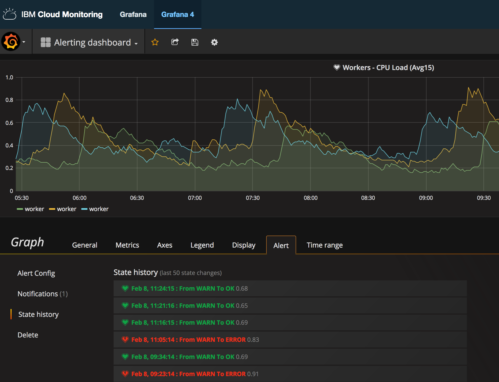

---

copyright:
  years: 2017, 2018

lastupdated: "2018-02-07"

---

{:new_window: target="_blank"}
{:shortdesc: .shortdesc}
{:screen: .screen}
{:pre: .pre}
{:table: .aria-labeledby="caption"}
{:codeblock: .codeblock}
{:tip: .tip}
{:download: .download}

# Retrieving the history of an alert in Grafana
{: #retrieve_history_grafana}

In Grafana, you can view the history of an alert. 
{:shortdesc}

To retrieve the history of an alert, complete the following steps:

1. Select the side menubar toggle .
2. Select **Dashboards**.
3. Select the dashboard where the alert is defined.
4. Click on the graph title, and then select **edit**.
    
    The *Metrics* tab opens. 

5. Select the **Alert** tab.
6. Select **State history**.

    Every entry that is listed represents an instance when the alert has been triggered.

