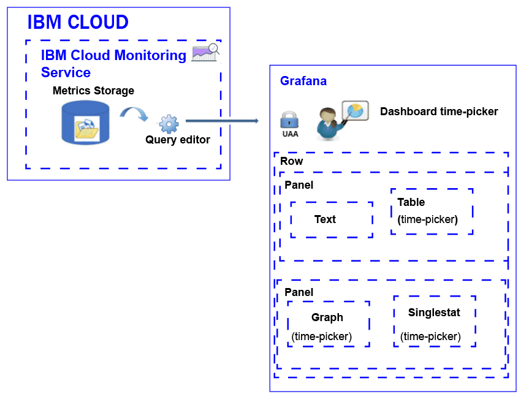

---

copyright:
  years: 2017

lastupdated: "2017-11-09"

---

{:shortdesc: .shortdesc}
{:new_window: target="_blank"}
{:codeblock: .codeblock}
{:screen: .screen}
{:pre: .pre}

# Analyzing metrics
{: #analyze_metrics_ov}

In the {{site.data.keyword.Bluemix}}, you can use Grafana, an open source visualization and monitoring platform, to monitor, search, analyze, and visualize your metrics in a variety of graphs, for example charts and tables. 
{:shortdesc}

## Components overview
{: #overview}

The {{site.data.keyword.monitoringshort}} service stores series of data in the Metrics storage database. You can query this data through the Query Editor. For more information about the queries that are supported, see [Graphite functions ](http://graphite.readthedocs.io/en/0.9.13-pre1/functions.html).

In Grafana, to access the data that is available in the Metrics storage database, you must log in to a space, organization, and region, with the user ID and password that you use to log in to the {{site.data.keyword.Bluemix_notm}}. 

To visualize the data, you configure a dashboard that can include one or more rows. In each row, you can define multiple panels. 

* A row groups panels in a dashboard. 
* A panel is the basic visualization resource to monitor metrics. 
* A dashboard can be tagged and include annotations that include data that you can use to correlate data across panels.

You can define the following types of panels: text, graph, table, singlestat. Each panel offers different styles and formatting options that you can customize. 

The amount of data that is displayed in a panel is determined by the query and the time range that is set. You can set a common time range for all panels at the dashboard level, or individual time ranges per panel.

The following figure shows the different components that Grafana uses from the {{site.data.keyword.monitoringshort}} service to filter data, and the resources that you can use in Grafana to visualize and analyze the data:

