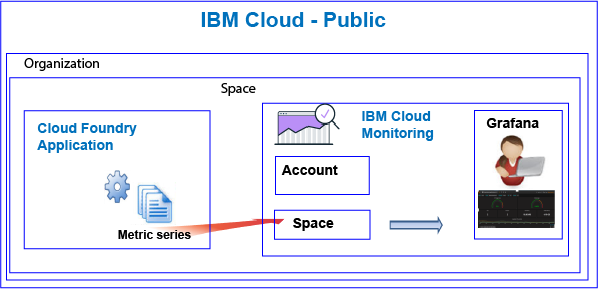

---

copyright:
  years: 2017, 2018

lastupdated: "2018-02-08"

---

{:new_window: target="_blank"}
{:shortdesc: .shortdesc}
{:screen: .screen}
{:pre: .pre}
{:table: .aria-labeledby="caption"}
{:codeblock: .codeblock}
{:tip: .tip}
{:download: .download}


# Cloud Foundry apps
 {:#monitoring_bluemix_apps}

In the {{site.data.keyword.Bluemix}}, metrics are collected automatically for Cloud Foundry (CF) apps that run in the Public region, and forwarded to the {{site.data.keyword.monitoringlong}} service. You can use Grafana  for analysis to monitor the performance of your CF application. You can also use the Metrics API to query the CF app metrics and take action based on the data.
{:shortdesc}


## Monitoring CF apps running on Public
{: #public}


Consider the following information when you use the {{site.data.keyword.monitoringshort}} service to monitor a CF app:

* You must provision the {{site.data.keyword.monitoringshort}} service in the same space where the CF app is running.
* Metrics that are collected for a CF app are forwarded automatically to the space domain in {{site.data.keyword.monitoringshort}} service. 
* Metrics are forwarded to a space domain. The space domain corresponds to the one where the CF app is running. 
* You can also use the Metrics API to query the metrics and take action based on the data. For example, you can create an automation which queries the CPU utilization of your CF app, and scales it if the CPU is getting to high.

The following figure shows a high level view of monitoring of CF apps in the {{site.data.keyword.Bluemix_notm}}:



## Monitoring CF apps running on Dedicated
{: #dedicated}

To monitor CF apps that run on {{site.data.keyword.Bluemix_notm}} Dedicated, you can use the Metrics API to forward your CF app metrics to the {{site.data.keyword.monitoringshort}} service.

* For more information on the API, see [Metrics API](https://console.bluemix.net/apidocs/927-ibm-cloud-monitoring-metrics-api?&language=node#introduction).
* For more information about using the API, see [Sending data by using the Metrics API](/docs/services/cloud-monitoring/send-metrics/send_data_api.html#send_data_api).


## Monitoring CF apps running outside the {{site.data.keyword.Bluemix_notm}}
{: #dedicated}

To monitor CF apps that run outside the {{site.data.keyword.Bluemix_notm}}, you can use the Metrics API to forward your CF app metrics to the {{site.data.keyword.monitoringshort}} service.

* For more information on the API, see [Metrics API](https://console.bluemix.net/apidocs/927-ibm-cloud-monitoring-metrics-api?&language=node#introduction).
* For more information about using the API, see [Sending data by using the Metrics API](/docs/services/cloud-monitoring/send-metrics/send_data_api.html#send_data_api).


## Viewing and analyzing CF apps metrics
{: #monitoring_cfapps}

To monitor the performance of CF applications in the {{site.data.keyword.Bluemix_notm}}, use Grafana. 

The {{site.data.keyword.monitoringlong}} service uses Grafana, an open source analytics and visualization platform, that you can use to monitor, search, analyze, and visualize your metrics in a variety of graphs, for example charts and tables.

You can launch Grafana from a browser. For more information, see [Navigating to the Grafana dashboard from a web browser](/docs/services/cloud-monitoring/grafana/navigating_grafana.html#launch_grafana_from_browser).

**Note:** You must launch Grafana in the same {{site.data.keyword.Bluemix_notm}} region where the CF app instance is running.


To monitor CF applications, you must define one or more queries in Grafana. For more information, see [Configuring a metric query in Grafana](/docs/services/cloud-monitoring/grafana/define_query.html#define_query). 

You can also define alerts on queries. For more information, see [Configuring alerts](/docs/services/cloud-monitoring/config_alerts_ov.html#config_alerts_ov).


## CPU metrics
{: #cpu_metrics}

The metric series that are collected automatically for each CF appliction include data about the CPU utilization.


<table>
  <caption>CPU metrics collected for a CF application</caption>
  <tr>
    <th>Metric</th>
    <th>Description</th>
  </tr>
  <tr>
    <td>cpu-utilization</td>
    <td>Percentage of CPU utilization toward the limit of the container.</td>
  </tr>
</table>


## Disk metrics
{: #disk_metrics}

The metric series that are collected automatically for each CF appliction include data about the disk size that is used, the total disk size that is available, and the percentage of disk that is used.


<table>
  <caption>Disk metrics collected for a CF application</caption>
  <tr>
    <th>Metric</th>
    <th>Description</th>
  </tr>
  <tr>
    <td>disk-bytes-total</td>
    <td>Disk size of the container the CF app is running in. Value defined in bytes.</td>
  </tr>
  <tr>
    <td>disk-bytes-used</td>
    <td>Disk size of the container that is used on disk by the CF app. Value defined in bytes.</td>
  </tr>
  <tr>
    <td>disk-utilization</td>
    <td>Percentage of disk that is used by the CF app.</td>
  </tr>
</table>

**Note:** 

* You specify the disk size when you push the CF app.
* When your disk-utilization reaches 90%, consider scaling the CF app.

## Memory metrics
{: #mem_metrics}

The metric series that are collected automatically for each CF appliction include data about the memory that is used, the total memory that is available, and the percentage of memory that is used.

<table>
  <caption>Memory metrics collected for a CF application</caption>
  <tr>
    <th>Metric</th>
    <th>Description</th>
  </tr>
  <tr>
    <td>memory-bytes-total</td>
    <td>Memory in bytes that is available for the CF app.</td>
  </tr>
  <tr>
    <td>memory-bytes-used</td>
    <td>Memory in bytes that is used by the CF app instance.</td>
  </tr>
  <tr>
    <td>memory-utilization</td>
    <td>Percentage of memory that is used by the CF app.</td>
  </tr>
</table>


## Metrics query format
{: #monitoring_cfapps}


Queries that you define in Grafana to monitor a Cloud Foundry application must comply with the following format: 

```
{Source}.{Cloud Type}.{Service Name}.{Region}.{CFapp Name}.{CFapp Index}.{Metric series}.[Functions]
```
{: codeblock}

For example, see samples of the metric series that are collected for a CF app instance named logtester in the Sydney region:

```
ibmcloud.public.cloud-foundry.au-syd.logtester.0.container.cpu-utilization
ibmcloud.public.cloud-foundry.au-syd.logtester.0.container.disk-bytes-total
ibmcloud.public.cloud-foundry.au-syd.logtester.0.container.disk-bytes-used
ibmcloud.public.cloud-foundry.au-syd.logtester.0.container.disk-utilization
ibmcloud.public.cloud-foundry.au-syd.logtester.0.container.memory-bytes-total
ibmcloud.public.cloud-foundry.au-syd.logtester.0.container.memory-bytes-used
ibmcloud.public.cloud-foundry.au-syd.logtester.0.container.memory-utilization
```
{: screen}

For more information, see [CF apps metrics format](/docs/services/cloud-monitoring/reference/cfapps_metrics_format.html#cfapps_metrics_format).

**Note:** Not all characters that are allowed in CF app names are allowed in metric series names. For example, uppercase is not allowed. The CF app name that you can see in Grafana when you define a query is changed to all lower case.


