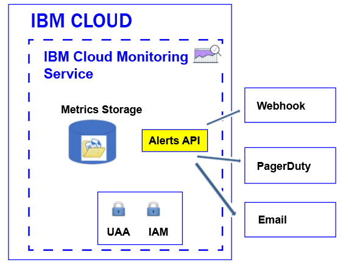

---

copyright:
  years: 2017

lastupdated: "2017-11-09"

---

{:shortdesc: .shortdesc}
{:new_window: target="_blank"}
{:codeblock: .codeblock}
{:screen: .screen}
{:pre: .pre}


# Configuring alerts
{: #config_alerts_ov}

The {{site.data.keyword.monitoringshort}} service provides a query-based alerting system. You can use the Alerts API to set the rules and notification methods for each metric query that you want to monitor. You can notify by sending an email, trigering a webhook, or sending an alert to PagerDuty.
{:shortdesc}

You can define an alert to trigger a notification for a metric. An alert is defined by a rule that describes the metric query to be monitored, the threshold value, and the action to take when the threshold is crossed, and one or more notification methods.  

You can define alerts for one a single instance or for multiple instances. When a query that you monitor through an alert rule includes a wildcard, the wildcard identifies multiple targets, that is, multiple services instances or applications instances. Every 5 minutes, the {{site.data.keyword.monitoringshort}} service runs the query that is configured in an alert rule, and checks the last datapoints that are returned for each instance or multiple instances. The {{site.data.keyword.monitoringshort}} service keeps track of the last state for each instance, and  generates new alert if the state of the alert changes. 

The following figure shows the different notification types that you can configure in the {{site.data.keyword.monitoringshort}} service to alert you:



* To learn how to create an alert that sends an email, see [Configuring an alert that sends an email](/docs/services/cloud-monitoring/alerts/configure_email_alert.html#configure_email_alert).
* To learn how to create an alert that sends a PagerDuty notification, see [Configuring an alert that sends a PagerDuty notification](/docs/services/cloud-monitoring/alerts/configure_pagerduty_alert.html#configure_pagerduty_alert).
* To learn how to create an alert that sends a webhook notification, see [Configuring an alert that sends a PagerDuty notification](/docs/services/cloud-monitoring/alerts/configure_webhook_alert.html#configure_webhook_alert).

## Alert states
{: #status}

An alert can have any of the following states when the rule is enabled:

* *OK*: The state of a rule is set to *OK* when:
    
	* Data is available in the {{site.data.keyword.monitoringshort}} service for the metric query that is associated with that rule. You have set a warning threshold and an error threshold. The value of the data does not cross the threshold value.
	 
	* There is no data in the {{site.data.keyword.monitoringshort}} service for the metric query that is associated with that rule, and you configure the rule property `allow_no_data` to *true*.           
	 
* *WARNING*: The state of the rule is set to *WARNING* when data is available in the {{site.data.keyword.monitoringshort}} service for the metric query that is associated with that rule. You have set a warning threshold, and an error threshold. The value of the data is between the warning threshold value and the error threshold value.
	
* *ERROR*: The state of the rule is set to *ERROR* when data is available in the {{site.data.keyword.monitoringshort}} service for the metric query that is associated with that rule. You have set a warning threshold and an error threshold. The error threshold value is reached.  

* *UNKNOWN*: The state of the rule is set to *UNKNOWN* when there is no data in the {{site.data.keyword.monitoringshort}} service for the metric query that is associated with that rule. You can configure whether to receive a notification or not based on the property `allow_no_data` that you configure for the rule. If you set this property to `false`, you are notified that no data was found for the rule.


	
## Alert history
{: #history}

Every time that the state of an alert changes, the history record of the alert is updated. You can use the Alerts API (*/v1/alert/history*) to retrieve information about the history of a metric.

The state of an alert is used to define the status in any of the following scenarios:

* Status of the query before the rule triggers a notification.
* Status of the query after the rule was triggered. 

For example, if a warning threshold is exceeded, then a history record is generated that will record the transition from *OK* to *WARNING*. Similarly, when the value goes back below the threshold, a history record is generated to record the transition from *WARNING* to *OK*.

For more information, see [Retrieving the history of a rule](/docs/services/cloud-monitoring/alerts/retrieve_history.html#retrieve_history).

## Rules
{: #rules}

A rule describes the metric query to be monitored, the threshold value, and the action to take when the threshold is crossed. 

* You can create, delete, update, show the details for a rule, and list all the rules by using the Alerts API. For more information, see [Working with rules](/docs/services/cloud-monitoring/alerts/rules.html#rules).

    * To create a rule, see [Creating a rule](/docs/services/cloud-monitoring/alerts/rules.html#create).
	* To delete a rule, see [Deleting a rule](/docs/services/cloud-monitoring/alerts/rules.html#delete).
	* To update a rule, see [Updating a rule](/docs/services/cloud-monitoring/alerts/rules.html#update).
	* To list all rules, see [Listing all rules](/docs/services/cloud-monitoring/alerts/rules.html#list).
	* To show information about a rule, see [Showing the details of a rule](/docs/services/cloud-monitoring/alerts/rules.html#showing-the-details-of-a-rule).

* The alert system checks every 5 minutes the rules that are enabled in the space.

* By default, a rule is enabled when you create it. However, you can define the rule, and disable it, by configuring the field *enable* to `false`.

* When the rule parameter *comparison* is set to below, the error_level value must be lower than then warning level value. When the rule parameter *comparison* is set to above, the error_level value should be higher than warning level value.

* By default, a rule is created with the field *allow_no_data* set to `true`. When no datapoints are available, notifications are not sent unless the rule condition is triggered. If you want to receive a notification to inform that no data was found for rule X, you must set the field *allow_no_data* to `false`. 

**Tip:** Verify the query that you monitor through an alert rule in Grafana. Check that it does not timeout, for example, as a result of configuring a long period of time or by using a query that includes a wildcard. Notice that when the query timesout in Grafana, an alert configured for that query is not triggered.

The following fields are required to define a rule:

<table>
  <caption>Table 1. List of fields that are used to define a rule.</caption>
  <tr>
    <th>Field Name</th>
	<th>Description</th>
  </tr>
  <tr>
    <td>name</td>
	<td>Name of the rule. This name must be unique.</td>
  </tr>
  <tr>
    <td>description</td>
	<td>Summary of the rule.</td>
  </tr>
  <tr>
    <td>expression</td>
	<td>Metric query that you want to monitor and send an alert if a threshold is crossed. <br>Valid expressions are: a single metric name, multiple metrics identified with wildcards, or functions to aggregate data. <br>**Tip:** You can copy a verified query from Grafana.</td>
  </tr>
  <tr>
    <td>enabled</td>
	<td>Describes the status of the rule: <br>Set to `true` to enable the rule. <br>Set to `false` to disable the rule. <br>By default, it is set to `true`.</td>
  </tr>
  <tr>
    <td>from</td>
	<td>Initial point in time that is used to analyze the data based on the threshold values that you set for the query that you define in the expression field. For example: `"from": "-5min"`</td>
  </tr>
  <tr>
    <td>until</td>
	<td>End point in time that is used to analyze the data based on the threshold values that you set for the query that you define in the expression field. For example: `"until": "now"`</td>
  </tr>
  <tr>
    <td>comparison</td>
	<td>Comparison operation that is used to identify what type of check to make. Valid values are: *below*, and *above*. </td>
  </tr>
  <tr>
    <td>comparison_scope</td>
	<td>Defines the scope of the data that is analyzed. <br>Set to *last* to look at the last value in the series (the data that is available for your query).</td>
  </tr>
  <tr>
    <td>error_level</td>
	<td>Defines the threshold that you set to trigger an error alert. <br>Set the value that if it is reached, then an error alert is generated. For example: `"error_level" : 27.94`</td>
  </tr>
  <tr>
    <td>warning_level</td>
	<td>Defines the threshold that you set to trigger a warning alert. <br>Set the value that if it is reached, then a warning alert is generated. For example: `"warning_level" : 24`</td>
  </tr>
  <tr>
    <td>frequency</td>
	<td>Defines how often the check is performed. <br>It is measured in minutes, hours or days, for example, 5min, 1h, 7d. <br>For example, to check every min, you can set `"frequency": "1min"`. <br>**Note:** Currently, the frequency is fixed to 5 minutes.</td>
  </tr>
  <tr>
    <td>dashboard_url</td>
	<td>Defines the URL to a Grafana dashboard where the query that is monitored is defined.</td>
  </tr>
    <tr>
    <td>allow_no_data</td>
	<td>Defines the condition by which a notification is sent when no datapoints are available. <br>By default, it is set to `true`. <br>Set to `false` if you want to be notified that no data was found for rule X.</td>
  </tr>
  <tr>
    <td>notifications</td>
	<td>The name of a notification that defines the action that you want to trigger for the rule. <br>**Note:** You can define 1 or more notifications per rule by listing notification names separated by comma.</td>
  </tr>
</table>

For example, the following is a sample of a rule:

```
{
  "name": "checkbytesin1",
  "description": "MH check Bytes In per second",
  "expression": "movingAverage(messagehub.65ad9211-1234-5678-a751-c82123411eee.1.kafka-java-console-sa
mple-topic.BytesInPerSec.15MinuteRate,\"5min\")",
  "enabled": true,
  "from": "-5min",
  "until": "now",
  "comparison": "below",
  "comparison_scope": "last",
  "error_level" : 22.94,
  "warning_level" : 25,
  "frequency": "1min",
  "dashboard_url": "https://metrics.ng.bluemix.net",
  "notifications": [
    "emailXXX"
  ]
}
```
{: screen}


## Notifications
{: #notifications}

A notification describes the method and details that is used to notify when an alert is triggered. For example, to get a warning notification and an error notification for a metric, define a rule that monitors the warning threshold, and define a rule that monitors the error threshold. 

* A notification is only sent when the state of the alert changes, for example, when the state of an alert for a metric changes from "OK" to "ERROR", or "ERROR" to "WARNING". 

    **Note:** If an alert rule remains at the same state, *OK*, *WARNING*, *ERROR*, or *UNKNOWN*, it will not be re-triggered on the next iteration.

* Notifications are considered to be 24 hour events. You cannot specify a time interval when a notification can be triggered.

* You can configure 1 or more notification methods per rule by listing notification names separated by comma. 

* You can use the [Alerts REST API](https://console.bluemix.net/apidocs/940-ibm-cloud-monitoring-alerts-api?&language=node#introduction){: new_window} to create, delete, and update a notification, to show the details for a notification, and to list the notifications that are defined in a space.

    * To create a notification, see [Creating a notification](/docs/services/cloud-monitoring/alerts/notifications.html#create).
	* To delete a notification, see [Deleting a notification](/docs/services/cloud-monitoring/alerts/notifications.html#delete).
	* To update a notification, see [Updating a notification](/docs/services/cloud-monitoring/alerts/notifications.html#update).
	* To list all notification, see [Listing all notifications](/docs/services/cloud-monitoring/alerts/notifications.html#list).
	* To show information about a notification, see [Showing the details of a notification](/docs/services/cloud-monitoring/alerts/notifications.html#show).

* You can configure an email notification, a PagerDuty configuration, and a webhook notification. 

**Note:** You define alert notifications independently of rules so that you can reuse the notifications with multiple rules.

	
## Notification - JSON templates
{: #notification_template}
	
A notification is a JSON file. 

The following table includes a notification template for type of notification method:

<table>
  <caption>Table 3. Notification templates</caption>
  <tr>
    <th>Type</th>
	<th>Template</th>
	<th>Sample</th>
  </tr>
  <tr>
    <td>Email</td>
	<td>
	```
	{
	"name": "Template_Name",
	"type": "Email",
	"description" : "Description",
	"detail": "EmailAddress"
	}
	```
	{: screen}
	</td>
	<td>
	```
	{
	"name": "my-email",
	"type": "Email",
	"description" : "Send email notification when there is an infrastructure problem.",
	"detail": "xxx@yyy.com"
	}
	```
	{: screen}
	</td>
  </tr>
  <tr>
    <td>Webhook</td>
	<td>
	```
	{
	"name": "Template_Name",
	"type": "Webhook",
	"description" : "Description",
	"detail": "Endpoint"
	}
	```
	{: codeblock}
	</td>
	<td>
	```
	{
	"name": "my-webhook",
	"type": "Webhook",
	"description" : "Fire a webhook when there is an infrastructure problem..",
	"detail": "https://myendpoint.bluemix.net?key=abcd1234"
	}
	```
	{: screen}
	</td>
  </tr>
  <tr>
    <td>Pagerduty</td>
	<td>
	```
	"name": "Template_Name",
	"type": "PagerDuty",
	"description" : "Description",
	"detail": "Pagerduty_APIkey"
	}
	```
	{: codeblock}
	</td>
	<td>
	```
	{
	"name": "my-pagerduty",
	"type": "PagerDuty",
	"description" : "Fire a PagerDuty alert when there is an infrastructure problem..",
	"detail": "abcd1234"
	}
	```
	{: screen}
	</td>
  </tr>
</table>

Where

* The *Template_Name* defines the name of the notification template.
* The *Description* explains when this type of notification is used.
* The *EmailAddress* defines the email address of the recepient of the notification.
* The *Endpoint* defines the URL where the POST should be made. 
* The *Pagerduty_APIkey*  defines a unique API key. This API key is generated by a PagerDuty account admin or owner.

For more information, see [Creating a notification template](/docs/services/cloud-monitoring/alerts/notifications.html#template).


## Rules - JSON template
{: #rules_template}

A rule is described by using a JSON file. 

The following code is a template for a rule:

```
{
"name": "Enter rule name",
"description": "Desccribe rule",
"expression": "Add metric query",
"enabled": true,
"from": "-5min",
"until": "now",
"comparison": "below",
"comparison_scope": "last",
"error_level" : xxxx,
"warning_level" : xxxx,
"frequency": "1min",
"dashboard_url": "https://metrics.ng.bluemix.net",
"notifications": [
 "List of Notifications by name. Include all the motification methods for this rule separated by commas."
 ]
}
```
{: screen}