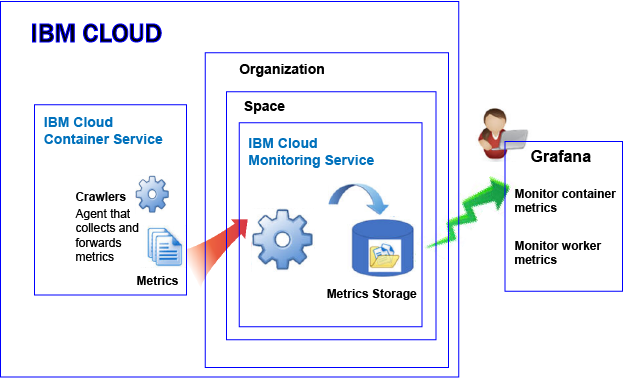
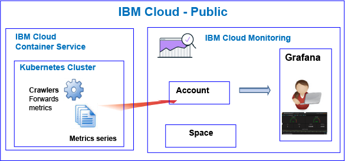
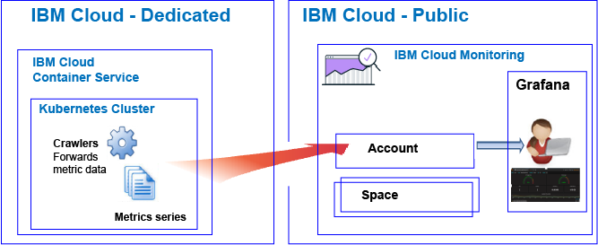

---

copyright:
  years: 2017, 2018

lastupdated: "2018-04-20"

---

{:new_window: target="_blank"}
{:shortdesc: .shortdesc}
{:screen: .screen}
{:pre: .pre}
{:table: .aria-labeledby="caption"}
{:codeblock: .codeblock}
{:tip: .tip}
{:download: .download}

# {{site.data.keyword.containershort_notm}}
{: #monitoring_bmx_containers_ov}

In the {{site.data.keyword.Bluemix}}, cluster metrics are collected automatically. You can use Grafana to monitor the performance of your cluster. 
{:shortdesc}

**Note:** Metrics are collected and available for monitoring through the {{site.data.keyword.monitoringshort}} service for containers running in standard clusters.

## About monitoring in Public
{: #public}

In the {{site.data.keyword.Bluemix_notm}}, you can use the {{site.data.keyword.monitoringshort}} service to store and analyze container metrics and Kubernetes cluster metrics that are collected automatically by the {{site.data.keyword.containershort}} in Public.

You can have 1 or more Kubernetes clusters in an account. Metrics are collected automatically by the {{site.data.keyword.containershort}} as soon as the cluster is provisioned.  Container metrics are collected as soon as the pod is deployed. Metrics are automatically forwarded to the {{site.data.keyword.monitoringshort}} service:

When you create a cluster, metrics are forwarded to the account domain in the {{site.data.keyword.monitoringshort}} service. For metrics to be forwarded to the account domain, the {{site.data.keyword.containershort}} key owner must have the following IAM policies:

* IAM policy with **editor** permisisons for the {{site.data.keyword.monitoringshort}} service.
* IAM policy with **administrator** permisisons for the {{site.data.keyword.containershort}}.

The following figure shows a high level view of monitoring for the {{site.data.keyword.containershort}}:

The crawler is a process that is running in the host and performs agentless monitoring for metrics. The crawler constantly collects CPU and memory metrics from all of the containers by default.

To analyze metrics in Grafana for a cluster, consider the following information:

* You must launch Grafana in the Public region where the {{site.data.keyword.monitoringshort}} instance that you use to view metrics is provisioned. 
* You can use the default Grafana dashboard **ClusterMonitoringDashboard_v1** to monitor your cluster.
* You can also configure custom Grafana dashboards to visualize metric data for a cluster in the Cloud Public region where the cluster is created.
* Your user ID must have permissions to view metrics. 

    To see metrics in the account domain, a user needs an IAM policy for the {{site.data.keyword.monitoringshort}} service. The user needs  **Viewer** permissions. 

The following figure shows a high level view of monitoring in Public for the {{site.data.keyword.containershort}}. The cluster forwards metrics to the account domain:

## About monitoring in Dedicated
{: #dedicated}

In the {{site.data.keyword.Bluemix_notm}}, you can use the {{site.data.keyword.monitoringshort}} service in Public to store and analyze container metrics and Kubernetes cluster metrics that are collected automatically by the {{site.data.keyword.containershort}} on Dedicated.

You can have 1 or more Kubernetes clusters in an account. Metrics are collected automatically by the {{site.data.keyword.containershort}} as soon as the cluster is provisioned.  Container metrics are collected as soon as the pod is deployed. Metrics are automatically forwarded to the account domain of the {{site.data.keyword.monitoringshort}} service.

When you create a cluster, metrics are forwarded to the account domain in the {{site.data.keyword.monitoringshort}} service. For metrics to be forwarded to the account domain, the {{site.data.keyword.containershort}} key owner must have the following IAM policies:

* IAM policy with **editor** permisisons for the {{site.data.keyword.monitoringshort}} service.
* IAM policy with **administrator** permisisons for the {{site.data.keyword.containershort}}.

To view and analyze metrics for a cluster in Grafana, consider the following information:

* You must launch Grafana in the Cloud Public region where the cluster is available on Dedicated. For example, if a cluster is provisioned on Dedicated in US South, you must launch Grafana in the US South region on Public.
* You can use the default Grafana dashboard **ClusterMonitoringDashboard_v1** to monitor your cluster.
* You can also configure custom Grafana dashboards to visualize metric data for a cluster in the Cloud Public region where the cluster is created.
* Your user ID must have an IAM policy to work with the {{site.data.keyword.monitoringshort}} service. You need to have **Viewer** permissions to see metrics in the account domain.  

The following figure shows a high level view of monitoring in Dedicated for the {{site.data.keyword.containershort}}:

## CPU metrics for containers
{: #cpu_metrics_containers}

The following table lists the CPU metrics that are captured  automatically for a container:

<table>
  <caption>Table 1. CPU metrics for containers</caption>
  <tr>
    <th>Metric Name</th>
    <th>Description</th>
  </tr>
  <tr>
    <td>*cpu.num-cores*</td>
    <td>This metric reports the number of CPU cores that are available to the container.   By default, this metric reports the number of cores on the worker. If you set a limit on the number of cores available to the container, then this metric reports the number of cores that you set in that limit.</td>
  </tr>
  <tr>
    <td>*cpu.usage*</td>
    <td>This metric reports the nanoseconds of CPU time across all cores.   When the CPU usage is high, you may experience delay. High CPU usage indicates insufficient processing power.</td>
  </tr>
  <tr>
    <td>*cpu.usage-pct*</td>
    <td>This metric reports on the CPU time that is used as a percentage of the CPU's capacity.   By default, CPU capacity is determined by the number of cores on the worker. If you set limits to container CPU capacity, then this metric reports the CPU usage as a percentage of the limits that you set. When the percentage of CPU usage is high, you may experience delay. High CPU usage indicates insufficient processing power.</td>
  </tr>
  <tr>
    <td>*cpu.usage-pct-container-requested*</td>
    <td>This metric reports the CPU time that is used as a percentage of the container's requested CPU.   If you do not set requested CPU on a container, then this metric is not exposed for the container.</td>
  </tr>
</table>

## Load metrics for workers
{: #load_metrics_workers}

The following table lists the CPU metrics that are captured  automatically for a worker:

<table>
  <caption>Table 2. Load metrics for workers</caption>
  <tr>
    <th>Metric Name</th>
    <th>Description</th>
  </tr>
  <tr>
    <td>*load.avg-1*</td>
    <td>This metric reports the average CPU load for the Kubernetes host over the past 1 minute.   An average CPU load that is greater than the number of cores on the worker indicates that traffic to the host is queuing.</td>
  </tr>
  <tr>
    <td>*load.avg-5*</td>
    <td>This metric reports the average CPU load for the Kubernetes host over the past 5 minutes.   An average CPU load that is greater than the number of cores on the worker indicates that traffic to the host is queuing.</td>
  </tr>
  <tr>
    <td>*load.avg-15*</td>
    <td>This metric reports the average CPU load for the Kubernetes host over the past 15 minutes.   An average CPU load that is greater than the number of cores on the worker indicates that traffic to the host is queuing.</td>
  </tr>
</table>

## Memory metrics for containers
{: #memory_metrics}

The following table lists the memory metrics captured automatically:

<table>
  <caption>Table 3. Memory metrics for containers</caption>
  <tr>
    <th>Metric Name</th>
    <th>Description</th>
  </tr>
  <tr>
    <td>*memory.current*</td>
    <td>This metric reports the bytes of memory that the container is currently using. </td>
  </tr>
  <tr>
    <td>*memory.limit*</td>
    <td>This metric reports the memory amount that a container is allowed to swap to disk in comparison to the maximum and minimum limits set for a pod.    By default, pods run with unlimited memory limits. A pod can consume as much memory as is on the worker where it is running. When you deploy a pod, you can set limits to the amount of memory that a pod can use. </td>
  </tr>
  <tr>
    <td>*memory.usage-pct*</td>
    <td>This metric reports the memory that is used as a percentage of the container's memory limit.    If you set limits to the amount of memory that a container can use, then this metric reports the memory usage as a percentage of the limits that you set. </td>
  </tr>
</table>

## Defining queries to monitor resources in a Kubernetes cluster
{: #monitoring_metrics_kube}

To monitor the performance of containers and workers that are deployed in a Kubernetes cluster in the {{site.data.keyword.Bluemix_notm}}, use Grafana. 

The {{site.data.keyword.monitoringlong}} service uses Grafana, an open source analytics and visualization platform, that you can use to monitor, search, analyze, and visualize your metrics in a variety of graphs, for example charts and tables.

You can launch Grafana from a browser. For more information, see [Navigating to the Grafana dashboard from a web browser](/docs/services/cloud-monitoring/grafana/navigating_grafana.html#launch_grafana_from_browser).

To monitor containers and workers that run in a Kubernetes cluster, you must define a query in Grafana for each resource:

* To define a query that monitors a CPU metric for a container, see [Configuring CPU metrics for a container in Grafana](/docs/services/cloud-monitoring/containers/config_cpu_containers.html#config_cpu_containers).
* To define a query that monitors a memory metric for a container, see [Configuring memory metrics for a container in Grafana](/docs/services/cloud-monitoring/containers/config_mem_container.html#config_mem_container).
* To define a query that monitors a Load metric for a worker, see [Configuring Load metrics for a worker in Grafana](/docs/services/cloud-monitoring/containers/config_load_worker.html#config_load_worker).

The format of the query is different per resource type and type of query:

* For more information about the format of queries to monitor CPU for a container, see [CPU metric query format for a container](/docs/services/cloud-monitoring/reference/metrics_format_containers.html#cpu_containers). 
* For more information about the format of queries to monitor Load for a worker, see [Load metric query format for a worker](/docs/services/cloud-monitoring/reference/metrics_format_containers.html#load_workers).
* For more information about the format of queries to monitor memory for a container, see [Memory metric query format for a container](/docs/services/cloud-monitoring/reference/metrics_format_containers.html#mem_containers).

## Configuring network traffic for custom firewall configurations in the {{site.data.keyword.Bluemix_notm}}
{: #ports}

When you have an additional firewall set up, or you have customized the firewall settings in your {{site.data.keyword.Bluemix_notm}} infrastructure (SoftLayer), you need to allow outgoing network traffic from the worker node to the {{site.data.keyword.monitoringshort}} service. 

You must open TCP port 443 and TCP port 9091 from each worker to the {{site.data.keyword.monitoringshort}} service for the following IP addresses in your customized firewall:

<table>
  <tr>
    <th>Region</th>
    <th>Ingestion URL</th>
	<th>Public IP addresses</th>
  </tr>
  <tr>
    <td>Germany</td>
	<td>ingest-eu-fra.logging.bluemix.net</td>
	<td>158.177.88.43  159.122.87.107</td>
  </tr>
  <tr>
    <td>United Kingdom</td>
	<td>ingest.logging.eu-gb.bluemix.net</td>
	<td>169.50.115.113</td>
  </tr>
  <tr>
    <td>US South</td>
	<td>ingest.logging.ng.bluemix.net</td>
	<td>169.48.79.236  169.46.186.113</td>
  </tr>
  <tr>
    <td>Sydney</td>
	<td>ingest-au-syd.logging.bluemix.net</td>
	<td>130.198.76.125  168.1.209.20</td>
  </tr>
</table>

## Tutorials
{: #tutorial}

To learn how to use the {{site.data.keyword.monitoringshort}} service to monitor the performance of your container, see [Analyze metrics in Grafana for an app that is deployed in a Kubernetes cluster](/docs/services/cloud-monitoring/tutorials/container_service_metrics.html#container_service_metrics).

To learn how to create a Grafana dashboard in the {{site.data.keyword.monitoringshort}} service to monitor the performance of your cluster, see [Create a Grafana dashboard to monitor a Kubernetes cluster](/docs/services/cloud-monitoring/tutorials/container_grafana_dashboard.html#container_grafana_dashboard).
