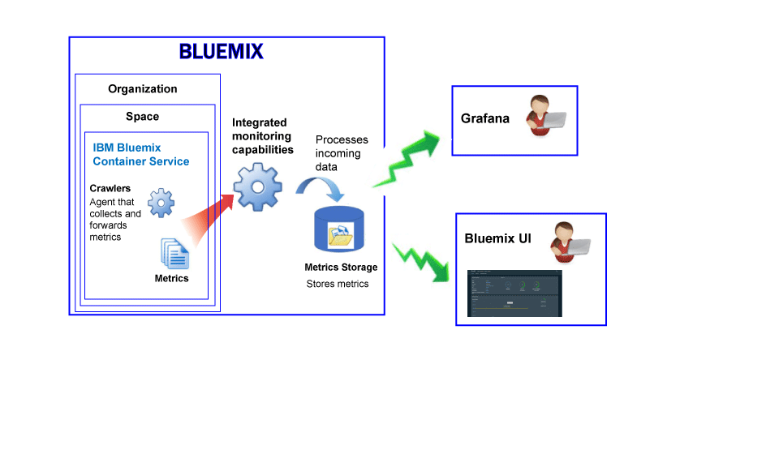

---

copyright:
  years: 2017

lastupdated: "2017-11-21"

---

{:shortdesc: .shortdesc}
{:new_window: target="_blank"}
{:codeblock: .codeblock}
{:screen: .screen}
{:pre: .pre}

# Monitoring for the {{site.data.keyword.containershort_notm}}
{: #monitoring_bmx_containers_ov}

In the {{site.data.keyword.Bluemix}}, container and worker metrics are collected automatically from outside of the container, without having to install and maintain agents inside of the container. You can use Grafana to visualize container metrics. 
{:shortdesc}

**Note:** Metrics are collected and available for monitoring through the {{site.data.keyword.monitoringshort}} service for containers running in standard clusters. For more information about the features supported by a standard cluster, see [Planning clusters and apps](/docs/containers/cs_planning.html#cs_planning_cluster_type).

## Collecting metrics for resources in a Kubernetes cluster
{: #metrics_containers_kube_ov}

In {{site.data.keyword.Bluemix_notm}}, when you deploy applications in a Kubernetes cluster, consider the following information:

* In an {{site.data.keyword.Bluemix_notm}} account, you can have 1 or more organizations.
* Each organization can have 1 or more spaces.
* You can have 1 or more Kubernetes clusters in an organization.
* Collection of metrics is enabled automatically when you create a Kubernetes cluster.
* A Kubernetes cluster is independent of {{site.data.keyword.Bluemix_notm}} spaces. However, the metrics collected for a cluster and its resources are associated with a space in the {{site.data.keyword.Bluemix_notm}}.
* Metrics are collected for a container as soon as the pod is deployed.
* You can view metrics in Grafana or in the Kubernetes UI.
* To visualize metric data for a cluster, you must configure Grafana dashboards for the Cloud Public region where the cluster is created.

Before you create a cluster, either through the {{site.data.keyword.Bluemix_notm}} UI or through the command line, you must log into a specific {{site.data.keyword.Bluemix_notm}} region, account, organization, and space. The space where you are logged in is the space where metric data for the cluster and its resources is collected.

The following figure shows a high level view of monitoring for the {{site.data.keyword.containershort}}:

The crawler is a process that is running in the host and performs agentless monitoring for metrics. The crawler constantly collects the following CPU and memory metrics from all of the containers by default.

## CPU metrics for containers
{: #cpu_metrics_containers}

The following table lists the CPU metrics that are captured  automatically for a container:

<table>
  <caption>Table 1. CPU metrics for containers</caption>
  <tr>
    <th>Metric Name</th>
    <th>Description</th>
  </tr>
  <tr>
    <td>*cpu.num-cores*</td>
    <td>This metric reports the number of CPU cores that are available to the container.   By default, this metric reports the number of cores on the worker. If you set a limit on the number of cores available to the container, then this metric reports the number of cores that you set in that limit.</td>
  </tr>
  <tr>
    <td>*cpu.usage*</td>
    <td>This metric reports the nanoseconds of CPU time across all cores.   When the CPU usage is high, you may experience delay. High CPU usage indicates insufficient processing power.</td>
  </tr>
  <tr>
    <td>*cpu.usage-pct*</td>
    <td>This metric reports on the CPU time that is used as a percentage of the CPU's capacity.   By default, CPU capacity is determined by the number of cores on the worker. If you set limits to container CPU capacity, then this metric reports the CPU usage as a percentage of the limits that you set. When the percentage of CPU usage is high, you may experience delay. High CPU usage indicates insufficient processing power.</td>
  </tr>
  <tr>
    <td>*cpu.usage-pct-container-requested*</td>
    <td>This metric reports the CPU time that is used as a percentage of the container's requested CPU.   If you do not set requested CPU on a container, then this metric is not exposed for the container.</td>
  </tr>
</table>

## Load metrics for workers
{: #load_metrics_workers}

The following table lists the CPU metrics that are captured  automatically for a worker:

<table>
  <caption>Table 2. Load metrics for workers</caption>
  <tr>
    <th>Metric Name</th>
    <th>Description</th>
  </tr>
  <tr>
    <td>*load.avg-1*</td>
    <td>This metric reports the average CPU load for the Kubernetes host over the past 1 minute.   An average CPU load that is greater than the number of cores on the worker indicates that traffic to the host is queuing.</td>
  </tr>
  <tr>
    <td>*load.avg-5*</td>
    <td>This metric reports the average CPU load for the Kubernetes host over the past 5 minutes.   An average CPU load that is greater than the number of cores on the worker indicates that traffic to the host is queuing.</td>
  </tr>
  <tr>
    <td>*load.avg-15*</td>
    <td>This metric reports the average CPU load for the Kubernetes host over the past 15 minutes.   An average CPU load that is greater than the number of cores on the worker indicates that traffic to the host is queuing.</td>
  </tr>
</table>

## Memory metrics for containers
{: #memory_metrics}

The following table lists the memory metrics captured automatically:

<table>
  <caption>Table 3. Memory metrics for containers</caption>
  <tr>
    <th>Metric Name</th>
    <th>Description</th>
  </tr>
  <tr>
    <td>*memory.current*</td>
    <td>This metric reports the bytes of memory that the container is currently using. </td>
  </tr>
  <tr>
    <td>*memory.limit*</td>
    <td>This metric reports the memory amount that a container is allowed to swap to disk in comparison to the maximum and minimum limits set for a pod.    By default, pods run with unlimited memory limits. A pod can consume as much memory as is on the worker where it is running. When you deploy a pod, you can set limits to the amount of memory that a pod can use. </td>
  </tr>
  <tr>
    <td>*memory.usage-pct*</td>
    <td>This metric reports the memory that is used as a percentage of the container's memory limit.    If you set limits to the amount of memory that a container can use, then this metric reports the memory usage as a percentage of the limits that you set. </td>
  </tr>
</table>

## Defining queries to monitor resources in a Kubernetes cluster
{: #monitoring_metrics_kube}

To monitor the performace of containers and workers that are deployed in a Kubernetes cluster in the {{site.data.keyword.Bluemix_notm}}, use Grafana. 

The {{site.data.keyword.monitoringlong}} service uses Grafana, an open source analytics and visualization platform, that you can use to monitor, search, analyze, and visualize your metrics in a variety of graphs, for example charts and tables.

You can launch Grafana from a browser. For more information, see [Navigating to the Grafana dashboard from a web browser](/docs/services/cloud-monitoring/grafana/navigating_grafana.html#launch_grafana_from_browser).

To monitor containers and workers that run in a Kubernetes cluster, you must define a query in Grafana for each resource:

* To define a query that monitors a CPU metric for a container, see [Configuring CPU metrics for a container in Grafana](/docs/services/cloud-monitoring/containers/config_cpu_worker.html#config_cpu_worker).
* To define a query that monitors a memory metric for a container, see [Configuring memory metrics for a container in Grafana](/docs/services/cloud-monitoring/containers/config_mem_container.html#config_mem_container).
* To define a query that monitors a Load metric for a worker, see [Configuring Load metrics for a worker in Grafana](/docs/services/cloud-monitoring/containers/config_load_worker.html#config_load_worker).

The format of the query is different per resource type and type of query:

* For more information about the format of queries to monitor CPU for a container, see [CPU metric query format for a container](/docs/services/cloud-monitoring/reference/metrics_format.html#cpu_containers). 
* For more information about the format of queries to monitor Load for a worker, see [Load metric query format for a worker](/docs/services/cloud-monitoring/reference/metrics_format.html#load_workers).
* For more information about the format of queries to monitor memory for a container, see [Memory metric query format for a container](/docs/services/cloud-monitoring/reference/metrics_format.html#mem_containers).

## Collecting default metrics for a container managed in Bluemix (Deprecated)
{: #metrics_containers_bmx_ov}

The following figure shows a high level view of monitoring for the {{site.data.keyword.containershort}}:

The crawler constantly collects the following metrics from all of the containers by default:

* CPU
* Memory
* Network information

## Monitoring metrics for a container managed in the IBM Cloud (Deprecated)
{: #monitoring_metrics_bmx}

Metrics are collected and displayed in both the {{site.data.keyword.Bluemix_notm}} UI and Grafana:

* Use Grafana, an open source analytics and visualization platform, to monitor, search, analyze, and visualize your metrics in a variety of graphs, for example charts and tables.

    You can launch Grafana from the {{site.data.keyword.Bluemix_notm}} UI or from a browser. For more information, see [Navigating to the Grafana dashboard](/docs/services/cloud-monitoring/grafana/navigating_grafana.html#navigating_grafana).

* Use the {{site.data.keyword.Bluemix_notm}} UI to view the latest metrics.

    To view the metrics in the {{site.data.keyword.Bluemix_notm}} UI, see [Analyzing metrics from the {{site.data.keyword.Bluemix_notm}} console](/docs/services/cloud-monitoring/containers/analyzing_metrics_bmx_ui.html#analyzing_metrics_bmx_ui).
