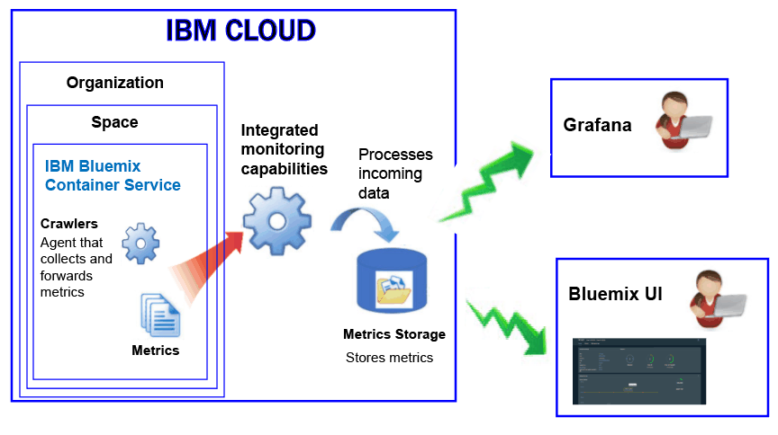

---

copyright:
  years: 2017, 2018

lastupdated: "2018-02-02"

---

{:new_window: target="_blank"}
{:shortdesc: .shortdesc}
{:screen: .screen}
{:pre: .pre}
{:table: .aria-labeledby="caption"}
{:codeblock: .codeblock}
{:tip: .tip}
{:download: .download}

# Containers managed in the IBM Cloud (Deprecated)
{: #monitoring_managed_containers_ov}

In the {{site.data.keyword.Bluemix}}, container and worker metrics are collected automatically from outside of the container, without having to install and maintain agents inside of the container. You can use Grafana to visualize container metrics. 
{:shortdesc}

**Note:** Metrics are collected and available for monitoring through the {{site.data.keyword.monitoringshort}} service for containers running in standard clusters. For more information about the features supported by a standard cluster, see [Planning clusters and apps](/docs/containers/cs_planning.html#cs_planning_cluster_type).

## Collecting default metrics
{: #metrics_containers_bmx_ov}

The following figure shows a high level view of monitoring for the {{site.data.keyword.containershort}}:

The crawler constantly collects the following metrics from all of the containers by default:

* CPU
* Memory
* Network information

## Monitoring metrics for a container managed in the IBM Cloud (Deprecated)
{: #monitoring_metrics_bmx}

Metrics are collected and displayed in both the {{site.data.keyword.Bluemix_notm}} UI and Grafana:

* Use Grafana, an open source analytics and visualization platform, to monitor, search, analyze, and visualize your metrics in a variety of graphs, for example charts and tables.

    You can launch Grafana from the {{site.data.keyword.Bluemix_notm}} UI or from a browser. For more information, see [Navigating to the Grafana dashboard](/docs/services/cloud-monitoring/grafana/navigating_grafana.html#navigating_grafana).

* Use the {{site.data.keyword.Bluemix_notm}} UI to view the latest metrics.

    To view the metrics in the {{site.data.keyword.Bluemix_notm}} UI, see [Analyzing metrics from the {{site.data.keyword.Bluemix_notm}} console](/docs/services/cloud-monitoring/containers/analyzing_metrics_bmx_ui.html#analyzing_metrics_bmx_ui).
