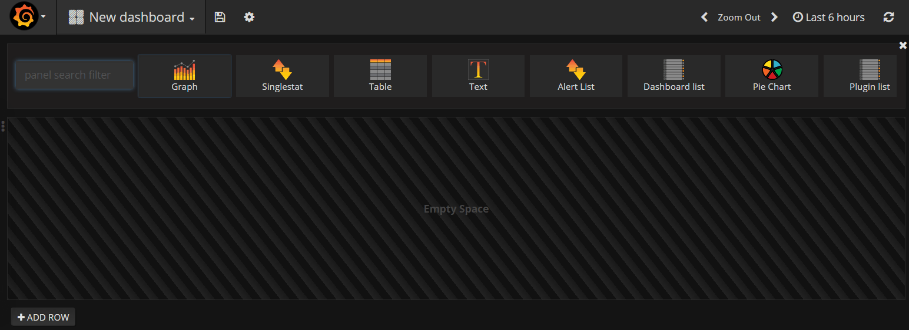
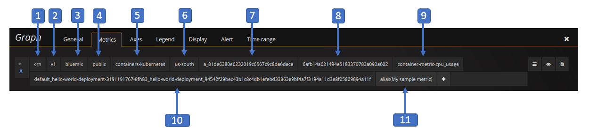

---

copyright:
  years: 2017
lastupdated: "2017-06-26"

---

{:new_window: target="_blank"}
{:shortdesc: .shortdesc}
{:screen: .screen}
{:codeblock: .codeblock}
{:pre: .pre}

# Getting started with IBM Cloud Monitoring in Bluemix
{: #getting-started-with-ibm-cloud-monitoring}

In this getting started tutorial, we'll take you through the steps to analyze a container by using the {{site.data.keyword.monitoringlong}} service. Learn how to search and analyze container metrics for an app that is deployed in a Kubernetes cluster.
{:shortdesc}

## Before you begin
{: #prereqs}

Create a [Bluemix account](https://console.bluemix.net/registration/). Your user ID must be a member or an owner of a Bluemix account with permissions to create Kubernetes clusters, deploy apps into clusters, and query the logs in Bluemix for advanced analysis in Kibana.

Open a terminal session from where you can manage the Kubernetes cluster and deploy apps from the command line. The examples in this tutorial are given for an Ubuntu Linux system.

[Install the CLI plugins](/docs/containers/cs_cli_install.html#cs_cli_install_steps) in your local environment to manage the IBM Bluemix Container service from the command line. 


## Step 1: Deploying an app in a container
{: #step1}

Complete the following steps to deploy a container in a Kubernetes cluster:

1. [Create a Kubernetes cluster](/docs/containers/cs_cluster.html#cs_cluster_ui).

2. [Setup the cluster context](/docs/containers/cs_cli_install.html#cs_cli_configure) in a Linux terminal. After the context is set, you can manage the Kubernetes cluster and deploy the application in the Kubernetes cluster.

3. Deploy and run a sample app in the Kubernetes cluster. [Complete the steps for lesson 1](/docs/containers/cs_tutorials.html#cs_apps_tutorial).

    The app is a Hello World Node.js app:

    ```
    var express = require('express')
    var app = express()

    app.get('/', function(req, res) {
      res.send('Hello world! Your app is up and running in a cluster!\n')
    })
    app.listen(8080, function() {
      console.log('Sample app is listening on port 8080.')
    })
    ```

    When the app is deployed, metrics collection is automatically enabled.


## Step 2: Navigating to the Grafana dashboard
{: #step2}

Launch Grafana from a browser. 

To analyze metrics for a cluster, you must access Grafana in the cloud Public region where the cluster is created. 
    
Then, from a browser, launch the following URL to open Grafana: `https://metrics.ng.bluemix.net/`
    
    
## Step 3: Analyzing metrics in Grafana
{: #step3}

Complete the following steps to create a Grafana dashboard:
    
1. Create a new dashboard.

    * Select the side menubar toggle . 
    * Select **Dashboards**. 
    * Click **New**
    
    A dashboard opens. The dashboard includes an empty row that is ready for configuration. 
    
    
    
     In Grafana, you add rows to divide the dashboard into sections. A row groups 1 or more panels. Within a row, a panel is the smallest visualization unit that you can configure to display data for a metric, for example, you can choose a graph panel or a table panel. You can drag and drop panels to rearrange panels in a dashboard. The data that a panel displays is configured through queries. You can define one or more queries in a panel. Each query represents a different set of data. You can also set the time range for a panel. Normally, the time range is set by the *Dashboard* time picker.
    
2. Add a *Graph* panel to monitor the nanoseconds of cpu time across all cores for a container.
    
    1. Select **Graph**.
    
    2. Click on the graph title, and then select **edit**.
    
        The *Metrics* tab opens. You can see here the default data source.
    
        
    
3. Define the query that filters the data that is displayed in the graph. 

    The following table outlines the different fields that are required to configure a query that filters data for a container metric:

    <table>
      <caption>Table 1. Grafana query fields for containers</caption>
      <tr>
        <th align="center">Field</th>
        <th align="center">Description</th>
        <th align="center">Valid values</th>
      </tr>
      <tr>
        <td>Prefix</td>
        <td>Prefix for containers metrics. <br><br>This prefix applies to data collected for containers that are deployed in a Kubernetes cluster.</td>
        <td>`crn`</td>
      </tr>
      <tr>
        <td>Version</td>
        <td>Version of the metric data collected.</td>
        <td>`v1`</td>
      </tr>
      <tr>
        <td>Provider</td>
        <td>Cloud provider where the data is collected.</td>
        <td>`bluemix`</td>
      </tr>
      <tr>
        <td>Type</td>
        <td>Cloud environment where the data is collected.</td>
        <td>`public`</td>
      </tr>
      <tr>
        <td>Source</td>
        <td>Cloud infrastructure where metrics are collected.</td>
        <td>`containers-kubernetes`</td>
      </tr>
      <tr>
        <td>Region</td>
        <td>Cloud region where metrics are collected.</td>
        <td>* `ng` <br>* `eu-gb` <br>* `eu-de` </td>
      </tr>
      <tr>
        <td>Account</td>
        <td>GUID of the account where metrics are collected. <br>the format of this field is the following: `a_*ID*` where ID is the GUID of the account.</td>
        <td></td>
      </tr>
      <tr>
        <td>Cluster</td>
        <td>GUID of the cluster where metrics are collected.</td>
        <td></td>
      </tr>
      <tr>
        <td>Container metric</td>
        <td>Metrics collected for a container.</td>
        <td>* `memory_current` <br>* `memory_limit` <br>* `cpu_usage` <br>* `cpu_usage_pct` <br>* `cpu_num_cores`</td>
      </tr>
      <tr>
        <td>Container in a pod</td>
        <td>Combination of Kubernetes resource names and GUIDs that are required to identified uniquely a container that runs in a pod. <br> The format of this fields is the following: *{namespace}_#{pod_name}_#{container_name}_#{container_id}* <br><br>**Note:** When you look at the list of available options for this entry in the query, notice that there is also an entry with the following format: *{namespace}_#{pod_name}_#{container_name}_POD_#{container_id}*. This entries correspond to internal container IDs that are created by Kubernetes.</td>
        <td></td>
      </tr>
      <tr>
        <td>Functions</td>
        <td>Query functions that you can select to visualize a container metric in the panel. <br>For more information, see [Functions ](http://graphite.readthedocs.io/en/latest/functions.html){: new_window}</td>
        <td></td>
      </tr>
    </table>
    
    The following image shows how the query is displayed in Grafana when you configure it:
    
    
    
    Complete the following steps to define the query:
    
    In the *Metrics* tab, select **Add query**. <br>A query entry is added. Each query is labeled with a letter.
    
    
        
    1. Click **Select metric**, and then choose `crn`.
    
    2. Click **Select metric**, and then choose `v1`.
    
    3. Click **Select metric**, and then choose `bluemix`.
    
    4. Click **Select metric**, and then choose `public`.
    
    5. Click **Select metric**, and then choose `containers-kubernetes`.
    
    6. Click **Select metric**, and then choose the region from where you are working, for example, `us-south`.
    
    7. Click **Select metric**, and then choose the account ID for which you want to display data, for example, `a_91d1d1exxxxxxx4df920bbd06461b066`
    
    8. Click **Select metric**, and then choose the Cluster ID.
    
    9. Click **Select metric**, and then choose a container metric. To monitor the *CPU usage* of a container, choose `container-metric-cpu_usage`.
    
    10. Click **Select metric**, and then choose the ID that corresponds to the container for which you want to monitor CPU usage, for example, `default_hello-world-deployment-3355293961-0fwkg_hello-world-deployment_ad5eb446a493db31f1d9eb158f5de915fc063d6c136823488b694e63bb00aa57`.
    
    11. Click the plus image  and choose a function. You can add a function to transform, combine, and perform computations on the data that is available for a metric.
        
        For example, you can add the **alias(newName)** function to add an alias for a metric. This alias is used to print a string instead of the metric name in the legend that is displayed in the graph.
        
        To add an alias for your metric, complete the following steps:
        
        1. Click the plus symbol.
        2. Select **Special**. 
        3 Select **alias**.
        4. Enter a string, for example, `My sample metric`.
        
4. Save the dashboard for later reuse. 

    1. Click the save dashboard image . 
    
        
    
    2. Enter the name of the dashboard.
    3. Click **Save**.


## Next steps
{: #next_steps}

Define an alert for a metric. For more information, see [Configuring alerts](/docs/services/cloud-monitoring/config_alerts_ov.html#config_alerts_ov).


