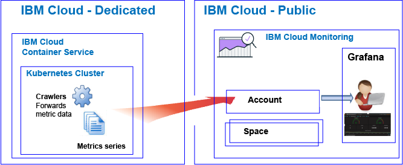

---

copyright:
  years: 2017, 2018

lastupdated: "2018-04-19"

---

{:new_window: target="_blank"}
{:shortdesc: .shortdesc}
{:screen: .screen}
{:pre: .pre}
{:table: .aria-labeledby="caption"}
{:codeblock: .codeblock}
{:tip: .tip}
{:download: .download}

# Getting started with IBM Cloud Monitoring
{: #getting-started-with-ibm-cloud-monitoring}

Use this tutorial to learn how to start working with the {{site.data.keyword.monitoringlong}} service in the {{site.data.keyword.Bluemix}}.
{:shortdesc}

By default, {{site.data.keyword.Bluemix_notm}} offers integrated monitoring capabilities for selected services. You can use the {{site.data.keyword.monitoringlong_notm}} service to expand your collection and retention capabilities when working with metrics, and to be able to define rules and alerts that notify you of conditions that require attention. The {{site.data.keyword.monitoringshort}} service offers features that give you insight into how your apps are performing and consuming resources, and help you to quickly identify trends, detect and diagnose problems; all with immediate time to value and low total cost of ownership. You monitor your environment through Grafana. 

## Before you begin
{: #prereqs}

Your must have a user ID that is a member or an owner of an {{site.data.keyword.Bluemix_notm}} account. To get an {{site.data.keyword.Bluemix_notm}} user ID, go to: [Registration ](https://console.bluemix.net/registration/){:new_window}

## Step1: Choose a cloud resource that you want to monitor
{: #step1}

In the {{site.data.keyword.Bluemix_notm}}, CF applications, containers that run on the {{site.data.keyword.containershort}}, and selected services collect metric series data automatically and they forward it to the {{site.data.keyword.monitoringshort}} service.

The following table lists different cloud resources. Complete the tutorial for a resource to get started working with the {{site.data.keyword.monitoringshort}} service:

<table>
  <caption>Tutorials to get started working with the {{site.data.keyword.monitoringshort}} service </caption>
  <tr>
    <th>Resource</th>
    <th>Tutorial</th>
    <th>Cloud environment</th>
    <th>Scenario</th>
  </tr>
  <tr>
    <td>Containers running on the {{site.data.keyword.containershort}}</td>
    <td>[Analyze metrics in Grafana for an app that is deployed in a Kubernetes cluster](/docs/services/cloud-monitoring/tutorials/container_service_metrics.html#container_service_metrics)</td>
    <td>Public  Dedicated</td>
    <td></td>
  </tr>
  <tr>
    <td>CF apps</td>
    <td>[Analyze metrics in Grafana for a CF app](/docs/services/cloud-monitoring/tutorials/cfapps_metrics.html#cfapps_metrics)</td>
    <td>Public</td>
    <td></td>
  </tr>
</table>

## Step 2: Set permissions for a user to view metrics
{: #step2}

To control the {{site.data.keyword.monitoringshort}} actions that a user is allowed to perform, you can assign roles and policies to a user. 

There are two types of security permissions in the {{site.data.keyword.Bluemix_notm}} that control the actions users can do when they work with the {{site.data.keyword.monitoringshort}} service:

* Cloud Foundry (CF) roles: You grant a user a CF role to define the permissions that the user has to view metrics in a space.
* IAM roles: You grant a user an IAM policy to define the permissions that the user has to view metrics in the account domain.

Complete the following steps to grant a user permissions to view metrics in a space:

1. Log in to the {{site.data.keyword.Bluemix_notm}} console.

    Open a web browser and launch the {{site.data.keyword.Bluemix_notm}} dashboard: [http://bluemix.net ](http://bluemix.net){:new_window}
	
	After you log in with your user ID and password, the {{site.data.keyword.Bluemix_notm}} UI opens.

2. From the menu bar, click **Manage > Account > Users**. 

    The *Users* window displays a list of users with their email addresses for the currently selected account.
	
3. If the user is a member of the account, select the user name from the list, or click **Manage user** from the *Actions* menu.

    If the user is not a member of the account, see [Inviting users](/docs/iam/iamuserinv.html#iamuserinv).

4. Select **Cloud Foundry access**, then select the organization.

    The list of spaces available in that organization are listed.

5. Choose the space where you provisioned the {{site.data.keyword.monitoringshort}} service. Then, from the menu action, select **Edit space role**.

6. Select *Auditor*. 

    You can select 1 or more space roles. All of the following roles allow a user to view logs: *Manager*, *Developer*, and *Auditor*
	
7. Click **Save role**.

For more information, see [Granting permissions](/docs/services/cloud-monitoring/security/assign_policy.html#grant_permissions).

To verify that the user can view metric data, launch Grafana in the Cloud region where you have completed one of the tutorials. For example, for the US South region, open a web browser, and enter the following URL: [https://metrics.ng.bluemix.net/](https://metrics.ng.bluemix.net/)

For more information on how to launch Grafana in other regions, see [Navigating to Grafana from a web browser](/docs/services/cloud-monitoring/grafana/navigating_grafana.html#navigating_grafana).

**Note:** When you launch Grafana, if you get a message that indicates *bearer token not valid*, check your permissions in the space. This message is an indication that your user ID does not have permissions to see metrics.
    

## Next steps 
{: #next_steps}

Define an alert for a metric. For more information, see [Configuring alerts](/docs/services/cloud-monitoring/config_alerts_ov.html#config_alerts_ov).
