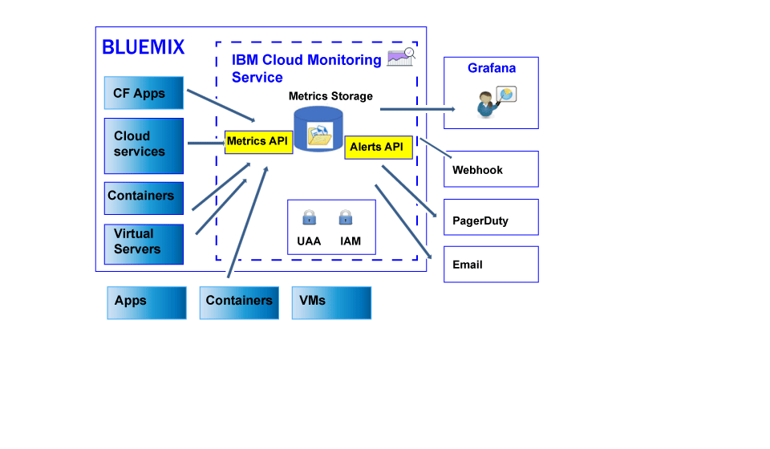

---

copyright:
  years: 2017

lastupdated: "2017-11-22"

---

{:shortdesc: .shortdesc}
{:new_window: target="_blank"}
{:codeblock: .codeblock}
{:screen: .screen}
{:pre: .pre}

# About
{: #monitoring_ov}

Use the {{site.data.keyword.monitoringlong}} service to expand your collection and retention capabilities when working with metrics, and to be able to define rules and alerts that notify you of conditions that require attention. Empower your DevOps team with features that give you insight into how your apps are performing and consuming resources. Quickly identify trends, detect and diagnose problems; all with immediate time to value and low total cost of ownership. Use Grafana to monitor your environment. 
{:shortdesc}

The following figure shows a high level view of the different resources from where you can send metrics to the {{site.data.keyword.monitoringshort}} service for analysis:

The {{site.data.keyword.Bluemix}}, by default, collects and displays metrics for CPU usage, memory utilization, and network I/O for the {{site.data.keyword.containershort}}. You can use the {{site.data.keyword.monitoringshort}} service in the {{site.data.keyword.Bluemix_notm}} to automatically collect and measure key metrics from your environment and applications. No special instrumentation is required to collect metrics. For example, you can use information provided by performance metrics to monitor how a service is running in the cloud, detect resource bottlenecks, and keep an eye on the service level agreement (SLA). When you analyze performance data for a service, you can detect situations that can lead to a resource bottleneck and consequently affect your service SLA to your clients. By taking early action, you can prevent situations that can impact your business negatively.  

You can send metrics for your Cloud Founfry (CF) applications and Virtual Machines (VMs) into the {{site.data.keyword.monitoringshort}} service. For more information on how to send metrics, see [Sending metrics to the {{site.data.keyword.monitoringshort}} service](/docs/services/cloud-monitoring/send_retrieve_metrics_ov.html#send_retrieve_metrics_ov).

You can provision the {{site.data.keyword.monitoringshort}} service through the {{site.data.keyword.Bluemix_notm}} catalog.  

You can view and analyze metrics collected by the {{site.data.keyword.monitoringshort}} service through the {{site.data.keyword.Bluemix_notm}} dashboard.  

## Why use the Monitoring service
{: #value}

1. **Spend less time instrumenting your application and more time enhancing its value**

    The {{site.data.keyword.monitoringlong_notm}} service automatically collects metric data from {{site.data.keyword.IBM_notm}} Cloud services, eliminating the need for agents. APIs make it easy to add custom metrics and to query your monitoring data. 
	
	The {{site.data.keyword.monitoringlong_notm}} service offers metric collection at once per minute.  The Lite plan retains metrics at full resolution for 15 days.  The Premium plan retains metrics at full resolution for 45 days.

2. **Easily extend monitoring into your application with APIs**

    Integrate your monitoring data into your applications and operations through the {{site.data.keyword.monitoringshort}} service APIs. Use the APIs to add relevant application and business metrics to your Cloud monitoring data. You can also use the APIs to send metric data from outside the {{site.data.keyword.IBM_notm}} Cloud into the {{site.data.keyword.monitoringshort}} service.

3. **Gain insights into your environment to quickly detect, diagnose, and identify issues**

    Visualize the pulse of your application and infrastructure with flexible and user customizable dashboards. {{site.data.keyword.monitoringlong_notm}} offers you the power, flexibility, and familiarity of Grafana to quickly build and adapt your dashboard to your application needs.
	
4. **Build reusable dashboards and make them interactive**

    The {{site.data.keyword.monitoringlong_notm}} service's hosted Grafana provides support for building custom dashboards with a large palate of visualization options.  Make your dashboards dynamic with templating by using metric queries with variables.

5. **Receive alerts**

    Define rules to notify you of conditions requiring attention. The {{site.data.keyword.monitoringlong_notm}} service offers an API that you can use to set performance thresholds, and to be notified when those thresholds are breached. Define alert rules for a single service instance or app instance, and alert rules that report on a set of instances. When an alert is triggered, get a notification through an e-mail, a PagerDuty event, a webhook notification, or any combination of the three.

6. **Choose the service plan that fits your needs** 

    You may choose the Lite service plan or the Premium service plan to match your usage needs.  The Lite plan offers basic platform metric collection and complementary alerting.  Alternatively, you can select the Premium plan to enable greater metric consumption with a longer retention period, to increase the number of alerts that you can define, including alerts that report on multiple services and apps, and to gain access to the services APIs.

 
## Service plan
{: #plan}

The {{site.data.keyword.monitoringshort}} service provides multiple plans. Each plan has different metrics collection, retention, and alert definition capabilities. 

You can change a plan through the {{site.data.keyword.Bluemix_notm}} UI or through the command line. You can upgrade or reduce your plan at any time. For more information about service plan upgrades in {{site.data.keyword.Bluemix_notm}}, see [Changing the plan](/docs/services/cloud-monitoring/plan/change_plan.html#change_plan). 

The following table outlines the plans that are available:

<table>
    <caption>Table 1. Summary of plans for the {{site.data.keyword.monitoringshort}} service.</caption>
      <tr>
        <th>Plan</th>
        <th>Sending of metrics by using the API</th>
        <th>Metrics retention period</th>
        <th>Alerts</th>
		<th>Notification methods</th>
      </tr>
      <tr>
        <td>Lite (default)</td>
        <td>Not available</td>
        <td>15 days</td>
        <td>You can define up to 10 single metric alerting rules or 1 rule that includes a wildcard.</td>
		<td>Email</td>
      </tr>
      <tr>
        <td>Premium</td>
        <td>Available</td>
        <td>45 days</td>
        <td>You can define alerting rules including rules with wildcards.</td>
		<td>Email, webhook, PagerDuty</td>
      </tr>
</table>

**Note:** 

* The Lite plan offers the same features as the integrated monitoring capabilities in the {{site.data.keyword.Bluemix_notm}}.
* To see the metrics for a Kubernetes cluster, you must provision the {{site.data.keyword.monitoringshort}} service in the same space where the cluster was created, and select the Premium plan. 

## Metrics retention period
{: #metrics_retention}

The following table summarizes the retention period based on your service plan:

<table>
    <caption>Table 2. Summary of retention period for the {{site.data.keyword.monitoringshort}} service.</caption>
      <tr>
        <th>Plan</th>
        <th>Retention period</th>
      </tr>
      <tr>
        <td>Lite (default)</td>
        <td>Metrics are stored every minute for 15 days. (1m:15d)</td>
      </tr>
      <tr>
        <td>Premium</td>
        <td>Metrics are stored every minute for 45 days. (1m:45d)</td>
      </tr>
</table>

Metrics that have not received data for the last 7 days are deleted. The {{site.data.keyword.monitoringshort}} service deletes all data for a metric path that appears to be transient in nature by identifying metrics that have not been written to in the past 7 days. For example:

* When a container is deleted, the metrics associated with that container exist for 7 days after which time the metrics are deleted.
* If you have a statsd gauge called `<space_id>.test.statsd.gauge-hello` and you do not write to it for a week, the metric will be identified as transient, and that metric will be deleted along with all of its historical information. 

## Provisioning the Monitoring service
{: #provision}

In the {{site.data.keyword.Bluemix_notm}} catalog, you can find the {{site.data.keyword.monitoringshort}} service in the **DevOps** section. For more information about provisioning a service in the {{site.data.keyword.Bluemix_notm}}, see [Provisioning the {{site.data.keyword.monitoringshort}} service](/docs/services/cloud-monitoring/how-to/provision.html#provision).

Consider the following information about the {{site.data.keyword.monitoringshort}} service:

* To collect metrics for cloud resources running in a {{site.data.keyword.Bluemix_notm}} space, you must provision the service in the same space where the resources are running.

* To send metrics into the {{site.data.keyword.monitoringshort}} service, you must provision an instance of the {{site.data.keyword.monitoringshort}} service in the {{site.data.keyword.Bluemix_notm}} space to where you want to send the metrics. 

## Regions
{: #regions}

The {{site.data.keyword.monitoringshort}} service is available in the following regions:

* Germany
* Sydney
* United Kingdom
* US South

## URLs for the Monitoring service
{: #region}

The {{site.data.keyword.monitoringshort}} service is available to anyone with an {{site.data.keyword.Bluemix_notm}} ID and permissions to work with the service in the {{site.data.keyword.Bluemix_notm}}.

* For each region where the {{site.data.keyword.monitoringshort}} service is available, there is a different set of endpoints. 
* There is a single URL that is shared by the ingest and API/Web UI endpoints.
* Port 443 is a TLS port that is used to access metrics through the API and the Web UI (Grafana).

The following table lists the URLs per region:

<table>
  <caption>Table 3. List of endpoints to work with the {{site.data.keyword.monitoringshort}} service</caption>
  <tr>
    <th>Region</th>
	<th>Endpoint</th>
  </tr>
  <tr>
    <td>Germany</td>
	<td>[https://metrics.eu-de.bluemix.net](https://metrics.eu-de.bluemix.net)</td>
  </tr>
  <tr>
    <td>Sydney</td>
	<td>[https://metrics.au-syd.bluemix.net](https://metrics.au-syd.bluemix.net)</td>
  </tr>
  <tr>
    <td>United Kingdom</td>
	<td>[https://metrics.eu-gb.bluemix.net](https://metrics.eu-gb.bluemix.net)</td>
  </tr>
  <tr>
    <td>US South</td>
	<td>[https://metrics.ng.bluemix.net/](https://metrics.ng.bluemix.net/)</td>
  </tr>
</table>

