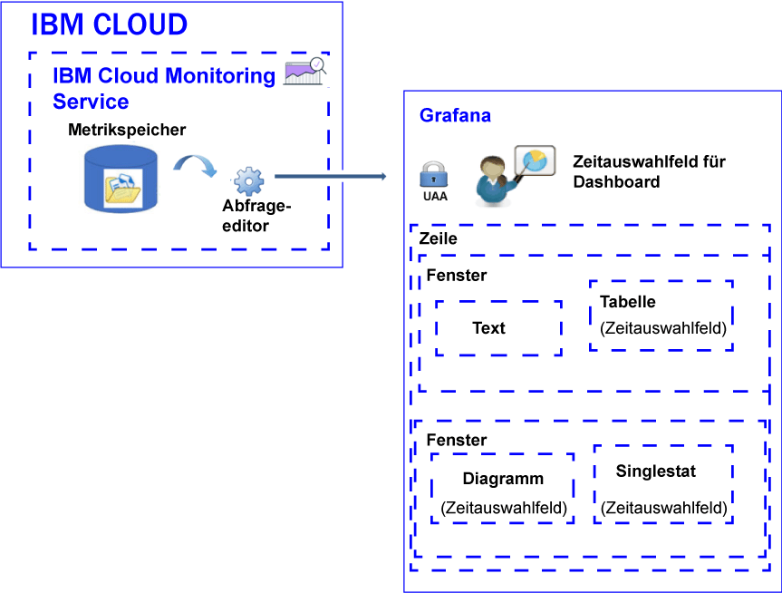

---

copyright:
  years: 2017, 2018

lastupdated: "2018-02-01"

---

{:new_window: target="_blank"}
{:shortdesc: .shortdesc}
{:screen: .screen}
{:pre: .pre}
{:table: .aria-labeledby="caption"}
{:codeblock: .codeblock}
{:tip: .tip}
{:download: .download}

# Metriken analysieren
{: #analyze_metrics_ov}

In {{site.data.keyword.Bluemix}} können Sie Grafana, eine Open-Source-Visualisierungs- und -Überwachungsplattform, verwenden, um Ihre Metriken in einer Vielfalt von Grafiken (z. B. Diagramme und Tabellen) zu überwachen, zu durchsuchen, zu analysieren und zu visualisieren.
{:shortdesc}

## Übersicht über die Komponenten
{: #overview}

Der {{site.data.keyword.monitoringshort}}-Service speichert Datenserien in der Metrikspeicherdatenbank. Sie können diese Daten über den Abfrageeditor abfragen. Weitere Informationen zu den unterstützten Abfragen finden Sie unter [Graphite-Funktionen  ](http://graphite.readthedocs.io/en/0.9.13-pre1/functions.html).

Wenn Sie in Grafana auf die Daten zugreifen möchten, die in der Metrikspeicherdatenbank verfügbar sind, müssen Sie sich bei einem Bereich, einer Organisation und einer Region mit der Benutzer-ID und dem Kennwort anmelden, die Sie für die Anmeldung bei {{site.data.keyword.Bluemix_notm}} verwendet haben. 

Zur Visualisierung der Daten können Sie ein Dashboard mit einer oder mehreren Zeilen konfigurieren. In jeder Zeile können Sie mehrere Anzeigen definieren. 

* In einem Dashboard werden in einer Zeile mehrere Anzeigen gruppiert. 
* Eine Anzeige ist die Basisvisualisierungsressource für die Überwachung von Metriken. 
* Ein Dashboard kann mit Tags und Anmerkungen versehen werden, die Daten enthalten, mit denen die anzeigenübergreifende Korrelation von Daten möglich ist.

Sie können die folgenden Anzeigetypen definieren: Text, Grafik, Tabelle, Singlestat. Jede Anzeige bietet unterschiedliche Stile und Formatierungsoptionen, die Sie anpassen können. 

Die in einer Anzeige enthaltene Datenmenge wird durch die Abfrage und den festgelegten Zeitraum bestimmt. Sie können einen gemeinsamen Zeitraum für alle Anzeigen auf Dashboardebene festlegen oder individuelle Zeiträume pro Anzeige.

Die folgende Abbildung zeigt die verschiedenen Komponenten, die Grafana vom {{site.data.keyword.monitoringshort}}-Service zum Filtern von Daten verwendet, sowie die Ressourcen, die in Grafana zum Visualisieren und Analysieren der Daten verwendet werden können:

