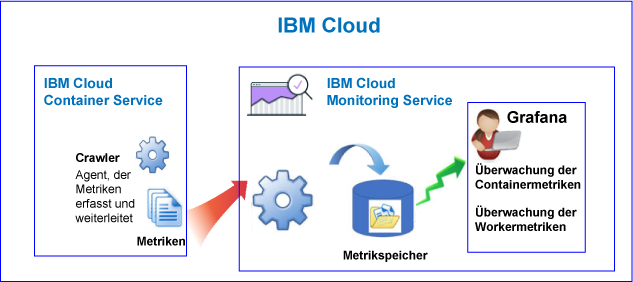
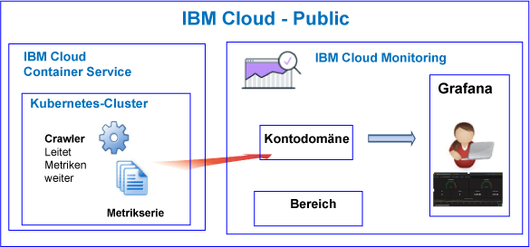
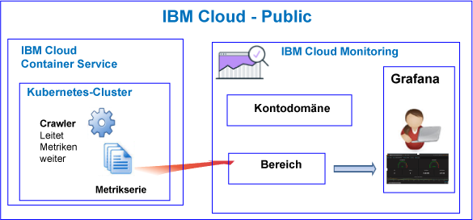
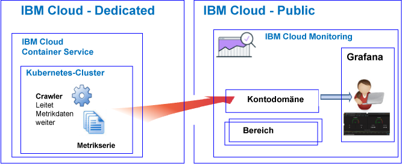

---

copyright:
  years: 2017, 2018

lastupdated: "2018-02-07"

---

{:new_window: target="_blank"}
{:shortdesc: .shortdesc}
{:screen: .screen}
{:pre: .pre}
{:table: .aria-labeledby="caption"}
{:codeblock: .codeblock}
{:tip: .tip}
{:download: .download}

# {{site.data.keyword.containershort_notm}}
{: #monitoring_bmx_containers_ov}

In {{site.data.keyword.Bluemix}} werden Clustermetriken automatisch erfasst. Sie können Grafana verwenden, um die Leistung Ihres Clusters zu überwachen.
{:shortdesc}

**Hinweis:** Metriken werden mithilfe des {{site.data.keyword.monitoringshort}}-Service für Container erfasst und verfügbar gemacht, die in Standardclustern ausgeführt werden. Weitere Informationen zu den von einem Standardcluster unterstützten Features finden Sie unter [Cluster und Apps planen](/docs/containers/cs_planning.html#cs_planning_cluster_type).

## Informationen zur Überwachung in Public
{: #public}

In {{site.data.keyword.Bluemix_notm}} können Sie mit dem {{site.data.keyword.monitoringshort}}-Service Containermetriken und die Kubernetes-Clustermetriken speichern und analysieren, die automatisch vom {{site.data.keyword.containershort}} in Public erfasst werden.

Sie können über einen oder mehrere Kubernetes-Cluster in einem Konto verfügen. Sobald der Cluster bereitgestellt wird, werden Metriken automatisch vom {{site.data.keyword.containershort}} erfasst. Containermetriken werden erfasst, sobald der Pod implementiert ist. Metriken werden automatisch an den {{site.data.keyword.monitoringshort}}-Service weitergeleitet:

* Wenn Sie einen Cluster als Kontoressource erstellen, werden Metriken an die Kontodomäne im {{site.data.keyword.monitoringshort}}-Service weitergeleitet. Damit Metriken an die Kontodomäne weitergeleitet werden können, muss der Eigner des {{site.data.keyword.monitoringshort}}-Service über eine IAM-Richtlinie mit der Berechtigung **Administrator** für die Arbeit mit dem {{site.data.keyword.monitoringshort}}-Service verfügen.
* Wenn Sie einen Cluster erstellen, dem ein Cloud Foundry-Bereich zugeordnet ist, werden Metriken an die Bereichsdomäne im {{site.data.keyword.monitoringshort}}-Service weitergeleitet. Damit Metriken an die Bereichsdomäne weitergeleitet werden können, muss dem Eigner des {{site.data.keyword.monitoringshort}}-Serviceschlüssels die Rolle **Manager** für die Organisation und die Rolle **Entwickler** für den Bereich zugeordnet sein.

Die folgende Abbildung zeigt eine Übersicht der Überwachung für {{site.data.keyword.containershort}}:

Der Crawler ist ein Prozess, der auf einem Host ausgeführt wird und die Überwachung von Metriken ohne Agenten ausführt. Der Crawler erfasst kontinuierlich CPU- und Speichermetriken von allen Containern.

Berücksichtigen Sie beim Analysieren von Metriken in Grafana für einen Cluster die folgenden Informationen:

* Sie müssen Grafana in einer Public-Region starten, in der die {{site.data.keyword.monitoringshort}}-Instanz, in der Sie Metriken anzeigen, implementiert ist. 
* Sie können zum Überwachen Ihres Clusters das Grafana-Standarddashboard **ClusterMonitoringDashboard_v1** verwenden.
* Sie können zudem angepasste Grafana-Dashboards konfigurieren, um Metrikdaten für einen Cluster in der Cloud Public-Region zu visualisieren, in der der Cluster erstellt wird.
* Ihre Benutzer-ID muss über Berechtigungen zum Anzeigen von Metriken verfügen. 

    Um Metriken in der Kontodomäne anzuzeigen, muss ein Benutzer über eine IAM-Richtlinie für den {{site.data.keyword.monitoringshort}}-Service verfügen. Der Benutzer benötigt die Berechtigung **Anzeigeberechtigter**. 
    
    Um Metriken in der Bereichsdomäne anzuzeigen, muss dem Benutzer eine CF-Rolle zugewiesen sein. Weitere Informationen finden Sie unter [Erforderliche Rollen zum Anzeigen von Metriken](/docs/services/cloud-monitoring/security_ov.html#bmx_roles).

### Allgemeine Ansicht der Überwachung für einen Cluster, der Metriken an die Kontodomäne weiterleitet
{: #acc}

Die folgende Abbildung zeigt eine allgemeine Übersicht der Überwachung in Public für den {{site.data.keyword.containershort}}, wenn der Cluster Metriken an die Kontodomäne weiterleitet:

### Allgemeine Ansicht der Überwachung für einen Cluster, der Metriken an eine Berichtsdomäne weiterleitet
{: #space}

Die folgende Abbildung zeigt eine allgemeine Übersicht der Überwachung in Public für den {{site.data.keyword.containershort}}, wenn der Cluster Metriken an eine Bereichsdomäne weiterleitet:

Cluster, die Metriken an einen Bereich weiterleiten, müssen über die Befehlszeile im Kontext einer Cloud Foundry-Organisation und eines Bereichs erstellt werden. Bevor Sie den Cluster erstellen, führen Sie den Befehl `bx target` aus, um den Kontext für die CF-Organisation und den Bereich festzulegen.

## Informationen zur Überwachung in Dedicated
{: #dedicated}

In {{site.data.keyword.Bluemix_notm}} können Sie mit dem {{site.data.keyword.monitoringshort}}-Service in Public Containermetriken und die Kubernetes-Clustermetriken speichern und analysieren, die automatisch vom {{site.data.keyword.containershort}} für Dedicated erfasst werden.

Sie können über einen oder mehrere Kubernetes-Cluster in einem Konto verfügen. Sobald der Cluster bereitgestellt wird, werden Metriken automatisch vom {{site.data.keyword.containershort}} erfasst. Containermetriken werden erfasst, sobald der Pod implementiert ist. Metriken werden automatisch an die Kontodomäne des {{site.data.keyword.monitoringshort}}-Service weitergeleitet.

**Hinweis:** Damit Metriken an die Kontodomäne weitergeleitet werden können, muss der Eigner des {{site.data.keyword.monitoringshort}}-Service über eine IAM-Richtlinie mit der Berechtigung **Administrator** für die Arbeit mit dem {{site.data.keyword.monitoringshort}}-Service verfügen.

Um Metriken für einen Cluster in Grafana anzuzeigen und zu analysieren, berücksichtigen Sie die folgenden Informationen:

* Sie müssen Grafana in der Cloud Public-Region starten, in der der Cluster für Dediciated zur Verfügung steht. Wenn ein Cluster beispielsweise für Dedicated in 'USA (Süden)' bereitgestellt wurde, müssen Sie Grafana in der Region 'USA (Süden)' für Public starten.
* Sie können zum Überwachen Ihres Cluster das Grafana-Standarddashboard **ClusterMonitoringDashboard_v1** verwenden.
* Sie können zudem angepasste Grafana-Dashboards konfigurieren, um Metrikdaten für einen Cluster in der Cloud Public-Region zu visualisieren, in der der Cluster erstellt wird.
* Ihrer Benutzer-ID muss eine IAM-Richtlinie für die Arbeit mit dem {{site.data.keyword.monitoringshort}}-Service zugewiesen sein. Sie benötigen die Berechtigung **Anzeigeberechtigter**, um Metriken in der Kontodomäne anzuzeigen.  

Die folgende Abbildung zeigt eine Übersicht der Überwachung in Dedicated für {{site.data.keyword.containershort}}:

## CPU-Metriken für Container
{: #cpu_metrics_containers}

In der folgenden Tabelle sind die CPU-Metriken aufgelistet, die automatisch für einen Container erfasst werden:

<table>
  <caption>Tabelle 1. CPU-Metriken für Container</caption>
  <tr>
    <th>Metrikname</th>
    <th>Beschreibung</th>
  </tr>
  <tr>
    <td>*cpu.num-cores*</td>
    <td>Diese Metrik berichtet die Anzahl der CPU-Kerne, die dem Container zur Verfügung stehen.   Standardmäßig gibt diese Metrik die Anzahl der Kerne auf dem Worker an. Wenn Sie eine Begrenzung für die Anzahl der für den Container verfügbaren Kerne festlegen, gibt diese Metrik die Anzahl der Kerne an, die Sie in diesem Grenzwert festgelegt haben.</td>
  </tr>
  <tr>
    <td>*cpu.usage*</td>
    <td>Diese Metrik berichtet die Nanosekunden der CPU-Zeit über alle Kerne hinweg.   Wenn die CPU-Auslastung hoch ist, können Verzögerungen auftreten. Eine hohe CPU-Belastung weist auf eine nicht ausreichende Verarbeitungskapazität hin.</td>
  </tr>
  <tr>
    <td>*cpu.usage-pct*</td>
    <td>Diese Metrik berichtet die CPU-Zeit, die verwendet wird, als Prozentsatz der CPU-Kapazität.   Standardmäßig ist die CPU-Kapazität durch die Anzahl der Kerne auf dem Worker festgelegt. Wenn Sie Grenzwerte für die Container-CPU-Kapazität festlegen, gibt diese Metrik die CPU-Auslastung als Prozentsatz der von Ihnen festgelegten Grenzwerte an. Wenn der Prozentsatz der CPU-Auslastung hoch ist, können Verzögerungen auftreten. Eine hohe CPU-Belastung weist auf eine nicht ausreichende Verarbeitungskapazität hin.</td>
  </tr>
  <tr>
    <td>*cpu.usage-pct-container-requested*</td>
    <td>Diese Metrik berichtet die verwendete CPU-Zeit als Prozentsatz der angeforderten CPU des Containers.   Wenn Sie die angeforderte CPU nicht für einen Container festlegen, wird diese Metrik für den Container nicht bereitgestellt.</td>
  </tr>
</table>

## Lademetriken für Worker
{: #load_metrics_workers}

In der folgenden Tabelle sind die CPU-Metriken aufgelistet, die automatisch für einen Worker erfasst werden:

<table>
  <caption>Tabelle 2. Auslastungsmetriken für Worker</caption>
  <tr>
    <th>Metrikname</th>
    <th>Beschreibung</th>
  </tr>
  <tr>
    <td>*load.avg-1*</td>
    <td>Diese Metrik berichtet die durchschnittliche CPU-Auslastung für den Kubernetes-Host im Verlauf der letzten 1 Minute.   Eine durchschnittliche CPU-Belastung, die größer ist als die Anzahl der Kerne im Worker, gibt an, dass der Datenverkehr zum Host in die Warteschlange gestellt wurde.</td>
  </tr>
  <tr>
    <td>*load.avg-5*</td>
    <td>Diese Metrik berichtet die durchschnittliche CPU-Auslastung für den Kubernetes-Host im Verlauf der letzten 5 Minuten.   Eine durchschnittliche CPU-Belastung, die größer ist als die Anzahl der Kerne im Worker, gibt an, dass der Datenverkehr zum Host in die Warteschlange gestellt wurde.</td>
  </tr>
  <tr>
    <td>*load.avg-15*</td>
    <td>Diese Metrik berichtet die durchschnittliche CPU-Auslastung für den Kubernetes-Host im Verlauf der letzten 15 Minuten.   Eine durchschnittliche CPU-Belastung, die größer ist als die Anzahl der Kerne im Worker, gibt an, dass der Datenverkehr zum Host in die Warteschlange gestellt wurde.</td>
  </tr>
</table>

## Speichermetriken für Container
{: #memory_metrics}

In der folgenden Tabelle sind die Speichermetriken aufgelistet, die automatisch erfasst werden:

<table>
  <caption>Tabelle 3. Speichermetriken für Container</caption>
  <tr>
    <th>Metrikname</th>
    <th>Beschreibung</th>
  </tr>
  <tr>
    <td>*memory.current*</td>
    <td>Diese Metrik berichtet die Anzahl an Byte des Speichers, die der Container gerade verwendet. </td>
  </tr>
  <tr>
    <td>*memory.limit*</td>
    <td>Diese Metrik berichtet die Menge an Speicher, die ein Container auf eine Platte auslagern darf, im Vergleich zu den oberen und unteren Grenzwerten, die für einen Pod festgelegt wurden.    Der Pod wird standardmäßig ohne Speicherbegrenzungen ausgeführt. Ein Pod kann so viel Speicher verbrauchen, wie auf dem Worker zur Verfügung steht, auf dem er ausgeführt wird. Wenn Sie einen Pod implementieren, können Sie Grenzwerte für die Speicherkapazität festlegen, die ein Pod verwenden kann. </td>
  </tr>
  <tr>
    <td>*memory.usage-pct*</td>
    <td>Diese Metrik berichtet den verwendeten Speicher als Prozentsatz der Speicherbegrenzung des Containers.    Wenn Sie Grenzwerte für die Speicherkapazität festlegen, berichtet diese Metrik die Speichernutzung als Prozentsatz der von Ihnen festgelegten Grenzwerte. </td>
  </tr>
</table>

## Abfragen zum Überwachen von Ressourcen in einem Kubernetes-Cluster definieren
{: #monitoring_metrics_kube}

Verwenden Sie Grafana, um die Leistung von Containern und Workern zu überwachen, die in einem Kubernetes-Cluster in {{site.data.keyword.Bluemix_notm}} bereitgestellt wurden. 

Der {{site.data.keyword.monitoringlong}}-Service verwendet Grafana, eine Open-Source-Analyse- und Darstellungsplattform, mit der Sie Ihre Metriken in einer Vielfalt von Grafiken (z. B. Diagramme und Tabellen) überwachen, durchsuchen, analysieren und visualisieren können.

Sie können Grafana von einem Browser starten. Weitere Informationen finden Sie unter [Von einem Web-Browser zum Grafana-Dashboard navigieren](/docs/services/cloud-monitoring/grafana/navigating_grafana.html#launch_grafana_from_browser).

Zum Überwachen von Containern und Workern, die in einem Kubernetes-Cluster ausgeführt werden, müssen Sie für jede Ressource eine Abfrage in Grafana definieren:

* Informationen darüber, wie Sie eine Abfrage definieren, mit der eine CPU-Metrik für einen Container überwacht wird, finden Sie unter [CPU-Metriken für einen Container in Grafana konfigurieren](/docs/services/cloud-monitoring/containers/config_cpu_worker.html#config_cpu_worker).
* Informationen darüber, wie Sie eine Abfrage definieren, mit der eine Speichermetrik für einen Container überwacht wird, finden Sie unter [Speichermetriken für einen Container in Grafana konfigurieren](/docs/services/cloud-monitoring/containers/config_mem_container.html#config_mem_container).
* Informationen darüber, wie Sie eine Abfrage definieren, mit der eine Lademetrik für einen Worker überwacht wird, finden Sie unter [Auslastungsmetriken für einen Worker in Grafana konfigurieren](/docs/services/cloud-monitoring/containers/config_load_worker.html#config_load_worker).

Das Format der Abfrage ist je nach Ressourcentyp und Art der Abfrage anders:

* Weitere Informationen zum Format der Abfragen zum Überwachen der CPU für einen Container finden Sie unter [Abfrageformat für CPU-Metriken für einen Container](/docs/services/cloud-monitoring/reference/metrics_format_containers.html#cpu_containers). 
* Weitere Informationen zum Format der Abfragen zum Überwachen der Auslastung für einen Worker finden Sie unter [Abfrageformat für Lademetriken für einen Worker](/docs/services/cloud-monitoring/reference/metrics_format_containers.html#load_workers).
* Weitere Informationen zum Format der Abfragen zum Überwachen von Speicher für einen Container finden Sie unter [Abfrageformat für Speichermetriken für einen Container](/docs/services/cloud-monitoring/reference/metrics_format_containers.html#mem_containers).

## Netzverkehr für angepasste Firewallkonfigurationen in {{site.data.keyword.Bluemix_notm}} konfigurieren
{: #ports}

Wenn Sie eine zusätzliche Firewall eingerichtet oder die Firewalleinstellungen in {{site.data.keyword.Bluemix_notm}} Infrastructure (SoftLayer) angepasst haben, müssen Sie abgehenden Netzverkehr vom Workerknoten an den {{site.data.keyword.monitoringshort}}-Service zulassen. 

Sie müssen TCP-Port 443 und TCP-Port 9091 an jedem Worker für den {{site.data.keyword.monitoringshort}}-Service für die folgenden IP-Adressen in der angepassten Firewall öffnen:

<table>
  <tr>
    <th>Region</th>
    <th>Einpflege-URL</th>
	<th>Öffentliche IP-Adressen</th>
  </tr>
  <tr>
    <td>Deutschland</td>
	<td>ingest-eu-fra.logging.bluemix.net</td>
	<td>158.177.88.43  159.122.87.107</td>
  </tr>
  <tr>
    <td>Vereinigtes Königreich</td>
	<td>ingest.logging.eu-gb.bluemix.net</td>
	<td>169.50.115.113</td>
  </tr>
  <tr>
    <td>USA (Süden)</td>
	<td>ingest.logging.ng.bluemix.net</td>
	<td>169.48.79.236  169.46.186.113</td>
  </tr>
  <tr>
    <td>Sydney</td>
	<td>ingest-au-syd.logging.bluemix.net</td>
	<td>130.198.76.125  168.1.209.20</td>
  </tr>
</table>
