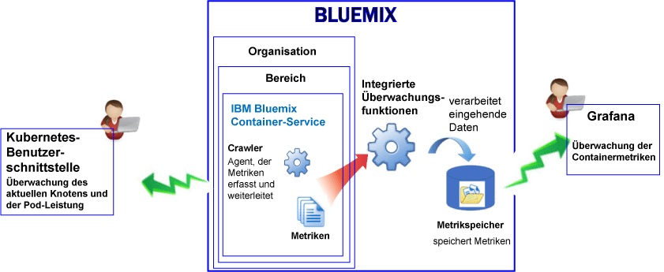

---

copyright:
  years: 2017

lastupdated: "2017-06-21"

---

{:shortdesc: .shortdesc}
{:new_window: target="_blank"}
{:codeblock: .codeblock}
{:screen: .screen}
{:pre: .pre}

# Überwachung für den IBM Bluemix Container-Service
{: #monitoring_bmx_containers_ov}

In {{site.data.keyword.Bluemix}} werden Containermetriken automatisch von außerhalb des Containers erfasst, ohne dass Agenten innerhalb des Containers installiert oder gewartet werden müssen. Sie können Grafana verwenden, um Containermetriken zu visualisieren. Sie können auch die Benutzerschnittstelle von Kubernetes verwenden, um Metriken für Knoten (Worker) und Pods anzuzeigen.
{:shortdesc}

## Metriken für einen Container erfassen, der in einem Kubernetes-Cluster ausgeführt wird.
{: #metrics_containers_kube_ov}

Beachten Sie die folgenden Informationen, wenn Sie in {{site.data.keyword.Bluemix_notm}} Anwendungen in einem Kubernetes-Cluster implementieren:

* In einem {{site.data.keyword.Bluemix_notm}}-Konto können Sie über eine oder mehrere Organisationen verfügen.
* Jede Organisation kann über einen oder mehrere {{site.data.keyword.Bluemix_notm}}-Bereiche verfügen.
* Sie können über ein oder mehrere Kubernetes-Cluster in einer Organisation verfügen.
* Die Erfassung von Metriken wird automatisch aktiviert, wenn Sie einen Kubernetes-Cluster erstellen.
* Ein Kubernetes-Cluster ist von den {{site.data.keyword.Bluemix_notm}}-Bereichen unabhängig. Die für ein Cluster und seine Ressourcen erfassten Metriken werden jedoch einem {{site.data.keyword.Bluemix_notm}}-Bereich zugeordnet.
* Metriken werden für einen Container erfasst, sobald der Pod implementiert ist.
* Sie können Metriken in Grafana oder in der Kubernetes-Benutzerschnittstelle anzeigen.
* Um Metrikdaten für ein Cluster zu visualisieren, müssen Sie Grafana-Dashboards für die Cloud Public-Region konfigurieren, in der das Cluster erstellt wurde.

Bevor Sie ein Cluster entweder über die {{site.data.keyword.Bluemix_notm}}-Benutzerschnittstelle oder über die Befehlszeile erstellen, müssen Sie sich bei einer bestimmten Region, einem Konto, einer Organisation und einem Bereich von {{site.data.keyword.Bluemix_notm}} anmelden. Der Bereich, in dem Sie angemeldet sind, ist der Bereich, in dem Metrikdaten für den Cluster und seine Ressourcen erfasst werden.

Die folgende Abbildung zeigt eine Übersicht der Überwachung für {{site.data.keyword.containershort}}:

Der Crawler ist ein Prozess, der auf einem Host ausgeführt wird und die Überwachung von Metriken ohne Agenten ausführt. Der Crawler erfasst kontinuierlich standardmäßig die folgenden Metriken von allen Containern:

<table>
  <caption>Tabelle 1. Standardmäßig erfasste Metriken</caption>
  <tr>
    <th>Metriktyp</th>
    <th>Metrikname</th>
    <th>Beschreibung</th>
  </tr>
  <tr>
    <td>Speicher</td>
    <td>*memory_current*</td>
    <td>Diese Metrik berichtet die Anzahl an Byte des Speichers, die der Container gerade verwendet. </td>
  </tr>
  <tr>
    <td>Speicher</td>
    <td>*memory_limit*</td>
    <td>Diese Metrik berichtet die Menge an Speicher, die ein Container auf eine Platte auslagern darf, im Vergleich zu den oberen und unteren Grenzwerten, die für einen Pod festgelegt wurden.    Der Pod wird standardmäßig ohne Speicherbegrenzungen ausgeführt. Ein Pod kann so viel Speicher verbrauchen, wie auf dem Worker zur Verfügung steht, auf dem er ausgeführt wird. Wenn Sie einen Pod implementieren, können Sie Grenzwerte für die Speicherkapazität festlegen, die ein Pod verwenden kann. </td>
  </tr>
  <tr>
    <td>CPU</td>
    <td>*cpu_usage*</td>
    <td>Diese Metrik berichtet die Nanosekunden der CPU-Zeit über alle Kerne hinweg.   Wenn die CPU-Auslastung hoch ist, können Verzögerungen auftreten. Eine hohe CPU-Belastung weist auf eine nicht ausreichende Verarbeitungskapazität hin.</td>
  </tr>
  <tr>
    <td>CPU</td>
    <td>*cpu_usage_pct*</td>
    <td>Diese Metrik berichtet die CPU-Zeit, die verwendet wird, als Prozentsatz der CPU-Kapazität.   Wenn der Prozentsatz der CPU-Auslastung hoch ist, können Verzögerungen auftreten. Eine hohe CPU-Belastung weist auf eine nicht ausreichende Verarbeitungskapazität hin.</td>
  </tr>
  <tr>
    <td>CPU</td>
    <td>*cpu_num_cores*</td>
    <td>Diese Metrik berichtet die Anzahl der CPU-Kerne, die dem Container zur Verfügung stehen.</td>
  </tr>
</table>

## Erfassung von Standardmetriken für einen Container, der in Bluemix verwaltet wird.
{: #metrics_containers_bmx_ov}

Die folgende Abbildung zeigt eine Übersicht der Überwachung für {{site.data.keyword.containershort}}:

Der Crawler erfasst kontinuierlich standardmäßig die folgenden Metriken von allen Containern:

* CPU
* Speicher
* Netzinformationen

## Metriken für einen Container überwachen, der in einem Kubernetes-Cluster ausgeführt wird
{: #monitoring_metrics_kube}

Metriken werden sowohl in der Benutzerschnittstelle von Kubernetes als auch in Grafana erfasst und angezeigt:

* Verwenden Sie Grafana, eine Open-Source-Analyse- und Darstellungsplattform, um Ihre Metriken in einer Vielfalt von Grafiken (z.B. Diagramme und Tabellen) zu überwachen, zu durchsuchen, zu analysieren und zu visualisieren.
 
    Sie können Grafana von einem Browser starten. Weitere Informationen finden Sie unter [Von einem Web-Browser zum Grafana-Dashboard navigieren](/docs/services/cloud-monitoring/grafana/navigating_grafana.html#launch_grafana_from_browser).
    
* Verwenden Sie die Kubernetes-Benutzerschnittstelle, um Metriken für Knoten und Pods anzuzeigen. Weitere Informationen finden Sie unter [Dashboard für Webbenutzerschnittstelle](https://kubernetes.io/docs/tasks/access-application-cluster/web-ui-dashboard/ "Symbol für externen Link"){: new_window}.

## Metriken für einen verwalteten Container in Bluemix überwachen
{: #monitoring_metrics_bmx}

Metriken werden in der {{site.data.keyword.Bluemix_notm}}-Benutzerschnittstelle und in Grafana erfasst und angezeigt:

* Verwenden Sie Grafana, eine Open-Source-Analyse- und Darstellungsplattform, um Ihre Metriken in einer Vielfalt von Grafiken (z.B. Diagramme und Tabellen) zu überwachen, zu durchsuchen, zu analysieren und zu visualisieren.
 
    Sie können Grafana über die {{site.data.keyword.Bluemix_notm}}-Benutzerschnittstelle oder über einen Browser starten. Weitere Informationen finden Sie unter [Navigieren zum Grafana-Dashboard](/docs/services/cloud-monitoring/grafana/navigating_grafana.html#navigating_grafana).
    

* Verwenden Sie die {{site.data.keyword.Bluemix_notm}}-Benutzerschnittstelle, um die aktuellsten Metriken anzuzeigen.

    Informationen zum Anzeigen der Metriken in der {{site.data.keyword.Bluemix_notm}}-Benutzerschnittstelle finden Sie unter [Metriken von der Bluemix-Konsole analysieren](/docs/services/cloud-monitoring/containers/analyzing_metrics_bmx_ui.html#analyzing_metrics_bmx_ui).

    

