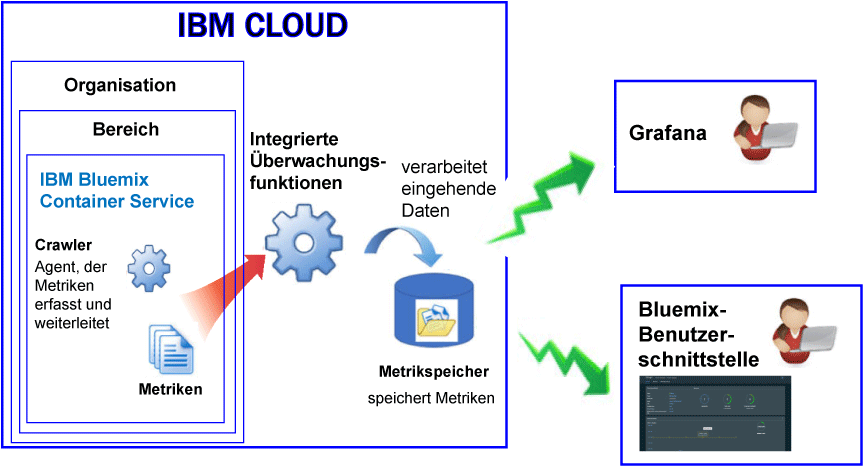

---

copyright:
  years: 2017, 2018

lastupdated: "2018-02-02"

---

{:new_window: target="_blank"}
{:shortdesc: .shortdesc}
{:screen: .screen}
{:pre: .pre}
{:table: .aria-labeledby="caption"}
{:codeblock: .codeblock}
{:tip: .tip}
{:download: .download}

# In IBM Cloud verwaltete Container (veraltet)
{: #monitoring_managed_containers_ov}

In {{site.data.keyword.Bluemix}} werden Container- und Workermetriken automatisch von außerhalb des Containers erfasst, ohne dass Agenten innerhalb des Containers installiert oder gewartet werden müssen. Sie können Grafana verwenden, um Containermetriken zu visualisieren. 
{:shortdesc}

**Hinweis:** Metriken werden mithilfe des {{site.data.keyword.monitoringshort}}-Service für Container erfasst und verfügbar gemacht, die in Standardclustern ausgeführt werden. Weitere Informationen zu den von einem Standardcluster unterstützten Features finden Sie unter [Cluster und Apps planen](/docs/containers/cs_planning.html#cs_planning_cluster_type).

## Standardmetriken erfassen
{: #metrics_containers_bmx_ov}

Die folgende Abbildung zeigt eine Übersicht der Überwachung für {{site.data.keyword.containershort}}:

Der Crawler erfasst kontinuierlich standardmäßig die folgenden Metriken von allen Containern:

* CPU
* Speicher
* Netzinformationen

## Metriken für einen in IBM Cloud verwalteten Container überwachen (veraltet)
{: #monitoring_metrics_bmx}

Metriken werden in der {{site.data.keyword.Bluemix_notm}}-Benutzerschnittstelle und in Grafana erfasst und angezeigt:

* Verwenden Sie Grafana, eine Open-Source-Analyse- und Darstellungsplattform, um Ihre Metriken in einer Vielfalt von Grafiken (z.B. Diagramme und Tabellen) zu überwachen, zu durchsuchen, zu analysieren und zu visualisieren.

    Sie können Grafana über die {{site.data.keyword.Bluemix_notm}}-Benutzerschnittstelle oder über einen Browser starten. Weitere Informationen finden Sie unter [Navigieren zum Grafana-Dashboard](/docs/services/cloud-monitoring/grafana/navigating_grafana.html#navigating_grafana).

* Verwenden Sie die {{site.data.keyword.Bluemix_notm}}-Benutzerschnittstelle, um die aktuellsten Metriken anzuzeigen.

    Informationen zum Anzeigen der Metriken in der {{site.data.keyword.Bluemix_notm}}-Benutzerschnittstelle finden Sie unter [Metriken über die {{site.data.keyword.Bluemix_notm}}-Konsole analysieren](/docs/services/cloud-monitoring/containers/analyzing_metrics_bmx_ui.html#analyzing_metrics_bmx_ui).
