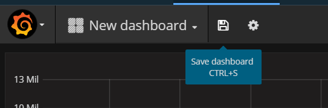

---

copyright:
  years: 2017
lastupdated: "2017-06-26"

---

{:new_window: target="_blank"}
{:shortdesc: .shortdesc}
{:screen: .screen}
{:codeblock: .codeblock}
{:pre: .pre}

# Einführung in IBM Cloud Monitoring in Bluemix
{: #getting-started-with-ibm-cloud-monitoring}

In diesem einführenden Lernprogramm werden Sie Schritt für Schritt durch die Analyse eines Containers mithilfe des {{site.data.keyword.monitoringlong}}-Service geführt. Sie erfahren, wie Sie nach Containermetriken für eine App suchen, die in einem Kubernetes-Cluster implementiert ist, und wie Sie diese Metriken analysieren.
{:shortdesc}

## Vorbemerkungen
{: #prereqs}

Erstellen Sie ein [Bluemix-Konto](https://console.bluemix.net/registration/). Ihre Benutzer-ID muss ein Mitglied oder ein Eigner eines Bluemix-Kontos mit der Berechtigung zum Erstellen von Kubernetes-Clustern, zum Implementieren von Apps in Cluster und zum Abfragen der Bluemix-Protokolle für die erweiterte Analyse in Kibana sein.

Öffnen Sie eine Terminalsitzung von der aus Sie die Kubernetes-Cluster verwalten und die Apps über die Befehlszeile implementieren können. Die Beispiele in diesem Lernprogramm sind für ein System mit Ubuntu Linux angegeben.

[Installieren Sie die CLI-Plug-ins](/docs/containers/cs_cli_install.html#cs_cli_install_steps) in Ihrer lokalen Umgebung, um den IBM Bluemix Container-Service von der Befehlszeile aus zu verwalten. 


## Schritt 1: Implementieren einer App in einem Container
{: #step1}

Führen Sie die folgenden Schritte aus, um einen Container in einem Kubernetes-Cluster zu implementieren:

1. [Erstellen Sie ein Kubernetes-Cluster](/docs/containers/cs_cluster.html#cs_cluster_ui).

2. [Konfigurieren Sie den Clusterkontext](/docs/containers/cs_cli_install.html#cs_cli_configure) in einem Linux-Terminal. Nach der Konfiguration des Kontexts können Sie den Kubernetes-Cluster verwalten und die Anwendung im Kubernetes-Cluster bereitstellen.

3. Implementieren Sie die Beispielapp im Kubernetes-Cluster und führen Sie sie aus. [ Führen Sie die Schritte für die Lerneinheit 1 aus](/docs/containers/cs_tutorials.html#cs_apps_tutorial).

    Die App ist eine 'Hello World'-Node.js-App:

    ```
    var express = require('express')
    var app = express()

    app.get('/', function(req, res) {
      res.send('Hello world! Your app is up and running in a cluster!\n')
    })
    app.listen(8080, function() {
      console.log('Sample app is listening on port 8080.')
    })
    ```

    Wenn die Anwendung bereitgestellt wird, wird die Metrikerfassung automatisch aktiviert.


## Schritt 2: Navigieren zum Grafana-Dashboard
{: #step2}

Starten Sie Grafana von einem Browser. 

Zum Analysieren von Metriken für einen Cluster müssen Sie auf Grafana in der öffentlichen Cloud-Region zugreifen, in der der Cluster erstellt wird. 
    
Starten Sie dann in einem Browser die folgende URL, um Grafana zu öffnen: `https://metrics.ng.bluemix.net/`
    
    
## Schritt 3: Analysieren von Metriken in Grafana
{: #step3}

Führen Sie die folgenden Schritte aus, um ein Grafana-Dashboard zu erstellen:
    
1. Erstellen Sie ein neues Dashboard.

    * Wählen Sie das Steuerelement zum Hin- und Herschalten  in der seitlichen Menüleiste aus.  
    * Wählen Sie **Dashboards** aus. 
    * Klicken Sie auf **Neu**
    
    Ein Dashboard wird geöffnet. Das Dashboard enthält eine leere Zeile, die konfiguriert werden kann. 
    
    
    
     Fügen Sie in Grafana Zeilen hinzu, um das Dashboard in Abschnitte zu unterteilen. Eine Zeile gruppiert eine oder mehrere Anzeigen. Innerhalb einer Zeile ist eine Anzeige die kleinste Visualisierungseinheit, die Sie für die Anzeige von Daten für eine Metrik konfigurieren können. Sie können zum Beispiel eine Diagrammanzeige oder eine Tabellenanzeige auswählen. Sie können Anzeigen ziehen und übergeben, um sie in einem Dashboard neu anzuordnen. Die in den Anzeigen angezeigten Daten werden über Abfragen konfiguriert. Sie können eine oder mehrere Abfragen in einer Anzeige definieren. Jede Abfrage stellt eine andere Gruppe von Daten dar. Sie können auch den Zeitraum für eine Anzeige festlegen. Normalerweise wird der Zeitraum durch das Zeitauswahlfeld im *Dashboard* festgelegt.
    
2. Fügen Sie eine *Grafik*anzeige hinzu, um die Nanosekunden der CPU-Zeit über alle zentralen Bestandteile für einen Container zu überwachen.
    
    1. Wählen Sie **Grafik** aus.
    
    2. Klicken Sie auf den Grafiktitel und wählen Sie anschließend **Bearbeiten** aus.
    
        Die Registerkarte *Metriken* wird angezeigt. Sie können hier die Standarddatenquelle sehen.
    
        
    
3. Definieren Sie die Abfrage, die die in der Grafik angezeigten Daten filtert. 

    Die folgende Tabelle stellt die unterschiedlichen Felder dar, die für die Konfiguration einer Abfrage erforderlich sind, die Daten für eine Containermetrik filtert:

    <table>
      <caption>Tabelle 1. Grafana-Abfragefelder für Container</caption>
      <tr>
        <th align="center">Feld</th>
        <th align="center">Beschreibung</th>
        <th align="center">Gültige Werte</th>
      </tr>
      <tr>
        <td>Präfix</td>
        <td>Präfix für Container-Metriken. <br><br>Dieses Präfix gilt für Daten, die für Container gesammelt wurden, die in einem Kubernetes-Cluster implementiert sind.</td>
        <td>`crn`</td>
      </tr>
      <tr>
        <td>Version</td>
        <td>Version der erfassten Metrikdaten.</td>
        <td>`v1`</td>
      </tr>
      <tr>
        <td>Provider</td>
        <td>Cloud-Provider, bei dem die Daten erfasst werden.</td>
        <td>`bluemix`</td>
      </tr>
      <tr>
        <td>Typ</td>
        <td>Cloudumgebung, in der die Daten erfasst werden.</td>
        <td>`public`</td>
      </tr>
      <tr>
        <td>Quelle</td>
        <td>Cloudinfrastruktur, in der Metriken erfasst werden.</td>
        <td>`containers-kubernetes`</td>
      </tr>
      <tr>
        <td>Region</td>
        <td>Cloudregion, in der Metriken erfasst werden.</td>
        <td>* `ng` <br>* `eu-gb` <br>* `eu-de` </td>
      </tr>
      <tr>
        <td>Konto</td>
        <td>GUID des Kontos, in dem Metriken erfasst werden. <br>Das Format dieses Feldes lautet wie folgt: ` a_ *ID* `, wobei ID die GUID des Kontos ist.</td>
        <td></td>
      </tr>
      <tr>
        <td>Cluster</td>
        <td>GUID des Clusters, in dem Metriken erfasst werden.</td>
        <td></td>
      </tr>
      <tr>
        <td>Container-Metrik</td>
        <td>Metriken, die für einen Container erfasst wurden.</td>
        <td>* `memory_current` <br>* `memory_limit` <br>* `cpu_usage` <br>* `cpu_usage_pct` <br>* `cpu_num_cores`</td>
      </tr>
      <tr>
        <td>Container in einem Pod</td>
        <td>Kombination von Kubernetes-Ressourcennamen und GUIDs, die für einen eindeutig gekennzeichneten Container erforderlich sind, der in einem Pod ausgeführt wird. <br> Das Format für diese Felder lautet: *{namespace}_#{pod_name}_#{container_name}_#{container_id}* <br><br>**Hinweis:** Wenn Sie die Liste verfügbarer Optionen für diesen Eintrag in der Abfrage anzeigen, beachten Sie, dass dort auch ein Eintrag mit folgendem Format vorhanden ist: *{namespace}_#{pod_name}_#{container_name}_POD_#{container_id}*. Diese Einträge entsprechen den internen Container-IDs, die von Kubernetes erstellt wurden.</td>
        <td></td>
      </tr>
      <tr>
        <td>Funktionen</td>
        <td>Abfragefunktionen, die Sie zur Visualisierung einer Containermetrik in der Anzeige auswählen können. <br>Weitere Informationen finden Sie unter [Funktionen  ](http://graphite.readthedocs.io/en/latest/functions.html "Symbol für externen Link"){: new_window}</td>
        <td></td>
      </tr>
    </table>
    
    Das folgende Abbild zeigt, wie die Abfrage in Grafana angezeigt wird, wenn Sie sie konfigurieren: 
    
    
    
    Führen Sie die folgenden Schritte aus, um die Abfrage zu definieren:
    
    Wählen Sie auf der Registerkarte *Metriken* die Option **Abfrage hinzufügen** aus. <br>Ein Abfrageeintrag wird hinzugefügt. Jede Abfrage wird mit einem Buchstaben gekennzeichnet.
    
    
        
    1. Klicken Sie auf **Metrik auswählen** und wählen Sie dann `crn` aus.
    
    2. Klicken Sie auf **Metrik auswählen** und wählen Sie dann `v1` aus.
    
    3. Klicken Sie auf **Metrik auswählen** und wählen Sie dann `bluemix` aus.
    
    4. Klicken Sie auf **Metrik auswählen** und wählen Sie dann `public` aus.
    
    5. Klicken Sie auf **Metrik auswählen** und wählen Sie dann `containers-kubernetes` aus.
    
    6. Klicken Sie auf **Metrik auswählen** und wählen Sie dann `us-south` aus.
    
    7. Klicken Sie auf **Metrik auswählen** und wählen Sie dann die Konto-ID aus, für die Sie die Daten anzeigen möchten. Zum Beispiel: `a_91d1d1exxxxxxx4df920bbd06461b066`
    
    8. Klicken Sie auf **Metrik auswählen** und wählen Sie dann die Cluster-ID aus.
    
    9. Klicken Sie auf **Metrik auswählen** und wählen Sie dann eine Containermetrik aus. Zur Überwachung der *CPU-Auslastung* eines Containers wählen Sie `container-metric-cpu_usage` aus.
    
    10. Klicken Sie auf **Metrik auswählen** und wählen Sie dann die ID aus, die mit dem Container übereinstimmt, für den Sie die CPU-Auslastung überwachen wollen. Beispiel: `default_hello-world-deployment-3355293961-0fwkg_hello-world-deployment_ad5eb446a493db31f1d9eb158f5de915fc063d6c136823488b694e63bb00aa57`.
    
    11. Klicken Sie auf das Pluszeichen  und wählen Sie eine Funktion aus. Sie können eine Funktion zur Transformation, zur Kombination und zur Durchführung von Berechnungen mit den Daten hinzufügen, die für eine Metrik zur Verfügung stehen.
        
        Sie können zum Beispiel die Funktion **alias(newName)** hinzufügen, um einen Aliasnamen für eine Metrik hinzuzufügen. Dieser Aliasname wird verwendet, um einen Zeichenfolge anstelle des Metriknamens in der Legende anzuzeigen, die in der Grafik angezeigt wird.
        
        Um einen Aliasnamen für Ihre Metrik hinzuzufügen, führen Sie die folgenden Schritte aus:
        
        1. Klicken Sie auf das Pluszeichen.
        2. Wählen Sie **Spezieller Name** aus. 
        3. Wählen Sie **Aliasname** aus.
        4. Geben Sie eine Zeichenfolge ein. Zum Beispiel `My sample metric`.
        
4. Speichern Sie das Dashboard zur späteren Wiederverwendung. 

    1. Klicken Sie auf die Dashboardabbildung zum Speichern . 
    
        
    
    2. Geben Sie den Namen des Dashboards ein.
    3. Klicken Sie auf **Speichern**.


## Nächste Schritte
{: #next_steps}

Definieren Sie einen Alert für eine Metrik. Weitere Informationen finden Sie unter [Alerts konfigurieren ](/docs/services/cloud-monitoring/config_alerts_ov.html#config_alerts_ov).


