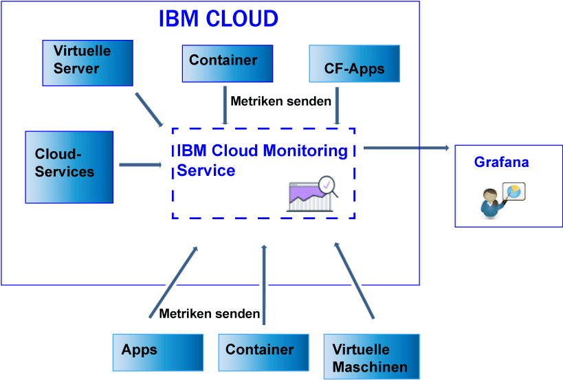

---

copyright:
  years: 2017

lastupdated: "2017-07-10"

---

{:shortdesc: .shortdesc}
{:new_window: target="_blank"}
{:codeblock: .codeblock}
{:screen: .screen}
{:pre: .pre}

# Senden und Abrufen von Daten
{: #send_retrieve_metrics_ov}

Sie können die Metrik-API verwenden, um Metriken von einem {{site.data.keyword.Bluemix}}-Bereich an den {{site.data.keyword.monitoringshort}}-Service zu senden bzw. um Metriken abzurufen.
{:shortdesc}

Die folgende Abbildung zeigt eine Übersicht der unterschiedlichen Ressourcen, von denen aus Sie Metriken an den {{site.data.keyword.monitoringshort}}-Service senden können.

## Metriken senden
{: #send}

Bei {{site.data.keyword.Bluemix_notm}} Docker-Containern werden die Systemmetriken automatisch erfasst. Bei Cloud Foundry-Anwendungen und Apps, die auf einer virtuellen Maschine ausgeführt werden, müssen Metriken direkt mithilfe der API für Metriken von der App gesendet werden. 

Beachten Sie beim Senden von Metriken an den {{site.data.keyword.monitoringshort}}-Service die folgenden Informationen: 

* Sie müssen den {{site.data.keyword.Bluemix_notm}}-Bereich festlegen, aus dem die Daten abgerufen werden sollen.

* Sie müssen ein Sicherheitstoken oder einen API-Schlüssel für die Verwendung des {{site.data.keyword.monitoringshort}}-Service angeben. 

* Sie können den API-Endpunkt `https://metrics.ng.bluemix.net/v1/metrics` verwenden. Weitere Informationen zur API finden Sie im Abschnitt [Metrik-API](https://console.bluemix.net/apidocs/927-ibm-cloud-monitoring-rest-api?&language=node#introduction){: new_window}.

Abhängig vom ausgewählten Authentifizierungsmodell können Sie eine der folgenden Optionen zum Senden von Daten an den {{site.data.keyword.monitoringshort}}-Service auswählen:
 
* Wenn Sie Metriken mithilfe eines UAA-Tokens senden möchten, lesen Sie die Informationen in [Metriken mit UAA-Token an einen Bereich senden](/docs/services/cloud-monitoring/send-metrics/send_data_api.html#uaa).

* Wenn Sie Metriken mithilfe eines IAM-Tokens oder eines API-Schlüssels senden möchten, lesen Sie die Informationen in [Metriken mit IAM-Token oder API-Schlüssel an einen Bereich senden](/docs/services/cloud-monitoring/send-metrics/send_data_api.html#iam).

## Metriken abrufen
{: #retrieve}

Beachten Sie beim Abrufen von Metriken die folgenden Informationen: 

* Sie müssen den {{site.data.keyword.Bluemix_notm}}-Bereich festlegen, aus dem die Daten abgerufen werden sollen.

* Sie müssen ein Sicherheitstoken oder einen API-Schlüssel für die Verwendung des {{site.data.keyword.monitoringshort}}-Service angeben. 

* Sie müssen einen Pfad für eine oder mehrere Metriken angeben. Weitere Informationen finden Sie in [Metriken definieren](/docs/services/cloud-monitoring/retrieve-metrics/retrieve_data_api.html#metrics).

* Optional können Sie einen benutzerdefinierten Zeitraum angeben. Wenn Sie keinen Zeitraum angeben, entsprechen die abgerufenen Daten standardmäßig den letzten 24 Stunden. Weitere Informationen finden Sie in [Zeitraum konfigurieren](/docs/services/cloud-monitoring/retrieve-metrics/retrieve_data_api.html#time).

* Sie können den API-Endpunkt `https://metrics.ng.bluemix.net/v1/metrics` verwenden. Weitere Informationen zur API finden Sie im Abschnitt [Metrik-API](https://console.bluemix.net/apidocs/927-ibm-cloud-monitoring-rest-api?&language=node#introduction){: new_window}.

**Hinweis:** Pro Anforderung können maximal 5 Ziele abgerufen werden. 

Abhängig vom ausgewählten Authentifizierungsmodell können Sie eine der folgenden Optionen zum Abrufen von Daten vom {{site.data.keyword.monitoringshort}}-Service auswählen:
 
* Wenn Sie Metriken mithilfe eines UAA-Tokens abrufen möchten, lesen Sie die Informationen in [Metriken mit UAA-Token von einem Bereich abrufen](/docs/services/cloud-monitoring/retrieve-metrics/retrieve_data_api.html#uaa).

* Wenn Sie Metriken mithilfe eines IAM-Tokens oder eines API-Schlüssels abrufen möchten, lesen Sie die Informationen in [Metriken mit IAM-Token oder API-Schlüssel von einem Bereich abrufen](/docs/services/cloud-monitoring/retrieve-metrics/retrieve_data_api.html#iam).

## Liste der Metriken abrufen
{: #show_metrics}

Sie können die Metriken auflisten, die in einem Bereich verfügbar sind.

Beachten Sie beim Auflisten der Metriken die folgenden Informationen: 

* Sie müssen den {{site.data.keyword.Bluemix_notm}}-Bereich festlegen, für den die verfügbaren Metriken aufgelistet werden sollen.

* Sie müssen ein Sicherheitstoken oder einen API-Schlüssel für die Verwendung des {{site.data.keyword.monitoringshort}}-Service angeben. 

* Sie müssen eine Abfrage angeben, die den Pfad definiert, der die aufzulistenden Metriken enthält. Zum Auflisten aller Metriken in einem Bereich können Sie für die Abfrage zum Beispiel Folgendes festlegen: `query=SpaceGUID.*`. Dabei ist *SpaceGUID* die GUID des Bereichs.

    Der Standardwert ist `*`. Dieser gibt den Startpunkt in der Stammverzeichnisebene für den Bereich an.

* Sie können den API-Endpunkt `https://metrics.ng.bluemix.net/v1/metrics/list` verwenden. Weitere Informationen zur API finden Sie im Abschnitt [Metrik-API](https://console.bluemix.net/apidocs/927-ibm-cloud-monitoring-rest-api?&language=node#introduction){: new_window}.

 
