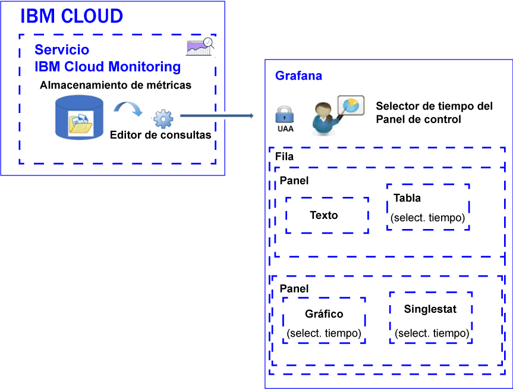

---

copyright:
  years: 2017

lastupdated: "2017-07-14"

---

{:shortdesc: .shortdesc}
{:new_window: target="_blank"}
{:codeblock: .codeblock}
{:screen: .screen}
{:pre: .pre}

# Análisis de métricas
{: #analyze_metrics_ov}

En {{site.data.keyword.Bluemix}}, puede utilizar Grafana, una plataforma de visualización y supervisión de código abierto, para supervisar, buscar, analizar y visualizar métricas en diversos gráficos, como diagramas y tablas.
{:shortdesc}

## Visión general de los componentes
{: #overview}

El servicio {{site.data.keyword.monitoringshort}} almacena series de datos en la base de datos de almacenamiento de métricas. Puede consultar estos datos en el Editor de consultas. Para obtener más información sobre las consultas soportadas, consulte [funciones de Graphite](http://graphite.readthedocs.io/en/latest/functions.html).

En Grafana, para acceder a los datos disponibles en la base de datos de almacenamiento de métricas, debe iniciar sesión en una organización, una región y un espacio {{site.data.keyword.Bluemix_notm}} con el ID de usuario y la contraseña que utiliza para iniciar sesión en {{site.data.keyword.Bluemix_notm}}. 

Para visualizar los datos, configure un panel de control que puede incluir una o más filas. En cada fila, puede definir varios paneles. 

* Una fila agrupa paneles en un panel de control. 
* Un panel es el recurso de visualización básico para supervisar métricas. 
* Un panel de control se puede etiquetar y puede incluir anotaciones con datos que puede utilizar para correlacionar datos entre paneles.

Puede definir los siguientes tipos de paneles: texto, gráfico, tabla, singlestat. Cada panel ofrece diferentes estilos y opciones de formato que puede personalizar. Los paneles pueden ser estáticos o dinámicos.

La cantidad de datos que se visualizan en un panel está determinada por la consulta y el rango de tiempo que se establece. Puede establecer un rango de tiempo común para todos los paneles a nivel del panel de control o rangos de tiempo individuales para cada panel.

La figura siguiente muestra los distintos componentes del servicio {{site.data.keyword.monitoringshort}} que utiliza Grafana para filtrar datos, y los recursos que se pueden utilizar en Grafana para visualizar y analizar los datos:

