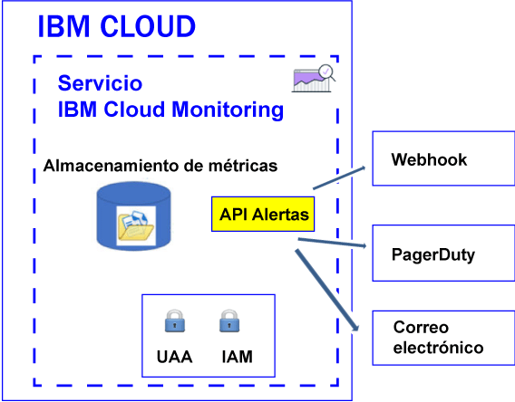

---

copyright:
  years: 2017

lastupdated: "2017-07-12"

---

{:shortdesc: .shortdesc}
{:new_window: target="_blank"}
{:codeblock: .codeblock}
{:screen: .screen}
{:pre: .pre}


# Configuración de alertas
{: #config_alerts_ov}

El servicio {{site.data.keyword.monitoringshort}} proporciona un sistema de alertas basado en consultas. Puede utilizar la API de alertas para definir las reglas y métodos de notificación para cada consulta de métrica que desea supervisar. Puede emitir notificaciones enviando un correo electrónico, activando un webhook o enviando una alerta a PagerDuty.
{:shortdesc}

Puede definir una alerta para activar una notificación para una métrica. Una alerta se define por una regla que describe la consulta de métrica que se va a supervisar, el valor de umbral y la acción que se emprenderá cuando se supere el umbral, y uno o varios métodos de notificación.  

Puede definir alertas para una única instancia o para varias instancias. Cuando una consulta que supervisa a través de una regla de alerta incluye un comodín, el comodín identifica varios destinos, es decir, varias instancias de servicio o instancias de aplicaciones. Cada 5 minutos, el servicio {{site.data.keyword.monitoringshort}} ejecuta la consulta que se configura en una regla de alerta y comprueba los últimos puntos de datos que se devuelven para cada instancia o grupo de instancias. El servicio {{site.data.keyword.monitoringshort}} realiza un seguimiento del último estado para cada instancia y genera una alerta nueva si cambia el estado de la alerta. 

La figura siguiente muestra los distintos tipos de notificación que puede configurar en el servicio {{site.data.keyword.monitoringshort}} para que le alerte:



## Estados de alerta
{: #status}

Una alerta puede tener cualquiera de los siguientes estados cuando la regla está habilitada:

* *OK*: el estado de una regla se establece en *OK* cuando:
    
	* Hay datos disponibles en el servicio {{site.data.keyword.monitoringshort}} para la consulta de métrica asociada a esa regla. Se ha establecido un umbral de aviso y un umbral de error. El valor de los datos no sobrepasa el valor de umbral.
	 
	* No hay datos en el servicio {{site.data.keyword.monitoringshort}} para la consulta de métrica asociada con esa regla, y se configura la propiedad de regla `allow_no_data` en *true*.           
	 
* *WARNING*: el estado de la regla se establece en *WARNING* cuando hay datos disponibles en el servicio {{site.data.keyword.monitoringshort}} para la consulta de métrica asociada a esa regla. Se ha establecido un umbral de aviso y un umbral de error. El valor de los datos se encuentra entre el valor del umbral de aviso y el valor del umbral de error.
	
* *ERROR*: el estado de la regla se establece en *ERROR* cuando hay datos disponibles en el servicio {{site.data.keyword.monitoringshort}} para la consulta de métrica asociada a esa regla. Se ha establecido un umbral de aviso y un umbral de error. Se ha alcanzado el valor del umbral de error.  

* *UNKNOWN*: el estado de la regla se establece en *UNKNOWN* cuando hay datos disponibles en el servicio {{site.data.keyword.monitoringshort}} para la consulta de métrica asociada a esa regla. Puede configurar si desea recibir una notificación o no en función de la propiedad `allow_no_data` que configure para la regla. Si establece esta propiedad en `false`, se le notificará que no se han encontrado datos para la regla.


	
## Historial de alertas
{: #history}

Cada vez que cambia el estado de una alerta, se actualiza el registro histórico de la alerta. Puede utilizar la API de alertas (*/v1/alert/history*) para recuperar información sobre el historial de una métrica.

El estado de una alerta se utiliza para definir el estado en cualquiera de los siguientes casos de ejemplo:

* Estado de la consulta antes de que la regla desencadene una notificación.
* Estado de la consulta después de que se haya desencadenado la regla. 

Por ejemplo, si se supera un umbral de aviso, se genera un registro histórico que registrará la transición de *OK* a *WARNING*. Paralelamente, cuando el valor vuelve a estar por debajo del umbral, se genera un registro histórico que registra la transición de *WARNING* a *OK*.


## Reglas
{: #rules}

Una regla describe la consulta de métrica que se va a supervisar, el valor de umbral y la acción que se emprenderá cuando se supere el umbral. 

* Puede crear, suprimir, actualizar y mostrar los detalles de una regla y elaborar una lista de todas las reglas mediante la API de alertas. Para obtener más información, consulte [Cómo trabajar con reglas](/docs/services/cloud-monitoring/alerts/rules.html#rules).

* El sistema de alerta comprueba cada 5 minutos las reglas que están habilitadas en el espacio.

* De forma predeterminada, una regla se habilitada cuando se crea. Sin embargo, puede definir la regla e inhabilitarla configurando el campo *enable* en `false`.

* Cuando el parámetro de regla *comparison* se establece en below, el valor error_level debe ser menor que el valor de nivel de aviso. Cuando el parámetro de regla *comparison* se establece en above, el valor error_level debe ser mayor que el valor de nivel de aviso.

* De forma predeterminada, una regla se crea con el campo *allow_no_data* establecido en `true`. Cuando no hay puntos de datos disponibles, las notificaciones no se envían a menos que se desencadene la condición de regla. Si desea recibir una notificación para informar de que no se han encontrado datos para la regla X, debe establecer el campo *allow_no_data* en `false`. 

**Consejo:** verifique la consulta que se supervisa a través de una regla de alerta en Grafana. Compruebe que no excede el tiempo de espera, por ejemplo, como resultado de configurar de un largo periodo de tiempo o utilizando una consulta que incluya un comodín. Fíjese en que, cuando la consulta excede el tiempo de espera en Grafana, no se desencadena una alerta configurada para dicha consulta.

Se necesitan los siguientes campos para definir una regla:

<table>
  <caption>Tabla 1. Lista de campos que se utilizan para definir una regla.</caption>
  <tr>
    <th>Nombre de campo</th>
	<th>Descripción</th>
  </tr>
  <tr>
    <td>name</td>
	<td>Nombre de la regla. Este nombre
debe ser exclusivo.</td>
  </tr>
  <tr>
    <td>description</td>
	<td>Resumen de la regla.</td>
  </tr>
  <tr>
    <td>expression</td>
	<td>Consulta de métrica que desea supervisar y enviar una alerta si se supera un umbral. <br>Las expresiones válidas son: un solo nombre de métrica, varias métricas identificadas con caracteres comodín o una función sobre una o varias métricas. <br>**Consejo:** Puede copiar una consulta verificada de Grafana.</td>
  </tr>
  <tr>
    <td>enabled</td>
	<td>Describe el estado de la regla: <br>Establezca este valor en `true` para habilitar la regla. <br>Establezca este valor en `false` para inhabilitar la regla. <br>De forma predeterminada, se establece en `true`.</td>
  </tr>
  <tr>
    <td>from</td>
	<td>Punto inicial en el tiempo que se utiliza para analizar los datos en función de los valores de umbral que ha definido para la consulta en el campo de expresión. Por ejemplo: `"from": "-5min"`</td>
  </tr>
  <tr>
    <td>until</td>
	<td>Punto final en el tiempo que se utiliza para analizar los datos en función de los valores de umbral que ha definido para la consulta en el campo de expresión. Por ejemplo: `"until": "now"`</td>
  </tr>
  <tr>
    <td>comparison</td>
	<td>Operación de comparación que se utiliza para identificar el tipo de comprobación que se va a realizar. Los valores válidos son *below* y *above*. </td>
  </tr>
  <tr>
    <td>comparison_scope</td>
	<td>Define el ámbito de los datos que se analizan. <br>Establezca el valor *last* para examinar el último valor de la serie (los datos que están disponibles para la consulta).</td>
  </tr>
  <tr>
    <td>error_level</td>
	<td>Define el umbral que establece para desencadenar una alerta de error. <br>Establezca un valor que, si se alcanza, hará que se genere una alerta de error. Por ejemplo: `"error_level" : 27.94`</td>
  </tr>
  <tr>
    <td>warning_level</td>
	<td>Define el umbral que establece para desencadenar una alerta de aviso. <br>Establezca un valor que, si se alcanza, hará que se genere una alerta de aviso. Por ejemplo: `"warning_level" : 24`</td>
  </tr>
  <tr>
    <td>frequency</td>
	<td>Define la frecuencia con la que se realiza la comprobación. <br>Se mide en minutos, horas o días; por ejemplo, 5min, 1h, 7d. <br>Por ejemplo, para comprobar en cada minuto, puede establecer `"frequency": "1min"`. <br>**Nota:** actualmente, la frecuencia está fijada en 5 minutos.</td>
  </tr>
  <tr>
    <td>dashboard_url</td>
	<td>Define el URL a un panel de control de Grafana en el que está definida la consulta que se supervisa.</td>
  </tr>
    <tr>
    <td>allow_no_data</td>
	<td>Define la condición por la que se envía una notificación cuando no hay puntos de datos disponibles. <br>De forma predeterminada, se establece en `true`. <br>Defínalo en `false` si desea recibir una notificación de que no se han encontrado datos para la regla X.</td>
  </tr>
  <tr>
    <td>notifications</td>
	<td>El nombre de una notificación que define la acción que desea desencadenar para la regla. <br>**Nota:** puede definir 1 o más notificaciones por regla indicando una lista de nombres de notificación separados por comas.</td>
  </tr>
</table>

A continuación se muestra un ejemplo de regla:

```
{
  "name": "checkbytesin1",
  "description": "MH check Bytes In per second",
  "expression": "movingAverage(messagehub.65ad9211-1234-5678-a751-c82123411eee.1.kafka-java-console-sa
mple-topic.BytesInPerSec.15MinuteRate,\"5min\")",
  "enabled": true,
  "from": "-5min",
  "until": "now",
  "comparison": "below",
  "comparison_scope": "last",
   "error_level" : 22.94,
   "warning_level" : 25,
  "frequency": "1min",
  "dashboard_url": "https://metrics.ng.bluemix.net",
  "notifications": [
    "emailXXX"
  ]
}
```
{: screen}


## Notificaciones
{: #notifications}

Una notificación describe el método y los detalles que se utilizan para la notificación cuando se activa una alerta. Por ejemplo, para obtener una notificación de aviso y una notificación de error para una métrica, defina una regla que supervise el umbral de aviso y defina una regla que supervise el umbral de error. 

* Solo se envía una notificación cuando el estado de la alerta cambia, por ejemplo, cuando el estado de una alerta para una métrica pasa de "OK" a "ERROR", o de "ERROR" a "WARNING". 

    **Nota:** Si una regla de alerta permanece en el mismo estado, *OK*, *WARNING*, *ERROR* o *UNKNOWN*, no se volverá a desencadenar en la siguiente iteración.

* Se considera que las notificaciones son sucesos de 24 horas. No puede especificar un intervalo de tiempo en el que se puede desencadenar una notificación.

* Puede configurar 1 o más métodos de notificación por regla indicando una lista de nombres de notificación separados por comas. 

* Puede utilizar la [API REST de alertas](https://console.bluemix.net/apidocs/940-ibm-cloud-monitoring-alerts-api?&language=node#introduction){: new_window} para crear, suprimir y actualizar una notificación, para mostrar los detalles de una notificación y para crear una lista de las notificaciones definidas en un espacio.


Se admiten los siguientes métodos de notificación:

<table>
 <caption>Tabla 2. Lista de métodos de notificación.</caption>
 <tr>
    <th>Método</th>
	<th>Más información</th>
 </tr>
 <tr>
    <td>Correo electrónico</td>
	<td>[Configuración de una notificación por correo electrónico](/docs/services/cloud-monitoring/alerts/configure_alerts.html#send_email)</td>
  </tr>
  <tr>
    <td>PagerDuty</td>
	<td>[Configuración de una notificación de PagerDuty](/docs/services/cloud-monitoring/alerts/configure_alerts.html#config_alert_pagerduty)</td>
  </tr>
  <tr>
    <td>Webhook</td>
	<td>[Configuración de una notificación de webhook](/docs/services/cloud-monitoring/alerts/configure_alerts.html#config_webhook)</td>
  </tr>
</table>

**Nota:** Las notificaciones de alerta se definen independientemente de las reglas para que pueda reutilizar las notificaciones con varias reglas.
	
## Plantillas de notificación
{: #notification_template}
	
Una notificación es un archivo JSON. 

Puede crear tantas plantillas de notificación como desee y luego reutilizarlas para crear notificaciones de ese tipo en su organización. 

Puede definir cualquiera de los siguientes tipos de notificaciones:

* Email: Defina una notificación de tipo *Email* para enviar un correo electrónico a una dirección de correo electrónico válida. 
* Webhook: Defina una notificación de tipo *Webhook* solo para puntos finales https. Añada un parámetro al punto final para ayudar a reducir la posibilidad de que alguien más intente invocar su punto final.
* Pagerduty: Defina una notificación de tipo *PagerDuty* para enviar los datos de alerta correspondientes a una métrica al sistema de gestión de incidentes PagerDuty. 

Por ejemplo, en la tabla siguiente encontrará ejemplos de plantillas de notificación:

<table>
  <caption>Tabla 3. Ejemplos de plantillas de notificación</caption>
  <tr>
    <th>Tipo</th>
	<th>Plantilla</th>
	<th>Ejemplo</th>
  </tr>
  <tr>
    <td>Correo electrónico</td>
	<td>
	```
	{
	"name": "Template_Name",
	"type": "Email",
	"description" : "Description",
	"detail": "EmailAddress"
	}
	```
	{: screen}
	</td>
	<td>
	```
	{
	"name": "my-email",
	"type": "Email",
	"description" : "Send email notification when there is an infrastructure problem.",
    "detail": "xxx@yyy.com"
    }
	```
	{: screen}
	</td>
  </tr>
  <tr>
    <td>Webhook</td>
	<td>
	```
	{
	"name": "Template_Name",
	"type": "Webhook",
	"description" : "Description",
	"detail": "Endpoint"
	}
	```
	{: codeblock}
	</td>
	<td>
	```
	{
	"name": "my-webhook",
	"type": "Webhook",
	"description" : "Fire a webhook when there is an infrastructure problem..",
    "detail": "https://myendpoint.bluemix.net?key=abcd1234"
    }
	```
	{: screen}
	</td>
  </tr>
  <tr>
    <td>Pagerduty</td>
	<td>
	```
	"name": "Template_Name",
	"type": "PagerDuty",
	"description" : "Description",
	"detail": "Pagerduty_APIkey"
	}
	```
	{: codeblock}
	</td>
	<td>
	```
	{
	"name": "my-pagerduty",
	"type": "PagerDuty",
	"description" : "Fire a PagerDuty alert when there is an infrastructure problem..",
    "detail": "abcd1234"
    }
	```
	{: screen}
	</td>
  </tr>
</table>

Donde

* *Template_Name* define el nombre de la plantilla de notificación.
* *Description* explica cuándo se utiliza este tipo de notificación.
* *EmailAddress* define la dirección de correo electrónico del destinatario de la notificación.
* *Endpoint* define el URL en el que se debe realizar la acción POST. 
* *Pagerduty_APIkey* define una clave de API exclusiva. Esta clave de API la genera el administrador o el propietario de la cuenta de PagerDuty.

Para obtener más información, consulte [Creación de una plantilla de notificación](/docs/services/cloud-monitoring/alerts/notifications.html#template).


