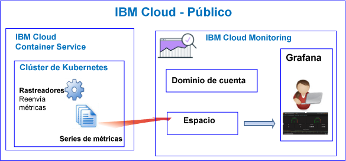

---

copyright:
  years: 2017, 2018

lastupdated: "2018-02-07"

---

{:new_window: target="_blank"}
{:shortdesc: .shortdesc}
{:screen: .screen}
{:pre: .pre}
{:table: .aria-labeledby="caption"}
{:codeblock: .codeblock}
{:tip: .tip}
{:download: .download}

# {{site.data.keyword.containershort_notm}}
{: #monitoring_bmx_containers_ov}

En {{site.data.keyword.Bluemix}}, las métricas de clúster se recopilan automáticamente. Puede utilizar Grafana para supervisar el rendimiento de su clúster. 
{:shortdesc}

**Nota:** Las métricas se recopilan y están disponibles para la supervisión a través del servicio de {{site.data.keyword.monitoringshort}} para contenedores que se ejecutan en clústeres estándares. Para obtener más información sobre las características a las que da soporte un clúster estándar, consulte [Planificación de clústeres y apps](/docs/containers/cs_planning.html#cs_planning_cluster_type).

## Acerca de la supervisión en Public
{: #public}

En {{site.data.keyword.Bluemix_notm}}, puede utilizar el servicio {{site.data.keyword.monitoringshort}} para almacenar y analizar métricas de contenedor y métricas de clúster Kubernetes recopiladas automáticamente por {{site.data.keyword.containershort}} en Public.

Puede tener uno o varios clústeres Kubernetes en una cuenta. Las métricas las recopila automáticamente {{site.data.keyword.containershort}} en cuanto se suministra el clúster.  Las métricas de contenedor se recopilan en cuanto se despliega el pod. Las métricas se reenvían automáticamente al servicio {{site.data.keyword.monitoringshort}}:

* Al crear un clúster como un recurso de cuenta, las métricas se reenviarán al dominio de cuenta en el servicio {{site.data.keyword.monitoringshort}}. Para que las métricas se reenvíen al dominio de cuenta, el propietario de la clave de servicio {{site.data.keyword.monitoringshort}} debe tener una política de IAM con permisos de **administrador** para trabajar con el servicio {{site.data.keyword.monitoringshort}}.
* Al crear un clúster con un espacio de Cloud Foundry asociado al mismo, las métricas se reenviarán al dominio de espacio en el servicio {{site.data.keyword.monitoringshort}}. Para que las métricas se reenvíen al dominio de espacio, el propietario de la clave de servicio {{site.data.keyword.monitoringshort}} debe tener el rol **gestor** en la organización, y el rol **desarrollador** en el espacio.

En la siguiente figura se muestra una vista de alto nivel de la supervisión para {{site.data.keyword.containershort}}:

El rastreador es un proceso que se ejecuta en el host y realiza una supervisión sin agente para las métricas. El rastreador recopila constantemente métricas de CPU y de memoria de todos los contenedores de forma predeterminada.

Para analizar métricas en Grafana para un clúster, tenga en cuenta la información siguiente:

* Debe iniciar Grafana en la región Public donde se suministra la instancia de {{site.data.keyword.monitoringshort}} que utiliza para ver métricas. 
* Puede utilizar el panel de control de Grafana predeterminado **ClusterMonitoringDashboard_v1** para supervisar el clúster.
* También puede configurar paneles de control de Grafana personalizados para visualizar datos de métricas para un clúster de la región Cloud Public donde se ha creado el clúster.
* El ID de usuario debe tener permisos para ver las métricas. 

    Para ver las métricas en el dominio de la cuenta, un usuario necesita una política de IAM para el servicio {{site.data.keyword.monitoringshort}}. El usuario necesita permisos de **Visor**. 
    
    Para ver las métricas en el dominio de métrica, el usuario necesita un rol de CF. Para obtener más información, consulte [Roles que necesita un usuario para ver métricas](/docs/services/cloud-monitoring/security_ov.html#bmx_roles).

### Vista de alto nivel de supervisión para un clúster que reenvía métricas al dominio de la cuenta
{: #acc}

La figura siguiente muestra una vista de alto nivel de supervisión en Public para {{site.data.keyword.containershort}} cuando el clúster reenvía métricas al dominio de la cuenta:

### Vista de alto nivel de supervisión para un clúster que reenvía métricas a un dominio de espacio
{: #space}

La figura siguiente muestra una vista de alto nivel de supervisión en Public para {{site.data.keyword.containershort}} cuando el clúster reenvía métricas a un dominio de espacio:

Los clústeres que reenvían métricas a un espacio deben crearse desde la línea de mandatos dentro del contexto de una organización y un espacio de Cloud Foundry. Para poder crear el clúster, ejecute el mandato `bx target` para establecer la organización y el contexto de espacio de CF.

## Acerca de la supervisión en Dedicated
{: #dedicated}

En {{site.data.keyword.Bluemix_notm}}, puede utilizar el servicio {{site.data.keyword.monitoringshort}} en Public para almacenar y analizar métricas de contenedor y métricas de clúster Kubernetes que recopila automáticamente {{site.data.keyword.containershort}} en Dedicated.

Puede tener uno o varios clústeres Kubernetes en una cuenta. Las métricas las recopila automáticamente {{site.data.keyword.containershort}} en cuanto se suministra el clúster.  Las métricas de contenedor se recopilan en cuanto se despliega el pod. Las métricas se reenvían automáticamente al dominio de cuenta del servicio {{site.data.keyword.monitoringshort}}.

**Nota:** Para que las métricas se reenvíen al dominio de cuenta, el propietario de la clave de servicio {{site.data.keyword.monitoringshort}} debe tener una política IAM con permisos de **administrador** para trabajar con el servicio {{site.data.keyword.monitoringshort}}.

Para ver y analizar las métricas de un clúster en Grafana, tenga en cuenta la información siguiente:

* Debe iniciar Grafana en la región Cloud Public donde está disponible el clúster en Dedicated. Por ejemplo, si se suministra un clúster en Dedicated en EE.UU. sur, debe iniciar Grafana en la región EE.UU. sur en Public.
* Puede utilizar el panel de control de Grafana predeterminado **ClusterMonitoringDashboard_v1** para supervisar el clúster.
* También puede configurar paneles de control de Grafana personalizados para visualizar datos de métricas para un clúster de la región Cloud Public donde se ha creado el clúster.
* Su ID de usuario debe tener una política de IAM para trabajar con el servicio {{site.data.keyword.monitoringshort}}. Debe tener permisos de **Visor** para ver métricas en el dominio de la cuenta.  

En la siguiente figura se muestra una vista de alto nivel de supervisión en Dedicated para {{site.data.keyword.containershort}}:

## Métricas de CPU para contenedores
{: #cpu_metrics_containers}

La tabla siguiente lista las métricas de CPU que se capturan automáticamente para un contenedor:

<table>
  <caption>Tabla 1. Métricas de CPU para contenedores</caption>
  <tr>
    <th>Nombre de métrica</th>
    <th>Descripción</th>
  </tr>
  <tr>
    <td>*cpu.num-cores*</td>
    <td>Esta métrica informa del número de núcleos de CPU disponibles en el contenedor.   De forma predeterminada, esta métrica informa del número de núcleos en el trabajador. Si establece un límite en el número de núcleos disponibles en el contenedor, la métrica informa del número de núcleos que se establece en dicho límite.</td>
  </tr>
  <tr>
    <td>*cpu.usage*</td>
    <td>Esta métrica informa de los nanosegundos del tiempo de CPU en todos los núcleos.   Cuando la utilización de la CPU es elevada, podría presentarse algún tipo de retardo. Una utilización de CPU elevada indica la falta de potencia de proceso.</td>
  </tr>
  <tr>
    <td>*cpu.usage-pct*</td>
    <td>Esta métrica informa sobre el tiempo de CPU que se utiliza como un porcentaje de la capacidad de la CPU.   De forma predeterminada, la capacidad de CPU está determinada por el número de núcleos en el trabajador. Si establece los límites en la capacidad de CPU del contenedor, la métrica informa del uso de CPU como un porcentaje de los límites que establece. Cuando el porcentaje de utilización de CPU es elevado, podría presentarse algún tipo de retardo. Una utilización de CPU elevada indica la falta de potencia de proceso.</td>
  </tr>
  <tr>
    <td>*cpu.usage-pct-container-requested*</td>
    <td>Esta métrica informa del tiempo de CPU utilizado como porcentaje de la CPU solicitada del contenedor.   Si no establece la CPU solicitada en un contenedor, la métrica no está expuesta para el contenedor.</td>
  </tr>
</table>

## Métricas de carga para trabajadores
{: #load_metrics_workers}

La tabla siguiente lista las métricas de CPU que se capturan automáticamente para un trabajador:

<table>
  <caption>Tabla 2. Métricas de carga para trabajadores</caption>
  <tr>
    <th>Nombre de métrica</th>
    <th>Descripción</th>
  </tr>
  <tr>
    <td>*load.avg-1*</td>
    <td>Esta métrica informa de la carga de CPU promedio para el host de Kubernetes en el último minuto.   Una carga de CPU promedio que es mayor que el número de núcleos en el trabajador indica que el tráfico hacia el host está en cola.</td>
  </tr>
  <tr>
    <td>*load.avg-5*</td>
    <td>Esta métrica informa de la carga de CPU promedio para el host de Kubernetes de los últimos 5 minutos.   Una carga de CPU promedio que es mayor que el número de núcleos en el trabajador indica que el tráfico hacia el host está en cola.</td>
  </tr>
  <tr>
    <td>*load.avg-15*</td>
    <td>Esta métrica informa de la carga de CPU promedio para el host de Kubernetes de los últimos 15 minutos.   Una carga de CPU promedio que es mayor que el número de núcleos en el trabajador indica que el tráfico hacia el host está en cola.</td>
  </tr>
</table>

## Métricas de memoria para contenedores
{: #memory_metrics}

La tabla siguiente lista las métricas de memoria capturadas automáticamente:

<table>
  <caption>Tabla 3. Métricas de memoria para contenedores</caption>
  <tr>
    <th>Nombre de métrica</th>
    <th>Descripción</th>
  </tr>
  <tr>
    <td>*memory.current*</td>
    <td>Esta métrica informa de los bytes de memoria que el contenedor está utilizando actualmente. </td>
  </tr>
  <tr>
    <td>*memory.limit*</td>
    <td>Esta métrica informa de la cantidad de memoria que el contenedor puede intercambiar en disco respecto a los límites inferior y superior establecidos para un pod.    De forma predeterminada, los pods se ejecutan sin límites de memoria. Un pod puede consumir tanta memoria como la que haya en el trabajador en el que se ejecuta. Cuando se despliega un pod, se pueden establecer límites a la cantidad de memoria que dicho pod puede utilizar. </td>
  </tr>
  <tr>
    <td>*memory.usage-pct*</td>
    <td>Esta métrica informa de la memoria que se utiliza como porcentaje del límite de memoria del contenedor.    Si establece límites a la cantidad de memoria que puede utilizar un contenedor, la métrica informa del uso de memoria como porcentaje de los límites que establece. </td>
  </tr>
</table>

## Definición de consultas para supervisar recursos en un clúster Kubernetes
{: #monitoring_metrics_kube}

Para supervisar el rendimiento de contenedores y trabajadores desplegados en un clúster Kubernetes en {{site.data.keyword.Bluemix_notm}}, utilice Grafana. 

El servicio de {{site.data.keyword.monitoringlong}} utiliza Grafana, un análisis de código abierto y una plataforma de visualización, que puede utilizar para supervisar, buscar, analizar y visualizar las métricas en diversos gráficos, como por ejemplo diagramas y tablas.

Grafana se puede iniciar desde un navegador. Para obtener más información, consulte [Navegación al panel de control de Grafana desde un navegador web](/docs/services/cloud-monitoring/grafana/navigating_grafana.html#launch_grafana_from_browser).

Para supervisar contenedores y trabajadores que se ejecutan en un clúster Kubernetes, debe definir una consulta en Grafana para cada recurso:

* Para definir una consulta que supervisa una métrica CPU para un contenedor, consulte [Configuración de métricas de CPU para un contenedor en Grafana](/docs/services/cloud-monitoring/containers/config_cpu_worker.html#config_cpu_worker).
* Para definir una consulta que supervisa una métrica de memoria para un contenedor, consulte [Configuración de métricas de memoria para un contenedor en Grafana](/docs/services/cloud-monitoring/containers/config_mem_container.html#config_mem_container).
* Para definir una consulta que supervisa una métrica de carga para un trabajador, consulte [Configuración de métricas de carga para un trabajador en Grafana](/docs/services/cloud-monitoring/containers/config_load_worker.html#config_load_worker).

El formato de la consulta es diferente por tipo de recurso y tipo de consulta:

* Para obtener más información sobre el formato de las consultas para supervisar CPU para un contenedor, consulte [Formato de consulta de métricas de CPU para un contenedor](/docs/services/cloud-monitoring/reference/metrics_format_containers.html#cpu_containers). 
* Para obtener más información sobre el formato de las consultas para supervisar la carga para un trabajador, consulte [Formato de consulta de métricas de carga para un trabajador](/docs/services/cloud-monitoring/reference/metrics_format_containers.html#load_workers).
* Para obtener más información sobre el formato de las consultas para supervisar la memoria para un contenedor, consulte [Formato de consulta de métricas de memoria para un contenedor](/docs/services/cloud-monitoring/reference/metrics_format_containers.html#mem_containers).

## Configuración del tráfico de red para configuraciones personalizadas de cortafuegos en {{site.data.keyword.Bluemix_notm}}
{: #ports}

Si tiene configurado un cortafuegos adicional, o si ha personalizado los valores de cortafuegos en la infraestructura de {{site.data.keyword.Bluemix_notm}} (SoftLayer), debe permitir el tráfico de red de salida entre el nodo trabajador y el servicio {{site.data.keyword.monitoringshort}}. 

Debe abrir el puerto TCP 443 y el puerto TCP 9091 entre cada trabajador y el servicio {{site.data.keyword.monitoringshort}} para las siguientes direcciones IP en el cortafuegos personalizado:

<table>
  <tr>
    <th>Región</th>
    <th>URL de ingestión</th>
	<th>Direcciones IP públicas</th>
  </tr>
  <tr>
    <td>Alemania</td>
	<td>ingest-eu-fra.logging.bluemix.net</td>
	<td>158.177.88.43  159.122.87.107</td>
  </tr>
  <tr>
    <td>Reino Unido</td>
	<td>ingest.logging.eu-gb.bluemix.net</td>
	<td>169.50.115.113</td>
  </tr>
  <tr>
    <td>EE.UU. sur</td>
	<td>ingest.logging.ng.bluemix.net</td>
	<td>169.48.79.236  169.46.186.113</td>
  </tr>
  <tr>
    <td>Sídney</td>
	<td>ingest-au-syd.logging.bluemix.net</td>
	<td>130.198.76.125  168.1.209.20</td>
  </tr>
</table>
