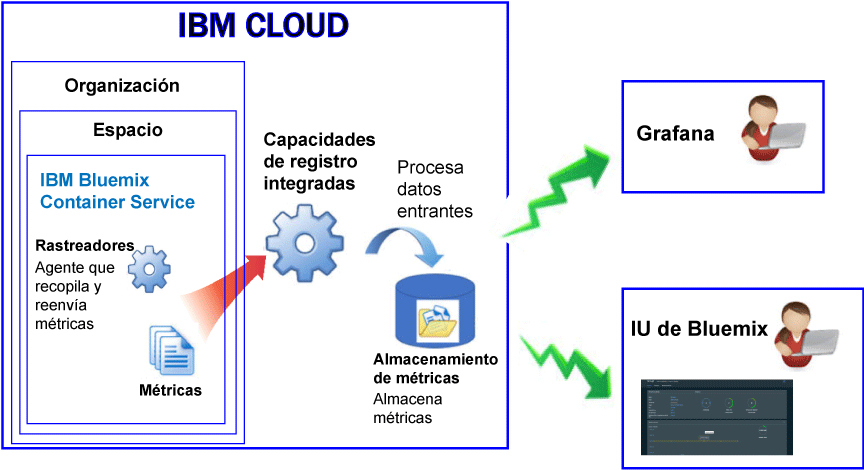

---

copyright:
  years: 2017, 2018

lastupdated: "2018-02-02"

---

{:new_window: target="_blank"}
{:shortdesc: .shortdesc}
{:screen: .screen}
{:pre: .pre}
{:table: .aria-labeledby="caption"}
{:codeblock: .codeblock}
{:tip: .tip}
{:download: .download}

# Contenedores gestionados en IBM Cloud (en desuso)
{: #monitoring_managed_containers_ov}

En {{site.data.keyword.Bluemix}}, las métricas de contenedor y de trabajador se recopilan automáticamente desde fuera del contenedor, sin tener que instalar ni mantener agentes dentro del contenedor. Utilice Grafana para visualizar métricas de contenedor. 
{:shortdesc}

**Nota:** Las métricas se recopilan y están disponibles para la supervisión a través del servicio de {{site.data.keyword.monitoringshort}} para contenedores que se ejecutan en clústeres estándares. Para obtener más información sobre las características a las que da soporte un clúster estándar, consulte [Planificación de clústeres y apps](/docs/containers/cs_planning.html#cs_planning_cluster_type).

## Recopilación de métricas predeterminadas
{: #metrics_containers_bmx_ov}

En la siguiente figura se muestra una vista de alto nivel de la supervisión para {{site.data.keyword.containershort}}:

De forma predeterminada el rastreador recopila de forma constante las siguientes métricas de todos los contenedores:

* CPU
* Memoria
* Información de red

## Supervisión de métricas para un contenedor gestionado en IBM Cloud (en desuso)
{: #monitoring_metrics_bmx}

Las métricas se recopilan y muestran tanto en la interfaz de usuario de {{site.data.keyword.Bluemix_notm}} como en Grafana:

* Utilice Grafana, una plataforma de visualización y análisis de código abierto, para supervisar, buscar, analizar y visualizar sus métricas en diversos gráficos, como diagramas y tablas.

    Puede iniciar Grafana desde la interfaz de usuario de {{site.data.keyword.Bluemix_notm}} o desde un navegador. Para obtener más información, consulte [Navegación al panel de control de Grafana](/docs/services/cloud-monitoring/grafana/navigating_grafana.html#navigating_grafana).

* Utilice la interfaz de usuario de {{site.data.keyword.Bluemix_notm}} para visualizar las métricas más recientes.

    Para visualizar las métricas en la interfaz de usuario de {{site.data.keyword.Bluemix_notm}}, consulte [Análisis de métricas desde la consola de {{site.data.keyword.Bluemix_notm}}](/docs/services/cloud-monitoring/containers/analyzing_metrics_bmx_ui.html#analyzing_metrics_bmx_ui).
