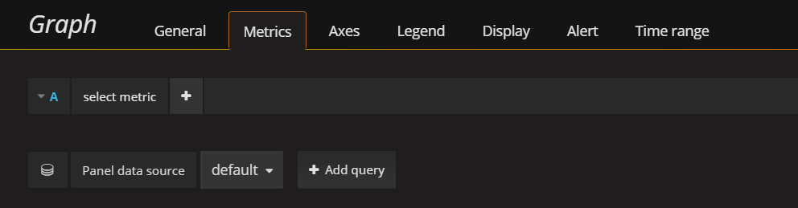

---

copyright:
  years: 2017
lastupdated: "2017-06-26"

---

{:new_window: target="_blank"}
{:shortdesc: .shortdesc}
{:screen: .screen}
{:codeblock: .codeblock}
{:pre: .pre}

# Iniciación a IBM Cloud Monitoring en Bluemix
{: #getting-started-with-ibm-cloud-monitoring}

En esta guía de iniciación, estudiaremos los pasos necesarios para analizar un contenedor utilizando el servicio {{site.data.keyword.monitoringlong}}. Aprenderá a buscar y analizar métricas de contenedor de una app desplegada en un clúster Kubernetes.
{:shortdesc}

## Antes de empezar
{: #prereqs}

Cree una [cuenta de Bluemix](https://console.bluemix.net/registration/). El ID de usuario debe ser miembro o propietario de una cuenta Bluemix con permisos para crear clústeres Kubernetes, desplegar apps en clústeres y realizar consultas en los registros de Bluemix para un análisis avanzado en Kibana.

Abra una sesión de terminal desde la que gestionar el clúster Kubernetes y desplegar apps desde la línea de mandatos. Los ejemplos en esta guía de aprendizaje se proporcionan para un sistema Ubuntu Linux.

[Instale los plugins de interfaz de línea de mandatos](/docs/containers/cs_cli_install.html#cs_cli_install_steps) en el entorno local para gestionar el servicio IBM Bluemix Container desde la línea de mandatos. 


## Paso 1. Despliegue de una app en un contenedor
{: #step1}

Lleve a cabo los siguientes pasos para desplegar un contenedor en un clúster Kubernetes:

1. [Crear un clúster Kubernetes](/docs/containers/cs_cluster.html#cs_cluster_ui).

2. [Configurar el contexto del clúster](/docs/containers/cs_cli_install.html#cs_cli_configure) en un terminal Linux. Después de haber configurado el contexto, podrá gestionar el clúster Kubernetes y desplegar la aplicación en dicho clúster Kubernetes.

3. Desplegar y ejecutar una app de ejemplo en el clúster Kubernetes. [Complete los pasos de la lección 1](/docs/containers/cs_tutorials.html#cs_apps_tutorial).

    La app es una app Node.js Hello World:

    ```
    var express = require('express')
    var app = express()

    app.get('/', function(req, res) {
      res.send('Hello world! Your app is up and running in a cluster!\n')
    })
    app.listen(8080, function() {
      console.log('Sample app is listening on port 8080.')
    })
    ```

    Cuando la app se despliega, la recopilación de métricas se habilita automáticamente.


## Paso 2. Navegación al panel de control de Grafana
{: #step2}

Inicie Grafana desde un navegador. 

Para analizar las métricas de un clúster, debe acceder a Grafana en la región pública de la nube en la que se ha creado el clúster. 
    
A continuación, desde un navegador, inicie el URL siguiente para abrir Grafana: `https://metrics.ng.bluemix.net/`
    
    
## Paso 3: Análisis de métricas en Grafana
{: #step3}

Siga los siguientes pasos para crear un panel de control de Grafana:
    
1. Cree un panel de control nuevo.

    * Seleccione el conmutador de la barra de menús lateral . 
    * Seleccione **Paneles de control**. 
    * Pulse **Nuevo**
    
    Se abre un panel de control. El panel de control incluye una fila vacía que está lista para la configuración. 
    
    
    
     En Grafana, puede añadir filas para dividir el panel de control en secciones. Una fila agrupa 1 o varios paneles. Dentro de una fila, un panel es la unidad de visualización más pequeña que se puede configurar para visualizar datos correspondientes a una métrica; por ejemplo, puede elegir un panel gráfico o un panel de tabla. Puede arrastrar y soltar paneles para cambiar la disposición de los paneles en un panel de control. Los datos que muestra un panel se configuran mediante consultas. Puede definir una o varias consultas en un panel. Cada consulta representa un conjunto de datos distinto. También puede definir el intervalo de tiempo para un panel. Normalmente, el intervalo de tiempo se establece mediante el selector de tiempo del *Panel de control*.
    
2. Añada un panel *Gráfico* para supervisar los nanosegundos de tiempo de cpu en todos los núcleos de un contenedor.
    
    1. Seleccione **Gráfico**.
    
    2. Pulse en el título del gráfico y seleccione **editar**.
    
        Se abre el separador *Métricas*. Aquí puede ver el origen de datos predeterminado.
    
        
    
3. Defina la consulta que filtra los datos que se muestran en el gráfico. 

    En la tabla siguiente se describen los distintos campos necesarias para configurar una consulta que filtra los datos correspondientes a una métrica de contenedor:

    <table>
      <caption>Tabla 1. Campos de consulta de Grafana para contenedores</caption>
      <tr>
        <th align="center">Campo</th>
        <th align="center">Descripción</th>
        <th align="center">Valores válidos</th>
      </tr>
      <tr>
        <td>Prefijo</td>
        <td>Prefijo para métricas de contenedores. <br><br>Este prefijo se aplica a los datos recopilados para contenedores Docker desplegados en un clúster Kubernetes.</td>
        <td>`crn`</td>
      </tr>
      <tr>
        <td>Versión</td>
        <td>Versión de los datos de métricas recopilados.</td>
        <td>`v1`</td>
      </tr>
      <tr>
        <td>Proveedor</td>
        <td>Proveedor de la nube en la que se han recopilado los datos.</td>
        <td>`bluemix`</td>
      </tr>
      <tr>
        <td>Tipo</td>
        <td>Entorno de nube en la que se han recopilado los datos.</td>
        <td>`public`</td>
      </tr>
      <tr>
        <td>Origen</td>
        <td>Infraestructura de nube en la que se han recopilado las métricas.</td>
        <td>`containers-kubernetes`</td>
      </tr>
      <tr>
        <td>Región</td>
        <td>Región de nube en la que se han recopilado las métricas.</td>
        <td>* `ng` <br>* `eu-gb` <br>* `eu-de` </td>
      </tr>
      <tr>
        <td>Cuenta</td>
        <td>GUID de la cuenta en la que se han recopilado las métricas. <br>El formato de este campo es el siguiente: `a_*ID*` donde ID es el GUID de la cuenta.</td>
        <td></td>
      </tr>
      <tr>
        <td>Clúster</td>
        <td>GUID del clúster en el que se han recopilado las métricas.</td>
        <td></td>
      </tr>
      <tr>
        <td>Métrica de contenedor</td>
        <td>Métricas recopiladas para un contenedor.</td>
        <td>* `memory_current` <br>* `memory_limit` <br>* `cpu_usage` <br>* `cpu_usage_pct` <br>* `cpu_num_cores`</td>
      </tr>
      <tr>
        <td>Contenedor en un pod</td>
        <td>Combinación de nombres de recursos de Kubernetes y GUID necesarios para identificar de forma exclusiva un contenedor que se ejecuta en un pod. <br> El formato de estos campos es el siguiente: *{espacionombres}_#{nombre_pod}_#{nombre_contenedor}_#{id_contenedor}* <br><br>**Nota:** Cuando examine la lista de opciones disponibles para esta entrada de la consulta, observe que también hay una entrada con el siguiente formato: *{espacionombres}_#{nombre_pod}_#{nombre_contenedor}_POD_#{id_contenedor}*. Estas entradas corresponden a los ID internos de contenedor que crea Kubernetes.</td>
        <td></td>
      </tr>
      <tr>
        <td>Departamentos</td>
        <td>Funciones de consulta que puede seleccionar para visualizar una métrica de contenedor en el panel. <br>Para obtener más información, consulte [Funciones ](http://graphite.readthedocs.io/en/latest/functions.html "Icono de enlace externo"){: new_window}</td>
        <td></td>
      </tr>
    </table>
    
    La imagen siguiente muestra cómo se visualiza la consulta en Grafana cuando la configura:
    
    
    
    Siga los siguientes pasos para definir la consulta:
    
    En el separador *Métricas*, seleccione **Añadir consulta**. <br>Se añade una entrada de consulta. Cada consulta está etiquetada con una letra.
    
    
        
    1. Pulse **Seleccionar métrica** y elija `crn`.
    
    2. Pulse **Seleccionar métrica** y elija `v1`.
    
    3. Pulse **Seleccionar métrica** y elija `bluemix`.
    
    4. Pulse **Seleccionar métrica** y elija `public`.
    
    5. Pulse **Seleccionar métrica** y elija `containers-kubernetes`.
    
    6. Pulse **Seleccionar métrica** y elija la región en la que está trabajando, como por ejemplo `us-south`.
    
    7. Pulse **Seleccionar métrica** y elija el ID de la cuenta para la que desea visualizar datos, como por ejemplo `a_91d1d1exxxxxxx4df920bbd06461b066`
    
    8. Pulse **Seleccionar métrica** y elija el ID de clúster.
    
    9. Pulse **Seleccionar métrica** y elija una métrica de contenedor. Para supervisar el *Uso de CPU* de un contenedor, elija `container-metric-cpu_usage`.
    
    10. Pulse **Seleccionar métrica** y luego elija el ID correspondiente al contenedor para el que desea supervisar el uso de CPU, por ejemplo `default_hello-world-deployment-3355293961-0fwkg_hello-world-deployment_ad5eb446a493db31f1d9eb158f5de915fc063d6c136823488b694e63bb00aa57`.
    
    11. Pulse la imagen del símbolo más  y elija una función. Puede añadir una función para transformar, combinar y realizar cálculos sobre los datos disponibles para una métrica.
        
        Por ejemplo, puede añadir la función **alias(newName)** para añadir un alias a una métrica. Este alias se utiliza para mostrar una serie de caracteres en lugar del nombre de la métrica en la descripción que se muestra en el gráfico.
        
        Para añadir un alias a una métrica, siga estos pasos:
        
        1. Pulse el símbolo más.
        2. Seleccione **Especial**. 
        3. Seleccione **alias**.
        4. Escriba una serie de caracteres, como por ejemplo `Mi métrica de ejemplo`.
        
4. Guarde el panel de control para utilizarlo más adelante. 

    1. Pulse la imagen de guardar panel de control . 
    
        
    
    2. Escriba el nombre del panel de control.
    3. Pulse **Guardar**.


## Pasos siguientes
{: #next_steps}

Defina una alerta para una métrica. Para obtener más información, consulte [Configuración de alertas](/docs/services/cloud-monitoring/config_alerts_ov.html#config_alerts_ov).


