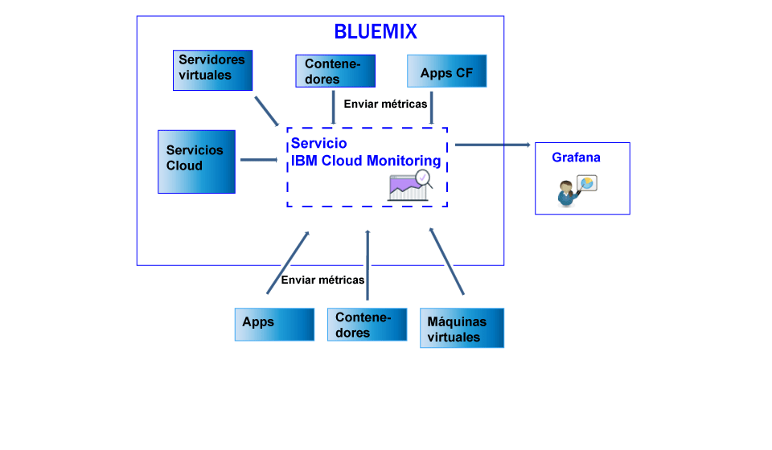

---

copyright:
  years: 2017

lastupdated: "2017-07-10"

---

{:shortdesc: .shortdesc}
{:new_window: target="_blank"}
{:codeblock: .codeblock}
{:screen: .screen}
{:pre: .pre}

# Envío y recuperación de datos
{: #send_retrieve_metrics_ov}

Puede enviar y recuperar métricas desde un espacio de {{site.data.keyword.Bluemix}} para el servicio {{site.data.keyword.monitoringshort}} mediante la API de métricas.
{:shortdesc}

En la figura siguiente se muestra una vista de nivel alto de los distintos recursos desde los que puede enviar métricas al servicio {{site.data.keyword.monitoringshort}}:

## Envío de métricas
{: #send}

Para contenedores {{site.data.keyword.Bluemix_notm}} Docker, se recopilan automáticamente métricas básicas del sistema. Para aplicaciones Cloud Foundry y apps que se ejecutan en una máquina virtual (VM), las métricas se deben enviar directamente desde la app mediante la API de métricas. 

Para enviar métricas al servicio {{site.data.keyword.monitoringshort}}, tenga en cuenta la información siguiente: 

* Debe establecer el espacio de {{site.data.keyword.Bluemix_notm}} desde donde desea recuperar los datos.

* Debe proporcionar una señal de seguridad o una clave de API para trabajar con el servicio {{site.data.keyword.monitoringshort}}. 

* Puede utilizar el punto final de la API `https://metrics.ng.bluemix.net/v1/metrics`. Para obtener más información acerca de la API, consulte [la API de métricas](https://console.bluemix.net/apidocs/927-ibm-cloud-monitoring-rest-api?&language=node#introduction){: new_window}.

Dependiendo del modelo de autenticación que elija, seleccione una de las opciones siguientes para enviar datos en el servicio {{site.data.keyword.monitoringshort}}:
 
* Para enviar métricas utilizando una señal de UAA, consulte [Envío de métricas en un espacio mediante UAA](/docs/services/cloud-monitoring/send-metrics/send_data_api.html#uaa).

* Para enviar métricas utilizando una señal de IAM o una clave de API, consulte [Envío de métricas en un espacio mediante IAM o mediante una clave de API](/docs/services/cloud-monitoring/send-metrics/send_data_api.html#iam).

## Recuperación de métricas
{: #retrieve}

Para recuperar métricas, tenga en cuenta la información siguiente: 

* Debe establecer el espacio de {{site.data.keyword.Bluemix_notm}} desde donde desea recuperar los datos.

* Debe proporcionar una señal de seguridad o una clave de API para trabajar con el servicio {{site.data.keyword.monitoringshort}}. 

* Debe especificar una vía de acceso a 1 o más métricas. Para obtener más información, consulte [Definición de las métricas](/docs/services/cloud-monitoring/retrieve-metrics/retrieve_data_api.html#metrics).

* Opcionalmente, puede especificar un periodo de tiempo personalizado. De forma predeterminada, si no especifica un periodo de tiempo, los datos que recupera son los datos que corresponden a las últimas 24 horas. Para obtener más información, consulte [Configuración de un periodo de tiempo](/docs/services/cloud-monitoring/retrieve-metrics/retrieve_data_api.html#time).

* Puede utilizar el punto final de la API `https://metrics.ng.bluemix.net/v1/metrics`. Para obtener más información acerca de la API, consulte [la API de métricas](https://console.bluemix.net/apidocs/927-ibm-cloud-monitoring-rest-api?&language=node#introduction){: new_window}.

**Nota:** puede recuperar un máximo de 5 destinos por solicitud.

Dependiendo del modelo de autenticación que elija, seleccione una de las opciones siguientes para recuperar datos desde el servicio {{site.data.keyword.monitoringshort}}:
 
* Para recuperar métricas utilizando una señal de UAA, consulte [Recuperación de métricas en un espacio mediante UAA](/docs/services/cloud-monitoring/retrieve-metrics/retrieve_data_api.html#uaa).

* Para recuperar métricas utilizando una señal de IAM o una clave de API, consulte [Recuperación de métricas en un espacio mediante IAM o mediante una clave de API](/docs/services/cloud-monitoring/retrieve-metrics/retrieve_data_api.html#iam).

## Recuperación de la lista de métricas
{: #show_metrics}

Puede listar las métricas que están disponibles en un espacio.

Para enumerar las métricas, tenga en cuenta la información siguiente: 

* Debe establecer el espacio de {{site.data.keyword.Bluemix_notm}} para el que desea listar las métricas que están disponibles.

* Debe proporcionar una señal de seguridad o una clave de API para trabajar con el servicio {{site.data.keyword.monitoringshort}}. 

* Debe especificar una consulta que defina la vía de acceso desde la que enumerar las métricas. Por ejemplo, para listar todas las métricas de un espacio, puede establecer la consulta en: `query=SpaceGUID. *`, donde *SpaceGUID* es el GUID del espacio.

    El valor predeterminado es `*`, que especifica el punto de inicio en el nivel raíz del espacio.

* Puede utilizar el punto final de la API `https://metrics.ng.bluemix.net/v1/metrics/list`. Para obtener más información acerca de la API, consulte [la API de métricas](https://console.bluemix.net/apidocs/927-ibm-cloud-monitoring-rest-api?&language=node#introduction){: new_window}.

 
