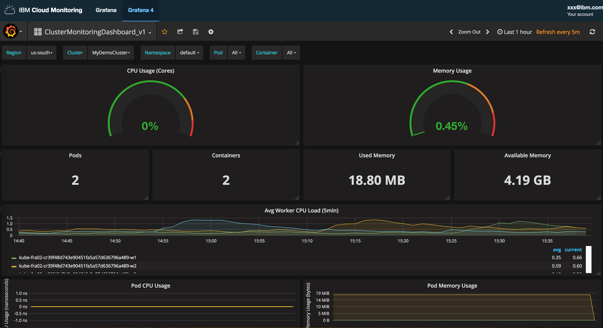

---

copyright:
  years: 2017, 2018

lastupdated: "2018-02-07"

---

{:new_window: target="_blank"}
{:shortdesc: .shortdesc}
{:screen: .screen}
{:pre: .pre}
{:table: .aria-labeledby="caption"}
{:codeblock: .codeblock}
{:tip: .tip}
{:download: .download}


# Analizar métricas en Grafana para una app desplegada en un clúster Kubernetes
{: #container_service_metrics}

Utilice esta guía de aprendizaje para aprender a utilizar el servicio de {{site.data.keyword.monitoringlong}} para supervisar el rendimiento del contenedor. 
{:shortdesc}


## Objetivos
{: #objectives}

Aprenda a buscar y analizar métricas de contenedor de una app que se despliega en un clúster Kubernetes:

1. Identifique dónde se reenvían las métricas que se recopilan en un clúster al servicio {{site.data.keyword.monitoringshort}}. 
2. Inicie Grafana y establezca el dominio de {{site.data.keyword.monitoringshort}} donde puede ver las métricas de clúster.
3. Busque y analice las métricas de contenedor de una app desplegada en un clúster Kubernetes en {{site.data.keyword.Bluemix_notm}}.

Esta guía de aprendizaje le guiará por los pasos necesarios para que el siguiente caso de ejemplo completo funcione en {{site.data.keyword.Bluemix_notm}}: Suministro de un clúster, identificación de dónde envía métricas el clúster al servicio {{site.data.keyword.monitoringshort}} en {{site.data.keyword.Bluemix_notm}}, despliegue de una app en el clúster, y uso de Grafana para ver y filtrar métricas de contenedor para dicho clúster.


**Nota:** Para completar esta guía de aprendizaje, debe completar los requisitos previos y las guías de aprendizaje enlazados desde los distintos pasos.


## Requisitos previos
{: #prereqs}

1. Ser miembro o propietario de una cuenta de {{site.data.keyword.Bluemix_notm}} con permisos para crear clústeres Kubernetes estándares, desplegar apps en clústeres, y consultar métricas en {{site.data.keyword.Bluemix_notm}} para supervisión en Grafana.

    Su ID de usuario para {{site.data.keyword.Bluemix_notm}} debe tener las siguientes políticas asignadas:
    
    * Una política de IAM para {{site.data.keyword.containershort}} con permisos de *operador* o *administrador*.
    * Un rol de CF para el espacio donde se proporciona el servicio de {{site.data.keyword.monitoringshort}} con permisos de *desarrollador*.
    
    Para obtener más información, consulte [Asignar una política de IAM a un usuario mediante la IU de IBM Cloud](/docs/services/cloud-monitoring/security/grant_permissions.html#grant_permissions_ui_account) y [Otorgar un rol de CF a un usuario mediante la IU de IBM Cloud](/docs/services/cloud-monitoring/security/grant_permissions.html#grant_permissions_ui_space).

2. Tener una sesión de terminal desde la que gestionar el clúster Kubernetes y desplegar apps desde la línea de mandatos. Los ejemplos en esta guía de aprendizaje se proporcionan para un sistema Ubuntu Linux.

3. Instalar las CLI para trabajar con {{site.data.keyword.containershort}} en el sistema Ubuntu.

    * Instale la CLI de {{site.data.keyword.Bluemix_notm}}. Para obtener más información, consulte [Instalación de la CLI de {{site.data.keyword.Bluemix_notm}}](/docs/cli/reference/bluemix_cli/download_cli.html#download_install).
    
    * Instale la CLI de {{site.data.keyword.containershort}} para crear y gestionar los clústeres Kubernetes en {{site.data.keyword.containershort}}, y para desplegar apps contenerizadas en el clúster. Para obtener más información, consulte [Instalar el plugin de CS](/docs/containers/cs_cli_install.html#cs_cli_install_steps).
    

    
 

## Paso 1: Suministrar un clúster de Kubernetes
{: #step1}

Realice los siguientes pasos:

1. Cree un clúster de Kubernetes estándar.

   * [Cree un clúster de Kubernetes estándar mediante la IU](/docs/containers/cs_cluster.html#cs_cluster_ui).
   * [Cree un clúster de Kubernetes estándar mediante la CLI](/docs/containers/cs_cluster.html#cs_cluster_cli).

2. Configure el contexto del clúster en un terminal. Después de haber configurado el contexto, podrá gestionar el clúster Kubernetes y desplegar la aplicación en dicho clúster Kubernetes.

    Inicie la sesión en la región, organización y espacio en {{site.data.keyword.Bluemix_notm}} que están asociados al clúster que ha creado. Para obtener más información, consulte [Cómo iniciar la sesión en {{site.data.keyword.Bluemix_notm}}](/docs/services/CloudLogAnalysis/qa/cli_qa.html#login).

	Inicialice el plug-in del servicio {{site.data.keyword.containershort}}.

	```
	bx cs init
	```
	{: codeblock}

    Establezca el contexto de terminal para el clúster.
    
	```
	bx cs cluster-config MyCluster
	```
	{: codeblock}

    El resultado de ejecutar este mandato muestra el mandato que debe ejecutar en el terminal para definir la vía de acceso a su archivo de configuración. Por ejemplo:

	```
	export KUBECONFIG=/Users/ibm/.bluemix/plugins/container-service/clusters/MyCluster/kube-config-hou02-MyCluster.yml
	```
	{: codeblock}

    Copie y pegue el mandato para definir la variable de entorno en el terminal y luego pulse **Intro**.


## Paso 2: Identificar dónde reenvía el clúster las métricas en el servicio de {{site.data.keyword.monitoringshort}}
{: #step2}

Un clúster es un recurso de nivel de cuenta. Al suministrar un clúster en {{site.data.keyword.containershort}}, se pueden crear clústeres a nivel de cuenta o se pueden crear con un espacio de Cloud Foundry (CF) asociado al mismo. En cuanto el clúster se haya suministrado y esté listo, las métricas se recopilan automáticamente y se reenvían al servicio de {{site.data.keyword.monitoringshort}}.

* Los clústeres que tienen un espacio de CF asociado reenvían métricas al dominio de métricas de espacio.
* Los clústeres creados a nivel de cuenta reenvían métricas al dominio de métricas de la cuenta.

Para identificar dónde reenvía el clúster las métricas, ejecute el mandato siguiente:

```
$ bx cs cluster-get ClusterName --json
```
{: codeblock}

donde *ClusterName* es el nombre del clúster.

En la salida, los campos siguientes proporcionan la información sobre dónde se reenvían métricas:

* **logOrg** define el ID de una organización de CF.
* **logOrgName** define el nombre de una organización de CF.
* **logSpace** define el ID de un espacio de CF.
* **logSpaceName** define el nombre de un espacio de CF.

Si los campos están vacíos, las métricas se reenviarán al dominio de la cuenta.
Si los campos tienen una organización de CF y un espacio de CF establecidos, las métricas se reenviarán al dominio de espacio asociado con este espacio.

Por ejemplo, el resultado para un clúster que reenvía métricas al dominio de la cuenta tiene este aspecto:

```
$ bx cs cluster-get MyDemoCluster --json
{
    "id": "f9adabcjhefg745746hgfjbnkdnfsks",
    "name": "MyDemoCluster",
    "region": "eu-gb",
    "dataCenter": "lon02",
    "location": "eu-gb-lon02",
    "serverURL": "https://xxx.xxx.xxx.x:xxxxx",
    "state": "normal",
    "createdDate": "2018-01-30T17:41:14+0000",
    "modifiedDate": "2018-01-30T17:41:14+0000",
    "workerCount": 2,
    "isPaid": true,
    "masterKubeVersion": "1.8.6_1505",
    "targetVersion": "1.8.6_1505",
    "ingressHostname": "mydemocluster.uk-south.containers.mybluemix.net",
    "ingressSecretName": "mydemocluster",
    "ownerEmail": "xxxx@uibm.com",
    "logOrg": "",
    "logOrgName": "",
    "logSpace": "",
    "logSpaceName": "",
    "monitoringURL": "https://metrics.eu-gb.bluemix.net/app/#/grafana4/dashboard/db/a-siuhfieuhf7346586hfrhf_ClusterMonitoringDashboard_v1?scopeId=a-siuhfieuhf7346586hfrhf\u0026?var-Account_ID=a_siuhfieuhf7346586hfrhf\u0026var-Cluster=MyDemoCluster\u0026var-Namespace=default\u0026var-Pod_ID=All",
    "addons": [
        {
            "name": "customer-storage-pod",
            "enabled": true
        },
        {
            "name": "basic-ingress-v2",
            "enabled": true
        },
        {
            "name": "storage-watcher-pod",
            "enabled": true
        }
    ],
    "vlans": null
}
```
{: screen}


## Paso 3: Otorgar permisos de usuario para ver métricas en el dominio de las métricas
{: #step3}

Para otorgar permisos a un usuario para ver métricas en un dominio de espacio, debe asignar a dicho usuario un rol de CF que describa las acciones que puede realizar este usuario con el servicio de {{site.data.keyword.monitoringshort}} en el espacio. 

Para otorgar permisos a un usuario para ver métricas en un dominio de cuenta, debe asignar a dicho usuario una política de IAM que describa las acciones que puede realizar este usuario con el servicio de {{site.data.keyword.monitoringshort}}. 

### Otorgar permisos de usuario para ver métricas en un dominio de espacio
{: #space}

Complete los pasos siguientes para otorgar permisos a un usuario para trabajar con el servicio de {{site.data.keyword.monitoringshort}}:

1. Inicie sesión en la consola de {{site.data.keyword.Bluemix_notm}}.

    Abra un navegador web y lance el panel de control de {{site.data.keyword.Bluemix_notm}}: [http://bluemix.net ](http://bluemix.net){:new_window}
	
	Después de iniciar sesión con su ID de usuario y su contraseña, se abre la interfaz de usuario de {{site.data.keyword.Bluemix_notm}}.

2. En la barra de menús, pulse **Gestionar > Cuenta > Usuarios**. 

    La ventana *Usuarios* muestra una lista de usuarios con sus direcciones de correo electrónico para la cuenta seleccionada actualmente.
	
3. Si el usuario es un miembro de la cuenta, seleccione el nombre de usuario de la lista, o pulse **Gestionar usuario** del menú *Acciones*.

    Si el usuario no es un miembro de la cuenta, consulte [Invitación a usuarios](/docs/iam/iamuserinv.html#iamuserinv).

4. Seleccione **Acceso de Cloud Foundry** y, a continuación, seleccione **Asignar organización**.

5. Especifique los valores siguientes: 

    <table>
      <caption></caption>
      <tr>
        <th>Campo</th>
        <th>Valor</th>
      </tr>
      <tr>
        <td>Organización</td>
        <td>MyOrg</td>
      </tr>
      <tr>
        <td>Rol de organización</td>
        <td>Sin rol de organización</td>
      </tr>
      <tr>
        <td>Región</td>
        <td>EE.UU. sur</td>
      </tr>
      <tr>
        <td>Espacio</td>
        <td>desarrollo</td>
      </tr>
      <tr>
        <td>Rol de espacio</td>
        <td>Auditor</td>
      </tr>
	
6. Pulse **Guardar rol**.

### Otorgar permisos de usuario para ver métricas en el dominio de la cuenta
{: #acc}

Complete los pasos siguientes para otorgar permisos a un usuario para trabajar con el servicio de {{site.data.keyword.monitoringshort}}:

1. Inicie sesión en la consola de {{site.data.keyword.Bluemix_notm}}.

    Abra un navegador web y lance el panel de control de {{site.data.keyword.Bluemix_notm}}: [http://bluemix.net ](http://bluemix.net){:new_window}
	
	Después de iniciar sesión con su ID de usuario y su contraseña, se abre la interfaz de usuario de {{site.data.keyword.Bluemix_notm}}.

2. En la barra de menús, pulse **Gestionar > Cuenta > Usuarios**. 

    La ventana *Usuarios* muestra una lista de usuarios con sus direcciones de correo electrónico para la cuenta seleccionada actualmente.
	
3. Si el usuario es un miembro de la cuenta, seleccione el nombre de usuario de la lista, o pulse **Gestionar usuario** del menú *Acciones*.

    Si el usuario no es un miembro de la cuenta, consulte [Invitación a usuarios](/docs/iam/iamuserinv.html#iamuserinv).

4. Seleccione **Políticas de acceso > Asignar acceso > Asignar acceso a recursos**.

5. Elija el **{{site.data.keyword.monitoringlong}}** de servicio, seleccione la región donde está disponible el clúster, **US-South** para esta guía de aprendizaje, y seleccione un rol, **visor**.


## Paso 4: Otorgar los permisos de propietario de claves de {{site.data.keyword.containershort_notm}}
{: #step4}

Cuando el clúster reenvía métricas a un dominio de espacio, también debe otorgar permisos de Cloud Foundry (CF) al propietario de claves de {{site.data.keyword.containershort}} en la organización y el espacio. El propietario de claves necesita el rol *orgManager* para la organización, y *SpaceManager* y *Developer* para el espacio. 

Cuando el clúster reenvía métricas al dominio de cuenta, el propietario de claves de {{site.data.keyword.containershort}} debe tener una política de IAM con permisos de administrador para el servicio de {{site.data.keyword.monitoringshort}}.

### Otorgar permisos para ver métricas en un dominio de espacio
{: #space_1}

Otorgue al ID de usuario del propietario de claves de {{site.data.keyword.containershort}} los permisos siguientes: rol *orgManager* para la organización y *SpaceManager* y *Developer* para el espacio. Realice los siguientes pasos:
    
1. Inicie sesión en la consola de {{site.data.keyword.Bluemix_notm}}.

    Abra un navegador web y lance el panel de control de {{site.data.keyword.Bluemix_notm}}: [http://bluemix.net ](http://bluemix.net){:new_window}
	
	Después de iniciar sesión con su ID de usuario y su contraseña, se abre la interfaz de usuario de {{site.data.keyword.Bluemix_notm}}.

2. En la barra de menús, pulse **Gestionar > Cuenta > Usuarios**. 

    La ventana *Usuarios* muestra una lista de usuarios con sus direcciones de correo electrónico para la cuenta seleccionada actualmente.
	
3. Busque el ID de usuario del propietario de claves de {{site.data.keyword.containershort}}.

    Ejecute el mandato `bx cs api-key-info ClusterName` para recibir el ID de usuario del propietario de claves de {{site.data.keyword.containershort}}.

4. Seleccione **Acceso de Cloud Foundry** y, a continuación, seleccione **Asignar una organización**.

5. Especifique los valores siguientes: 

    <table>
      <caption></caption>
      <tr>
        <th>Campo</th>
        <th>Valor</th>
      </tr>
      <tr>
        <td>Organización</td>
        <td>MyOrg</td>
      </tr>
      <tr>
        <td>Rol de organización</td>
        <td>Gestor</td>
      </tr>
      <tr>
        <td>Región</td>
        <td>EE.UU. sur</td>
      </tr>
      <tr>
        <td>Espacio</td>
        <td>desarrollo</td>
      </tr>
      <tr>
        <td>Rol de espacio</td>
        <td>Desarrollador</td>
      </tr>
	
6. Pulse **Guardar rol**.


### Otorgar permisos para ver métricas en el dominio de cuenta
{: #acc_1}

Realice los siguientes pasos:

1. Inicie sesión en la consola de {{site.data.keyword.Bluemix_notm}}.

    Abra un navegador web y lance el panel de control de {{site.data.keyword.Bluemix_notm}}: [http://bluemix.net ](http://bluemix.net){:new_window}
	
	Después de iniciar sesión con su ID de usuario y su contraseña, se abre la interfaz de usuario de {{site.data.keyword.Bluemix_notm}}.

2. En la barra de menús, pulse **Gestionar > Cuenta > Usuarios**. 

    La ventana *Usuarios* muestra una lista de usuarios con sus direcciones de correo electrónico para la cuenta seleccionada actualmente.
	
3. Busque el ID de usuario del propietario de claves de {{site.data.keyword.containershort}}.

    Ejecute el mandato `bx cs api-key-info ClusterName` para recibir el ID de usuario del propietario de claves de {{site.data.keyword.containershort}}.

4. Seleccione **Políticas de acceso > Asignar acceso > Asignar acceso a recursos**.

5. Elija el **{{site.data.keyword.monitoringlong}}** de servicio, seleccione la región donde está disponible el clúster, **US-South** para esta guía de aprendizaje, y seleccione un rol, **administrador**.	

## Paso 5: Desplegar una app de ejemplo en el clúster Kubernetes
{: #step5}

Desplegar y ejecutar una app de ejemplo en el clúster Kubernetes. Complete los pasos de la siguiente guía de aprendizaje para desplegar la app de ejemplo: [Lección 1: Despliegue de apps de una sola instancia en clústeres Kubernetes](/docs/containers/cs_tutorials_apps.html#cs_apps_tutorial_lesson1).

La app es una app Node.js Hello World:

```
var express = require('express')
    var app = express()

app.get('/', function(req, res) {
  res.send('Hello world! Your app is up and running in a cluster!\n')
})
app.listen(8080, function() {
  console.log('Sample app is listening on port 8080.')
})
```
{: screen}

En esta app de ejemplo, cuando prueba la app en un navegador, la app escribe en la salida estándar el siguiente mensaje: `Sample app is listening on port 8080.`


## Paso 6: Iniciar Grafana y establecer el dominio de métricas
{: #step6}

Inicie Grafana desde un navegador y establezca el dominio de {{site.data.keyword.monitoringshort}} donde puede ver las métricas de clúster.

Para analizar las métricas de un clúster, debe acceder a Grafana en la región pública de la nube en la que se ha creado el clúster. Para obtener más información, consulte [Navegación al panel de control de Grafana desde un navegador web](/docs/services/cloud-monitoring/grafana/navigating_grafana.html#launch_grafana_from_browser).

1. Desde un navegador, inicie Grafana. 

    Especifique el URL de servicio de {{site.data.keyword.monitoringshort}} para la región en la que ha creado el clúster. 
    
    Para obtener los URL por región, consulte [URL para el servicio de Supervisión](/docs/services/cloud-monitoring/monitoring_ov.html#region).

    Por ejemplo, para la región EE.UU. sur, inicie: [https://metrics.ng.bluemix.net/](https://metrics.ng.bluemix.net/).

2. Establezca el dominio de {{site.data.keyword.monitoringshort}} donde puede ver las métricas de clúster.

    En Grafana, seleccione el ID. A continuación, compruebe que está en la cuenta correcta, y elija un dominio.

    Los clústeres que tienen un espacio de CF asociado reenvían métricas al dominio de métricas de espacio. Seleccione `Dominio = espacio`, y la organización y el espacio asociados con el clúster.

    Los clústeres creados a nivel de cuenta reenvían métricas al dominio de métricas de la cuenta. Seleccione `Dominio = cuenta`

## Paso 7: Supervisar el clúster en Grafana
{: #step7}

{{site.data.keyword.containershort}} proporciona un panel de control de Grafana que puede utilizar para supervisar las métricas del clúster. 

Realice los pasos siguientes para abrir el panel de control de ejemplo:

1. Seleccione el conmutador de la barra de menús lateral .
2. Seleccione **Paneles de control**.
3. Pulse **Abrir**.
4. Seleccione **ClusterMonitoringDashboard_v1**.

Se abrirá el panel de control de ejemplo. 




## Pasos siguientes
{: #next_steps}

Defina una alerta para una métrica. Para obtener más información, consulte [Configuración de alertas](/docs/services/cloud-monitoring/config_alerts_ov.html#config_alerts_ov).
