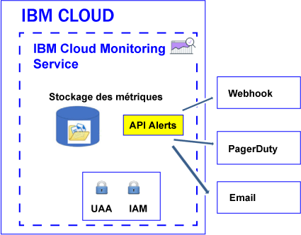

---

copyright:
  years: 2017

lastupdated: "2017-07-12"

---

{:shortdesc: .shortdesc}
{:new_window: target="_blank"}
{:codeblock: .codeblock}
{:screen: .screen}
{:pre: .pre}


# Configuration d'alertes
{: #config_alerts_ov}

Le service {{site.data.keyword.monitoringshort}} fournit un système d'alerte reposant sur des requêtes. Vous pouvez utiliser l'API Alerts afin de définir les règles et les méthodes de notification pour chaque requête de métrique à surveiller. Vous pouvez envoyer une notification par courrier électronique, en déclenchant un webhook ou en envoyant une alerte à PagerDuty.
{:shortdesc}

Vous pouvez définir une alerte dans le but de déclencher une notification pour une métrique. Une alerte est définie par une règle qui décrit la requête de métrique à surveiller, la valeur de seuil, l'action à effectuer en cas de dépassement du seuil, ainsi qu'une ou plusieurs méthodes de notification.   

Vous pouvez définir des alertes pour une ou plusieurs instance(s). Lorsqu'une requête que vous surveillez via une règle d'alerte inclut un caractère générique, celui-ci identifie plusieurs cibles, c'est-à-dire, plusieurs instances de service ou instances d'application. Toutes les 5 minutes, le service {{site.data.keyword.monitoringshort}} exécute la requête qui est configurée dans une règle d'alerte, et vérifie les derniers points de données qui sont renvoyés pour chaque instance ou pour plusieurs instances. Le service {{site.data.keyword.monitoringshort}} effectue le suivi du dernier état pour chaque instance et génère une nouvelle alerte si l'état de l'alerte change.  

L'illustration suivante montre les différents types de notification que vous pouvez configurer dans le service {{site.data.keyword.monitoringshort}} pour vous alerter : 



## Etats des alertes
{: #status}

Une alerte peut être associée à l'un des états suivants lorsque la règle est activée : 

* *OK* : l'état d'une règle a pour valeur *OK* dans les cas suivants :
    
	* Des données sont disponibles dans le service {{site.data.keyword.monitoringshort}} pour la requête de métrique qui est associée à cette règle. Vous avez défini un seuil d'avertissement et un seuil d'erreur. La valeur des données ne dépasse pas la valeur de seuil. 
	 
	* Aucune donnée n'est disponible dans le service {{site.data.keyword.monitoringshort}} pour la requête de métrique qui est associée à cette règle et vous configurez la propriété de règle `allow_no_data` avec la valeur *true*.           
	 
* *WARNING* : l'état de la règle a pour valeur *WARNING* lorsque des données sont disponibles dans le service {{site.data.keyword.monitoringshort}} pour la requête de métrique associée à cette règle. Vous avez défini un seuil d'avertissement et un seuil d'erreur. La valeur des données est comprise entre la valeur de seuil d'avertissement et la valeur de seuil d'erreur. 
	
* *ERROR* : l'état de la règle a pour valeur *ERROR* lorsque des données sont disponibles dans le service {{site.data.keyword.monitoringshort}} pour la requête de métrique associée à cette règle. Vous avez défini un seuil d'avertissement et un seuil d'erreur. La valeur de seuil d'erreur est atteinte.   

* *UNKNOWN* : l'état de la règle a pour valeur *UNKNOWN* lorsqu'aucune donnée n'est disponible dans le service {{site.data.keyword.monitoringshort}} pour la requête de métrique associée à cette règle. Vous pouvez indiquer si vous souhaitez recevoir ou non une notification basée sur la propriété `allow_no_data` que vous configurez pour la règle. Si vous affectez la valeur `false` à cette propriété, vous êtes averti qu'aucune donnée n'a été trouvée pour la règle. 


	
## Historique de l'alerte
{: #history}

A chaque fois que l'état d'une alerte change, l'enregistrement d'historique de l'alerte est mis à jour. Vous pouvez utiliser l'API Alerts (*/v1/alert/history*) pour extraire des informations sur l'historique d'une métrique.

L'état d'une alerte est utilisé pour définir le statut dans les scénarios suivants :

* Statut de la requête avant que la règle ne déclenche une notification.
* Statut de la requête après le déclenchement de la règle. 

Par exemple, si un seuil d'avertissement est dépassé, un enregistrement d'historique qui enregistre la transition de *OK* à *WARNING* est généré. De même, lorsque la valeur repasse sous le seuil, un enregistrement d'historique qui enregistre la transition de *WARNING* à *OK* est généré.


## Règles
{: #rules}

Une règle décrit la requête de métrique à surveiller, la valeur de seuil et l'action à effectuer en cas de dépassement du seuil. 

* Vous pouvez créer, supprimer et mettre à jour une règle, afficher les détails d'une règle, et répertorier toutes les règles à l'aide de l'API Alerts. Pour plus d'informations, voir [Utilisation de règles](/docs/services/cloud-monitoring/alerts/rules.html#rules).

* Le système d'alerte vérifie toutes les 5 minutes les règles qui sont activées dans l'espace. 

* Par défaut, une règle est activée lorsque vous la créez. Toutefois, vous pouvez définir la règle, et la désactiver, en affectant la valeur `false` à la zone *enable*. 

* Lorsque le paramètre de règle *comparison* a pour valeur below, la valeur error_level doit être inférieure à la valeur du niveau d'avertissement. Lorsque le paramètre de règle *comparison* a pour valeur above, la valeur error_level doit être supérieure à la valeur du niveau d'avertissement. 

* Par défaut, une règle est créée avec la valeur `true` affectée à la zone *allow_no_data*. Lorsqu'aucun point de données n'est disponible, aucune notification n'est envoyée sauf si la condition de règle est déclenchée. Si vous souhaitez recevoir une notification vous informant qu'aucune donnée n'a été trouvée pour la règle X, vous devez affecter la valeur `false` à la zone *allow_no_data*.  

**Astuce :** vérifiez la requête que vous surveillez au moyen d'une règle d'alerte dans Grafana. Assurez-vous qu'aucun dépassement de délai d'attente ne se produit, par exemple, en raison de la configuration d'une période prolongée ou suite à l'utilisation d'une requête qui inclut un caractère générique. Notez que lorsque la requête subit un dépassement de délai d'attente dans Grafana, une alerte configurée pour cette requête n'est pas déclenchée. 

Les zones suivantes sont requises pour définir une règle :

<table>
  <caption>Tableau 1. Liste des zones utilisées pour définir une règle</caption>
  <tr>
    <th>Nom de zone</th>
	<th>Description</th>
  </tr>
  <tr>
    <td>name</td>
	<td>Nom de la règle. Il doit être unique.</td>
  </tr>
  <tr>
    <td>description</td>
	<td>Récapitulatif de la règle.</td>
  </tr>
  <tr>
    <td>expression</td>
	<td>Requête de métrique à surveiller et pour laquelle envoyer une alerte si un seuil est dépassé. <br>Les expressions valides sont les suivantes : un nom de métrique unique, plusieurs métriques identifiées par des caractères génériques ou une fonction ajoutée à une ou plusieurs métriques. <br>**Astuce :** vous pouvez copier une requête vérifiée depuis Grafana. </td>
  </tr>
  <tr>
    <td>enabled</td>
	<td>Décrit le statut de la règle : <br>Définissez `true` pour activer la règle. <br>Définissez `false` pour désactiver la règle. <br>Par défaut, cette zone a pour valeur `true`.</td>
  </tr>
  <tr>
    <td>from</td>
	<td>Point de départ pour l'analyse des données en fonction des valeurs de seuil que vous avez définies pour la requête dans la zone expression. Exemple : `"from": "-5min"`</td>
  </tr>
  <tr>
    <td>until</td>
	<td>Point de fin pour l'analyse des données en fonction des valeurs de seuil que vous avez définies pour la requête dans la zone expression. Exemple : `"until": "now"`</td>
  </tr>
  <tr>
    <td>comparison</td>
	<td>Opération de comparaison utilisée pour identifier le type de vérification à effectuer. Les valeurs valides sont *below* et *above*. </td>
  </tr>
  <tr>
    <td>comparison_scope</td>
	<td>Définit la portée des données qui sont analysées. <br>Définissez *last* pour examiner la dernière valeur dans la série (les données qui sont disponibles pour votre requête).</td>
  </tr>
  <tr>
    <td>error_level</td>
	<td>Définit le seuil que vous avez configuré pour le déclenchement d'une alerte d'erreur. <br>Définissez la valeur qui, si elle est atteinte, entraîne la génération d'une alerte d'erreur. Exemple : `"error_level" : 27.94`</td>
  </tr>
  <tr>
    <td>warning_level</td>
	<td>Définit le seuil que vous avez configuré pour le déclenchement d'une alerte d'avertissement. <br>Définissez la valeur qui, si elle est atteinte, entraîne la génération d'une alerte d'avertissement. Exemple : `"warning_level" : 24`</td>
  </tr>
  <tr>
    <td>frequency</td>
	<td>Définit la fréquence à laquelle la vérification est effectuée. <br>Elle est mesurée en minutes, heures ou jours, par exemple, 5min, 1h, 7d. <br>Par exemple, pour effectuer une vérification toutes les minutes, vous pouvez affecter la valeur `"frequency": "1min"`. <br>**Note :** actuellement, la fréquence est de 5 minutes.</td>
  </tr>
  <tr>
    <td>dashboard_url</td>
	<td>Définit l'adresse URL d'un tableau de bord Grafana dans lequel la requête qui est surveillée est définie.</td>
  </tr>
    <tr>
    <td>allow_no_data</td>
	<td>Définit la condition à laquelle une notification n'est envoyée lorsqu'aucun point de données n'est disponible. <br>Par défaut, cette zone a pour valeur `true`.<br>Si vous souhaitez recevoir une notification vous informant qu'aucune donnée n'a été trouvée pour la règle X, affectez la valeur `false` à cette zone. </td>
  </tr>
  <tr>
    <td>notifications</td>
	<td>Nom d'une notification qui définit l'action à déclencher pour la règle. <br>**Note :** vous pouvez définir 1 ou plusieurs notifications par règle en répertoriant des noms de notification séparés par une virgule. </td>
  </tr>
</table>

Exemple de règle :

```
{
  "name": "checkbytesin1",
  "description": "MH check Bytes In per second",
  "expression": "movingAverage(messagehub.65ad9211-1234-5678-a751-c82123411eee.1.kafka-java-console-sa
mple-topic.BytesInPerSec.15MinuteRate,\"5min\")",
  "enabled": true,
  "from": "-5min",
  "until": "now",
  "comparison": "below",
  "comparison_scope": "last",
   "error_level" : 22.94,
   "warning_level" : 25,
  "frequency": "1min",
  "dashboard_url": "https://metrics.ng.bluemix.net",
  "notifications": [
    "emailXXX"
  ]
}
```
{: screen}


## Notifications
{: #notifications}

Une notification décrit la méthode et les détails qui sont utilisés pour envoyer une notification lorsqu'une alerte est déclenchée. Par exemple, afin d'obtenir une notification d'avertissement et une notification d'erreur pour une métrique, définissez une règle qui surveille le seuil d'avertissement et une règle qui surveille le seuil d'erreur.  

* Une notification est envoyée uniquement lorsque l'état de l'alerte change, par exemple, lorsque l'état d'une alerte définie pour une métrique passe de "OK" à "ERROR" ou de "ERROR" à "WARNING".  

    **Remarque :** si l'état (*OK*, *WARNING*, *ERROR* ou *UNKNOWN*) d'une règle d'alerte ne change pas, celle-ci n'est pas redéclenchée à l'itération suivante. 

* Les notifications sont considérées comme des événements de 24 heures. Vous ne pouvez pas spécifier d'intervalle de temps lorsqu'une notification peut être déclenchée.

* Vous pouvez configurer 1 ou plusieurs méthodes de notification par règle en répertoriant des noms de notification séparés par une virgule.  

* Vous pouvez utiliser l'[API REST Alerts](https://console.bluemix.net/apidocs/940-ibm-cloud-monitoring-alerts-api?&language=node#introduction){: new_window} pour créer, supprimer et mettre à jour une notification, pour afficher les détails d'une notification, et pour répertorier les notifications qui sont définies dans un espace.


Les méthodes de notification suivantes sont prises en charge :

<table>
 <caption>Tableau 2. Liste des méthodes de notification</caption>
 <tr>
    <th>Méthode</th>
	<th>Informations complémentaires</th>
 </tr>
 <tr>
    <td>Email</td>
	<td>[Configuration d'une notification par courrier électronique](/docs/services/cloud-monitoring/alerts/configure_alerts.html#send_email)</td>
  </tr>
  <tr>
    <td>PagerDuty</td>
	<td>[Configuration d'une notification PagerDuty](/docs/services/cloud-monitoring/alerts/configure_alerts.html#config_alert_pagerduty)</td>
  </tr>
  <tr>
    <td>Webhook</td>
	<td>[Configuration d'une notification webhook](/docs/services/cloud-monitoring/alerts/configure_alerts.html#config_webhook)</td>
  </tr>
</table>

**Remarque :** vous définissez les notifications d'alerte indépendamment des règles afin de pouvoir réutiliser les notifications avec plusieurs règles.
	
## Modèles de notification
{: #notification_template}
	
Une notification est un fichier JSON. 

Vous pouvez créer autant de modèles de notification que vous le souhaitez, puis les réutiliser afin de créer des notifications du type en question dans votre organisation. 

Vous pouvez définir les types de notification suivants :

* Email : définissez une notification de type *Email* pour envoyer un courrier électronique à une adresse électronique valide. 
* Webhook : définissez une notification de type *Webhook* pour les noeuds finaux https seulement. Ajoutez un paramètre au noeud final pour réduire la probabilité que quelqu'un d'autre appelle votre noeud final.
* Pagerduty : définissez une notification de type *PagerDuty* afin d'envoyer les données d'alerte pour une métrique à votre système de gestion des incidents PagerDuty. 

Le tableau suivant présente des exemples de modèle de notification :

<table>
  <caption>Tableau 3. Exemples de modèles de notification</caption>
  <tr>
    <th>Type</th>
	<th>Modèle</th>
	<th>Exemple</th>
  </tr>
  <tr>
    <td>Email</td>
	<td>
	```
	{
	"name": "Template_Name",
	"type": "Email",
	"description" : "Description",
	"detail": "EmailAddress"
	}
	```
	{: screen}
	</td>
	<td>
	```
	{
	"name": "my-email",
	"type": "Email",
	"description" : "Send email notification when there is an infrastructure problem.",
	"detail": "xxx@yyy.com"}
	```
	{: screen}
	</td>
  </tr>
  <tr>
    <td>Webhook</td>
	<td>
	```
	{
	"name": "Template_Name",
	"type": "Webhook",
	"description" : "Description",
	"detail": "Endpoint"
	}
	```
	{: codeblock}
	</td>
	<td>
	```
	{
	"name": "my-webhook",
	"type": "Webhook",
	"description" : "Fire a webhook when there is an infrastructure problem..",
	"detail": "https://myendpoint.bluemix.net?key=abcd1234"
	}
	```
	{: screen}
	</td>
  </tr>
  <tr>
    <td>Pagerduty</td>
	<td>
	```
	"name": "Template_Name",
	"type": "PagerDuty",
	"description" : "Description",
	"detail": "Pagerduty_APIkey"
	}
	```
	{: codeblock}
	</td>
	<td>
	```
	{
	"name": "my-pagerduty",
	"type": "PagerDuty",
	"description" : "Fire a PagerDuty alert when there is an infrastructure problem..",
	"detail": "abcd1234"
	}
	```
	{: screen}
	</td>
  </tr>
</table>

Où

* *Template_Name* correspond au nom du modèle de notification.
* *Description* indique à quel moment ce type de notification est utilisé.
* *EmailAddress* définit l'adresse électronique du destinataire de la notification.
* *Endpoint* définit l'adresse URL à laquelle la demande POST doit être émise. 
* *Pagerduty_APIkey* définit une clé d'API unique. Celle-ci est générée par un administrateur ou un propriétaire de compte PagerDuty.

Pour plus d'informations, voir [Création d'un modèle de notification](/docs/services/cloud-monitoring/alerts/notifications.html#template).


