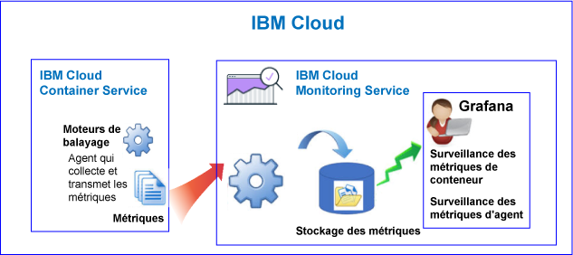

---

copyright:
  years: 2017, 2018

lastupdated: "2018-02-07"

---

{:new_window: target="_blank"}
{:shortdesc: .shortdesc}
{:screen: .screen}
{:pre: .pre}
{:table: .aria-labeledby="caption"}
{:codeblock: .codeblock}
{:tip: .tip}
{:download: .download}

# {{site.data.keyword.containershort_notm}}
{: #monitoring_bmx_containers_ov}

Dans {{site.data.keyword.Bluemix}}, les métriques de cluster sont automatiquement collectées. Vous pouvez utiliser Grafana pour surveiller les performances de votre cluster.
{:shortdesc}

**Remarque :** les métriques sont collectées et disponibles pour la surveillance via le service {{site.data.keyword.monitoringshort}} pour les conteneurs qui s'exécutent dans des clusters standard. Pour plus d'informations sur les fonctions prises en charge par un cluster standard, voir [Planification de clusters et d'applications](/docs/containers/cs_planning.html#cs_planning_cluster_type).

## A propos de la surveillance dans un environnement public
{: #public}

Dans {{site.data.keyword.Bluemix_notm}}, vous pouvez utiliser le service {{site.data.keyword.monitoringshort}} pour stocker et analyser des métriques de conteneur et des métriques de cluster Kubernetes qui sont automatiquement collectées par {{site.data.keyword.containershort}} dans un environnement public.

Vous pouvez disposer d'un ou de plusieurs clusters Kubernetes sur votre compte. Les métriques sont collectées automatiquement par {{site.data.keyword.containershort}} dès que le cluster est mis à disposition. Des métriques de conteneur sont collectées dès que le pod est déployé. Des métriques sont automatiquement transmises au service {{site.data.keyword.monitoringshort}} : 

* Lorsque vous créez un cluster en tant que ressource de compte, les métriques sont transmises au domaine de compte dans le service {{site.data.keyword.monitoringshort}}. Pour que les métriques puissent être transmises au domaine de compte, le propriétaire de clé de service {{site.data.keyword.monitoringshort}} doit posséder une règle IAM avec des droits de type **administrator** pour gérer le service {{site.data.keyword.monitoringshort}}. 
* Lorsque vous créez un cluster avec un espace Cloud Foundry associé, les métriques sont transmises au domaine d'espace dans le service {{site.data.keyword.monitoringshort}}. Pour que les métriques puissent être transmises au domaine d'espace, le propriétaire de clé de service {{site.data.keyword.monitoringshort}} doit posséder un rôle de type **manager** sur l'organisation et un rôle de type **developer** sur l'espace. 

Le diagramme suivant offre une vue d'ensemble de la surveillance pour {{site.data.keyword.containershort}} :

Le moteur de balayage est un processus qui s'exécute sur l'hôte et effectue une surveillance des métriques sans intervention d'agent. Il collecte par défaut en continu les métriques d'unité centrale et de mémoire de tous les conteneurs. 

Pour analyser des métriques dans Grafana pour un cluster, prenez en compte les informations suivantes :

* Vous devez lancer Grafana dans la région publique où l'instance {{site.data.keyword.monitoringshort}} que vous utilisez pour afficher les métriques est mise à disposition.  
* Vous pouvez utiliser le tableau de bord Grafana par défaut **ClusterMonitoringDashboard_v1** pour surveiller votre cluster.
* Vous pouvez également configurer des tableaux de bord Grafana personnalisés afin de visualiser des données de métrique pour un cluster dans la région publique du Cloud où le cluster est créé. 
* Votre ID utilisateur doit être doté des droits permettant d'afficher des métriques.  

    Pour afficher les métriques dans le domaine de compte, un utilisateur doit posséder une règle IAM pour le service {{site.data.keyword.monitoringshort}}. Il requiert les droits **Afficheur**. 
    
    Pour afficher les métriques dans le domaine d'espace, l'utilisateur a besoin d'un rôle CF. Pour plus d'informations, voir[Rôles requis pour un utilisateur pour afficher des métriques](/docs/services/cloud-monitoring/security_ov.html#bmx_roles).

### Vue d'ensemble de la surveillance d'un cluster qui transmet des métriques au domaine de compte
{: #acc}

Le diagramme suivant offre une vue d'ensemble de la surveillance dans un environnement public pour {{site.data.keyword.containershort}} lorsque le cluster transmet des métriques au domaine de compte :

### Vue d'ensemble de la surveillance d'un cluster qui transmet des métriques à un domaine d'espace
{: #space}

Le diagramme suivant offre une vue d'ensemble de la surveillance dans un environnement public pour {{site.data.keyword.containershort}} lorsque le cluster transmet des métriques à un domaine de compte :

Les clusters qui transmettent des métriques à un espace doivent être créés à partir de la ligne de commande dans le contexte d'une organisation et d'un espace Cloud Foundry. Avant de créer le cluster, exécutez la commande `bx target` pour définir le contexte de l'espace et de l'organisation CF. 

## A propos de la surveillance dans un environnement dédié
{: #dedicated}

Dans {{site.data.keyword.Bluemix_notm}}, vous pouvez utiliser le service {{site.data.keyword.monitoringshort}} dans un environnement public pour stocker et analyser des métriques de conteneur et des métriques de cluster Kubernetes qui sont automatiquement collectées par {{site.data.keyword.containershort}} dans un environnement dédié. 

Vous pouvez disposer d'un ou de plusieurs clusters Kubernetes sur votre compte. Les métriques sont collectées automatiquement par {{site.data.keyword.containershort}} dès que le cluster est mis à disposition. Des métriques de conteneur sont collectées dès que le pod est déployé. Des métriques sont automatiquement transmises au domaine de compte du service {{site.data.keyword.monitoringshort}}. 

**Remarque :** pour que les métriques puissent être transmises au domaine de compte, le propriétaire de clé de service {{site.data.keyword.monitoringshort}} doit posséder une règle IAM avec des droits de type **administrator** pour gérer le service {{site.data.keyword.monitoringshort}}. 

Pour afficher et analyser des métriques pour un cluster dans Grafana, tenez compte des informations suivantes :

* Vous devez lancer Grafana dans la région publique du cloud où le cluster est disponible dans l'environnement un dédié. Par exemple, si un cluster est mis à disposition dans un environnement dédié dans la région Sud des Etats-Unis, vous devez lancer Grafana dans la région Sud des Etats-Unis dans un environnement public. 
* Vous pouvez utiliser le tableau de bord Grafana par défaut **ClusterMonitoringDashboard_v1** pour surveiller votre cluster.
* Vous pouvez également configurer des tableaux de bord Grafana personnalisés afin de visualiser des données de métrique pour un cluster dans la région publique du Cloud où le cluster est créé. 
* Votre ID utilisateur doit posséder une règle IAM pour gérer le service {{site.data.keyword.monitoringshort}}. Vous devez disposer des droits de type**Viewer** pour afficher des métriques dans le domaine de compte.   

Le diagramme suivant offre une vue d'ensemble de la surveillance dans un environnement dédié pour {{site.data.keyword.containershort}} :

## Métriques d'unité centrale pour les conteneurs
{: #cpu_metrics_containers}

Le tableau suivant répertorie les métriques d'unité centrale automatiquement capturées pour un conteneur :

<table>
  <caption>Tableau 1. Métriques d'unité centrale pour les conteneurs</caption>
  <tr>
    <th>Nom de la métrique</th>
    <th>Description</th>
  </tr>
  <tr>
    <td>*cpu.num-cores*</td>
    <td>Cette métrique rend compte du nombre de coeurs d'UC disponibles pour le conteneur.   Par défaut, cette métrique rend compte du nombre de coeurs sur l'agent. Si vous définissez une limite au nombre de coeurs disponibles pour le conteneur, cette métrique rend compte du nombre de coeurs défini dans cette limite.</td>
  </tr>
  <tr>
    <td>*cpu.usage*</td>
    <td>Cette métrique rend compte du nombre de nanosecondes de temps d'UC sur tous les coeurs.   Une utilisation élevée de l'unité centrale peut entraîner des temps d'attente. Une utilisation élevée de l'UC témoigne d'une capacité de traitement insuffisante.</td>
  </tr>
  <tr>
    <td>*cpu.usage-pct*</td>
    <td>Cette métrique rend compte du temps UC utilisé en pourcentage de la capacité de l'UC.   Par défaut, la capacité d'UC est déterminée par le nombre de coeurs sur l'agent. Si vous définissez des limites à la capacité d'UC du conteneur, cette métrique rend compte de l'utilisation de l'unité centrale sous forme de pourcentage des limites définies. Une utilisation élevée de l'unité centrale peut entraîner des temps d'attente. Une utilisation élevée de l'UC témoigne d'une capacité de traitement insuffisante.</td>
  </tr>
  <tr>
    <td>*cpu.usage-pct-container-requested*</td>
    <td>Cette métrique rend compte du temps UC utilisé en pourcentage d'UC demandée du conteneur.   Si vous ne définissez pas l'UC demandés sur un conteneur, cette métrique n'est pas exposée pour le conteneur.</td>
  </tr>
</table>

## Métriques de charge pour les agents
{: #load_metrics_workers}

Le tableau suivant répertorie les métriques d'unité centrale automatiquement capturées pour un agent :

<table>
  <caption>Tableau 2. Métriques de charge pour les agents</caption>
  <tr>
    <th>Nom de la métrique</th>
    <th>Description</th>
  </tr>
  <tr>
    <td>*load.avg-1*</td>
    <td>Cette métrique rend compte de la charge d'UC moyenne pour l'hôte Kubernetes au cours de la dernière minute.   Une charge d'UC moyenne supérieure au nombre de coeurs sur l'agent indique que du trafic vers l'hôte est en file d'attente.</td>
  </tr>
  <tr>
    <td>*load.avg-5*</td>
    <td>Cette métrique rend compte de la charge d'UC moyenne pour l'hôte Kubernetes au cours des 5 dernières minutes.   Une charge d'UC moyenne supérieure au nombre de coeurs sur l'agent indique que du trafic vers l'hôte est en file d'attente.</td>
  </tr>
  <tr>
    <td>*load.avg-15*</td>
    <td>Cette métrique rend compte de la charge d'UC moyenne pour l'hôte Kubernetes au cours des 15 dernières minutes.   Une charge d'UC moyenne supérieure au nombre de coeurs sur l'agent indique que du trafic vers l'hôte est en file d'attente.</td>
  </tr>
</table>

## Métriques de mémoire pour les conteneurs
{: #memory_metrics}

Le tableau suivant répertorie les métriques de mémoire automatiquement capturées :

<table>
  <caption>Tableau 3. Métriques de mémoire pour les conteneurs</caption>
  <tr>
    <th>Nom de la métrique</th>
    <th>Description</th>
  </tr>
  <tr>
    <td>*memory.current*</td>
    <td>Cette métrique rend compte du nombre d'octets de mémoire utilisé actuellement par le conteneur. </td>
  </tr>
  <tr>
    <td>*memory.limit*</td>
    <td>Cette métrique rend compte de la quantité de mémoire qu'un conteneur est autorisé à à utiliser dans un fichier d'échange sur disque comparé aux limites plafond et plancher définies pour un pod.    Par défaut, les pods peuvent opèrent sans limites de mémoire. Un pod peut consommer autant de mémoire que celle disponible sur l'agent où il s'exécute. Lorsque vous déployez un pod, vous pouvez fixer des limites quant à la quantité de mémoire qu'il peut utiliser. </td>
  </tr>
  <tr>
    <td>*memory.usage-pct*</td>
    <td>Cette métrique rend compte de la mémoire utilisée en pourcentage de la limite de mémoire du conteneur.    Si vous définissez des limites à la quantité de mémoire qu'un conteneur peut utiliser, cette métrique rend compte de l'utilisation de la mémoire en pourcentage des limites définies. </td>
  </tr>
</table>

## Définition de requêtes pour surveiller des ressources dans un cluster Kubernetes
{: #monitoring_metrics_kube}

Pour surveiller les performances des conteneurs et des agents qui sont déployés dans un cluster Kubernetes dans {{site.data.keyword.Bluemix_notm}}, utilisez Grafana. 

Le service {{site.data.keyword.monitoringlong}} utilise la plateforme de visualisation et d'analyse open source Grafana dont vous pouvez vous servir pour surveiller, rechercher, analyser et visualiser vos métriques dans différents graphiques, par exemple, dans des diagrammes et des tableaux. 

Vous pouvez démarrer Grafana depuis un navigateur. Pour plus d'informations, voir [Accès au tableau de bord Grafana depuis un navigateur Web](/docs/services/cloud-monitoring/grafana/navigating_grafana.html#launch_grafana_from_browser).

Pour surveiller les conteneurs et les agents qui s'exécutent dans un cluster Kubernetes, vous devez définir une requête dans Grafana pour chaque ressource :

* Pour définir une requête qui surveille une métrique d'UC pour un conteneur, voir [Configuration de métriques d'unité centrale pour un conteneur dans Grafana](/docs/services/cloud-monitoring/containers/config_cpu_worker.html#config_cpu_worker).
* Pour définir une requête qui surveille une métrique de mémoire pour un conteneur, voir [Configuration de métriques de mémoire pour un conteneur dans Grafana](/docs/services/cloud-monitoring/containers/config_mem_container.html#config_mem_container).
* Pour définir une requête qui surveille une métrique de charge pour un agent, voir [Configuration de métriques de charge pour un agent dans Grafana](/docs/services/cloud-monitoring/containers/config_load_worker.html#config_load_worker).

Le format de la requête varie en fonction des types de ressource et des types de requête :

* Pour plus d'informations sur le format des requêtes permettant de surveiller l'unité centrale pour un conteneur, voir [Format de requête de métrique d'unité centrale pour un conteneur](/docs/services/cloud-monitoring/reference/metrics_format_containers.html#cpu_containers). 
* Pour plus d'informations sur le format des requêtes permettant de surveiller la charge pour un agent, voir [Format de requête de métrique de charge pour un agent](/docs/services/cloud-monitoring/reference/metrics_format_containers.html#load_workers).
* Pour plus d'informations sur le format des requêtes permettant de surveiller la mémoire pour un conteneur, voir [Format de requête de métrique de mémoire pour un conteneur](/docs/services/cloud-monitoring/reference/metrics_format_containers.html#mem_containers).

## Configuration du trafic réseau pour les configurations de pare-feu personnalisées dans {{site.data.keyword.Bluemix_notm}}
{: #ports}

Lorsqu'un pare-feu supplémentaire est configuré ou si vous avez personnalisé les paramètres de pare-feu dans votre infrastructure {{site.data.keyword.Bluemix_notm}} (SoftLayer), vous devez autoriser le trafic réseau sortant du noeud d'agent vers le service {{site.data.keyword.monitoringshort}}. 

Vous devez ouvrir le port TCP 443 et le port TCP 9091 depuis chaque agent vers le service {{site.data.keyword.monitoringshort}} pour les adresses IP suivantes dans votre pare-feu personnalisé :

<table>
  <tr>
    <th>Région</th>
    <th>URL d'ingestion</th>
	<th>Adresses IP publiques</th>
  </tr>
  <tr>
    <td>Allemagne</td>
	<td>ingest-eu-fra.logging.bluemix.net</td>
	<td>158.177.88.43  159.122.87.107</td>
  </tr>
  <tr>
    <td>Royaume-Uni</td>
	<td>ingest.logging.eu-gb.bluemix.net</td>
	<td>169.50.115.113</td>
  </tr>
  <tr>
    <td>Sud des Etats-Unis</td>
	<td>ingest.logging.ng.bluemix.net</td>
	<td>169.48.79.236  169.46.186.113</td>
  </tr>
  <tr>
    <td>Sydney</td>
	<td>ingest-au-syd.logging.bluemix.net</td>
	<td>130.198.76.125  168.1.209.20</td>
  </tr>
</table>
