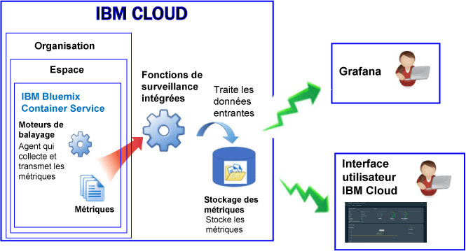

---

copyright:
  years: 2017, 2018

lastupdated: "2018-02-02"

---

{:new_window: target="_blank"}
{:shortdesc: .shortdesc}
{:screen: .screen}
{:pre: .pre}
{:table: .aria-labeledby="caption"}
{:codeblock: .codeblock}
{:tip: .tip}
{:download: .download}

# Conteneurs générs dans IBM Cloud (Obsolète)
{: #monitoring_managed_containers_ov}

Dans {{site.data.keyword.Bluemix}}, les métriques de conteneur et d'agent sont collectées automatiquement depuis l'extérieur du conteneur, sans avoir à installer et à gérer des agents dans le conteneur. Vous pouvez utiliser Grafana pour visualiser des métriques de conteneur. 
{:shortdesc}

**Remarque :** les métriques sont collectées et disponibles pour la surveillance via le service {{site.data.keyword.monitoringshort}} pour les conteneurs qui s'exécutent dans des clusters standard. Pour plus d'informations sur les fonctions prises en charge par un cluster standard, voir [Planification de clusters et d'applications](/docs/containers/cs_planning.html#cs_planning_cluster_type).

## Collecte de métriques par défaut
{: #metrics_containers_bmx_ov}

Le diagramme suivant offre une vue d'ensemble de la surveillance pour {{site.data.keyword.containershort}} :

Il collecte par défaut en continu les métriques suivantes de tous les conteneurs :

* UC
* Mémoire
* Informations réseau

## Surveillance des métriques pour un conteneur géré dans IBM Cloud (Obsolète)
{: #monitoring_metrics_bmx}

Les métriques sont collectées et affichées à la fois dans l'interface utilisateur de {{site.data.keyword.Bluemix_notm}} et dans Grafana :

* Utilisez la plateforme de visualisation et d'analyse open source Grafana pour surveiller, rechercher, analyser et visualiser vos métriques dans différents graphiques, par exemple, dans des diagrammes et des tableaux.

    Vous pouvez démarrer Grafana depuis l'interface utilisateur de {{site.data.keyword.Bluemix_notm}} ou depuis un navigateur. Pour plus d'informations, voir [Accès au tableau de bord Grafana](/docs/services/cloud-monitoring/grafana/navigating_grafana.html#navigating_grafana).

* Utilisez l'interface utilisateur de {{site.data.keyword.Bluemix_notm}} pour visualiser les métriques les plus récentes.

    Pour visualiser les métriques dans l'interface utilisateur de {{site.data.keyword.Bluemix_notm}}, voir [Analyse des métriques depuis la console {{site.data.keyword.Bluemix_notm}}](/docs/services/cloud-monitoring/containers/analyzing_metrics_bmx_ui.html#analyzing_metrics_bmx_ui).
