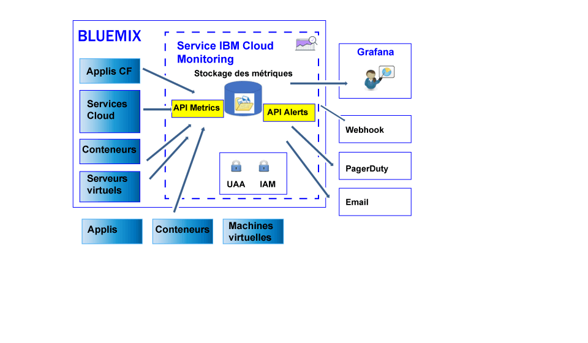

---

copyright:
  years: 2017

lastupdated: "2017-07-12"

---

{:shortdesc: .shortdesc}
{:new_window: target="_blank"}
{:codeblock: .codeblock}
{:screen: .screen}
{:pre: .pre}

# A propos d'
{: #monitoring_ov}

Utilisez le service {{site.data.keyword.monitoringlong}} pour étendre vos capacités de collecte et de conservation lorsque vous utilisez des métriques, et pour pouvoir définir des règles et des alertes afin de recevoir des notifications relatives aux conditions nécessitant votre attention. Donnez plus de moyens à votre équipe DevOps avec des fonctions qui permettent de savoir quelles sont les performances des applications et quelle est la consommation des ressources. Identifiez rapidement les tendances et détectez et diagnostiquez les problèmes, le tout associé à une rentabilisation immédiate et un faible coût total de possession. Utilisez Grafana pour surveiller votre environnement. 
{:shortdesc}

Par défaut, {{site.data.keyword.Bluemix}} collecte et affiche des métriques de performance relatives à l'utilisation de l'unité centrale, à l'utilisation de la mémoire et aux entrées-sorties de réseau pour le service {{site.data.keyword.containershort}}. Vous pouvez utiliser le service {{site.data.keyword.monitoringshort}} dans {{site.data.keyword.Bluemix_notm}} pour collecter et mesurer automatiquement des métriques clés à partir de votre environnement et de vos applications. Aucune instrumentation spéciale n'est requise pour collecter les métriques. Par exemple, vous pouvez utiliser les informations fournies par les métriques de performance pour surveiller le fonctionnement d'un service dans le cloud, détecter des goulots d'étranglement de ressources et garder un oeil sur l'accord sur les niveaux de licence. Lorsque vous analysez les données de performance d'un service, vous pouvez détecter des situations susceptibles de générer un goulot d'étranglement des ressources et d'affecter votre accord sur les niveaux de licence fournis à vos clients. En agissant suffisamment tôt, vous pouvez empêcher que des situations pouvant avoir un effet négatif sur votre activité ne se développent.  

Vous pouvez envoyer des métriques pour vos applications et machines virtuelles Cloud Foundry (CF) dans le service {{site.data.keyword.monitoringshort}}.   

La figure suivante est une vue générale des différentes ressources à partir desquelles vous pouvez envoyer des métriques au service {{site.data.keyword.monitoringshort}} en vue de leur analyse :

Pour plus d'informations sur l'envoi des métriques, voir[Envoi de métriques au service {{site.data.keyword.monitoringshort}}](/docs/services/cloud-monitoring/send_retrieve_metrics_ov.html#send_retrieve_metrics_ov).

Vous pouvez accéder au service {{site.data.keyword.monitoringlong}} via la catalogue {{site.data.keyword.Bluemix_notm}}. Pour le service {{site.data.keyword.containershort}} avec des conteneurs uniques et des conteneurs de groupes, vous pouvez également accéder au service à partir de l'interface utilisateur {{site.data.keyword.Bluemix_notm}}. 

## Pourquoi utiliser le service Monitoring ?
{: #value}

1. **Passez moins de temps à instrumenter votre application et davantage de temps à développer sa valeur ajoutée**

    Le service {{site.data.keyword.monitoringlong_notm}} collecte automatiquement des données de métrique depuis des services {{site.data.keyword.IBM_notm}} et évite ainsi d'avoir recours à des agents. Les API facilitent l'ajout de métriques personnalisées et l'interrogation des données de surveillance. 
	
	Le service {{site.data.keyword.monitoringlong_notm}} offre une collecte de métriques par minute. Le plan Lite conserve des métriques à résolution intégrale pendant 15 jours. Le plan Premium conserve des métriques à résolution intégrale pendant 45 jours. 

2. **Etendez facilement la surveillance dans votre application à l'aide d'API**

    Intégrez vos données de surveillance à vos applications et opérations à l'aide des API du service {{site.data.keyword.monitoringshort}}. Utilisez les API pour ajouter des métriques métier et applicatives à vos données de surveillance de cloud. Vous pouvez également utiliser les API pour envoyer des données de métrique depuis l'extérieur du cloud {{site.data.keyword.IBM_notm}} dans le service {{site.data.keyword.monitoringshort}}. 

3. **Examinez votre environnement afin de détecter, de diagnostiquer et d'identifier rapidement les problèmes**

    Visualisez l'impulsion de votre application et de votre infrastructure grâce à des tableaux de bord flexibles et personnalisables par l'utilisateur. {{site.data.keyword.monitoringlong_notm}} propose la puissance, la souplesse et l'expérience de Grafana pour construire et adapter rapidement votre tableau de bord en fonction des besoins de votre application.
	
4. **Créez des tableaux de bord réutilisables et rendez-les interactifs**

    La plateforme Grafana hébergée par le service {{site.data.keyword.monitoringlong_notm}} fournit la prise en charge permettant de générer des tableaux de bord personnalisés avec une large palette d'options de visualisation. Rendez vos tableaux de bord dynamiques grâce à la modélisation en utilisant des requêtes de métrique avec des variables. 

5. **Recevez des alertes**

    Définissez des règles pour la notification des conditions nécessitant votre attention. Le service {{site.data.keyword.monitoringlong_notm}} offre une API que vous pouvez utiliser pour définir des seuils de performance et pour être averti lorsque ces seuils sont atteints. Définissez des règles d'alerte pour une instance de service ou une instance d'application, ainsi que des règles d'alerte qui génèrent des rapports sur un ensemble d'instances. Lorsqu'une alerte est déclenchée, obtenez une notification via un courrier électronique, un événement PagerDuty, une notification webhook ou une combinaison de ces trois éléments. 

6. **Choisissez le plan de service qui correspond à vos besoins** 

    Vous pouvez choisir le plan de service Lite ou le plan de service Premium selon vos besoins en matière d'utilisation. Le plan Lite offre une fonction de collecte de métrique de plateforme de base et une fonction d'alerte supplémentaire. Vous pouvez aussi sélectionner le plan Premium qui permet d'activer une plus grande consommation de métrique avec une période de conservation plus longue, d'augmenter le nombre d'alertes que pouvez définir, y compris les alertes qui génèrent des rapports sur plusieurs services et applications, et d'accéder aux API des services. 

 
## Plan de service
{: #plan}

Le service {{site.data.keyword.monitoringshort}} met à disposition plusieurs plans. Chaque plan propose des fonctions différentes de collecte et de conservation des métriques, et de définition d'alerte. 

Vous pouvez changer de plan dans l'interface utilisateur {{site.data.keyword.Bluemix_notm}} ou via la ligne de commande. Vous pouvez mettre à niveau ou rétrograder votre plan à tout moment. Pour plus d'informations sur les mises à niveau des plans de service dans {{site.data.keyword.Bluemix_notm}},
voir [Modification du plan](/docs/services/cloud-monitoring/plan/change_plan.html#change_plan). 

Le tableau suivant présente les plans disponibles :

<table>
    <caption>Tableau 1. Récapitulatif des plans pour le service {{site.data.keyword.monitoringshort}}. </caption>
      <tr>
        <th>Plan</th>
        <th>Envoi de métriques à l'aide de l'API</th>
        <th>Durée de conservation des métriques</th>
        <th>Alertes</th>
      </tr>
      <tr>
        <td>Lite (par défaut)</td>
        <td>Non disponibles</td>
        <td>15 jours</td>
        <td>Vous pouvez définir jusqu'à 10 règles d'alerte pour une métrique ou 1 règle qui inclut un caractère générique. </td>
      </tr>
      <tr>
        <td>Premium</td>
        <td>Disponible</td>
        <td>45 jours</td>
        <td>Vous pouvez définir des règles d'alerte, y compris des règles avec des caractères génériques. </td>
      </tr>
</table>

**Remarque :** le plan Lite propose les mêmes fonctions que les capacités de surveillance intégrées dans {{site.data.keyword.Bluemix_notm}}.

## Durée de conservation des métriques
{: #metrics_retention}

Le tableau suivant récapitule les durées de conservation en fonction du plan de service utilisé :

<table>
    <caption>Tableau 2. Récapitulatif des durées de conservation pour le service {{site.data.keyword.monitoringshort}}. </caption>
      <tr>
        <th>Plan</th>
        <th>Durée de conservation </th>
      </tr>
      <tr>
        <td>Lite (par défaut)</td>
        <td>Les métriques sont stockées toutes les minutes pendant 15 jours. (1m:15d)</td>
      </tr>
      <tr>
        <td>Premium</td>
        <td>Les métriques sont stockées toutes les minutes pendant 45 jours. (1m:45d)</td>
      </tr>
</table>

Les métriques qui n'ont pas été actualisées pendant 7 jours sont supprimées. Le service {{site.data.keyword.monitoringshort}} supprime toutes les données pour un chemin de métrique qui semble transitoire par nature en identifiant les métriques qui n'ont pas été actualisées au cours des 7 derniers jours. Par exemple :

* Lorsqu'un conteneur est supprimé, les métriques qui lui sont associées sont conservées pendant une période de 7 jours, puis sont supprimées.
* Si vous disposez d'une jauge statsd appelée `<space_id>.test.statsd.gauge-hello` mais que vous ne l'actualisez pas pendant une semaine, la métrique est identifiée comme transitoire, puis supprimée, ainsi que toutes ses informations d'historique. 

## Mise à disposition du service Monitoring
{: #provision}

Vous trouverez le service {{site.data.keyword.monitoringshort}} dans la section **DevOps** du catalogue {{site.data.keyword.Bluemix_notm}}. Pour plus d'informations sur la mise à disposition d'un service dans {{site.data.keyword.Bluemix_notm}}, voir [Mise à disposition du service {{site.data.keyword.monitoringshort}}](/docs/services/cloud-monitoring/how-to/provision.html#provision).

Prenez en compte les informations suivantes pour le service {{site.data.keyword.monitoringshort}} :

* Afin de collecter des métriques pour les ressources de cloud s'exécutant dans un espace {{site.data.keyword.Bluemix_notm}}, vous devez mettre à disposition le service dans ce même espace.

* Afin d'envoyer des métriques au service {{site.data.keyword.monitoringshort}}, vous devez mettre à disposition une instance du service {{site.data.keyword.monitoringshort}} dans l'espace {{site.data.keyword.Bluemix_notm}} auquel vous souhaitez envoyer les métriques.  

## Régions
{: #regions}

Le service {{site.data.keyword.monitoringshort}} est disponible dans la région suivante :

* Sud des États-Unis

## Adresses URL du service Monitoring
{: #region}

Le service {{site.data.keyword.monitoringshort}} est à la disposition de toute personne disposant d'un ID utilisateur {{site.data.keyword.Bluemix_notm}} et de l'accès à un espace dans une organisation {{site.data.keyword.Bluemix_notm}}. 

* Pour chaque région dans laquelle le service {{site.data.keyword.monitoringshort}} est disponible, il existe un ensemble différent de noeuds finaux. 
* Une adresse URL unique est partagée par les noeuds finaux d'ingestion et d'interface utilisateur Web/d'API. 
* Le port 443 est un port TLS utilisé pour accéder aux métriques via l'API et l'interface utilisateur Web (Grafana).

Le tableau suivant répertorie l'adresse URL de l'environnement de cloud public qui est prise en charge : 

<table>
  <caption>Tableau 3. Liste des noeuds finaux permettant d'utiliser le service {{site.data.keyword.monitoringshort}}. </caption>
  <tr>
    <th>Région</th>
	<th>Noeud final</th>
  </tr>
  <tr>
    <td>Sud des États-Unis</td>
	<td>metrics.ng.bluemix.net</td>
  </tr>
</table>

