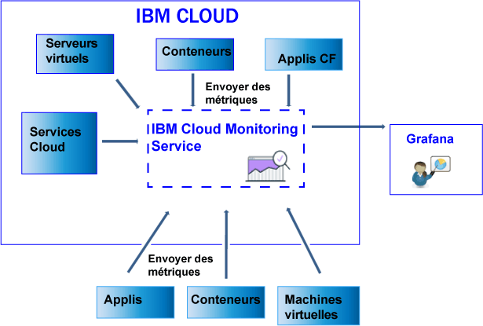

---

copyright:
  years: 2017

lastupdated: "2017-07-10"

---

{:shortdesc: .shortdesc}
{:new_window: target="_blank"}
{:codeblock: .codeblock}
{:screen: .screen}
{:pre: .pre}

# Envoi et extraction de données
{: #send_retrieve_metrics_ov}

Vous pouvez envoyer et extraire des métriques à partir d'un espace {{site.data.keyword.Bluemix}} dans le service {{site.data.keyword.monitoringshort}} à l'aide de l'API Metrics.
{:shortdesc}

La figure suivante est une vue générale des différentes ressources à partir desquelles vous pouvez envoyer des métriques au service {{site.data.keyword.monitoringshort}} : 

## Envoi de métriques
{: #send}

Pour les conteneurs Docker {{site.data.keyword.Bluemix_notm}}, les métriques système de base sont collectées automatiquement. Pour les applications Cloud Foundry et les applications s'exécutant sur une machine virtuelle, les métriques doivent être envoyées directement depuis l'application à l'aide de l'API Metrics. 

Pour envoyer des métriques au service {{site.data.keyword.monitoringshort}}, prenez en compte les informations suivantes : 

* Vous devez définir l'espace {{site.data.keyword.Bluemix_notm}} à partir duquel vous souhaitez extraire les données. 

* Vous devez fournir un jeton de sécurité ou une clé d'API pour gérer le service {{site.data.keyword.monitoringshort}}.  

* Vous pouvez utiliser le noeud final d'API `https://metrics.ng.bluemix.net/v1/metrics`. Pour plus d'informations sur l'API, voir [API Metrics](https://console.bluemix.net/apidocs/927-ibm-cloud-monitoring-rest-api?&language=node#introduction){: new_window}.

Selon le modèle d'authentification que vous choisissez, sélectionnez l'une des options suivantes pour envoyer des données au service {{site.data.keyword.monitoringshort}} : 
 
* Pour envoyer des métriques à l'aide d'un jeton UAA, voir [Envoi de métriques à un espace à l'aide d'UAA](/docs/services/cloud-monitoring/send-metrics/send_data_api.html#uaa).

* Pour envoyer des métriques à l'aide d'un jeton IAM ou d'une clé d'API, voir [Envoi de métriques à un espace à l'aide d'IAM ou d'une clé d'API](/docs/services/cloud-monitoring/send-metrics/send_data_api.html#iam).

## Extraction de métriques
{: #retrieve}

Pour extraire des métriques, prenez en compte les informations suivantes : 

* Vous devez définir l'espace {{site.data.keyword.Bluemix_notm}} à partir duquel vous souhaitez extraire les données. 

* Vous devez fournir un jeton de sécurité ou une clé d'API pour gérer le service {{site.data.keyword.monitoringshort}}.  

* Vous devez spécifier un chemin d'accès à 1 ou plusieurs métriques. Pour plus d'informations, voir [Définition des métriques](/docs/services/cloud-monitoring/retrieve-metrics/retrieve_data_api.html#metrics).

* Vous pouvez éventuellement spécifier une période personnalisée. Par défaut, si vous ne spécifiez pas de période, les données que vous extrayez sont celles qui correspondent aux 24 dernières heures. Pour plus d'informations, voir [Configuration d'une période](/docs/services/cloud-monitoring/retrieve-metrics/retrieve_data_api.html#time).

* Vous pouvez utiliser le noeud final d'API `https://metrics.ng.bluemix.net/v1/metrics`. Pour plus d'informations sur l'API, voir [API Metrics](https://console.bluemix.net/apidocs/927-ibm-cloud-monitoring-rest-api?&language=node#introduction){: new_window}.

**Remarque :** vous pouvez extraire un maximum de 5 cibles par demande. 

Selon le modèle d'authentification que vous choisissez, sélectionnez l'une des options suivantes pour extraire des données du service {{site.data.keyword.monitoringshort}} : 
 
* Pour extraire des métriques à l'aide d'un jeton UAA, voir [Extraction de métriques sur un espace à l'aide d'UAA](/docs/services/cloud-monitoring/retrieve-metrics/retrieve_data_api.html#uaa).

* Pour extraire des métriques à l'aide d'un jeton IAM ou d'une clé d'API, voir [Extraction de métriques sur un espace à l'aide d'IAM ou d'une clé d'API](/docs/services/cloud-monitoring/retrieve-metrics/retrieve_data_api.html#iam).

## Extraction de la liste de métriques
{: #show_metrics}

Vous pouvez afficher la liste des métriques disponibles dans un espace. 

Pour afficher la liste des métriques, prenez en compte les informations suivantes : 

* Vous devez définir l'espace {{site.data.keyword.Bluemix_notm}} dont vous souhaitez afficher la liste de métriques disponibles. 

* Vous devez fournir un jeton de sécurité ou une clé d'API pour gérer le service {{site.data.keyword.monitoringshort}}.  

* Vous devez spécifier une requête qui définit le chemin à partir duquel afficher la liste des métriques. Par exemple, pour afficher la liste de toutes les métriques dans un espace, vous pouvez définir la requête comme suit : `query=SpaceGUID.*` où *SpaceGUID* est l'identificateur global unique de l'espace. 

    La valeur par défaut est `*`, qui spécifie le point de départ au niveau racine pour l'espace. 

* Vous pouvez utiliser le noeud final d'API `https://metrics.ng.bluemix.net/v1/metrics/list`. Pour plus d'informations sur l'API, voir [API Metrics](https://console.bluemix.net/apidocs/927-ibm-cloud-monitoring-rest-api?&language=node#introduction){: new_window}.

 
