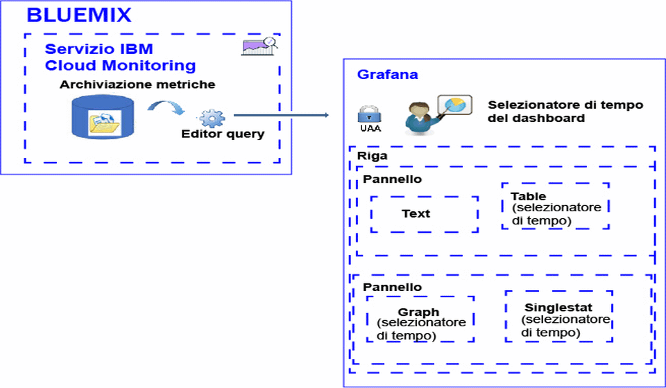

---

copyright:
  years: 2017

lastupdated: "2017-07-14"

---

{:shortdesc: .shortdesc}
{:new_window: target="_blank"}
{:codeblock: .codeblock}
{:screen: .screen}
{:pre: .pre}

# Analisi delle metriche
{: #analyze_metrics_ov}

In {{site.data.keyword.Bluemix}}, puoi utilizzare Grafana, una piattaforma di visualizzazione e monitoraggio open source, per monitorare, ricercare, analizzare e visualizzare le tue metriche in una varietà di grafici, ad esempio, diagrammi e tabelle. {:shortdesc}

## Panoramica dei componenti
{: #overview}

Il servizio {{site.data.keyword.monitoringshort}} archivia le serie di dati nel database di archiviazione delle metriche. Puoi eseguire query di questi dati servendoti dell'Editor query. Per ulteriori informazioni sulle query che sono supportate, vedi il documento relativo alle [funzioni Graphite](http://graphite.readthedocs.io/en/latest/functions.html).

In Grafana, per accedere ai dati che sono disponibili nel database di archiviazione delle metriche, devi accedere a uno spazio, un'organizzazione e una regione {{site.data.keyword.Bluemix_notm}} con l'ID utente e la password che usi per accedere a {{site.data.keyword.Bluemix_notm}}. 

Per visualizzare i dati, configuri un dashboard che può includere uno o più righe. In ciascuna riga, puoi definire più pannelli. 

* Una riga raggruppa i pannelli in un dashboard. 
* Un pannello è la risorsa di visualizzazione di base per monitorare le metriche. 
* Un dashboard può essere contrassegnato con tag e includere annotazioni che includono dati che puoi utilizzare per correlare i dati nei pannelli.

Puoi definire i seguenti tipi di pannelli: text, graph, table, singlestat. Ciascun pannello offre stili e opzioni di formattazione differenti che puoi personalizzare. I pannelli possono essere statici o dinamici.

La quantità di dati visualizzata in un pannello è determinata dalla query e dall'intervallo di tempo impostato. Puoi impostare un intervallo di tempo comune per tutti i pannelli a livello del dashboard oppure dei singoli intervalli di tempo per pannello.

La seguente figura mostra i diversi pannelli utilizzati da Grafana dal servizio {{site.data.keyword.monitoringshort}} per filtrare i dati e le risorse che puoi usare in Grafana per visualizzare e analizzare i dati:

