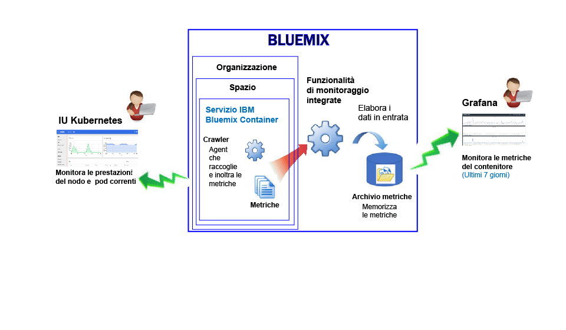
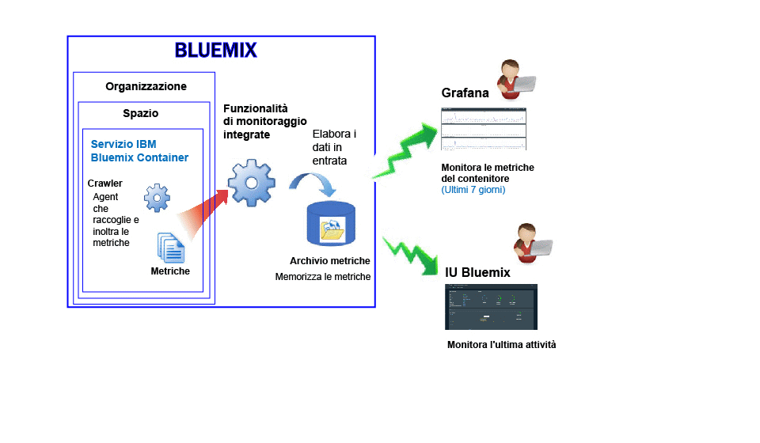

---

copyright:
  years: 2017

lastupdated: "2017-06-21"

---

{:shortdesc: .shortdesc}
{:new_window: target="_blank"}
{:codeblock: .codeblock}
{:screen: .screen}
{:pre: .pre}

# Monitoraggio per il servizio IBM Bluemix Container
{: #monitoring_bmx_containers_ov}

In {{site.data.keyword.Bluemix}}, le metriche del contenitore vengono raccolte automaticamente dall'esterno del contenitore, senza dover installare e conservare gli agent nel contenitore. Puoi utilizzare Grafana per visualizzare le metriche del contenitore. Inoltre, puoi utilizzare l'IU Kubernetes per visualizzare le metriche per i nodi (nodi di lavoro) e pod.
{:shortdesc}

## Raccolta di metriche per un contenitore in esecuzione in un cluster Kubernetes
{: #metrics_containers_kube_ov}

In {{site.data.keyword.Bluemix_notm}}, quando distribuisci le applicazioni in un cluster Kubernetes, tieni in considerazione le seguenti informazioni:

* In un account {{site.data.keyword.Bluemix_notm}}, puoi avere 1 o più organizzazioni.
* Ogni organizzazione può avere 1 o più spazi {{site.data.keyword.Bluemix_notm}}.
* In un'organizzazione, puoi avere 1 o più cluster Kubernetes.
* La raccolta delle metriche viene abilitata automaticamente quando crei un cluster Kubernetes.
* Un cluster Kubernetes è indipendente dagli spazi {{site.data.keyword.Bluemix_notm}}. Tuttavia, le metriche raccolte per un cluster e le sue risorse vengono associate a uno spazio {{site.data.keyword.Bluemix_notm}}.
* Le metriche vengono raccolte per un contenitore non appena il pod viene distribuito.
* Puoi visualizzare le metriche in Grafana o nell'IU Kubernetes.
* Per visualizzare i dati di metrica per un cluster, devi configurare i dashboard Grafana per la regione pubblica del cloud in cui viene creato il cluster.

Prima di creare un cluster, tramite l'IU {{site.data.keyword.Bluemix_notm}} o la riga di comando, devi accedere a una regione, account, organizzazione e spazio specifici di {{site.data.keyword.Bluemix_notm}}. Lo spazio in cui hai eseguito l'accesso è lo spazio dove vengono raccolti i dati di metrica per il cluster e le relative risorse.

La seguente figura mostra una visualizzazione di alto livello del monitoraggio per {{site.data.keyword.containershort}}:

Il crawler è un processo che viene eseguito nell'host ed effettua il monitoraggio senza agent delle metriche. Per impostazione predefinita, il crawler raccoglie costantemente le seguenti metriche da tutti i contenitori:

<table>
  <caption>Tabella 1. Metriche ottenute per impostazione predefinita</caption>
  <tr>
    <th>Tipo di metrica</th>
    <th>Nome metrica</th>
    <th>Descrizione</th>
  </tr>
  <tr>
    <td>Memoria</td>
    <td>*memory_current*</td>
    <td>Questa metrica riporta i byte della memoria che il contenitore sta attualmente utilizzando. </td>
  </tr>
  <tr>
    <td>Memoria</td>
    <td>*memory_limit*</td>
    <td>Questa metrica riporta la quantità di memoria che un contenitore è autorizzato a scambiare nel disco rispetto ai limiti massimi e minimi impostati per un pod.    Per impostazione predefinita, i pod vengono eseguiti senza limiti di memoria. Un pod può utilizzare la quantità di memoria presente sul nodo operatore in cui è in esecuzione. Quando distribuisci un pod, puoi impostare dei limiti alla quantità di memoria che un pod può utilizzare. </td>
  </tr>
  <tr>
    <td>CPU</td>
    <td>*cpu_usage*</td>
    <td>Questa metrica riporta i nanosecondi del tempo cpu in tutti i core.   Quando l'utilizzo della CPU è elevato, puoi notare un ritardo. L'utilizzo elevato della CPU indica un potere di elaborazione insufficiente.</td>
  </tr>
  <tr>
    <td>CPU</td>
    <td>*cpu_usage_pct*</td>
    <td>Questa metrica riporta il tempo CPU utilizzato come percentuale della capacità della CPU.   Quando la percentuale dell'utilizzo della CPU è elevata, puoi notare un ritardo. L'utilizzo elevato della CPU indica un potere di elaborazione insufficiente.</td>
  </tr>
  <tr>
    <td>CPU</td>
    <td>*cpu_num_cores*</td>
    <td>Questa metrica riporta il numero di core CPU disponibili per il contenitore.</td>
  </tr>
</table>

## Raccolta di metriche predefinite per un contenitore gestito in Bluemix
{: #metrics_containers_bmx_ov}

La seguente figura mostra una visualizzazione di alto livello del monitoraggio per {{site.data.keyword.containershort}}:

Per impostazione predefinita, il crawler raccoglie costantemente le seguenti metriche da tutti i contenitori:

* CPU
* Memoria
* Informazioni di rete

## Monitoraggio delle metriche per un contenitore in esecuzione in un cluster Kubernetes
{: #monitoring_metrics_kube}

Le metriche vengono raccolte e visualizzate nell'IU Kubernetes e in Grafana:

* Utilizza Grafana, una piattaforma di analisi e visualizzazione open source, per monitorare, ricercare, analizzare e visualizzare le tue metriche in una varietà di grafici, ad esempio, diagrammi e tabelle.
 
    Puoi avviare Grafana da un browser. Per ulteriori informazioni, vedi [Passaggio al dashboard Grafana da un browser web](/docs/services/cloud-monitoring/grafana/navigating_grafana.html#launch_grafana_from_browser).
    
* Utilizza l'IU Kubernetes per visualizzare le metriche per i nodi e i pod. Per ulteriori informazioni, vedi [Dashboard IU Web ](https://kubernetes.io/docs/tasks/access-application-cluster/web-ui-dashboard/ "Icona link esterno"){: new_window}.

## Monitoraggio delle metriche per un contenitore gestito in Bluemix
{: #monitoring_metrics_bmx}

Le metriche vengono raccolte e visualizzate nell'IU {{site.data.keyword.Bluemix_notm}} e in Grafana:

* Utilizza Grafana, una piattaforma di analisi e visualizzazione open source, per monitorare, ricercare, analizzare e visualizzare le tue metriche in una varietà di grafici, ad esempio, diagrammi e tabelle.
 
    Puoi avviare Grafana dall'IU {{site.data.keyword.Bluemix_notm}} o da un browser. Per ulteriori informazioni, vedi [Passaggio al dashboard Grafana](/docs/services/cloud-monitoring/grafana/navigating_grafana.html#navigating_grafana).
    

* Utilizza l'IU {{site.data.keyword.Bluemix_notm}} per visualizzare le metriche più recenti.

    Per visualizzare le metriche nell'IU {{site.data.keyword.Bluemix_notm}}, vedi [Analisi delle metriche dalla console Bluemix](/docs/services/cloud-monitoring/containers/analyzing_metrics_bmx_ui.html#analyzing_metrics_bmx_ui).

    

