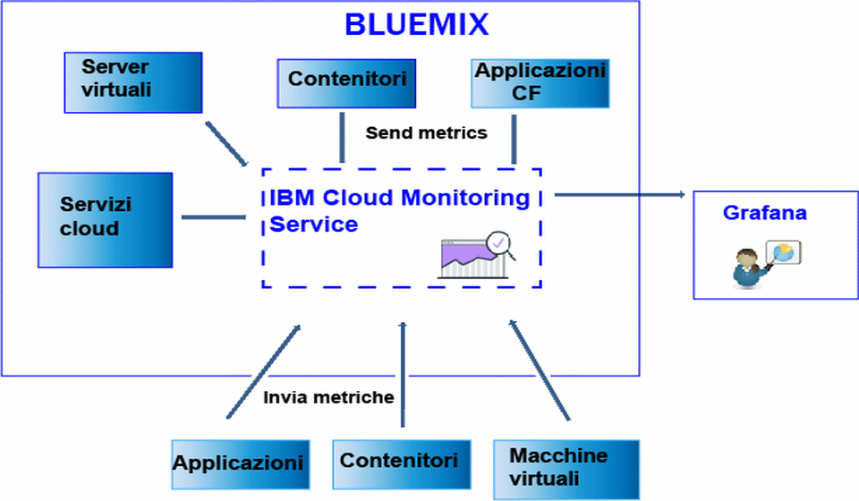

---

copyright:
  years: 2017

lastupdated: "2017-07-10"

---

{:shortdesc: .shortdesc}
{:new_window: target="_blank"}
{:codeblock: .codeblock}
{:screen: .screen}
{:pre: .pre}

# Invio e recupero di dati
{: #send_retrieve_metrics_ov}

Puoi inviare e recuperare metriche da uno spazio {{site.data.keyword.Bluemix}} nel servizio {{site.data.keyword.monitoringshort}} utilizzando l'API Metriche.
{:shortdesc}

La seguente figura mostra una visualizzazione di alto livello delle diverse risorse da cui puoi inviare le metriche al servizio {{site.data.keyword.monitoringshort}}:

## Invio di metriche
{: #send}

Per i contenitori {{site.data.keyword.Bluemix_notm}} Docker, le metriche del sistema di base vengono raccolte automaticamente. Per le applicazioni Cloud Foundry e per le applicazioni in esecuzione in una macchina virtuale (VM), le metriche devono essere inviate direttamente dall'applicazione utilizzando l'API Metriche. 

Per inviare metriche nel servizio {{site.data.keyword.monitoringshort}}, considera le seguenti informazioni: 

* Devi impostare lo spazio {{site.data.keyword.Bluemix_notm}} da dove vuoi recuperare i dati.

* Devi fornire un token di sicurezza o una chiave API per lavorare con il servizio {{site.data.keyword.monitoringshort}}. 

* Puoi utilizzare l'endpoint API `https://metrics.ng.bluemix.net/v1/metrics`. Per ulteriori informazioni sull'API, vedi [l'API Metriche](https://console.bluemix.net/apidocs/927-ibm-cloud-monitoring-rest-api?&language=node#introduction){: new_window}.

A seconda del modello di autenticazione per cui opti, scegli una delle seguenti opzioni per inviare i dati nel servizio {{site.data.keyword.monitoringshort}}:
 
* Per inviare metriche utilizzando un token UAA, vedi [Invio delle metriche a uno spazio utilizzando UAA](/docs/services/cloud-monitoring/send-metrics/send_data_api.html#uaa).

* Per inviare metriche utilizzando un token IAM o una chiave API, vedi [Invio di metriche a uno spazio utilizzando IAM o una chiave API](/docs/services/cloud-monitoring/send-metrics/send_data_api.html#iam).

## Recupero di metriche
{: #retrieve}

Per recuperare le metriche, considera le seguenti informazioni: 

* Devi impostare lo spazio {{site.data.keyword.Bluemix_notm}} da dove vuoi recuperare i dati.

* Devi fornire un token di sicurezza o una chiave API per lavorare con il servizio {{site.data.keyword.monitoringshort}}. 

* Devi specificare un percorso a 1 o più metriche. Per ulteriori informazioni, vedi [Definizione delle metriche](/docs/services/cloud-monitoring/retrieve-metrics/retrieve_data_api.html#metrics).

* Facoltativamente, puoi specificare un periodo di tempo personalizzato. Per impostazione predefinita, se non specifichi un periodo di tempo, i dati che recuperi sono quelli corrispondenti alle ultime 24 ore. Per ulteriori informazioni, vedi [Configurazione un periodo di tempo](/docs/services/cloud-monitoring/retrieve-metrics/retrieve_data_api.html#time).

* Puoi utilizzare l'endpoint API `https://metrics.ng.bluemix.net/v1/metrics`. Per ulteriori informazioni sull'API, vedi [l'API Metriche](https://console.bluemix.net/apidocs/927-ibm-cloud-monitoring-rest-api?&language=node#introduction){: new_window}.

**Nota:** puoi recuperare un massimo di 5 destinazioni per richiesta.

A seconda del modello di autenticazione per cui opti, scegli una delle seguenti opzioni per recuperare i dati dal servizio {{site.data.keyword.monitoringshort}}:
 
* Per recuperare metriche utilizzando un token UAA, vedi [Recupero delle metriche da uno spazio utilizzando UAA](/docs/services/cloud-monitoring/retrieve-metrics/retrieve_data_api.html#uaa).

* Per recuperare metriche utilizzando un token IAM o una chiave API, vedi [Recupero di metriche da uno spazio utilizzando IAM o una chiave API](/docs/services/cloud-monitoring/retrieve-metrics/retrieve_data_api.html#iam).

## Recupero dell'elenco di metriche
{: #show_metrics}

Puoi elencare le metriche disponibili in uno spazio.

Per elencare le metriche, considera le seguenti informazioni: 

* Devi impostare lo spazio {{site.data.keyword.Bluemix_notm}} per cui vuoi elencare le metriche disponibili.

* Devi fornire un token di sicurezza o una chiave API per lavorare con il servizio {{site.data.keyword.monitoringshort}}. 

* Devi specificare una query che definisce il percorso da cui elencare le metriche. Ad esempio, per elencare tutte le metriche in uno spazio, puoi impostare la query: `query=SpaceGUID.*` dove *SpaceGUID* è il GUID dello spazio.

    Il valore predefinito è `*`, che specifica il punto di inizio al livello root per lo spazio.

* Puoi utilizzare l'endpoint API `https://metrics.ng.bluemix.net/v1/metrics/list`. Per ulteriori informazioni sull'API, vedi [l'API Metriche](https://console.bluemix.net/apidocs/927-ibm-cloud-monitoring-rest-api?&language=node#introduction){: new_window}.

 
