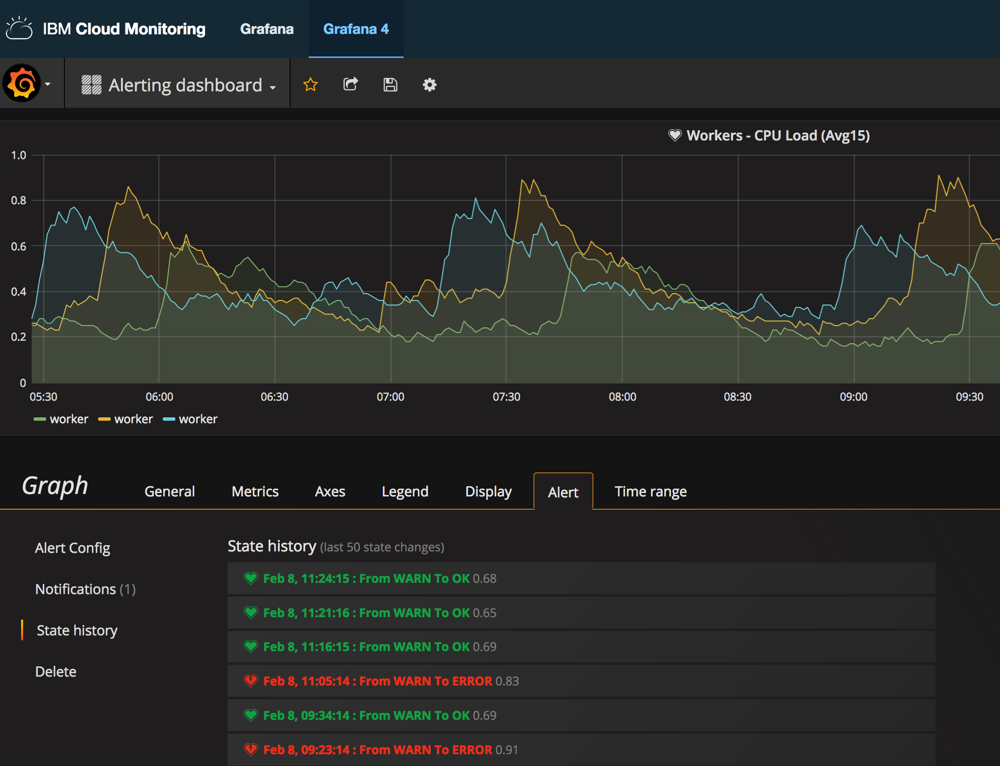

---

copyright:
  years: 2017, 2018

lastupdated: "2018-02-07"

---

{:new_window: target="_blank"}
{:shortdesc: .shortdesc}
{:screen: .screen}
{:pre: .pre}
{:table: .aria-labeledby="caption"}
{:codeblock: .codeblock}
{:tip: .tip}
{:download: .download}

# Grafana でのアラートの履歴の取得
{: #retrieve_history_grafana}

Grafana では、アラートの履歴を表示できます。
{:shortdesc}

アラートの履歴を取得するには、以下の手順を実行します。

1. サイド・メニュー・バーのトグル を選択します。
2. **「Dashboards」**を選択します。
3. アラートが定義されているダッシュボードを選択します。
4. グラフのタイトルをクリックし、次に**「edit」**を選択します。
    
    *「Metrics」*タブが開きます。 

5. **「Alert」**タブを選択します。
6. **「State history」**を選択します。

    リストされている項目はすべて、アラートがトリガーされたときのインスタンスを表します。

