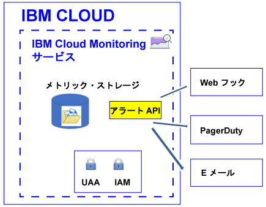

---

copyright:
  years: 2017

lastupdated: "2017-07-12"

---

{:shortdesc: .shortdesc}
{:new_window: target="_blank"}
{:codeblock: .codeblock}
{:screen: .screen}
{:pre: .pre}


# アラートの構成
{: #config_alerts_ov}

{{site.data.keyword.monitoringshort}} サービスには、照会ベースのアラート・システムが用意されています。アラート API を使用して、モニターする各メトリック照会のルールと通知方法を設定することができます。通知は、E メールの送信、Web フックのトリガー、または PagerDuty へのアラートの送信によって実行できます。
{:shortdesc}

メトリックの通知をトリガーするアラートを定義できます。アラートは、モニターするメトリック照会、しきい値、およびしきい値を超えた際に実行するアクションを記述するルールと、1 つ以上の通知方法によって定義されます。  

単一インスタンス用または複数インスタンス用のアラートを定義できます。アラート・ルールを通じてモニターする照会にワイルドカードが含まれる場合、そのワイルドカードは複数のターゲット (すなわち複数のサービス・インスタンスまたはアプリケーション・インスタンス) を識別します。{{site.data.keyword.monitoringshort}} サービスは、5 分ごとに、アラート・ルールで構成されている照会を実行し、各インスタンスまたは複数インスタンスについて返された最後のデータ・ポイントをチェックします。{{site.data.keyword.monitoringshort}} サービスは、各インスタンスの最後の状態を追跡し、アラートの状態が変わった場合に新規アラートを生成します。 

以下の図に、アラートを出すように {{site.data.keyword.monitoringshort}} サービスで構成できるさまざまな通知タイプを示します。



## アラートの状態
{: #status}

ルールが有効になっている場合、アラートの状態は以下のいずれかになります。

* *OK*: 以下の場合、ルールの状態が *OK* に設定されます。
    
	* そのルールに関連付けられたメトリック照会用のデータが {{site.data.keyword.monitoringshort}} サービス内で使用可能である。警告しきい値とエラーしきい値を設定済みである。データの値はしきい値を超えていない。
	 
	* そのルールに関連付けられたメトリック照会用のデータが {{site.data.keyword.monitoringshort}} サービス内に存在せず、ルール・プロパティー `allow_no_data` を *true* に構成している。           
	 
* *WARNING*: そのルールに関連付けられたメトリック照会用のデータが {{site.data.keyword.monitoringshort}} サービス内で使用可能である場合、ルールの状態が *WARNING* に設定されます。警告しきい値とエラーしきい値を設定済みです。データの値は警告しきい値とエラーしきい値の間です。
	
* *ERROR*: そのルールに関連付けられたメトリック照会用のデータが {{site.data.keyword.monitoringshort}} サービス内で使用可能である場合、ルールの状態が *ERROR* に設定されます。警告しきい値とエラーしきい値を設定済みです。エラーしきい値に達しています。  

* *UNKNOWN*: そのルールに関連付けられたメトリック照会用のデータが {{site.data.keyword.monitoringshort}} サービス内に存在しない場合、ルールの状態が *UNKNOWN* に設定されます。ルールに対して構成したプロパティー `allow_no_data` に基づいて、通知を受け取るかどうかを構成できます。このプロパティーを `false` に設定した場合、そのルール用のデータが見つからなかったことが通知されます。


	
## アラート履歴
{: #history}

アラートの状態が変更されるたびに、アラートの履歴レコードが更新されます。アラート API (*/v1/alert/history*) を使用して、メトリックの履歴に関する情報を取得できます。

アラートの状態は、以下のいずれかのシナリオの状況を定義するために使用されます。

* ルールが通知をトリガーする前の照会の状況。
* ルールが通知をトリガーした後の照会の状況。 

例えば、警告しきい値を超えると、*OK* から *WARNING* への遷移を記録する履歴レコードが生成されます。同様に、値が再びしきい値を下回ると、*WARNING* から *OK* への遷移を記録する履歴レコードが生成されます。


## ルール
{: #rules}

ルールは、モニターするメトリック照会、しきい値、およびしきい値を超えた際に実行するアクションを記述します。 

* アラート API を使用して、ルールの作成、削除、および更新、ルールの詳細の表示、およびすべてのルールのリストを行うことができます。詳しくは、[ルールの処理](/docs/services/cloud-monitoring/alerts/rules.html#rules)を参照してください。

* アラート・システムは、スペース内で有効になっているルールを 5 分ごとにチェックします。

* デフォルトでは、ルールは作成時に有効になっています。ただし、ルールを定義し、フィールド *enable* を `false` に構成することによって、そのルールを無効にすることができます。

* ルール・パラメーター *comparison* が below に設定されている場合、error_level の値は、警告レベル値よりも低くなければなりません。ルール・パラメーター *comparison* が above に設定されている場合、error_level の値は、警告レベル値よりも高くなければなりません。

* デフォルトでは、フィールド *allow_no_data* が `true` に設定された状態でルールが作成されます。使用可能なデータ・ポイントがない場合、ルール条件がトリガーされない限り通知は送信されません。ルール X のデータが見つからなかったことを伝える通知を受け取りたい場合は、フィールド *allow_no_data* を `false` に設定する必要があります。 

**ヒント:** Grafana でアラート・ルールを通じてモニターする照会を検証してください。例えば、長い期間を構成した結果として、またはワイルドカードを含む照会を使用することによって、タイムアウトにならないことを確認してください。Grafana で照会がタイムアウトになったときに、その照会用に構成されたアラートはトリガーされないことに注意してください。

ルールを定義するには、以下のフィールドが必要です。

<table>
  <caption>表 1. ルールを定義するために使用されるフィールドのリスト</caption>
  <tr>
    <th>フィールド名</th>
	<th>説明</th>
  </tr>
  <tr>
    <td>name</td>
	<td>ルールの名前。この名前は固有でなければなりません。</td>
  </tr>
  <tr>
    <td>description</td>
	<td>ルールの要約。</td>
  </tr>
  <tr>
    <td>expression</td>
	<td>モニターし、しきい値を超えたらアラートを送信するメトリック照会。<br>有効な式は、単一メトリック名、ワイルドカードによって識別される複数のメトリック、または 1 つ以上のメトリックに加えた関数です。<br>**ヒント:** 検証済みの照会を、Grafana からコピーできます。</td>
  </tr>
  <tr>
    <td>enabled</td>
	<td>次のようにルールの状況を記述します。<br>ルールを有効にするには、`true` に設定します。<br>ルールを無効にするには `false` に設定します。<br>デフォルトでは、`true` に設定されます。</td>
  </tr>
  <tr>
    <td>from</td>
	<td>expression フィールドに定義した照会に設定されているしきい値に基づいてデータを分析するために使用される初期ポイント・イン・タイム。例: `"from": "-5min"`</td>
  </tr>
  <tr>
    <td>until</td>
	<td>expression フィールドに定義した照会に設定されているしきい値に基づいてデータを分析するために使用される終了ポイント・イン・タイム。例: `"until": "now"`</td>
  </tr>
  <tr>
    <td>comparison</td>
	<td>実行するチェックのタイプを識別するために使用される比較演算。有効な値は、*below* と *above* です。</td>
  </tr>
  <tr>
    <td>comparison_scope</td>
	<td>分析するデータのスコープを定義します。<br>シリーズ (照会に使用可能なデータ) の最後の値を表示するには、*last* に設定します。</td>
  </tr>
  <tr>
    <td>error_level</td>
	<td>エラー・アラートをトリガーするために設定するしきい値を定義します。<br>到達したらエラー・アラートが生成される値を設定します。例: `"error_level" : 27.94`</td>
  </tr>
  <tr>
    <td>warning_level</td>
	<td>警告アラートをトリガーするために設定するしきい値を定義します。<br>到達したら警告アラートが生成される値を設定します。例: `"warning_level" : 24`</td>
  </tr>
  <tr>
    <td>frequency</td>
	<td>チェックが実行される頻度を定義します。<br>単位は分、時間、日のいずれかであり、例えば 5min、1h、7d と指定します。<br>例えば、毎分チェックが行われるように、`"frequency": "1min"` と設定できます。<br>**注:** 現在は、この頻度は 5 分に固定されています。</td>
  </tr>
  <tr>
    <td>dashboard_url</td>
	<td>モニターする照会が定義されている Grafana ダッシュボードの URL を定義します。</td>
  </tr>
    <tr>
    <td>allow_no_data</td>
	<td>使用可能なデータ・ポイントがない場合に通知が送信される条件を定義します。<br>デフォルトでは、`true` に設定されます。<br>ルール X のデータが見つからなかったという通知を受け取りたい場合は、`false` に設定します。</td>
  </tr>
  <tr>
    <td>notifications</td>
	<td>このルールでトリガーするアクションを定義する通知の名前。<br>**注:** コンマで区切って通知名をリストすることにより、ルールごとに 1 つ以上の通知を定義できます。</td>
  </tr>
</table>

例えば、ルールのサンプルを以下に示します。

```
{
  "name": "checkbytesin1",
  "description": "MH check Bytes In per second",
  "expression": "movingAverage(messagehub.65ad9211-1234-5678-a751-c82123411eee.1.kafka-java-console-sa
mple-topic.BytesInPerSec.15MinuteRate,\"5min\")",
  "enabled": true,
  "from": "-5min",
  "until": "now",
  "comparison": "below",
  "comparison_scope": "last",
   "error_level" : 22.94,
   "warning_level" : 25,
  "frequency": "1min",
  "dashboard_url": "https://metrics.ng.bluemix.net",
  "notifications": [
    "emailXXX"
  ]
}
```
{: screen}


## 通知
{: #notifications}

通知は、アラートがトリガーされた際の通知に使用される方法と詳細を記述しています。例えば、メトリックの警告通知およびエラー通知を受け取るには、警告しきい値をモニターするルールを 1 つ定義し、それからエラーしきい値をモニターするルールを 1 つ定義します。 

* 通知が送信されるのは、アラートの状態が変わったとき (例えば、メトリックのアラートの状態が「OK」から「ERROR」、または「ERROR」から「WARNING」に変わったとき) だけです。 

    **注:** アラート・ルールが同じ状態、すなわち *OK*、*WARNING*、*ERROR*、または *UNKNOWN* のままの場合は、次の反復の際に再トリガーされません。

* 通知は、24 時間イベントと見なされます。通知のトリガーが可能な時間間隔を指定することはできません。

* コンマで区切って通知名をリストすることにより、ルールごとに 1 つ以上の通知方法を構成できます。 

* [アラート REST API](https://console.bluemix.net/apidocs/940-ibm-cloud-monitoring-alerts-api?&language=node#introduction){: new_window} を使用して、通知の作成、削除、および更新、通知の詳細表示、およびスペース内に定義されている通知のリストを行うことができます。


サポートされる通知方法は以下のとおりです。

<table>
 <caption>表 2. 通知方法のリスト</caption>
 <tr>
    <th>方法</th>
	<th>詳細情報</th>
 </tr>
 <tr>
    <td>Email</td>
	<td>[E メール通知の構成](/docs/services/cloud-monitoring/alerts/configure_alerts.html#send_email)</td>
  </tr>
  <tr>
    <td>PagerDuty</td>
	<td>[PagerDuty 通知の構成](/docs/services/cloud-monitoring/alerts/configure_alerts.html#config_alert_pagerduty)</td>
  </tr>
  <tr>
    <td>Webhook</td>
	<td>[Web フック通知の構成](/docs/services/cloud-monitoring/alerts/configure_alerts.html#config_webhook)</td>
  </tr>
</table>

**注:** アラート通知の定義は、ルールとは無関係に行います。それにより、それらの通知を複数のルールで再使用することができます。
	
## 通知テンプレート
{: #notification_template}
	
通知は JSON ファイルです。 

通知テンプレートはいくつでも作成でき、それらを再使用して組織内にそのタイプの通知を作成することができます。 

以下のいずれかのタイプの通知を定義できます。

* Email: *Email* タイプの通知を定義すると、有効な E メール・アドレスに E メールが送信されます。 
* Webhook: *Webhook* タイプの通知は、https　エンドポイントのみを対象に定義します。他のユーザーによって自分のエンドポイントが呼び出されないようにするには、エンドポイントにパラメーターを追加します。
* Pagerduty: *PagerDuty* タイプの通知を定義すると、メトリックのアラート・データが PagerDuty インシデント管理システムに送信されます。 

例として、以下の表に通知テンプレートのサンプルをリストします。

<table>
  <caption>表 3. 通知テンプレートの例</caption>
  <tr>
    <th>タイプ</th>
	<th>テンプレート</th>
	<th>サンプル</th>
  </tr>
  <tr>
    <td>Email</td>
	<td>
	```
	{
	"name": "Template_Name",
	"type": "Email",
	"description" : "Description",
	"detail": "EmailAddress"
	}
	```
	{: screen}
	</td>
	<td>
	```
	{
	"name": "my-email",
	"type": "Email",
	"description" : "Send email notification when there is an infrastructure problem.",
	"detail": "xxx@yyy.com"
	}
	```
	{: screen}
	</td>
  </tr>
  <tr>
    <td>Webhook</td>
	<td>
	```
	{
	"name": "Template_Name",
	"type": "Webhook",
	"description" : "Description",
	"detail": "Endpoint"
	}
	```
	{: codeblock}
	</td>
	<td>
	```
	{
	"name": "my-webhook",
	"type": "Webhook",
	"description" : "Fire a webhook when there is an infrastructure problem..",
	"detail": "https://myendpoint.bluemix.net?key=abcd1234"
	}
	```
	{: screen}
	</td>
  </tr>
  <tr>
    <td>Pagerduty</td>
	<td>
	```
	"name": "Template_Name",
	"type": "PagerDuty",
	"description" : "Description",
	"detail": "Pagerduty_APIkey"
	}
	```
	{: codeblock}
	</td>
	<td>
	```
	{
	"name": "my-pagerduty",
	"type": "PagerDuty",
	"description" : "Fire a PagerDuty alert when there is an infrastructure problem..",
	"detail": "abcd1234"
	}
	```
	{: screen}
	</td>
  </tr>
</table>

各部の意味は、次のとおりです。

* *Template_Name* は、通知テンプレートの名前を定義します。
* *Description* は、このタイプの通知がどのような時に使用されるかを説明します。
* *EmailAddress* は、通知の受信者の E メール・アドレスを定義します。
* *Endpoint* は、POST を実行する URL を定義します。 
* *Pagerduty_APIkey* は、固有 API キーを定義します。この API キーは、PagerDuty アカウントの管理者または所有者によって生成されます。

詳細情報については、[通知テンプレートの作成](/docs/services/cloud-monitoring/alerts/notifications.html#template)を参照してください。


