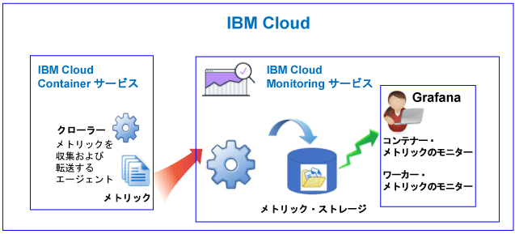
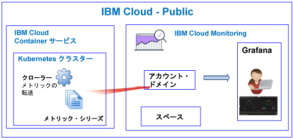
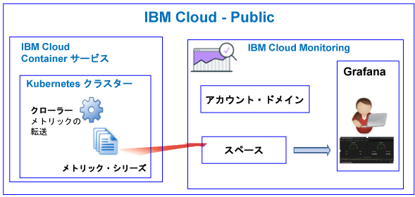
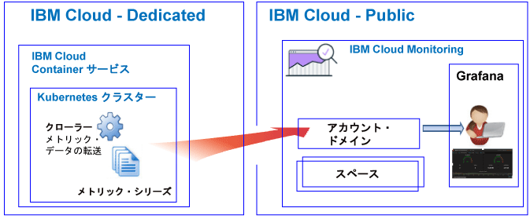

---

copyright:
  years: 2017, 2018

lastupdated: "2018-02-07"

---

{:new_window: target="_blank"}
{:shortdesc: .shortdesc}
{:screen: .screen}
{:pre: .pre}
{:table: .aria-labeledby="caption"}
{:codeblock: .codeblock}
{:tip: .tip}
{:download: .download}

# {{site.data.keyword.containershort_notm}}
{: #monitoring_bmx_containers_ov}

{{site.data.keyword.Bluemix}} では、クラスター・メトリックは自動的に収集されます。Grafana を使用して、クラスターのパフォーマンスをモニターできます
{:shortdesc}

**注:** 標準クラスターで実行中のコンテナーに関して、メトリックが収集され、{{site.data.keyword.monitoringshort}} サービスでのモニターに使用できます。標準クラスターでサポートされるフィーチャーについて詳しくは、[クラスターおよびアプリの計画](/docs/containers/cs_planning.html#cs_planning_cluster_type)を参照してください。

## Public でのモニタリングについて
{: #public}

{{site.data.keyword.Bluemix_notm}} では、Public の {{site.data.keyword.containershort}} によって自動的に収集されるコンテナー・メトリックと Kubernetes クラスター・メトリックを、{{site.data.keyword.monitoringshort}} サービスを使用して保管および分析することができます。

1 つのアカウント内に 1 つ以上の Kubernetes クラスターを持つことができます。 クラスターがプロビジョンされるとすぐに、{{site.data.keyword.containershort}} によってメトリックが自動的に収集されます。コンテナー・メトリックは、ポッドがデプロイされるとすぐに収集されます。メトリックは、以下のように {{site.data.keyword.monitoringshort}} サービスに自動的に転送されます。

* クラスターをアカウント・リソースとして作成すると、メトリックは {{site.data.keyword.monitoringshort}} サービス内のアカウント・ドメインに転送されます。メトリックがアカウント・ドメインに転送されるためには、{{site.data.keyword.monitoringshort}} サービス・キーの所有者が、{{site.data.keyword.monitoringshort}} サービスを処理するための**管理者**権限がある IAM ポリシーを持っている必要があります。
* Cloud Foundry スペースが関連付けられたクラスターを作成すると、メトリックは {{site.data.keyword.monitoringshort}} サービス内のスペース・ドメインに転送されます。メトリックがスペース・ドメインに転送されるためには、{{site.data.keyword.monitoringshort}} サービス・キーの所有者が、組織の**管理者**の役割とスペースの**開発者**の役割を持っている必要があります。

以下の図は、{{site.data.keyword.containershort}} のモニタリングの概要図を示しています。

クローラーは、ホストで稼働しているプロセスであり、メトリックのエージェントレス・モニタリングを実行します。 クローラー
は、デフォルトで、すべてのコンテナーから CPU のメトリックおよびメモリーのメトリックを常に収集します。

クラスターのメトリックを Grafana で分析するには、以下の情報を考慮してください。

* メトリックを表示するために使用している {{site.data.keyword.monitoringshort}} インスタンスがプロビジョンされている Public 地域で Grafana を起動する必要があります。 
* デフォルトの Grafana ダッシュボード **ClusterMonitoringDashboard_v1** を使用してクラスターをモニターできます。
* また、カスタム Grafana ダッシュボードを構成して、クラスターが作成されている Cloud Public 地域でクラスターのメトリック・データを視覚化することもできます。
* ユーザー ID はメトリックの表示権限を持っている必要があります。 

    アカウント・ドメイン内のメトリックを表示するには、ユーザーは {{site.data.keyword.monitoringshort}} サービスの IAM ポリシーを持っている必要があります。ユーザーには**ビューアー**権限が必要です。 
    
    スペース・ドメイン内のメトリックを表示するには、ユーザーは CF の役割を持っている必要があります。詳しくは、[メトリックを表示するユーザーに必要な役割](/docs/services/cloud-monitoring/security_ov.html#bmx_roles)を参照してください。

### メトリックをアカウント・ドメインに転送するクラスターのモニタリングの概略
{: #acc}

以下の図は、クラスターがメトリックをアカウント・ドメインに転送する際の {{site.data.keyword.containershort}} の Public でのモニタリングの概略を示しています。

### メトリックをスペース・ドメインに転送するクラスターのモニタリングの概略
{: #space}

以下の図は、クラスターがメトリックをスペース・ドメインに転送する際の {{site.data.keyword.containershort}} の Public でのモニタリングの概略を示しています。

メトリックをスペースに転送するクラスターは、Cloud Foundry の組織およびスペースのコンテキスト内のコマンド・ラインから作成する必要があります。クラスターを作成する前に、`bx target` コマンドを実行して、CF の組織およびスペースのコンテキストを設定します。

## Dedicated でのモニタリングについて
{: #dedicated}

{{site.data.keyword.Bluemix_notm}} では、Public の {{site.data.keyword.monitoringshort}} サービスを使用して、Dedicated で {{site.data.keyword.containershort}} によって自動的に収集されるコンテナー・メトリックと Kubernetes クラスター・メトリックを保管および分析することができます。

1 つのアカウント内に 1 つ以上の Kubernetes クラスターを持つことができます。 クラスターがプロビジョンされるとすぐに、{{site.data.keyword.containershort}} によってメトリックが自動的に収集されます。コンテナー・メトリックは、ポッドがデプロイされるとすぐに収集されます。メトリックは、{{site.data.keyword.monitoringshort}} サービスのアカウント・ドメインに自動的に転送されます。

**注:** メトリックがアカウント・ドメインに転送されるためには、{{site.data.keyword.monitoringshort}} サービス・キーの所有者が、{{site.data.keyword.monitoringshort}} サービスを処理するための**管理者**権限がある IAM ポリシーを持っている必要があります。

Grafana でクラスターのメトリックを表示および分析するには、以下の情報を考慮してください。

* Grafana は、クラスターが Dedicated 上で使用可能な Cloud Public 地域で起動する必要があります。例えば、クラスターが、米国南部の Dedicated 上にプロビジョンされている場合は、米国南部地域の Public 上で Grafana を起動する必要があります。
* デフォルトの Grafana ダッシュボード **ClusterMonitoringDashboard_v1** を使用してクラスターをモニターできます。
* また、カスタム Grafana ダッシュボードを構成して、クラスターが作成されている Cloud Public 地域でクラスターのメトリック・データを視覚化することもできます。
* ユーザー ID は、{{site.data.keyword.monitoringshort}} サービスを処理するために IAM ポリシーを持っている必要があります。アカウント・ドメイン内でメトリックを表示するためには、**ビューアー**権限が必要です。  

以下の図は、Dedicated での {{site.data.keyword.containershort}} のモニタリングの概略を示しています。

## コンテナー用の CPU メトリック
{: #cpu_metrics_containers}

以下の表に、コンテナーに関して自動的に収集される CPU メトリックをリストします。

<table>
  <caption>表 1. コンテナー用の CPU メトリック</caption>
  <tr>
    <th>メトリック名</th>
    <th>説明</th>
  </tr>
  <tr>
    <td>*cpu.num-cores*</td>
    <td>このメトリックは、コンテナーに使用可能な CPU コアの数を報告します。   デフォルトで、
このメトリックはワーカー上のコアの数を報告します。 コンテナーで使用可能なコアの数に制限を設定すると、このメトリックはその制限に設定したコアの数を報告します。</td>
  </tr>
  <tr>
    <td>*cpu.usage*</td>
    <td>このメトリックは、すべてのコアでの CPU 時間 (ナノ秒) を報告します。   CPU 使用量が大きい場合、遅延が生じることがあります。 CPU 使用量が大きいということは、処理能力が不十分であることを示します。</td>
  </tr>
  <tr>
    <td>*cpu.usage-pct*</td>
    <td>このメトリックは、使用 CPU 時間を、CPU の能力のパーセンテージで報告します。   デフォルトで、CPU の能力はワーカー上のコアの数によって決定されます。 コンテナーの CPU の能力に制限を設定すると、このメトリックは、設定した制限のパーセンテージとして CPU 使用量を報告します。 CPU 使用量のパーセンテージが大きい場合、遅延が生じることがあります。 CPU 使用量が大きいということは、処理能力が不十分であることを示します。</td>
  </tr>
  <tr>
    <td>*cpu.usage-pct-container-requested*</td>
    <td>このメトリックは、使用 CPU 時間を、コンテナーが要求する CPU に占めるパーセンテージで報告します。   要求された CPU をコンテナーに設定しないと、このメトリックはそのコンテナーに対して公開されません。</td>
  </tr>
</table>

## ワーカーのロード・メトリック
{: #load_metrics_workers}

以下の表に、ワーカーに関して自動的に収集される CPU メトリックをリストします。

<table>
  <caption>表 2. ワーカーのロード・メトリック</caption>
  <tr>
    <th>メトリック名</th>
    <th>説明</th>
  </tr>
  <tr>
    <td>*load.avg-1*</td>
    <td>このメトリックは、Kubernetes ホストの過去 1 分間の平均 CPU 負荷を報告します。   ワーカー上のコアの数よりも平均 CPU 負荷が大きい場合は、ホストへのトラフィックにキューイングが発生していることを示します。</td>
  </tr>
  <tr>
    <td>*load.avg-5*</td>
    <td>このメトリックは、Kubernetes ホストの過去 5 分間の平均 CPU 負荷を報告します。   ワーカー上のコアの数よりも平均 CPU 負荷が大きい場合は、ホストへのトラフィックにキューイングが発生していることを示します。</td>
  </tr>
  <tr>
    <td>*load.avg-15*</td>
    <td>このメトリックは、Kubernetes ホストの過去 15 分間の平均 CPU 負荷を報告します。   ワーカー上のコアの数よりも平均 CPU 負荷が大きい場合は、ホストへのトラフィックにキューイングが発生していることを示します。</td>
  </tr>
</table>

## コンテナー用のメモリーのメトリック
{: #memory_metrics}

以下の表に、自動的に収集されるメモリー・メトリックをリストします。

<table>
  <caption>表 3. コンテナー用のメモリーのメトリック</caption>
  <tr>
    <th>メトリック名</th>
    <th>説明</th>
  </tr>
  <tr>
    <td>*memory.current*</td>
    <td>このメトリックは、コンテナーが現在使用しているメモリーのバイト数を報告します。 </td>
  </tr>
  <tr>
    <td>*memory.limit*</td>
    <td>このメトリックは、ポッドに設定されている最大限度および最小限度と比較して、コンテナーがディスクに対してスワップを許可されているメモリー量を報告します。    デフォルトでは、ポッドはメモリー限度なしで実行されます。 ポッドは、そのポッドが実行されているワーカー上と同じ量のメモリーを消費できます。 ポッドをデプロイするときに、ポッドが使用できるメモリー量の限度を設定できます。 </td>
  </tr>
  <tr>
    <td>*memory.usage-pct*</td>
    <td>このメトリックは、使用メモリーを、コンテナーのメモリー制限に占めるパーセンテージとして報告します。    コンテナーが使用できるメモリー容量に制限を設定すると、このメトリック
は、設定した制限のパーセンテージとしてメモリーの使用量を報告します。 </td>
  </tr>
</table>

## Kubernetes クラスター内のリソースをモニターするための照会の定義
{: #monitoring_metrics_kube}

{{site.data.keyword.Bluemix_notm}} 内の Kubernetes クラスターにデプロイされるコンテナーおよびワーカーのパフォーマンスをモニターするには、Grafana を使用します。 

{{site.data.keyword.monitoringlong}} サービスは、Grafana を使用します。Grafana は、さまざまなグラフ (例えば、チャートや表) でメトリックをモニター、検索、分析、および視覚化するために使用できる、分析および視覚化のためのオープン・ソース・プラットフォームです。

Grafana は、ブラウザーから起動できます。 詳しくは、[Web ブラウザーから Grafana ダッシュボードへのナビゲート](/docs/services/cloud-monitoring/grafana/navigating_grafana.html#launch_grafana_from_browser)を参照してください。

Kubernetes クラスターで実行されているコンテナーおよびワーカーをモニターするには、以下のように各リソースの照会を Grafana に定義する必要があります。

* コンテナーの CPU メトリックをモニターする照会を定義するには、[Grafana でのコンテナーの CPU メトリックの構成](/docs/services/cloud-monitoring/containers/config_cpu_worker.html#config_cpu_worker)を参照してください。
* コンテナーのメモリー・メトリックをモニターする照会を定義するには、[Grafana でのコンテナーのメモリー・メトリックの構成](/docs/services/cloud-monitoring/containers/config_mem_container.html#config_mem_container)を参照してください。
* ワーカーのロード・メトリックをモニターする照会を定義するには、[Grafana でのワーカーのロード・メトリックの構成](/docs/services/cloud-monitoring/containers/config_load_worker.html#config_load_worker)を参照してください。

照会のフォーマットは、リソース・タイプおよび照会のタイプごとに異なります。

* コンテナーの CPU をモニターする照会のフォーマットについて詳しくは、[コンテナーの CPU メトリック照会のフォーマット](/docs/services/cloud-monitoring/reference/metrics_format_containers.html#cpu_containers)を参照してください。 
* ワーカーのロードをモニターする照会のフォーマットについて詳しくは、[ワーカーのロード・メトリック照会のフォーマット](/docs/services/cloud-monitoring/reference/metrics_format_containers.html#load_workers)を参照してください。
* コンテナーのメモリーをモニターする照会のフォーマットについて詳しくは、[コンテナーのメモリー・メトリック照会のフォーマット](/docs/services/cloud-monitoring/reference/metrics_format_containers.html#mem_containers)を参照してください。

## {{site.data.keyword.Bluemix_notm}} のカスタム・ファイアウォール構成に対するネットワーク・トラフィックの構成
{: #ports}

セットアップされた追加ファイアウォールがある場合や、{{site.data.keyword.Bluemix_notm}} インフラストラクチャー (SoftLayer) でファイアウォール設定をカスタマイズした場合は、ワーカー・ノードから {{site.data.keyword.monitoringshort}} サービスへの発信ネットワーク・トラフィックを許可する必要があります。 

カスタマイズしたファイアウォール内の次の IP アドレスに対して、各ワーカーから {{site.data.keyword.monitoringshort}} サービスへ TCP ポート 443 および TCP ポート 9091 を開く必要があります。

<table>
  <tr>
    <th>地域</th>
    <th>取り込み URL</th>
	<th>パブリック IP アドレス</th>
  </tr>
  <tr>
    <td>ドイツ</td>
	<td>ingest-eu-fra.logging.bluemix.net</td>
	<td>158.177.88.43  159.122.87.107</td>
  </tr>
  <tr>
    <td>英国</td>
	<td>ingest.logging.eu-gb.bluemix.net</td>
	<td>169.50.115.113</td>
  </tr>
  <tr>
    <td>米国南部</td>
	<td>ingest.logging.ng.bluemix.net</td>
	<td>169.48.79.236  169.46.186.113</td>
  </tr>
  <tr>
    <td>シドニー</td>
	<td>ingest-au-syd.logging.bluemix.net</td>
	<td>130.198.76.125  168.1.209.20</td>
  </tr>
</table>
