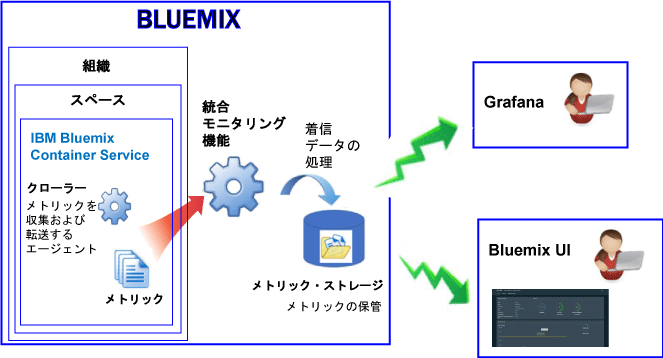

---

copyright:
  years: 2017, 2018

lastupdated: "2018-02-02"

---

{:new_window: target="_blank"}
{:shortdesc: .shortdesc}
{:screen: .screen}
{:pre: .pre}
{:table: .aria-labeledby="caption"}
{:codeblock: .codeblock}
{:tip: .tip}
{:download: .download}

# IBM Cloud で管理されているコンテナー (非推奨)
{: #monitoring_managed_containers_ov}

{{site.data.keyword.Bluemix}} では、コンテナーおよびワーカーのメトリックがコンテナー外部から自動的に収集されるので、コンテナー内部にエージェントをインストールして保守する必要がありません。Grafana を使用して、コンテナーのメトリックを視覚化できます。 
{:shortdesc}

**注:** 標準クラスターで実行中のコンテナーに関して、メトリックが収集され、{{site.data.keyword.monitoringshort}} サービスでのモニターに使用できます。標準クラスターでサポートされるフィーチャーについて詳しくは、[クラスターおよびアプリの計画](/docs/containers/cs_planning.html#cs_planning_cluster_type)を参照してください。

## デフォルト・メトリックの収集
{: #metrics_containers_bmx_ov}

以下の図は、{{site.data.keyword.containershort}} のモニタリングの概要図を示しています。

クローラーは、デフォルトで、すべてのコンテナーから以下のメトリックを常に収集します。

* CPU
* メモリー
* ネットワーク情報

## IBM Cloud で管理されているコンテナーのメトリックのモニター (非推奨)
{: #monitoring_metrics_bmx}

メトリックは収集され、以下のように {{site.data.keyword.Bluemix_notm}} UI および Grafana の両方で表示されます。

* 分析および視覚化のためのオープン・ソース・プラットフォームである Grafana を使用して、メトリックのモニター、検索、分析、および視覚化を、さまざまなグラフ (図表や表など) を用いて行います。

    Grafana は、{{site.data.keyword.Bluemix_notm}} UI またはブラウザーから起動できます。 詳しくは、[Grafana ダッシュボードへのナビゲート](/docs/services/cloud-monitoring/grafana/navigating_grafana.html#navigating_grafana)を参照してください。

* {{site.data.keyword.Bluemix_notm}} UI を使用して、最新メトリックを表示します。

    {{site.data.keyword.Bluemix_notm}} UI でメトリックを表示するには、[{{site.data.keyword.Bluemix_notm}} コンソールからのメトリックの分析](/docs/services/cloud-monitoring/containers/analyzing_metrics_bmx_ui.html#analyzing_metrics_bmx_ui)を参照してください。
