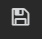

---

copyright:
  years: 2017
lastupdated: "2017-06-26"

---

{:new_window: target="_blank"}
{:shortdesc: .shortdesc}
{:screen: .screen}
{:codeblock: .codeblock}
{:pre: .pre}

# Bluemix の IBM Cloud Monitoring 入門
{: #getting-started-with-ibm-cloud-monitoring}

この入門チュートリアルでは、{{site.data.keyword.monitoringlong}} サービスを使用したコンテナーの分析手順をご案内します。Kubernetes クラスターにデプロイされたアプリのコンテナー・メトリックの検索および分析方法について説明します。
{:shortdesc}

## 始めに
{: #prereqs}

[Bluemix アカウント](https://console.bluemix.net/registration/)を作成します。ご使用のユーザー ID は、Kubernetes クラスターを作成し、クラスターにアプリケーションをデプロイし、Kibana での高度な分析のために Bluemix 内のログを照会する権限を持つ、Bluemix アカウントのメンバーまたは所有者でなければなりません。

コマンド・ラインから Kubernetes クラスターの管理およびアプリのデプロイを実行できる端末セッションをオープンします。このチュートリアルの例では Ubuntu Linux システムを使用しています。

IBM Bluemix Container サービスをコマンド・ラインから管理するために、ローカル環境に [CLI プラグインをインストール](/docs/containers/cs_cli_install.html#cs_cli_install_steps)します。 


## 手順 1: コンテナーへのアプリのデプロイ
{: #step1}

以下の手順を実行して、Kubernetes クラスターにコンテナーをデプロイします。

1. [Kubernetes クラスターを作成します](/docs/containers/cs_cluster.html#cs_cluster_ui)。

2. Linux 端末に[クラスター・コンテキストをセットアップ](/docs/containers/cs_cli_install.html#cs_cli_configure)します。コンテキストを設定すると、Kubernetes クラスターを管理し、Kubernetes クラスターにアプリケーションをデプロイできるようになります。

3. Kubernetes クラスターにサンプル・アプリをデプロイし、実行します。[演習 1 の手順を実行](/docs/containers/cs_tutorials.html#cs_apps_tutorial)します。

    このアプリは、以下のような Hello World Node.js アプリです。

    ```
    var express = require('express')
    var app = express()

    app.get('/', function(req, res) {
      res.send('Hello world! Your app is up and running in a cluster!\n')
    })
    app.listen(8080, function() {
      console.log('Sample app is listening on port 8080.')
    })
    ```

    アプリがデプロイされると、メトリック収集が自動的に有効になります。


## 手順 2: Grafana ダッシュボードへのナビゲート
{: #step2}

ブラウザーから Grafana を起動します。 

クラスターのメトリックを分析するには、そのクラスターが作成されているクラウド Public 地域で Grafana にアクセスする必要があります。 
    
次に、ブラウザーから `https://metrics.ng.bluemix.net/` という URL を起動して Grafana を開きます。
    
    
## 手順 3: Grafana でのメトリックの分析
{: #step3}

以下の手順を実行して、Grafana ダッシュボードを作成します。
    
1. 新規ダッシュボードを作成します。

    * サイド・メニュー・バーのトグル を選択します。 
    * **「Dashboards」**を選択します。 
    * **「New」**をクリックします
    
    ダッシュボードが開きます。ダッシュボードには、すぐに構成できる空の行が含まれています。 
    
    
    
     Grafana で、ダッシュボードを複数のセクションに分割するための行を追加します。行は、1 つ以上のパネルをグループ化します。1 行の中では、パネルが最小の視覚化単位であり、メトリックのデータを表示するために構成 (例えば、グラフ・パネルや表パネルを選択できる) できます。パネルをドラッグ・アンド・ドロップして、ダッシュボード内でパネルを再配置することができます。パネルが表示するデータは、照会を介して構成されます。1 つのパネルに 1 つ以上の照会を定義できます。各照会は、異なるデータ・セットを表しています。その他に、パネルの時刻範囲を設定することもできます。通常、この時刻範囲は、*ダッシュボード*のタイム・ピッカーによって設定されます。
    
2. コンテナーの全コアにわたって CPU 時間のナノ秒をモニターするために、*「Graph」*パネルを追加します。
    
    1. **「Graph」**をクリックします。
    
    2. グラフのタイトルをクリックし、次に**「edit」**を選択します。
    
        *「Metrics」*タブが開きます。デフォルト・データ・ソースが表示されています。
    
        
    
3. グラフに表示されるデータをフィルターに掛ける照会を定義します。 

    以下の表に、コンテナー・メトリックのデータをフィルターに掛ける照会を構成するために必要なさまざまなフィールドの概要を示します。

    <table>
      <caption>表 1. コンテナー用の Grafana 照会フィールド</caption>
      <tr>
        <th align="center">フィールド</th>
        <th align="center">説明</th>
        <th align="center">有効値</th>
      </tr>
      <tr>
        <td>Prefix</td>
        <td>コンテナー・メトリックの接頭部。<br><br>この接頭部は、Kubernetes クラスターにデプロイされるコンテナー用に収集されるデータに適用されます。</td>
        <td>`crn`</td>
      </tr>
      <tr>
        <td>Version</td>
        <td>収集されるメトリック・データのバージョン。</td>
        <td>`v1`</td>
      </tr>
      <tr>
        <td>Provider</td>
        <td>データの収集が行われるクラウド・プロバイダー。</td>
        <td>`bluemix`</td>
      </tr>
      <tr>
        <td>Type</td>
        <td>データの収集が行われるクラウド環境。</td>
        <td>`public`</td>
      </tr>
      <tr>
        <td>Source</td>
        <td>メトリックの収集が行われるクラウド・インフラストラクチャー。</td>
        <td>`containers-kubernetes`</td>
      </tr>
      <tr>
        <td>Region</td>
        <td>メトリックの収集が行われるクラウド地域。</td>
        <td>* `ng` <br>* `eu-gb` <br>* `eu-de` </td>
      </tr>
      <tr>
        <td>Account</td>
        <td>メトリックの収集が行われるアカウントの GUID。<br>このフィールドのフォーマットは、`a_*ID*` です。ここで、ID はアカウントの GUID です。</td>
        <td></td>
      </tr>
      <tr>
        <td>Cluster</td>
        <td>メトリックの収集が行われるクラスターの GUID。</td>
        <td></td>
      </tr>
      <tr>
        <td>Container metric</td>
        <td>コンテナー用に収集されるメトリック。</td>
        <td>* `memory_current` <br>* `memory_limit` <br>* `cpu_usage` <br>* `cpu_usage_pct` <br>* `cpu_num_cores`</td>
      </tr>
      <tr>
        <td>Container in a pod</td>
        <td>ポッド内で実行されているコンテナーを一意的に識別するために必要な、Kubernetes リソース名と GUID の組み合わせ。<br> このフィールドのフォーマットは次のとおりです: *{namespace}_#{pod_name}_#{container_name}_#{container_id}* <br><br>**注:** 照会内でこの項目に使用可能なオプションのリストを表示する際、次のフォーマットの項目もあることに注意してください: *{namespace}_#{pod_name}_#{container_name}_POD_#{container_id}*。この項目は、Kubernetes によって作成される内部コンテナー ID に対応しています。</td>
        <td></td>
      </tr>
      <tr>
        <td>Functions</td>
        <td>パネル内でコンテナー・メトリックを視覚化するために選択できる照会関数。<br>詳しくは、[Functions ](http://graphite.readthedocs.io/en/latest/functions.html "外部リンク・アイコン"){: new_window} を参照してください。</td>
        <td></td>
      </tr>
    </table>
    
    以下のイメージは、構成完了時に照会が Grafana でどのように表示されるかを示しています。
    
    
    
    以下の手順を実行して照会を定義します。
    
    *「Metrics」*タブで、**「Add query」**を選択します。<br>照会項目が追加されます。各照会には、1 文字のラベルが付いています。
    
    
        
    1. **「Select metric」**をクリックし、次に `crn` を選択します。
    
    2. **「Select metric」**をクリックし、次に `v1` を選択します。
    
    3. **「Select metric」**をクリックし、次に `bluemix` を選択します。
    
    4. **「Select metric」**をクリックし、次に `public` を選択します。
    
    5. **「Select metric」**をクリックし、次に `containers-kubernetes` を選択します。
    
    6. **「Select metric」**をクリックし、次に、作業している地域 (例えば、`us-south`) を選択します。
    
    7. **「Select metric」**をクリックし、次に、データを表示するアカウント ID (例えば、`a_91d1d1exxxxxxx4df920bbd06461b066`) を選択します。
    
    8. **「Select metric」**をクリックし、次にクラスター ID を選択します。
    
    9. **「Select metric」**をクリックし、次にコンテナー・メトリックを選択します。コンテナーの *CPU 使用量*をモニターするには、`container-metric-cpu_usage` を選択します。
    
    10. **「Select metric」**をクリックし、次に、CPU 使用量をモニターするコンテナーに対応する ID (例えば、`default_hello-world-deployment-3355293961-0fwkg_hello-world-deployment_ad5eb446a493db31f1d9eb158f5de915fc063d6c136823488b694e63bb00aa57`) を選択します。
    
    11. 正符号イメージ  をクリックし、関数を選択します。関数を追加すると、メトリックに使用可能なデータを変換したり、結合したり、それらのデータに対して計算を実行したりすることができます。
        
        例えば、**alias(newName)** 関数を追加して、メトリックの別名を追加することができます。この別名は、グラフに表示される凡例にメトリック名の代わりにストリングを表示するために使用されます。
        
        メトリックの別名を追加するには、以下の手順を実行します。
        
        1. 正符号をクリックします。
        2. **「Special」**を選択します。3. **「alias」**を選択します。
        4. ストリング (例えば、`My sample metric`) を入力します。
        
4. 後で再利用するためにダッシュボードを保存します。 

    1. ダッシュボードの保存イメージ  をクリックします。. 
    
        
    
    2. ダッシュボードの名前を入力します。
    3. **「保存」**をクリックします。


## 次の手順
{: #next_steps}

メトリックのアラートを定義します。詳しくは、[アラートの構成](/docs/services/cloud-monitoring/config_alerts_ov.html#config_alerts_ov)を参照してください。


