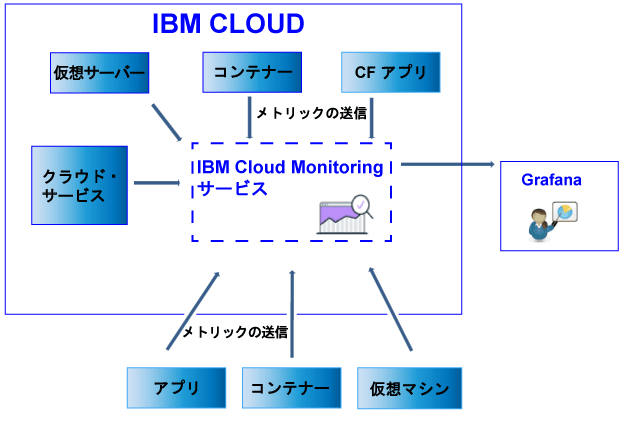

---

copyright:
  years: 2017

lastupdated: "2017-07-10"

---

{:shortdesc: .shortdesc}
{:new_window: target="_blank"}
{:codeblock: .codeblock}
{:screen: .screen}
{:pre: .pre}

# データの送信および取得
{: #send_retrieve_metrics_ov}

Metrics API を使用して、{{site.data.keyword.Bluemix}} スペースから {{site.data.keyword.monitoringshort}} サービスへメトリックを送信したり、メトリックを取得したりすることができます。
{:shortdesc}

以下の図は、{{site.data.keyword.monitoringshort}} サービスにメトリックを送信できるさまざまなリソースの概要図を示しています。

## メトリックの送信
{: #send}

{{site.data.keyword.Bluemix_notm}} Docker コンテナーの場合、基本のシステム・メトリックは自動的に収集されます。Cloud Foundry アプリケーション、および仮想計算機 (VM) で実行されているアプリの場合、メトリックは、Metrics API を使用してアプリから直接送信する必要があります。 

{{site.data.keyword.monitoringshort}} サービスにメトリックを送信するには、以下の情報を考慮してください。 

* データの取得元の {{site.data.keyword.Bluemix_notm}} スペースを設定する必要があります。

* {{site.data.keyword.monitoringshort}} サービスで作業するためのセキュリティー・トークンまたは API キーを入力する必要があります。 

* API エンドポイント `https://metrics.ng.bluemix.net/v1/metrics` を使用できます。API について詳しくは、[Metrics API](https://console.bluemix.net/apidocs/927-ibm-cloud-monitoring-rest-api?&language=node#introduction){: new_window} を参照してください。

選択した認証モデルに応じて、以下のオプションのいずれかを選択して、データを {{site.data.keyword.monitoringshort}} サービスに送信します。
 
* UAA トークンを使用してメトリックを送信するには、[UAA を使用したスペースへのメトリックの送信](/docs/services/cloud-monitoring/send-metrics/send_data_api.html#uaa)を参照してください。

* IAM トークンまたは API キーを使用してメトリックを送信するには、[IAM または API キーを使用したスペースへのメトリックの送信](/docs/services/cloud-monitoring/send-metrics/send_data_api.html#iam)を参照してください。

## メトリックの取得
{: #retrieve}

メトリックを取得するには、以下の情報を考慮してください。 

* データの取得元の {{site.data.keyword.Bluemix_notm}} スペースを設定する必要があります。

* {{site.data.keyword.monitoringshort}} サービスで作業するためのセキュリティー・トークンまたは API キーを入力する必要があります。 

* 1 つ以上のメトリックのパスを指定する必要があります。詳しくは、[メトリックの定義](/docs/services/cloud-monitoring/retrieve-metrics/retrieve_data_api.html#metrics)を参照してください。

* オプションで、カスタム期間を指定できます。デフォルトでは、期間を指定しない場合、取得するデータは直近の 24 時間に対応するデータです。詳しくは、[期間の構成](/docs/services/cloud-monitoring/retrieve-metrics/retrieve_data_api.html#time)を参照してください。

* API エンドポイント `https://metrics.ng.bluemix.net/v1/metrics` を使用できます。API について詳しくは、[Metrics API](https://console.bluemix.net/apidocs/927-ibm-cloud-monitoring-rest-api?&language=node#introduction){: new_window} を参照してください。

**注:** 要求ごとに最大 5 個のターゲットを取得できます。

選択した認証モデルに応じて、以下のオプションのいずれかを選択して、データを {{site.data.keyword.monitoringshort}} サービスから取得します。
 
* UAA トークンを使用してメトリックを取得するには、[UAA を使用したスペースからのメトリックの取得](/docs/services/cloud-monitoring/retrieve-metrics/retrieve_data_api.html#uaa)を参照してください。

* IAM トークンまたは API キーを使用してメトリックを取得するには、[IAM または API キーを使用したスペースからのメトリックの取得](/docs/services/cloud-monitoring/retrieve-metrics/retrieve_data_api.html#iam)を参照してください。

## メトリックのリストの取得
{: #show_metrics}

スペース内で使用可能なメトリックをリストできます。

メトリックをリストするには、以下の情報を考慮してください。 

* 使用可能なメトリックをリストする対象の {{site.data.keyword.Bluemix_notm}} スペースを設定する必要があります。

* {{site.data.keyword.monitoringshort}} サービスで作業するためのセキュリティー・トークンまたは API キーを入力する必要があります。 

* メトリックをリストするパスを定義する照会を指定する必要があります。例えば、スペース内のすべてのメトリックをリストする場合、照会を `query=SpaceGUID.*` と設定できます。ここで *SpaceGUID* は、スペースの GUID です。

    デフォルトは、開始点をスペースのルート・レベルに指定する `*` です。

* API エンドポイント `https://metrics.ng.bluemix.net/v1/metrics/list` を使用できます。API について詳しくは、[Metrics API](https://console.bluemix.net/apidocs/927-ibm-cloud-monitoring-rest-api?&language=node#introduction){: new_window} を参照してください。

 
