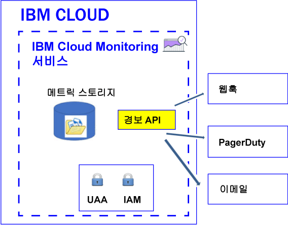

---

copyright:
  years: 2017

lastupdated: "2017-07-12"

---

{:shortdesc: .shortdesc}
{:new_window: target="_blank"}
{:codeblock: .codeblock}
{:screen: .screen}
{:pre: .pre}


# 경보 구성
{: #config_alerts_ov}

{{site.data.keyword.monitoringshort}} 서비스는 조회 기반 경보 시스템을 제공합니다. Alerts API를 사용하여 모니터할 각 메트릭 조회에 대해 규칙 및 알림 방법을 설정할 수 있습니다. 알림은 이메일을 발송하거나, 웹훅을 트리거하거나 PagerDuty에 경보를 전송하여 수행할 수 있습니다.
{:shortdesc}

메트릭에 대한 알림을 트리거하는 경보를 정의할 수 있습니다. 경보는 모니터되는 메트릭 조회, 임계값, 임계값을 초과하는 경우 취할 조치, 하나 이상의 알림 방법을 나타내는 규칙에 의해 정의됩니다.   

하나의 인스턴스 또는 여러 인스턴스에 대한 경보를 정의할 수 있습니다. 경보 규칙을 통해 모니터하는 조회가 와일드카드를 포함하는 경우 이 와일드카드는 여러 대상, 즉 여러 서비스 인스턴스 또는 애플리케이션 인스턴스를 식별합니다. {{site.data.keyword.monitoringshort}} 서비스는 5분마다 경보 규칙에 구성된 조회를 실행하고 각 인스턴스 또는 여러 인스턴스에 대해 리턴된 마지막 데이터 점을 확인합니다. {{site.data.keyword.monitoringshort}} 서비스는 각 인스턴스의 마지막 상태 업데이트를 계속해서 추적하며, 경보의 상태가 변경되면 새 경보를 생성합니다.  

다음 그림은 알림을 수신하기 위해 {{site.data.keyword.monitoringshort}} 서비스에 구성할 수 있는 다양한 알림 유형을 보여줍니다. 



## 경보 상태
{: #status}

규칙이 사용으로 설정된 경우 경보의 상태는 다음 중 하나일 수 있습니다. 

* *OK*: 규칙의 상태는 다음 경우에 *OK*로 설정됩니다. 
    
	* 규칙과 연관된 메트릭 조회에 대해 {{site.data.keyword.monitoringshort}} 서비스에 데이터가 있습니다. 사용자가 경고 임계값 및 오류 임계값을 설정했습니다. 데이터의 값이 임계값을 초과하지 않았습니다. 
	 
	* 규칙과 연관된 메트릭 조회에 대해 {{site.data.keyword.monitoringshort}} 서비스에 데이터가 없으며 규칙 특성 `allow_no_data`를 *true*로 설정했습니다.            
	 
* *WARNING*: 규칙과 연관된 메트릭 조회에 대해 {{site.data.keyword.monitoringshort}} 서비스에 데이터가 있으며 다음 조건을 만족하는 경우 규칙의 상태가 *WARNING*으로 설정됩니다. 사용자가 경고 임계값 및 오류 임계값을 설정했습니다. 데이터의 값이 경고 임계값과 오류 임계값의 사이입니다. 
	
* *ERROR*: 규칙과 연관된 메트릭 조회에 대해 {{site.data.keyword.monitoringshort}} 서비스에 데이터가 있으며 다음 조건을 만족하는 경우 규칙의 상태가 *ERROR*로 설정됩니다. 사용자가 경고 임계값 및 오류 임계값을 설정했습니다. 데이터의 값이 오류 임계값에 도달했습니다.   

* *UNKNOWN*: 규칙과 연관된 메트릭 조회에 대해 {{site.data.keyword.monitoringshort}} 서비스에 데이터가 없는 경우 규칙의 상태가 *UNKNOWN*으로 설정됩니다. 규칙에 대해 구성하는 특성 `allow_no_data`에 따른 알림 수신 여부를 구성할 수 있습니다. 이 특성을 `false`로 설정하면 규칙에 대해 데이터를 찾지 못했다는 알림을 수신합니다. 


	
## 경보 히스토리
{: #history}

경보의 상태가 변경될 때마다 해당 경보의 히스토리 레코드가 업데이트됩니다. Alerts API(*/v1/alert/history*)를 사용하여 메트릭의 히스토리에 대한 정보를 검색할 수 있습니다. 

경보의 상태는 다음 시나리오의 상태를 정의하는 데 사용됩니다. 

* 규칙이 알림을 트리거하기 전의 조회 상태. 
* 규칙이 트리거된 후의 조회 상태.  

예를 들어, 경고 임계값이 초과된 경우에는 *OK*에서 *WARNING*으로의 상태 전이를 기록하는 히스토리 레코드가 생성됩니다. 마찬가지로, 값이 다시 임계값 미만으로 내려가면 *WARNING*에서 *OK*로의 상태 전이를 기록하는 히스토리 레코드가 생성됩니다. 


## 규칙
{: #rules}

규칙은 모니터되는 메트릭 조회, 임계값, 임계값을 초과하는 경우 취할 조치를 나타냅니다.  

* Alerts API를 사용하여 규칙을 작성하거나, 삭제하거나, 업데이트하거나, 규칙의 세부사항을 표시하거나, 모든 규칙을 나열할 수 있습니다. 자세한 정보는 [규칙에 대한 작업](/docs/services/cloud-monitoring/alerts/rules.html#rules)을 참조하십시오. 

* 경보 시스템은 영역에서 사용으로 설정된 규칙을 5분마다 확인합니다. 

* 기본적으로 규칙은 작성 시 사용으로 설정됩니다. 그러나 규칙을 정의하고 필드 *enable*을 `false`로 구성하여 이를 사용 안함으로 설정할 수 있습니다. 

* 규칙 매개변수 *comparison*이 below로 설정된 경우 error_level 값은 warning_level 값보다 낮아야 합니다. 규칙 매개변수 *comparison*이 above로 설정된 경우 error_level 값은 warning_level 값보다 높아야 합니다. 

* 기본적으로 규칙은 필드 *allow_no_data*가 `true`로 설정되어 작성됩니다. 데이터 점이 없는 경우, 알림은 규칙 조건이 트리거되지 않는 한 전송되지 않습니다. 규칙 X에 대해 데이터를 찾지 못했다는 알림을 수신하려면 필드 *allow_no_data*를 `false`로 설정해야 합니다.  

**팁:** 경보 규칙을 통해 모니터하는 조회를 Grafana에서 확인하십시오. 긴 기간을 구성하거나 와일드카드를 포함하는 조회의 사용 등으로 인해 이 조회가 제한시간을 초과하지 않는지 확인하십시오. 조회가 Grafana에서 제한시간을 초과하는 경우 해당 조회에 대해 구성된 경보가 트리거되지 않는다는 점을 참고하십시오. 

규칙을 정의하려면 다음 필드가 필요합니다. 

<table>
  <caption>표 1. 규칙을 정의하는 데 사용되는 필드의 목록</caption>
  <tr>
    <th>필드 이름</th>
	<th>설명</th>
  </tr>
  <tr>
    <td>name</td>
	<td>규칙의 이름입니다. 이 이름은 고유해야 합니다. </td>
  </tr>
  <tr>
    <td>description</td>
	<td>규칙의 요약입니다. </td>
  </tr>
  <tr>
    <td>expression</td>
	<td>모니터하고 임계값이 초과되는 경우 경보를 전송할 메트릭 조회입니다. <br>유효한 표현식은 단일 메트릭 이름, 와일드카드로 식별되는 복수 메트릭, 또는 하나 이상의 메트릭에 적용된 함수입니다. <br>**팁:** Grafana로부터 확인된 조회를 복사할 수 있습니다. </td>
  </tr>
  <tr>
    <td>enabled</td>
	<td>규칙의 상태를 나타냅니다. <br>규칙을 사용으로 설정하려면 `true`로 설정하십시오. <br>규칙을 사용 안함으로 설정하려면 `false`로 설정하십시오. <br>기본적으로 이는 `true`로 설정됩니다. </td>
  </tr>
  <tr>
    <td>from</td>
	<td>expression 필드에 정의한 조회에 대해 설정한 임계값을 기반으로 데이터를 분석하는 데 사용되는 초기 시점입니다. 예: `"from": "-5min"`</td>
  </tr>
  <tr>
    <td>until</td>
	<td>expression 필드에 정의한 조회에 대해 설정한 임계값을 기반으로 데이터를 분석하는 데 사용되는 종료 시점입니다. 예: `"until": "now"`</td>
  </tr>
  <tr>
    <td>comparison</td>
	<td>어떤 유형의 확인을 수행할지 식별하는 데 사용되는 비교 오퍼레이션입니다. 올바른 값은 *below* 및 *above*입니다. </td>
  </tr>
  <tr>
    <td>comparison_scope</td>
	<td>분석되는 데이터의 범위를 정의합니다. <br>계열(조회에서 사용 가능한 데이터)의 마지막 값을 살펴보려면 *last*로 설정하십시오.</td>
  </tr>
  <tr>
    <td>error_level</td>
	<td>오류 경보를 트리거하기 위해 설정하는 임계값을 정의합니다. <br>도달하는 경우 오류 경보가 생성되는 값을 설정하십시오. 예: `"error_level" : 27.94`</td>
  </tr>
  <tr>
    <td>warning_level</td>
	<td>경고 경보를 트리거하기 위해 설정하는 임계값을 정의합니다. <br>도달하는 경우 경고 경보가 생성되는 값을 설정하십시오. 예: `"warning_level" : 24`</td>
  </tr>
  <tr>
    <td>frequency</td>
	<td>확인 수행 빈도를 정의합니다. <br>이는 5min, 1h, 7d와 같이 분, 시간 또는 일로 측정됩니다. <br>예를 들어, 1분마다 확인하려는 경우에는 `"frequency": "1min"`을 설정할 수 있습니다. <br>**참고:** 현재 이 빈도는 5분으로 고정되어 있습니다. </td>
  </tr>
  <tr>
    <td>dashboard_url</td>
	<td>모니터되는 조회가 정의된 Grafana 대시보드에 대한 URL을 정의합니다. </td>
  </tr>
    <tr>
    <td>allow_no_data</td>
	<td>데이터 점이 없는 경우 알림을 전송하는 조건을 정의합니다. <br>기본적으로 이는 `true`로 설정됩니다. <br>규칙 X에 대해 데이터를 찾지 못했다는 알림을 수신하려면 `false`로 설정하십시오. </td>
  </tr>
  <tr>
    <td>notifications</td>
	<td>규칙에 대해 트리거할 조치를 정의하는 알림의 이름입니다. <br>**참고:** 알림 이름을 쉼표로 구분하여 나열함으로써 규칙당 하나 이상의 알림을 정의할 수 있습니다. </td>
  </tr>
</table>

예를 들면, 다음 항목은 규칙의 샘플입니다. 

```
{
  "name": "checkbytesin1",
  "description": "MH check Bytes In per second",
  "expression": "movingAverage(messagehub.65ad9211-1234-5678-a751-c82123411eee.1.kafka-java-console-sa
mple-topic.BytesInPerSec.15MinuteRate,\"5min\")",
  "enabled": true,
  "from": "-5min",
  "until": "now",
  "comparison": "below",
  "comparison_scope": "last",
   "error_level" : 22.94,
   "warning_level" : 25,
  "frequency": "1min",
  "dashboard_url": "https://metrics.ng.bluemix.net",
  "notifications": [
    "emailXXX"
  ]
}
```
{: screen}


## 알림
{: #notifications}

알림은 경보가 트리거된 경우 알리는 데 사용되는 방법 및 세부사항을 나타냅니다. 예를 들어, 메트릭에 대한 경고 알림 및 오류 알림을 받으려면 경고 임계값을 모니터하는 규칙 및 오류 임계값을 모니터하는 규칙을 정의하십시오.  

* 알림은 메트릭에 대한 경보의 상태가 "OK"에서 "ERROR"로, 또는 "ERROR"에서 "WARNING"으로 변경되는 경우와 같이 경보의 상태가 변경되는 경우에만 전송됩니다.  

    **참고:** 경보 규칙 상태가 *OK*, *WARNING*, *ERROR* 또는 *UNKNOWN*에서 변경되지 않는 경우 이는 다음 반복 시에 다시 트리거되지 않습니다. 

* 알림은 24시간 이벤트로 간주됩니다. 알림이 트리거될 수 있는 시간 간격을 지정할 수는 없습니다. 

* 알림 이름을 쉼표로 구분하여 나열함으로써 규칙당 하나 이상의 알림 방법을 구성할 수 있습니다.  

* [Alerts REST API](https://console.bluemix.net/apidocs/940-ibm-cloud-monitoring-alerts-api?&language=node#introduction){: new_window}를 사용하여 알림을 작성하거나, 삭제하거나, 업데이트하거나, 알림의 세부사항을 표시하거나, 영역에 정의된 알림을 나열하십시오. 


지원되는 알림 방법은 다음과 같습니다. 

<table>
 <caption>표 2. 알림 방법 목록</caption>
 <tr>
    <th>방법</th>
	<th>자세한 정보</th>
 </tr>
 <tr>
    <td>이메일</td>
	<td>[이메일 알림 구성](/docs/services/cloud-monitoring/alerts/configure_alerts.html#send_email)</td>
  </tr>
  <tr>
    <td>PagerDuty</td>
	<td>[PagerDuty 알림 구성](/docs/services/cloud-monitoring/alerts/configure_alerts.html#config_alert_pagerduty)</td>
  </tr>
  <tr>
    <td>웹훅</td>
	<td>[웹훅 알림 구성](/docs/services/cloud-monitoring/alerts/configure_alerts.html#config_webhook)</td>
  </tr>
</table>

**참고:** 여러 규칙에 대해 알림을 재사용할 수 있도록 규칙과 별개로 알림을 정의할 수 있습니다. 
	
## 알림 템플리트
{: #notification_template}
	
알림은 JSON 파일입니다.  

사용자는 개수에 제한 없이 알림 템플리트를 작성할 수 있으며, 그 후 조직에서 이를 재사용하여 해당 유형의 알림을 작성할 수 있습니다.  

다음 유형의 알림을 정의할 수 있습니다. 

* 이메일: 유효한 이메일 주소로 이메일을 발송하려면 유형이 *이메일*인 알림을 정의하십시오.  
* 웹훅: https 엔드포인트에 대해서만 유형이 *웹훅*인 알림을 정의하십시오. 다른 사람이 사용자의 엔드포인트를 호출하려 시도할 가능성을 줄이기 위해 엔드포인트에 매개변수를 추가하십시오. 
* PagerDuty: 사용자의 PagerDuty 인시던트 관리 시스템으로 메트릭에 대한 경보 데이터를 전송하려면 유형이 *PagerDuty*인 알림을 정의하십시오.  

예를 들면, 다음 표에는 알림 템플리트의 예가 나열되어 있습니다. 

<table>
  <caption>표 3. 알림 템플리트의 예</caption>
  <tr>
    <th>유형</th>
	<th>템플리트</th>
	<th>샘플</th>
  </tr>
  <tr>
    <td>이메일</td>
	<td>
	```
	{
	"name": "Template_Name",
	"type": "Email",
	"description" : "Description",
	"detail": "EmailAddress"
	}
	```
	{: screen}
	</td>
	<td>
	```
	{
	"name": "my-email",
	"type": "Email",
	"description" : "Send email notification when there is an infrastructure problem.",
	"detail": "xxx@yyy.com"
	}
	```
	{: screen}
	</td>
  </tr>
  <tr>
    <td>웹훅</td>
	<td>
	```
	{
	"name": "Template_Name",
	"type": "Webhook",
	"description" : "Description",
	"detail": "Endpoint"
	}
	```
	{: codeblock}
	</td>
	<td>
	```
	{
	"name": "my-webhook",
	"type": "Webhook",
	"description" : "Fire a webhook when there is an infrastructure problem..",
	"detail": "https://myendpoint.bluemix.net?key=abcd1234"
	}
	```
	{: screen}
	</td>
  </tr>
  <tr>
    <td>PagerDuty</td>
	<td>
	```
	"name": "Template_Name",
	"type": "PagerDuty",
	"description" : "Description",
	"detail": "Pagerduty_APIkey"
	}
	```
	{: codeblock}
	</td>
	<td>
	```
	{
	"name": "my-pagerduty",
	"type": "PagerDuty",
	"description" : "Fire a PagerDuty alert when there is an infrastructure problem..",
	"detail": "abcd1234"
	}
	```
	{: screen}
	</td>
  </tr>
</table>

여기서, 

* *Template_Name*은 알림 템플리트의 이름을 정의합니다. 
* *Description*은 이 유형의 알림을 사용하는 경우를 설명합니다. 
* *EmailAddress*는 알림 수신자의 이메일 주소를 정의합니다. 
* *Endpoint*는 POST를 수행해야 하는 URL을 정의합니다.  
* *Pagerduty_APIkey*는 고유 API 키를 정의합니다. 이 API 키는 PagerDuty 계정 관리자 또는 소유자에 의해 생성됩니다. 

자세한 정보는 [알림 템플리트 작성](/docs/services/cloud-monitoring/alerts/notifications.html#template)을 참조하십시오. 


