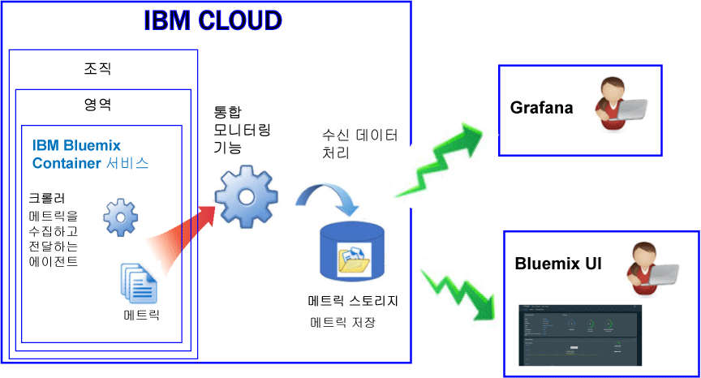

---

copyright:
  years: 2017, 2018

lastupdated: "2018-02-02"

---

{:new_window: target="_blank"}
{:shortdesc: .shortdesc}
{:screen: .screen}
{:pre: .pre}
{:table: .aria-labeledby="caption"}
{:codeblock: .codeblock}
{:tip: .tip}
{:download: .download}

# IBM Cloud에서 관리되는 컨테이너(더 이상 사용되지 않음)
{: #monitoring_managed_containers_ov}

{{site.data.keyword.Bluemix}}에서, 컨테이너 및 작업자 메트릭은 컨테이너 내에 에이전트를 설치하고 유지보수할 필요 없이 컨테이너 외부에서 자동으로 수집됩니다. Grafana를 사용하여 컨테이너 메트릭을 시각화할 수 있습니다. 
{:shortdesc}

**참고:** 메트릭은 표준 클러스터에서 실행 중인 컨테이너에 대한 {{site.data.keyword.monitoringshort}} 서비스를 통해 수집되고 모니터링에 사용될 수 있습니다. 표준 클러스터에서 지원하는 기능에 대한 자세한 정보는 [클러스터 및 앱 플랜](/docs/containers/cs_planning.html#cs_planning_cluster_type)을 참조하십시오.

## 기본 메트릭 수집
{: #metrics_containers_bmx_ov}

다음 그림은 {{site.data.keyword.containershort}} 모니터링에 대한 상위 레벨 보기를 보여줍니다.

기본적으로 크롤러는 모든 컨테이너로부터 다음 메트릭을 지속적으로 수집합니다.

* CPU
* 메모리
* 네트워크 정보

## IBM Cloud에서 관리되는 컨테이너에 대한 메트릭 모니터링(더 이상 사용되지 않음)
{: #monitoring_metrics_bmx}

메트릭은 수집되어 {{site.data.keyword.Bluemix_notm}} UI 및 Grafana 둘 다에 표시됩니다.

* 오픈 소스 분석 및 시각화 플랫폼인 Grafana를 사용하여 메트릭을 모니터하고, 검색하고, 분석하고, 다양한 그래프(예: 차트 및 표)로 시각화하십시오.

    Grafana는 {{site.data.keyword.Bluemix_notm}} UI 또는 브라우저에서 실행할 수 있습니다. 자세한 정보는 [Grafana 대시보드로 이동](/docs/services/cloud-monitoring/grafana/navigating_grafana.html#navigating_grafana)을 참조하십시오.

* {{site.data.keyword.Bluemix_notm}} UI를 사용하여 최신 메트릭을 보십시오.

    {{site.data.keyword.Bluemix_notm}} UI에서 메트릭을 보려면 [{{site.data.keyword.Bluemix_notm}} 콘솔에서 메트릭 분석](/docs/services/cloud-monitoring/containers/analyzing_metrics_bmx_ui.html#analyzing_metrics_bmx_ui)을 참조하십시오.
