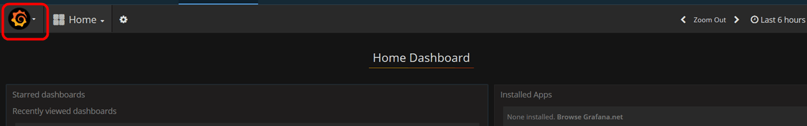
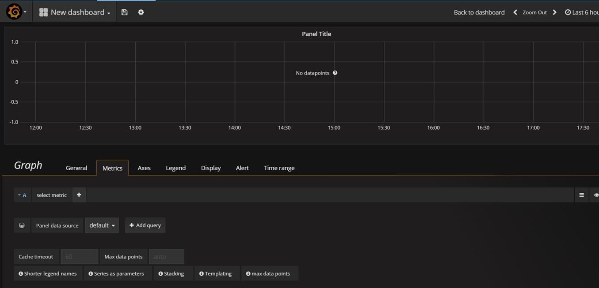
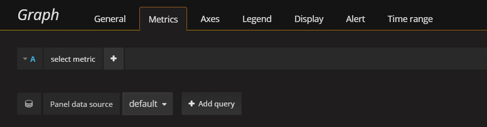

---

copyright:
  years: 2017
lastupdated: "2017-06-26"

---

{:new_window: target="_blank"}
{:shortdesc: .shortdesc}
{:screen: .screen}
{:codeblock: .codeblock}
{:pre: .pre}

# Bluemix에서 IBM Cloud Monitoring 시작하기
{: #getting-started-with-ibm-cloud-monitoring}

이 시작하기 튜토리얼에서는 {{site.data.keyword.monitoringlong}} 서비스를 사용하여 컨테이너를 분석하는 단계를 안내합니다. Kubernetes 클러스터에 배치된 앱에 대한 컨테이너 메트릭을 검색하고 분석하는 방법을 학습하십시오.
{:shortdesc}

## 시작하기 전에
{: #prereqs}

[Bluemix 계정](https://console.bluemix.net/registration/)을 작성하십시오. 사용자 ID는 Kubernetes 클러스터를 작성하고, 클러스터에 앱을 배치하고, Kibana에서의 고급 분석을 위해 Bluemix의 로그를 조회할 수 있는 권한이 있는 Bluemix 계정의 구성원 또는 소유자여야 합니다. 

Kubernetes 클러스터를 관리하고 명령행에서 앱을 배치할 수 있는 터미널 세션을 여십시오. 이 튜토리얼의 예는 Ubuntu Linux 시스템에 대한 예입니다. 

명령행에서 IBM Bluemix Container 서비스를 관리할 수 있도록 로컬 환경에 [CLI 플러그인](/docs/containers/cs_cli_install.html#cs_cli_install_steps)을 설치하십시오.  


## 1단계: 컨테이너에 앱 배치
{: #step1}

Kubernetes 클러스터에 컨테이너를 배치하려면 다음 단계를 완료하십시오. 

1. [Kubernetes 클러스터를 작성하십시오](/docs/containers/cs_cluster.html#cs_cluster_ui). 

2. Linux 터미널에서 [클러스터 컨텍스트를 설정하십시오](/docs/containers/cs_cli_install.html#cs_cli_configure). 컨텍스트가 설정된 후에는 Kubernetes 클러스터를 관리하고 Kubernetes 클러스터에 애플리케이션을 배치할 수 있습니다. 

3. Kubernetes 클러스터에 샘플 앱을 배치하고 실행하십시오. [학습 1의 단계를 완료하십시오](/docs/containers/cs_tutorials.html#cs_apps_tutorial). 

    이 앱은 Hello World Node.js 앱입니다. 

    ```
    var express = require('express')
    var app = express()

    app.get('/', function(req, res) {
      res.send('Hello world! Your app is up and running in a cluster!\n')
    })
    app.listen(8080, function() {
      console.log('Sample app is listening on port 8080.')
    })
    ```

    앱이 배치되면 메트릭 수집이 자동으로 사용으로 설정됩니다. 


## 2단계: Grafana 대시보드로 이동
{: #step2}

브라우저에서 Grafana를 실행하십시오.  

클러스터의 메트릭을 분석하려면 클러스터가 작성된 클라우드 퍼블릭 지역에서 Grafana에 액세스해야 합니다.  
    
그 후 브라우저에서 URL `https://metrics.ng.bluemix.net/`을 실행하여 Grafana를 여십시오. 
    
    
## 3단계: Grafana에서 메트릭 분석
{: #step3}

Grafana 대시보드를 작성하려면 다음 단계를 완료하십시오. 
    
1. 새 대시보드를 작성하십시오. 

    * 측면 메뉴 표시줄 토글 을 선택하십시오.  
    * **대시보드**를 선택하십시오.  
    * **새로 작성**을 클릭하십시오. 
    
    대시보드가 열립니다. 이 대시보드는 구성할 준비가 된 비어 있는 행을 포함하고 있습니다.  
    
    
    
     Grafana에서는 행을 추가하여 대시보드를 섹션으로 나눕니다. 하나의 행은 1개 이상의 패널을 그룹화합니다. 패널은 행 내에서 메트릭에 대한 데이터를 표시하기 위해 구성할 수 있는 가장 작은 시각화 단위로, 예를 들면 그래프 패널 또는 표 패널을 선택할 수 있습니다. 패널을 끌어서 놓아 대시보드에서 패널을 다시 배치할 수 있습니다. 패널이 표시하는 데이터는 조회를 통해 구성됩니다. 패널에는 하나 이상의 조회를 정의할 수 있습니다. 각 조회는 서로 다른 데이터 세트를 나타냅니다. 패널의 시간 범위를 설정할 수도 있습니다. 일반적으로 시간 범위는 *대시보드* 시간 선택도구로 설정됩니다. 
    
2. 컨테이너의 모든 코어의 CPU 시간(나노초(ns))을 모니터하는 *그래프* 패널을 추가하십시오. 
    
    1. **그래프**를 선택하십시오. 
    
    2. 그래프 제목을 클릭한 후 **편집**을 선택하십시오. 
    
        *메트릭* 탭이 열립니다. 여기서는 기본 데이터 소스를 볼 수 있습니다. 
    
        
    
3. 그래프에 표시되는 데이터를 필터링하는 조회를 정의하십시오.  

    다음 표에는 컨테이너 메트릭에 대한 데이터를 필터링하는 조회를 구성하는 데 필요한 다양한 필드가 간략하게 설명되어 있습니다. 

    <table>
      <caption>표 1. 컨테이너에 대한 Grafana 조회 필드</caption>
      <tr>
        <th align="center">필드</th>
        <th align="center">설명</th>
        <th align="center">올바른 값</th>
      </tr>
      <tr>
        <td>Prefix</td>
        <td>컨테이너 메트릭에 대한 접두부입니다. <br><br>이 접두부는 Kubernetes 클러스터에 배치된 컨테이너에 대해 수집되는 데이터에 적용됩니다. </td>
        <td>`crn`</td>
      </tr>
      <tr>
        <td>Version</td>
        <td>수집된 메트릭 데이터의 버전입니다. </td>
        <td>`v1`</td>
      </tr>
      <tr>
        <td>Provider</td>
        <td>데이터가 수집되는 클라우드 제공자입니다. </td>
        <td>`bluemix`</td>
      </tr>
      <tr>
        <td>Type</td>
        <td>데이터가 수집되는 클라우드 환경입니다. </td>
        <td>`public`</td>
</tr>
      <tr>
        <td>Source</td>
        <td>메트릭이 수집되는 클라우드 인프라입니다. </td>
        <td>`containers-kubernetes`</td>
      </tr>
      <tr>
        <td>Region</td>
        <td>메트릭이 수집되는 클라우드 지역입니다. </td>
        <td>* `ng` <br>* `eu-gb` <br>* `eu-de`</td>
      </tr>
      <tr>
        <td>Account</td>
        <td>메트릭이 수집되는 계정의 GUID입니다. <br>이 필드의 형식은 `a_*ID*`이며, 여기서 ID는 계정의 GUID입니다. </td>
        <td></td>
      </tr>
      <tr>
        <td>Cluster</td>
        <td>메트릭이 수집되는 클러스터의 GUID입니다. </td>
        <td></td>
      </tr>
      <tr>
        <td>Container metric</td>
        <td>컨테이너에 대해 수집되는 메트릭입니다. </td>
        <td>* `memory_current` <br>* `memory_limit` <br>* `cpu_usage` <br>* `cpu_usage_pct` <br>* `cpu_num_cores`</td>
      </tr>
      <tr>
        <td>Container in a pod</td>
        <td>포드에서 실행되는 컨테이너를 고유하게 식별하는 데 필요한, Kubernetes 리소스 이름과 GUID의 조합입니다. <br> 이 필드의 형식은 *{namespace}_#{pod_name}_#{container_name}_#{container_id}*입니다. <br><br>**참고:** 조회에서 이 항목에 대해 사용 가능한 옵션의 목록을 보면, *{namespace}_#{pod_name}_#{container_name}_POD_#{container_id}* 형식의 항목이 있는 것 또한 볼 수 있습니다. 이 항목은 Kubernetes에 의해 작성된 내부 컨테이너 ID에 해당합니다. </td>
        <td></td>
      </tr>
      <tr>
        <td>Functions</td>
        <td>패널에서 컨테이너 메트릭을 시각화하기 위해 선택할 수 있는 조회 함수입니다. <br>자세한 정보는 [함수](http://graphite.readthedocs.io/en/latest/functions.html){: new_window}를 참조하십시오. </td>
        <td></td>
      </tr>
    </table>
    
    다음 이미지는 조회가 구성되면 Grafana에서 어떻게 표시되는지 보여줍니다. 
    
    
    
    조회를 정의하려면 다음 단계를 완료하십시오. 
    
    *메트릭* 탭에서 **조회 추가**를 선택하십시오. <br>조회 항목이 추가됩니다. 각 조회는 하나의 문자로 레이블 지정됩니다. 
    
    
        
    1. **메트릭 선택**을 클릭한 후 `crn`을 선택하십시오. 
    
    2. **메트릭 선택**을 클릭한 후 `v1`을 선택하십시오. 
    
    3. **메트릭 선택**을 클릭한 후 `bluemix`를 선택하십시오. 
    
    4. **메트릭 선택**을 클릭한 후 `public`을 선택하십시오. 
    
    5. **메트릭 선택**을 클릭한 후 `containers-kubernetes`를 선택하십시오. 
    
    6. **메트릭 선택**을 클릭한 후 작업 중인 지역을 선택하십시오(예: `us-south`). 
    
    7. **메트릭 선택**을 클릭한 후 데이터를 표시할 계정 ID를 선택하십시오(예: `a_91d1d1exxxxxxx4df920bbd06461b066`). 
    
    8. **메트릭 선택**을 클릭한 후 클러스터 ID를 선택하십시오. 
    
    9. **메트릭 선택**을 클릭한 후 컨테이너 메트릭을 선택하십시오. 컨테이너의 *CPU 사용량*을 모니터하려면 `container-metric-cpu_usage`를 선택하십시오. 
    
    10. **메트릭 선택**을 클릭한 후 CPU 사용량을 모니터할 컨테이너에 해당하는 ID를 선택하십시오(예: `default_hello-world-deployment-3355293961-0fwkg_hello-world-deployment_ad5eb446a493db31f1d9eb158f5de915fc063d6c136823488b694e63bb00aa57`). 
    
    11. 더하기 이미지 을 클릭하고 함수를 선택하십시오. 함수를 추가하여 메트릭에 대해 사용 가능한 데이터를 변환하거나, 결합하거나, 이에 대한 계산을 수행할 수 있습니다. 
        
        예를 들면, **alias(newName)** 함수를 추가하여 메트릭에 대해 별명을 추가할 수 있습니다. 이 별명은 그래프에 표시되는 범례에 메트릭 이름 대신 문자열을 인쇄하는 데 사용됩니다. 
        
        메트릭에 대해 별명을 추가하려면 다음 단계를 완료하십시오. 
        
        1. 더하기 기호를 클릭하십시오. 
        2. **특수**를 선택하십시오.
        3. **별명**을 선택하십시오. 
        4. 문자열(예: `My sample metric`)을 입력하십시오. 
        
4. 나중에 재사용할 수 있도록 대시보드를 저장하십시오.  

    1. 대시보드 저장 이미지 를 클릭하십시오.  
    
        
    
    2. 대시보드의 이름을 입력하십시오. 
    3. **저장**을 클릭하십시오. 


## 다음 단계
{: #next_steps}

메트릭에 대한 경보를 정의하십시오. 자세한 정보는 [경보 구성](/docs/services/cloud-monitoring/config_alerts_ov.html#config_alerts_ov)을 참조하십시오. 


