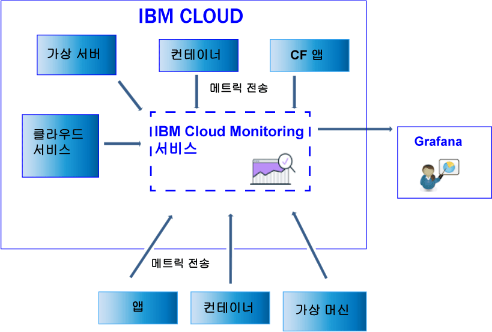

---

copyright:
  years: 2017

lastupdated: "2017-07-10"

---

{:shortdesc: .shortdesc}
{:new_window: target="_blank"}
{:codeblock: .codeblock}
{:screen: .screen}
{:pre: .pre}

# 데이터 전송 및 검색
{: #send_retrieve_metrics_ov}

Metrics API를 사용하여 {{site.data.keyword.Bluemix}} 영역에서 {{site.data.keyword.monitoringshort}} 서비스로 메트릭을 전송하고 검색할 수 있습니다.
{:shortdesc}

다음 그림은 {{site.data.keyword.monitoringshort}} 서비스에 메트릭을 전송할 수 있는 다양한 리소스에 대한 상위 레벨 보기를 보여줍니다. 

## 메트릭 전송
{: #send}

{{site.data.keyword.Bluemix_notm}} Docker 컨테이너의 경우, 기본 시스템 메트릭은 자동으로 수집됩니다. Cloud Foundry 애플리케이션, 그리고 가상 머신(VM)에서 실행 중인 앱의 경우에는 Metrics API를 사용하여 앱에서 바로 메트릭을 전송해야 합니다.  

{{site.data.keyword.monitoringshort}} 서비스에 메트릭을 전송하려는 경우에는 다음 정보를 고려하십시오.  

* 데이터를 검색할 {{site.data.keyword.Bluemix_notm}} 영역을 설정해야 합니다. 

* {{site.data.keyword.monitoringshort}} 서비스를 사용한 작업에 필요한 보안 토큰 또는 API 키를 제공해야 합니다.  

* API 엔드포인트 `https://metrics.ng.bluemix.net/v1/metrics`를 사용할 수 있습니다. API에 대한 자세한 정보는 [Metrics API](https://console.bluemix.net/apidocs/927-ibm-cloud-monitoring-rest-api?&language=node#introduction){: new_window}를 참조하십시오. 

선택하는 인증 모델에 따라, 다음 옵션 중 하나를 선택하여 {{site.data.keyword.monitoringshort}} 서비스에 데이터를 전송하십시오. 
 
* UAA 토큰을 사용하여 메트릭을 전송하려는 경우에는 [UAA를 사용하여 영역에 메트릭 전송](/docs/services/cloud-monitoring/send-metrics/send_data_api.html#uaa)을 참조하십시오. 

* IAM 토큰 또는 API 키를 사용하여 메트릭을 전송하려는 경우에는 [IAM 또는 API 키를 사용하여 영역에 메트릭 전송](/docs/services/cloud-monitoring/send-metrics/send_data_api.html#iam)을 참조하십시오. 

## 메트릭 검색
{: #retrieve}

메트릭을 검색하려는 경우에는 다음 정보를 고려하십시오.  

* 데이터를 검색할 {{site.data.keyword.Bluemix_notm}} 영역을 설정해야 합니다. 

* {{site.data.keyword.monitoringshort}} 서비스를 사용한 작업에 필요한 보안 토큰 또는 API 키를 제공해야 합니다.  

* 하나 이상의 메트릭에 대한 경로를 지정해야 합니다. 자세한 정보는 [메트릭 정의](/docs/services/cloud-monitoring/retrieve-metrics/retrieve_data_api.html#metrics)를 참조하십시오. 

* 선택적으로 사용자 정의 기간을 지정할 수 있습니다. 기본적으로, 기간을 지정하지 않는 경우 검색되는 데이터는 최근 24시간에 해당하는 데이터입니다. 자세한 정보는 [기간 구성](/docs/services/cloud-monitoring/retrieve-metrics/retrieve_data_api.html#time)을 참조하십시오. 

* API 엔드포인트 `https://metrics.ng.bluemix.net/v1/metrics`를 사용할 수 있습니다. API에 대한 자세한 정보는 [Metrics API](https://console.bluemix.net/apidocs/927-ibm-cloud-monitoring-rest-api?&language=node#introduction){: new_window}를 참조하십시오. 

**참고:** 요청당 최대 5개의 대상을 검색할 수 있습니다. 

선택하는 인증 모델에 따라, 다음 옵션 중 하나를 선택하여 {{site.data.keyword.monitoringshort}} 서비스에서 데이터를 검색하십시오. 
 
* UAA 토큰을 사용하여 메트릭을 검색하려는 경우에는 [UAA를 사용하여 영역으로 메트릭 검색](/docs/services/cloud-monitoring/retrieve-metrics/retrieve_data_api.html#uaa)을 참조하십시오. 

* IAM 토큰 또는 API 키를 사용하여 메트릭을 검색하려는 경우에는 [IAM 또는 API 키를 사용하여 영역으로 메트릭 검색](/docs/services/cloud-monitoring/retrieve-metrics/retrieve_data_api.html#iam)을 참조하십시오. 

## 메트릭의 목록 검색
{: #show_metrics}

영역에서 사용 가능한 메트릭을 나열할 수 있습니다. 

메트릭을 나열하려는 경우에는 다음 정보를 고려하십시오.  

* 사용 가능한 메트릭을 나열할 {{site.data.keyword.Bluemix_notm}} 영역을 설정해야 합니다. 

* {{site.data.keyword.monitoringshort}} 서비스를 사용한 작업에 필요한 보안 토큰 또는 API 키를 제공해야 합니다.  

* 메트릭을 나열할 경로를 정의하는 조회를 지정해야 합니다. 예를 들어, 영역 내의 모든 메트릭을 나열하려는 경우에는 `query=SpaceGUID.*`에 대해 조회를 설정할 수 있으며, 여기서 *SpaceGUID*는 영역의 GUID입니다. 

    기본값은 `*`이며 이는 시작점을 영역의 루트 레벨로 지정합니다. 

* API 엔드포인트 `https://metrics.ng.bluemix.net/v1/metrics/list`를 사용할 수 있습니다. API에 대한 자세한 정보는 [Metrics API](https://console.bluemix.net/apidocs/927-ibm-cloud-monitoring-rest-api?&language=node#introduction){: new_window}를 참조하십시오. 

 
