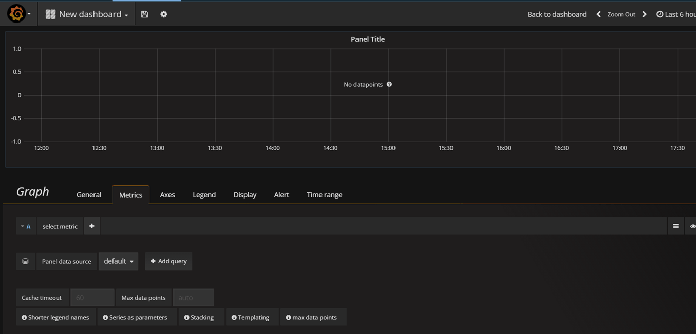

---

copyright:
  years: 2017, 2018

lastupdated: "2018-02-08"

---

{:new_window: target="_blank"}
{:shortdesc: .shortdesc}
{:screen: .screen}
{:pre: .pre}
{:table: .aria-labeledby="caption"}
{:codeblock: .codeblock}
{:tip: .tip}
{:download: .download}

# CF 앱에 대한 Grafana에서 메트릭 분석
{: #cfapps_metrics}

이 튜토리얼을 사용하여 {{site.data.keyword.monitoringlong}} 서비스를 사용하여 {{site.data.keyword.Bluemix_notm}} 퍼블릭에서 실행되는 CF(Cloud Foundry)앱의 성능을 모니터링하는 방법을 배울 수 있습니다.
{:shortdesc}

## 목표
{: #objectives}

CF 앱에 대한 메트릭을 검색하고 분석하는 방법에 대해 배웁니다.

1. CF 앱을 배치하십시오.
2. Grafana를 실행하고 CF 앱 메트릭을 볼 수 있는 {{site.data.keyword.monitoringshort}} 도메인을 설정하십시오.
3. {{site.data.keyword.Bluemix_notm}}의 영역에서 실행되는 CF 앱에 대한 메트릭을 검색하고 분석하십시오.

이 튜토리얼에서는 사용자가 미국 남부 지역에서 작업하는 것으로 가정합니다.

## 전제조건
{: #prereqs}

1. 영역에 서비스를 프로비저닝하고 CF 앱을 배치하고 {{site.data.keyword.monitoringshort}} 서비스를 통해 {{site.data.keyword.Bluemix_notm}}에서 메트릭을 조회할 수 있는 권한이 있는 {{site.data.keyword.Bluemix_notm}} 계정의 구성원 또는 소유자여야 합니다.

    {{site.data.keyword.Bluemix_notm}}에 대한 사용자 ID에 {{site.data.keyword.monitoringshort}} 서비스 및 CF 앱이 프로비저닝된 영역에 대한 CF 역할이 있어야 합니다. 필수 역할은 *개발자*입니다.
    
    자세한 정보는 [IBM Cloud UI를 사용하여 사용자에게 CF 역할 부여](/docs/services/cloud-monitoring/security/grant_permissions.html#grant_permissions_ui_space)를 참조하십시오.

2. 미국 남부 지역에서 서비스를 프로비저닝할 수 있는 권한이 있는 영역에 {{site.data.keyword.monitoringshort}} 서비스를 프로비저닝하십시오.

    자세한 정보는 [{{site.data.keyword.monitoringshort}} 서비스 프로비저닝](/docs/services/cloud-monitoring/how-to/provision.html#provision)을 참조하십시오.

## 1단계: 사용자에게 CF 앱 및 {{site.data.keyword.monitoringshort}} 서비스를 사용하여 작업할 수 있는 권한 부여
{: #step1}

사용자에게 영역 내에 CF 앱을 배치하거나 영역 도메인에서 메트릭을 볼 수 있는 권한을 부여하려면 이 사용자가 영역 및 {{site.data.keyword.Bluemix_notm}}에서 {{site.data.keyword.monitoringshort}} 서비스를 사용하여 수행할 수 있는 조치를 설명하는 CF 역할을 사용자에게 지정해야 합니다. 

**참고:** 이 튜토리얼에서는 사용자가 계정 소유자이거나 사용자 ID에 역할을 추가할 수 있는 권한이 있다고 가정합니다. 권한이 없는 경우, 소유자에게 이 단계를 완료하도록 요청하십시오.

다음 단계를 완료하여 사용자에게 튜토리얼을 완료할 수 있는 권한을 부여하십시오.

1. {{site.data.keyword.Bluemix_notm}} 콘솔에 로그인하십시오.

    웹 브라우저를 열고 {{site.data.keyword.Bluemix_notm}} 대시보드: [http://bluemix.net ](http://bluemix.net){:new_window}를 실행하십시오.
	
	사용자 ID 및 비밀번호를 사용하여 로그인하면 {{site.data.keyword.Bluemix_notm}} UI가 열립니다.

2. 메뉴 표시줄에서 **관리 > 계정 > 사용자**를 클릭하십시오. 

    *사용자* 창에 사용자의 목록이 현재 선택된 계정에 대한 해당 이메일 주소와 함께 표시됩니다.
	
3. 목록에서 사용자 이름을 찾고 *조치* 메뉴에서 **사용자 관리**를 클릭하십시오.

4. **Cloud Foundry 액세스**를 선택한 다음 **조직 지정**을 선택하십시오.

5. 다음 값을 입력하십시오. 

    <table>
      <caption></caption>
      <tr>
        <th>필드</th>
        <th>값</th>
      </tr>
      <tr>
        <td>조직</td>
        <td>MyOrg</td>
      </tr>
      <tr>
        <td>조직 역할</td>
        <td>조직 역할 없음</td>
      </tr>
      <tr>
        <td>Region</td>
        <td>미국 남부</td>
      </tr>
      <tr>
        <td>영역</td>
        <td>dev</td>
      </tr>
      <tr>
        <td>영역 역할</td>
        <td>개발자</td>
      </tr>
    </table>
	
6. **역할 저장**을 클릭하십시오.
 

## 2단계: CF 앱 배치
{: #step2}

{{site.data.keyword.Bluemix_notm}} 콘솔에서 다음 단계를 완료하십시오.

1. {{site.data.keyword.Bluemix_notm}} 도구 모음에서 **카탈로그**를 클릭하십시오.

2. **Cloud Foundry 앱 > Liberty for Java**를 클릭하십시오. 

3. 다음 정보를 입력하십시오.

    * **앱 이름**: 애플리케이션의 이름입니다. 고유해야 합니다.
    * **지역**: 미국 남부를 선택하십시오.
    * **조직**: {{site.data.keyword.monitoringshort}} 서비스를 프로비저닝한 조직을 선택하십시오.
    * **영역**: {{site.data.keyword.monitoringshort}} 서비스를 프로비저닝한 영역을 선택하십시오.

3. **작성**을 클릭하십시오.

CF 앱이 실행되는 즉시 메트릭이 수집되고 {{site.data.keyword.monitoringshort}} 서비스에 전달됩니다.

## 3단계: Grafana 실행 및 메트릭 도메인 설정
{: #step3}

브라우저에서 Grafana를 실행하고 CF 앱 메트릭을 볼 수 있는 {{site.data.keyword.monitoringshort}} 도메인을 설정하십시오.

1. 브라우저에서 Grafana를 실행하십시오. 

    {{site.data.keyword.monitoringshort}} 서비스를 프로비저닝한 지역에 대한 {{site.data.keyword.monitoringshort}} 서비스 URL을 입력하십시오.
    
    지역별 URL을 가져오려면 [모니터링 서비스에 대한 URL](/docs/services/cloud-monitoring/monitoring_ov.html#region)을 참조하십시오.

    예를 들어, 미국 남부 지역의 경우 [https://metrics.ng.bluemix.net/](https://metrics.ng.bluemix.net/)을 실행하십시오.

2. 클러스터 메트릭을 볼 수 있는 {{site.data.keyword.monitoringshort}} 도메인을 설정하십시오.

    Grafana에서 사용자 ID를 선택하십시오. 그런 다음, 올바른 계정인지 확인하고 `Domain = space`를 선택하십시오.

    CF 앱을 배치하고 {{site.data.keyword.monitoringshort}} 서비스를 프로비저닝한 위치에 해당하는 조직 이름 및 영역 이름을 확인하십시오.

## 4단계: 메트릭을 모니터링할 Grafana 대시보드 작성
{: #step4}

Grafana에서 새 대시보드를 작성하려면 다음 단계를 완료하십시오.

1. 측면 메뉴 표시줄 토글 을 선택하십시오.
2. **대시보드**를 선택하십시오.
3. **새로 작성**을 클릭하십시오.

대시보드가 열립니다. 이 대시보드는 구성할 준비가 된 비어 있는 행을 포함하고 있습니다.

Grafana에서는 행을 추가하여 대시보드를 섹션으로 나눕니다. 하나의 행은 1개 이상의 패널을 그룹화합니다. 패널은 행 내에서 메트릭에 대한 데이터를 표시하기 위해 구성할 수 있는 가장 작은 시각화 단위로, 예를 들면 그래프 패널 또는 표 패널을 선택할 수 있습니다. 패널을 끌어서 놓아 대시보드에서 패널을 다시 배치할 수 있습니다. 패널이 표시하는 데이터는 조회를 통해 구성됩니다. 패널에는 하나 이상의 조회를 정의할 수 있습니다. 각 조회는 서로 다른 데이터 세트를 나타냅니다. 패널의 시간 범위를 설정할 수도 있습니다. 일반적으로 시간 범위는 *대시보드* 시간 선택도구로 설정됩니다.

그래프에 표시되는 데이터를 필터링하는 조회를 정의하십시오. 이 조회는 컨테이너의 한계에 대한 CPU 사용률의 백분율을 모니터링합니다.

조회의 형식에 대한 정보는 [CF 앱에 대한 Grafana 조회 형식](/docs/services/cloud-monitoring/reference/cfapps_metrics_format.html#cfapps_metrics_format)을 참조하십시오.
    
1. 컨테이너의 모든 코어의 CPU 시간(나노초(ns))을 모니터하는 *그래프* 패널을 추가하십시오.
    
    1. **그래프**를 선택하십시오.
    
    2. 그래프 제목을 클릭한 후 **편집**을 선택하십시오.
    
        *메트릭* 탭이 열립니다. 여기서는 기본 데이터 소스를 볼 수 있습니다.
    
        
    
2. 그래프에 표시되는 데이터를 필터링하는 조회를 정의하십시오. 
    
    *메트릭* 탭에서 **조회 추가**를 선택하십시오.  조회 항목이 추가됩니다. 각 조회는 하나의 문자로 레이블 지정됩니다.
    
    
        
    1. **메트릭 선택**을 클릭한 다음 소스: `ibmcloud`를 선택하십시오.
    
    2. **메트릭 선택**을 클릭한 다음 클라우드 유형: `public`을 선택하십시오.
    
    3. **메트릭 선택**을 클릭한 다음 `Cloud Foundry`를 선택하십시오.
    
    4. **메트릭 선택**을 클릭한 다음 작업 중인 지역을 선택하십시오. 예를 들어, 미국 남부 지역의 경우, `us-south`입니다.
    
    5. **메트릭 선택**을 클릭한 다음 CF 앱 이름을 선택하십시오. 예를 들어, `logtester`입니다.
    
    6. **메트릭 선택**을 클릭한 다음 CF 앱 인스턴스 인덱스를 선택하십시오. 예를 들어, `0`입니다.

    7. **메트릭 선택**을 클릭한 다음 `컨테이너`를 선택하십시오.
    
    9. **메트릭 선택**을 클릭한 다음 메트릭을 선택하십시오. 컨테이너의 *CPU 사용률 백분률*을 모니터링하려면 `cpu-utilization`을 선택하십시오.

    10. 더하기 이미지 를 클릭하고 함수를 선택하십시오. 함수를 추가하여 메트릭에 대해 사용 가능한 데이터를 변환하거나, 결합하거나, 이에 대한 계산을 수행할 수 있습니다.
        
        예를 들면, **alias(newName)** 함수를 추가하여 메트릭에 대해 별명을 추가할 수 있습니다. 이 별명은 그래프에 표시되는 범례에 메트릭 이름 대신 문자열을 인쇄하는 데 사용됩니다.
        
        메트릭에 대해 별명을 추가하려면 다음 단계를 완료하십시오.
        
        1. 더하기 기호를 클릭하십시오.
        2. **특수**를 선택하십시오. 
        3. **별명**을 선택하십시오.
        4. 문자열(예: `My sample metric`)을 입력하십시오.
        

## 5단계: 대시보드 저장
{: #step5}

나중에 재사용할 수 있도록 대시보드를 저장하십시오.

1. 대시보드 저장 이미지 를 클릭하십시오.

    

2. 대시보드의 이름을 입력하십시오.
3. **저장**을 클릭하십시오.

## 다음 단계
{: #next_steps}

메트릭에 대한 경보를 정의하십시오. 자세한 정보는 [경보 구성](/docs/services/cloud-monitoring/config_alerts_ov.html#config_alerts_ov)을 참조하십시오.
