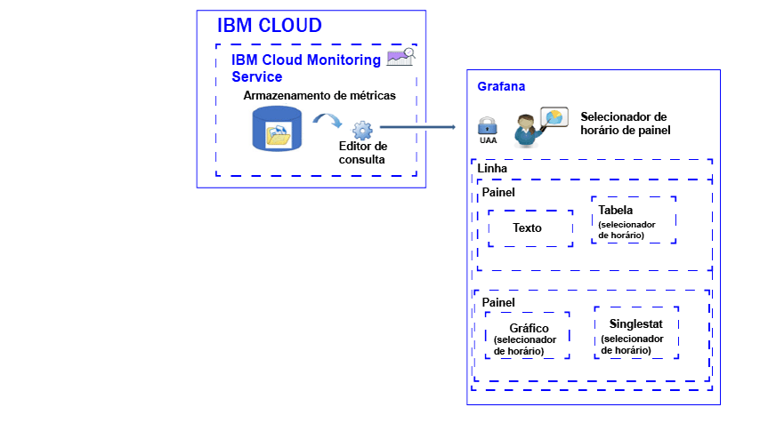

---

Copyright: years: 2017

lastupdated: "2017-07-14"

---

{:shortdesc: .shortdesc}
{:new_window: target="_blank"}
{:codeblock: .codeblock}
{:screen: .screen}
{:pre: .pre}

# Analisando métricas
{: #analyze_metrics_ov}

No {{site.data.keyword.Bluemix}}, é possível usar o Grafana, uma plataforma de visualização e monitoramento de software livre, para monitorar, procurar, analisar e visualizar as suas métricas em uma variedade de gráficos, por exemplo, gráficos e tabelas.
{:shortdesc}

## Visão Geral de Componentes
{: #overview}

O serviço do {{site.data.keyword.monitoringshort}} armazena uma série de dados no banco de dados de armazenamento do Metrics. É possível consultar esses dados por meio do Editor de consulta. Para obter mais informações sobre as consultas que são suportadas, veja [Funções do Graphite](http://graphite.readthedocs.io/en/latest/functions.html).

No Grafana, para acessar os dados que estão disponíveis no banco de dados de armazenamento do Metrics, deve-se efetuar login em um espaço, uma organização e uma região do {{site.data.keyword.Bluemix_notm}} com o ID do usuário e a senha que você usa para efetuar login no {{site.data.keyword.Bluemix_notm}}. 

Para visualizar os dados, você configura um painel que pode incluir uma ou mais linhas. Em cada linha, é possível definir múltiplos painéis. 

* Uma linha agrupa os painéis em um painel. 
* Um painel é o recurso de visualização básica para monitorar as métricas 
* Um painel pode ser identificado e incluir anotações com dados que você pode usar para correlacionar dados ao longo de painéis.

É possível definir os tipos de painéis a seguir: texto, gráfico, tabela, singlestat. Cada painel oferece estilos diferentes e opções de formatação que podem ser customizados. Os painéis podem ser estáticos ou dinâmicos.

A quantia de dados exibida em um painel é determinada pela consulta e pelo intervalo de tempo que é configurado. É possível configurar um intervalo de tempo comum para todos os painéis no nível de painel ou intervalos de tempo individuais por painel.

A figura a seguir mostra os diferentes componentes que o Grafana usa do serviço do {{site.data.keyword.monitoringshort}} para filtrar dados e os recursos que podem ser usados no Grafana para visualizar e analisar os dados:

