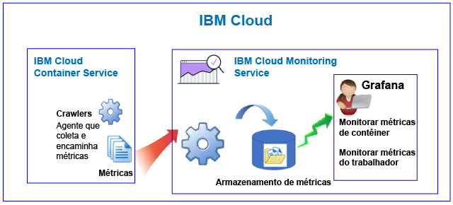
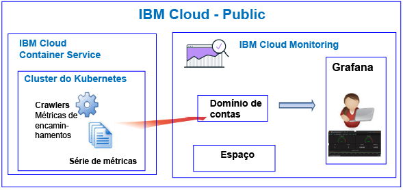
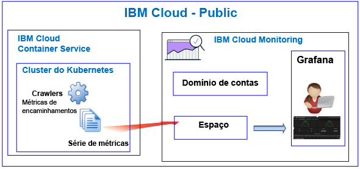
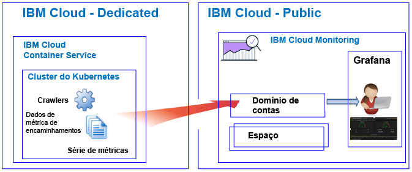

---

copyright:
  years: 2017, 2018

lastupdated: "2018-02-07"

---

{:new_window: target="_blank"}
{:shortdesc: .shortdesc}
{:screen: .screen}
{:pre: .pre}
{:table: .aria-labeledby="caption"}
{:codeblock: .codeblock}
{:tip: .tip}
{:download: .download}

# {{site.data.keyword.containershort_notm}}
{: #monitoring_bmx_containers_ov}

No {{site.data.keyword.Bluemix}}, as métricas do cluster são coletadas automaticamente. É
possível usar o Grafana para monitorar o desempenho de seu cluster.
{:shortdesc}

**Nota:** as métricas são coletadas e ficam disponíveis para monitoramento por meio
do serviço do {{site.data.keyword.monitoringshort}} para contêineres em execução em clusters padrão. Para obter mais informações sobre os recursos suportados por um cluster padrão, veja [Planejando clusters e apps](/docs/containers/cs_planning.html#cs_planning_cluster_type).

## Sobre monitoramento no Public
{: #public}

No {{site.data.keyword.Bluemix_notm}}, é possível usar o
serviço do {{site.data.keyword.monitoringshort}} para armazenar e analisar métricas do contêiner e métricas do cluster do Kubernetes que são coletadas automaticamente pelo
{{site.data.keyword.containershort}} no Public.

É possível ter 1 ou mais clusters do Kubernetes em uma conta. As métricas são coletadas automaticamente
pelo {{site.data.keyword.containershort}} assim que o cluster é fornecido.
As métricas do contêiner são coletadas assim que o pod é implementado. As métricas são encaminhadas
automaticamente para o serviço do {{site.data.keyword.monitoringshort}}:

* Ao criar um cluster como um recurso de conta, as métricas são encaminhadas para o domínio de contas
no serviço do {{site.data.keyword.monitoringshort}}. Para que as métricas sejam encaminhadas para o
domínio de contas, o proprietário da chave de serviço do {{site.data.keyword.monitoringshort}}
deve ter uma política do IAM com permissões **administrador** para trabalhar com o
serviço do {{site.data.keyword.monitoringshort}}.
* Ao criar um cluster com um espaço do Cloud Foundry associado a ele, as métricas são encaminhadas para
o domínio de espaço no serviço do {{site.data.keyword.monitoringshort}}. Para que as métricas sejam
encaminhadas para o domínio de espaço, o proprietário de chave de serviço do
{{site.data.keyword.monitoringshort}} deve ter a função **gerente** na
organização e a função **desenvolvedor** no espaço.

A figura a seguir mostra uma visualização de alto nível de monitoramento para o {{site.data.keyword.containershort}}:

O crawler é um processo que está em execução no host e executa o monitoramento sem agente para métricas. 
O crawler coleta constantemente as métricas da CPU e da memória de todos os contêineres por padrão.

Para analisar as métricas no Grafana para um cluster, considere as informações a seguir:

* Deve-se ativar o Grafana na região do Public na qual a instância do
{{site.data.keyword.monitoringshort}}
que você usa para visualizar métricas é fornecida. 
* É possível usar o painel padrão do Grafana **ClusterMonitoringDashboard_v1** para
monitorar seu cluster.
* Também é possível configurar painéis customizados do Grafana para visualizar
dados de métrica de um cluster na região do Cloud Public na qual o cluster é criado.
* Seu ID do usuário deve ter permissões para visualizar métricas. 

    Para ver métricas no domínio de contas, um usuário precisa de uma política do IAM para o
serviço do {{site.data.keyword.monitoringshort}}. O usuário precisa de permissões de **Visualizador**. 
    
    Para ver métricas no domínio de espaço, o usuário precisa de uma função do CF. Para obter mais
informações, consulte [Funções que são
necessárias por um usuário para visualizar métricas](/docs/services/cloud-monitoring/security_ov.html#bmx_roles).

### Visualização de alto nível de monitoramento de um cluster que encaminha métricas para o domínio
de contas
{: #acc}

A figura a seguir mostra uma visualização de monitoramento de alto nível no Public para o
{{site.data.keyword.containershort}} quando o cluster encaminha métricas para o domínio de contas:

### Visualização de alto nível de monitoramento de um cluster que encaminha métricas para um domínio
de espaço
{: #space}

A figura a seguir mostra uma visualização de alto nível de monitoramento no Public para o
{{site.data.keyword.containershort}} quando o cluster encaminha métricas para um domínio de espaço:

Os clusters que encaminham métricas para um espaço devem ser criados na linha de comandos dentro do
contexto de uma organização e espaço do Cloud Foundry. Antes de criar o cluster, execute o comando `bx
target` para configurar a organização e o contexto de espaço do CF.

## Sobre o monitoramento no Dedicated
{: #dedicated}

No {{site.data.keyword.Bluemix_notm}}, é possível usar o serviço do
{{site.data.keyword.monitoringshort}} no Public para armazenar e analisar métricas do contêiner e
métricas do cluster do Kubernetes que são coletadas automaticamente pelo {{site.data.keyword.containershort}} no
Dedicated.

É possível ter 1 ou mais clusters do Kubernetes em uma conta. As métricas são coletadas automaticamente
pelo {{site.data.keyword.containershort}} assim que o cluster é fornecido.
As métricas do contêiner são coletadas assim que o pod é implementado. As métricas são encaminhadas
automaticamente para o domínio de contas do serviço do {{site.data.keyword.monitoringshort}}.

**Nota:** para que as métricas sejam encaminhadas para o domínio de contas, o
proprietário da chave de serviço do {{site.data.keyword.monitoringshort}}
deve ter uma política do IAM com as permissões **administrador** para trabalhar
com o serviço do {{site.data.keyword.monitoringshort}}.

Para visualizar e analisar métricas de um cluster no Grafana, considere as informações a seguir:

* Deve-se ativar o Grafana na região do Cloud Public na qual o cluster está disponível no
Dedicated. Por exemplo, se um cluster é fornecido no Dedicated no Sul dos EUA, deve-se ativar o Grafana
na região Sul dos EUA no Public.
* É possível usar o painel padrão do Grafana **ClusterMonitoringDashboard_v1** para
monitorar seu cluster.
* Também é possível configurar painéis customizados do Grafana para visualizar dados de métrica de um
cluster na região do Cloud Public na qual o cluster é criado.
* Seu ID do usuário deve ter uma política do IAM para trabalhar com o
serviço do {{site.data.keyword.monitoringshort}}. É necessário ter as permissões
**Visualizador** para ver as métricas no domínio de contas.  

A figura a seguir mostra uma visualização de alto nível de monitoramento no Dedicated para o
{{site.data.keyword.containershort}}:

## Métricas da CPU para contêineres
{: #cpu_metrics_containers}

A tabela a seguir lista as métricas da CPU que são capturadas automaticamente para um contêiner:

<table>
  <caption>Tabela 1. Métricas da CPU para contêineres</caption>
  <tr>
    <th>Nome de métrica</th>
    <th>Descrição</th>
  </tr>
  <tr>
    <td>*cpu.num-cores*</td>
    <td>Essa métrica relata o número de núcleos da CPU que estão disponíveis para o contêiner.   Por padrão, esta métrica relata o número de núcleos no trabalhador. Se você configurar um limite no número de núcleos disponíveis para o contêiner, esta métrica relatará o número de núcleos configurado nesse limite.</td>
  </tr>
  <tr>
    <td>*cpu.usage*</td>
    <td>Essa métrica relata os nanossegundos de tempo de CPU em todos os núcleos.   Quando o uso de CPU está alto, você pode experimentar atrasos. O uso alto de CPU indica energia de processamento insuficiente.</td>
  </tr>
  <tr>
    <td>*cpu.usage-pct*</td>
    <td>Essa métrica relata o tempo de CPU que é usado como uma porcentagem da capacidade da CPU.   Por padrão, a capacidade da CPU é determinada pelo número de núcleos no trabalhador. Se você configurar limites para a capacidade da CPU do contêiner, esta métrica relatará o uso de CPU como uma porcentagem dos limites configurados. Quando a porcentagem de uso de CPU está alta, você pode experimentar atrasos. O uso alto de CPU indica energia de processamento insuficiente.</td>
  </tr>
  <tr>
    <td>*cpu.usage-pct-container-requested*</td>
    <td>Essa métrica relata o tempo de CPU que é usado como uma porcentagem da CPU solicitada do contêiner.   Se você não configurar a CPU solicitada em um contêiner, essa métrica não será exposta para o contêiner.</td>
  </tr>
</table>

## Métricas de carregamento para os trabalhadores
{: #load_metrics_workers}

A tabela a seguir lista as métricas da CPU que são capturadas automaticamente para um trabalhador:

<table>
  <caption>Tabela 2. Métricas de carregamento para os trabalhadores</caption>
  <tr>
    <th>Nome de métrica</th>
    <th>Descrição</th>
  </tr>
  <tr>
    <td>*load.avg-1*</td>
    <td>Essa métrica relata o carregamento médio de CPU para o host do Kubernetes no último 1 minuto.   Uma carga de CPU média que é maior que o número de núcleos no trabalhador indica que o tráfego para o host está enfileirando.</td>
  </tr>
  <tr>
    <td>*load.avg-5*</td>
    <td>Essa métrica relata o carregamento médio de CPU para o host do Kubernetes nos últimos 5 minutos.   Uma carga de CPU média que é maior que o número de núcleos no trabalhador indica que o tráfego para o host está enfileirando.</td>
  </tr>
  <tr>
    <td>*load.avg-15*</td>
    <td>Essa métrica relata o carregamento médio de CPU para o host do Kubernetes nos últimos 15 minutos.   Uma carga de CPU média que é maior que o número de núcleos no trabalhador indica que o tráfego para o host está enfileirando.</td>
  </tr>
</table>

## Métricas da memória para contêineres
{: #memory_metrics}

A tabela a seguir lista as métricas da memória capturadas automaticamente:

<table>
  <caption>Tabela 3. Métricas da memória para contêineres</caption>
  <tr>
    <th>Nome de métrica</th>
    <th>Descrição</th>
  </tr>
  <tr>
    <td>*memory.current*</td>
    <td>Essa métrica relata os bytes de memória que o contêiner está usando atualmente. </td>
  </tr>
  <tr>
    <td>*memory.limit*</td>
    <td>Essa métrica relata a quantia de memória que um contêiner é permitido trocar em disco em comparação com os limites máximo e mínimo configurados para um pod.    Por padrão, os pods são executados com limites de memória ilimitada. Um pod pode consumir tanta memória quanto houver no trabalhador no qual ele está em execução. Ao implementar um pod, é possível configurar limites para a quantia de memória que um pod pode usar. </td>
  </tr>
  <tr>
    <td>*memory.usage-pct*</td>
    <td>Essa métrica relata a memória que é usada como uma porcentagem do limite de memória do contêiner.    Se você configurar limites para a quantia de memória que um contêiner pode usar, esta métrica relatará o uso de memória como uma porcentagem dos limites configurados. </td>
  </tr>
</table>

## Definindo consultas para monitoramento de recursos em um cluster do Kubernetes
{: #monitoring_metrics_kube}

Para monitorar o desempenho dos contêineres e dos trabalhadores que são implementados em um cluster do
Kubernetes no {{site.data.keyword.Bluemix_notm}}, use o Grafana. 

O serviço do {{site.data.keyword.monitoringlong}} usa o Grafana, uma plataforma de software
livre para análise de dados e visualização, que pode ser usada para monitorar, procurar, analisar e visualizar
suas métricas em uma variedade de gráficos, por exemplo, diagramas e tabelas.

É possível ativar o Grafana em um navegador. Para obter mais informações, veja [Navegando para o painel do Grafana por meio de um navegador da web](/docs/services/cloud-monitoring/grafana/navigating_grafana.html#launch_grafana_from_browser).

Para monitorar contêineres e trabalhadores que são executados em um cluster do Kubernetes, deve-se definir
uma consulta no Grafana para cada recurso:

* Para definir uma consulta que monitora uma métrica de CPU para um contêiner, consulte
[Configurando
as métricas da CPU para um contêiner no Grafana](/docs/services/cloud-monitoring/containers/config_cpu_worker.html#config_cpu_worker).
* Para definir uma consulta que monitora uma métrica de memória para um contêiner, consulte
[Configurando
métricas da memória para um contêiner no Grafana](/docs/services/cloud-monitoring/containers/config_mem_container.html#config_mem_container).
* Para definir uma consulta que monitora uma métrica de carregamento para um trabalhador, consulte
[Configurando
métricas de carregamento para um trabalhador no Grafana](/docs/services/cloud-monitoring/containers/config_load_worker.html#config_load_worker).

O formato da consulta é diferente por tipo de recurso e tipo de consulta:

* Para obter mais informações sobre o formato de consultas para monitorar a CPU de um contêiner,
consulte [Formato
de consulta de métrica de CPU para um contêiner](/docs/services/cloud-monitoring/reference/metrics_format_containers.html#cpu_containers). 
* Para obter mais informações sobre o formato de consultas para monitorar o carregamento de um
trabalhador, consulte
[Formato de
consulta de métrica de carregamento para um trabalhador](/docs/services/cloud-monitoring/reference/metrics_format_containers.html#load_workers).
* Para obter mais informações sobre o formato de consultas para monitorar a memória de um contêiner,
consulte
[Formato
de consulta de métrica de memória para um contêiner](/docs/services/cloud-monitoring/reference/metrics_format_containers.html#mem_containers).

## Configurando o tráfego de rede para configurações de firewall customizado no {{site.data.keyword.Bluemix_notm}}
{: #ports}

Quando você tiver um firewall adicional configurado ou tiver customizado as configurações de firewall na infraestrutura do {{site.data.keyword.Bluemix_notm}} (SoftLayer), será necessário permitir o tráfego de rede de saída do nó do trabalhador para o serviço {{site.data.keyword.monitoringshort}}. 

Deve-se abrir a porta TCP 443 e a porta TCP 9091 de cada trabalhador para o serviço {{site.data.keyword.monitoringshort}} para os endereços IP a seguir em seu firewall customizado:

<table>
  <tr>
    <th>Região</th>
    <th>URL de ingestão</th>
	<th>Endereço IP público</th>
  </tr>
  <tr>
    <td>Alemão</td>
	<td>ingest-eu-fra.logging.bluemix.net</td>
	<td>158.177.88.43  159.122.87.107</td>
  </tr>
  <tr>
    <td>Reino Unido</td>
	<td>ingest.logging.eu-gb.bluemix.net</td>
	<td>169.50.115.113</td>
  </tr>
  <tr>
    <td>Sul dos Estados Unidos</td>
	<td>ingest.logging.ng.bluemix.net</td>
	<td>169.48.79.236  169.46.186.113</td>
  </tr>
  <tr>
    <td>Sydney</td>
	<td>ingest-au-syd.logging.bluemix.net</td>
	<td>130.198.76.125  168.1.209.20</td>
  </tr>
</table>
