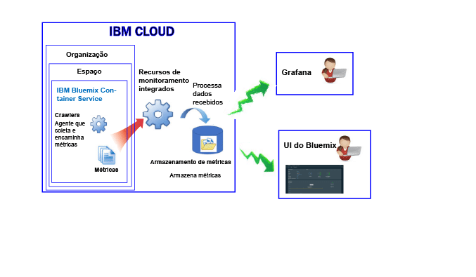

---

copyright:
  years: 2017, 2018

lastupdated: "2018-02-02"

---

{:new_window: target="_blank"}
{:shortdesc: .shortdesc}
{:screen: .screen}
{:pre: .pre}
{:table: .aria-labeledby="caption"}
{:codeblock: .codeblock}
{:tip: .tip}
{:download: .download}

# Contêineres gerenciados no IBM Cloud (Descontinuado)
{: #monitoring_managed_containers_ov}

No {{site.data.keyword.Bluemix}}, as métricas do contêiner e do trabalhador são coletadas automaticamente de fora do contêiner, sem precisar instalar e manter agentes dentro do contêiner. É possível usar o Grafana para visualizar as métricas do contêiner. 
{:shortdesc}

**Nota:** as métricas são coletadas e ficam disponíveis para monitoramento por meio do serviço do {{site.data.keyword.monitoringshort}} para contêineres em execução em clusters padrão. Para obter mais informações sobre os recursos suportados por um cluster padrão, veja [Planejando clusters e apps](/docs/containers/cs_planning.html#cs_planning_cluster_type).

## Coletando métricas padrão
{: #metrics_containers_bmx_ov}

A figura a seguir mostra uma visualização de alto nível de monitoramento para o {{site.data.keyword.containershort}}:

O crawler coleta constantemente as métricas a seguir de todos os contêineres por padrão:

* CPU
* do NT
* Informações de rede

## Monitorando métricas para um contêiner gerenciado no IBM Cloud (Descontinuado)
{: #monitoring_metrics_bmx}

As métricas são coletadas e exibidas na UI do {{site.data.keyword.Bluemix_notm}} e no Grafana:

* Use o Grafana, uma plataforma de visualização e análise de software livre para monitorar, procurar, analisar e visualizar suas métricas em uma variedade de gráficos, por exemplo, gráficos e tabelas.

    É possível ativar o Grafana por meio da UI do {{site.data.keyword.Bluemix_notm}} ou de um navegador. Para obter mais informações, veja [Navegando para o painel do Grafana](/docs/services/cloud-monitoring/grafana/navigating_grafana.html#navigating_grafana).

* Use a UI do {{site.data.keyword.Bluemix_notm}} para visualizar as métricas mais recentes.

    Para visualizar as métricas na UI do {{site.data.keyword.Bluemix_notm}}, consulte [Analisando métricas do console do {{site.data.keyword.Bluemix_notm}}](/docs/services/cloud-monitoring/containers/analyzing_metrics_bmx_ui.html#analyzing_metrics_bmx_ui).
