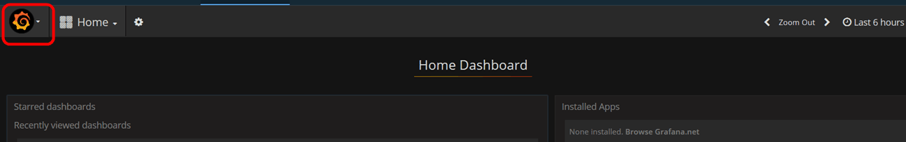
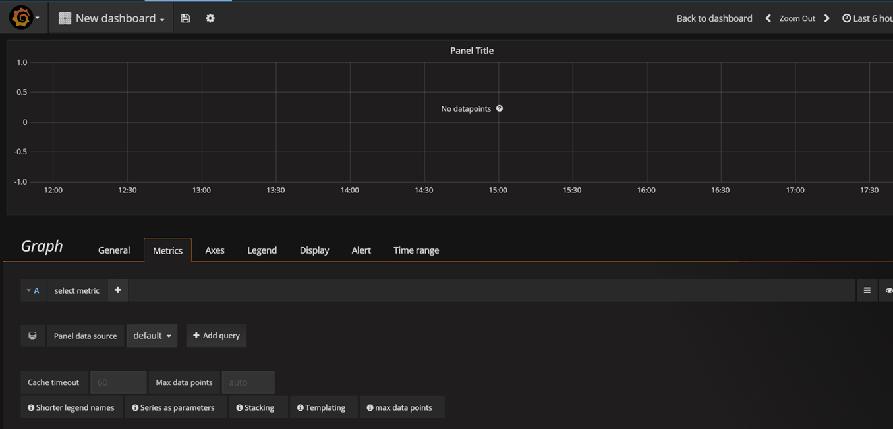
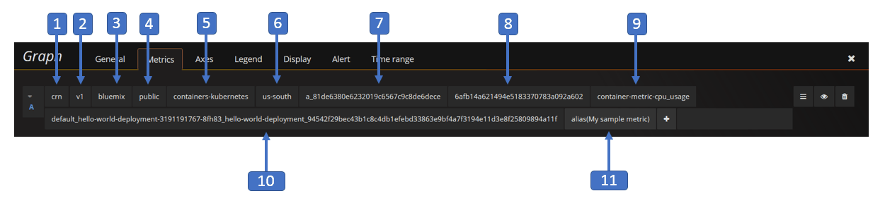

---

copyright:
  years: 2017
lastupdated: "2017-06-26"

---

{:new_window: target="_blank"}
{:shortdesc: .shortdesc}
{:screen: .screen}
{:codeblock: .codeblock}
{:pre: .pre}

# Introdução ao IBM Cloud Monitoring no Bluemix
{: #getting-started-with-ibm-cloud-monitoring}

Neste tutorial de introdução, percorreremos as etapas para analisar um contêiner usando o serviço {{site.data.keyword.monitoringlong}}. Saiba como procurar e analisar métricas de contêiner para um app que é implementado em um cluster do Kubernetes.
{:shortdesc}

## Antes de Começar
{: #prereqs}

Crie um [conta do Bluemix](https://console.bluemix.net/registration/). Seu ID do usuário deve ser um membro ou um proprietário de uma conta do Bluemix com permissões para criar clusters do Kubernetes, implementar apps em clusters e consultar os logs no Bluemix para análise avançada no Kibana.

Abra uma sessão de terminal na qual seja possível gerenciar o cluster do Kubernetes e implementar apps por meio da linha de comandos. Os exemplos neste tutorial são fornecidos para um sistema Ubuntu Linux.

[Instale os plugins da CLI](/docs/containers/cs_cli_install.html#cs_cli_install_steps) em seu ambiente local para gerenciar o serviço IBM Bluemix Container por meio da linha de comandos. 


## Etapa 1: implementando um app em um contêiner
{: #step1}

Conclua as etapas a seguir para implementar um contêiner em um cluster do Kubernetes:

1. [Criar um Kubernetes cluster](/docs/containers/cs_cluster.html#cs_cluster_ui).

2. [Configure o contexto do cluster](/docs/containers/cs_cli_install.html#cs_cli_configure) em um terminal Linux. Após o contexto ser configurado, é possível gerenciar o cluster do Kubernetes e implementar o aplicativo no cluster do Kubernetes.

3. Implemente e execute um aplicativo de amostra no cluster do Kubernetes. [Conclua as etapas para a lição 1](/docs/containers/cs_tutorials.html#cs_apps_tutorial).

    O app é um app Hello World Node.js:

    ```
    var express = require('express')
    var app = express()

    app.get('/', function(req, res) {
      res.send('Hello world! Your app is up and running in a cluster!\n')
    })
    app.listen(8080, function() {
      console.log('Sample app is listening on port 8080.')
    })
    ```

    Quando o app for implementado, a coleta de métricas será ativada automaticamente.


## Etapa 2: navegando para o painel do Grafana
{: #step2}

Ative o Grafana por meio de um navegador. 

Para analisar métricas para um cluster, deve-se acessar o Grafana na região Pública de nuvem na qual o cluster estiver criado. 
    
Em seguida, por meio de um navegador, ative a URL a seguir para abrir o Grafana: `https://metrics.ng.bluemix.net/`
    
    
## Etapa 3: Analisando métricas em Grafana
{: #step3}

Conclua as etapas a seguir para criar um painel do Grafana:
    
1. Cria um novo painel.

    * Selecione a alternância de barra de menus lateral . 
    * Selecione **Painéis**. 
    * Clique em **Novo**
    
    Um painel se abre. O painel inclui uma linha vazia que está pronta para configuração. 
    
    
    
     No Grafana, você inclui linhas para dividir o painel em seções. Uma linha agrupa um ou mais painéis. Dentro de uma linha, um painel é a menor unidade de visualização que pode ser configurada para exibir dados para uma métrica; por exemplo, é possível escolher um painel de gráfico ou um painel de tabela. É possível arrastar e soltar painéis para reorganizá-los em um dashboard. Os dados que um painel exibe são configurados por meio de consultas. É possível definir uma ou mais consultas em um painel. Cada consulta representa um conjunto diferente de dados. Também é possível configurar o intervalo de tempo para um painel. Normalmente, o intervalo de tempo é configurado pelo selecionador de tempo do *Dashboard*.
    
2. Inclua um painel de *Graph* para monitorar os nanossegundos de tempo de CPU em todos os núcleos para um contêiner.
    
    1. Selecione **Gráfico**.
    
    2. Clique no título do gráfico e, em seguida, selecione **Editar**.
    
        O *Métricas* guia é aberta. É possível ver aqui a origem de dados padrão.
    
        
    
3. Defina a consulta que filtra os dados que são exibidos no gráfico. 

    A tabela a seguir descreve os campos diferentes que são necessários para configurar uma consulta que filtra os dados para uma métrica de contêiner:

    <table>
      <caption>Tabela 1. Campos de consulta do Grafana para contêineres</caption>
      <tr>
        <th align="center">Campo</th>
        <th align="center">Descrição</th>
        <th align="center">Valores válidos</th>
      </tr>
      <tr>
        <td>Prefixo</td>
        <td>Prefixo para métricas de contêineres. <br><br>Esse prefixo se aplica a dados coletados para contêineres que são implementados em um cluster do Kubernetes.</td>
        <td>`crn`</td>
      </tr>
      <tr>
        <td>Versão</td>
        <td>Versão dos dados de métrica coletados.</td>
        <td>`v1`</td>
      </tr>
      <tr>
        <td>Provedor</td>
        <td>Provedor em nuvem no qual os dados são coletados.</td>
        <td>`bluemix`</td>
      </tr>
      <tr>
        <td>Tipo</td>
        <td>Ambiente de nuvem no qual os dados são coletados.</td>
        <td>`Público`</td>
      </tr>
      <tr>
        <td>Fonte</td>
        <td>Infraestrutura do Cloud onde métricas são coletadas.</td>
        <td>`contêineres-kubernetes`</td>
      </tr>
      <tr>
        <td>Região</td>
        <td>Região Cloud onde métricas são coletadas.</td>
        <td>* `a` <br>* `eu-gb` <br>* `eu-de` </td>
      </tr>
      <tr>
        <td>Conta</td>
        <td>GUID da conta em que as métricas são coletadas. <br>O formato desse campo é o seguinte: `a_*ID*`, em que ID é o GUID da conta.</td>
        <td></td>
      </tr>
      <tr>
        <td>Grupo</td>
        <td>GUID do cluster em que métricas são coletadas.</td>
        <td></td>
      </tr>
      <tr>
        <td>Contêiner de métrica</td>
        <td>Métricas coletadas para um contêiner.</td>
        <td>* `memory_current` <br>* `memory_limit` <br>* `cpu_usage` <br>* `cpu_usage_pct` <br>* `cpu_num_cores`</td>
      </tr>
      <tr>
        <td>Contêiner em uma vagem</td>
        <td>Combinação de nomes e GUIDs do recurso Kubernetes que são necessários para identificar exclusivamente um contêiner que é executado em um pod. <br> O formato desse campo é o seguinte: *{namespace}_#{pod_name}_#{container_name}_#{container_id}* <br><br>**Observação:** ao olhar para a lista de opções disponíveis para essa entrada na consulta, observe que há também uma entrada com o seguinte formato: *{namespace}_#{pod_name}_#{container_name}_POD_#{container_id}*. Essas entradas correspondem aos IDs de contêineres internos que são criados pelo Kubernetes.</td>
        <td></td>
      </tr>
      <tr>
        <td>Funções</td>
        <td>Funções de consulta que podem ser selecionadas para visualizar uma métrica de contêiner no painel. <br>Para obter mais informações, consulte [Funções ](http://graphite.readthedocs.io/en/latest/functions.html "Ícone de link externo"){: new_window}</td>
        <td></td>
      </tr>
    </table>
    
    A imagem a seguir mostra como a consulta será exibida no Grafana quando você o configurar:
    
    
    
    Conclua as etapas a seguir para definir a consulta:
    
    Na guia *Métricas*, selecione **Incluir consulta**. <br>Uma entrada de consulta é incluído. Cada consulta é rotulada com uma letra.
    
    
        
    1. Clique em **Selecionar métrica** e depois escolha `crn`.
    
    2. Clique em **Selecionar métrica** e depois escolha `v1`.
    
    3. Clique em **Selecionar métrica** e depois escolha `bluemix`.
    
    4. Clique em **Selecionar métrica** e depois escolha `public`.
    
    5. Clique em **Selecionar métrica** e depois escolha `containers-kubernetes`.
    
    6. Clique em **Selecionar métrica** e depois escolha a região de onde você está trabalhando, por exemplo, `us-south`.
    
    7. Clique em **Selecionar métrica** e depois escolha o ID da conta para o qual você deseja exibir dados, por exemplo, `a_91d1d1exxxxxxx4df920bbd06461b066`
    
    8. Clique em **Selecionar métrica** e depois escolha o ID do cluster.
    
    9. Clique em **Selecionar métrica** e depois escolha uma métrica do contêiner. Para monitorar o *uso de CPU* de um contêiner, escolha `container-metric-cpu_usage`.
    
    10. Clique em **Selecionar métrica** e, em seguida, escolha o ID que corresponde ao contêiner para o qual você deseja monitorar o uso da CPU, por exemplo, `default_hello-world-deployment-3355293961-0fwkg_hello-world-deployment_ad5eb446a493db31f1d9eb158f5de915fc063d6c136823488b694e63bb00aa57`.
    
    11. Clique na imagem de mais  e escolha uma função. Será possível incluir uma função para transformar, combinar e executar cálculos nos dados que estiverem disponíveis para uma métrica.
        
        Por exemplo, é possível incluir a função **alias(newName)** para incluir um alias para uma métrica. Esse alias é usado para imprimir uma sequência em vez do nome da métrica na legenda que é exibida no gráfico.
        
        Para incluir um alias para sua métrica, conclua as etapas a seguir:
        
        1. Clique no símbolo de mais.
        2. Selecione **Especial**. 
        3 Selecione **alias**.
        4. Insira uma sequência, por exemplo, `My sample metric`.
        
4. Salve o painel para reutilização posterior. 

    1. Clique na imagem de painel salvar . 
    
        
    
    2. Insira o nome do painel.
    3. Clique em **Salvar**.


## Etapas Seguintes
{: #next_steps}

Defina um alerta para uma métrica. Para obter mais informações, consulte [Configurando alertas](/docs/services/cloud-monitoring/config_alerts_ov.html#config_alerts_ov).


