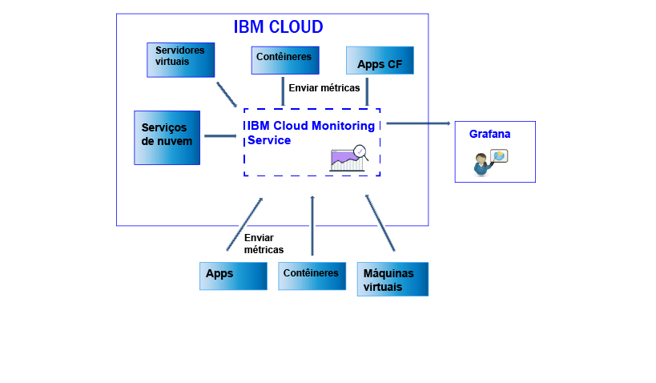

---

Copyright: years: 2017

lastupdated: "2017-07-10"

---

{:shortdesc: .shortdesc}
{:new_window: target="_blank"}
{:codeblock: .codeblock}
{:screen: .screen}
{:pre: .pre}

# Enviando e recuperando dados
{: #send_retrieve_metrics_ov}

É possível enviar e recuperar métricas de um espaço do {{site.data.keyword.Bluemix}} para o serviço do {{site.data.keyword.monitoringshort}} usando a API de Métricas.
{:shortdesc}

A figura a seguir mostra uma visualização de alto nível dos diferentes recursos por meio dos quais é possível enviar métricas ao serviço do {{site.data.keyword.monitoringshort}}:

## Enviando métricas
{: #send}

Para os contêineres do Docker do {{site.data.keyword.Bluemix_notm}}, são coletadas métricas do sistema básico automaticamente. Para os aplicativos Cloud Foundry e os apps em execução em uma máquina virtual (VM), as métricas devem ser enviadas diretamente do app usando a API de Métricas. 

Para enviar métricas para o serviço do {{site.data.keyword.monitoringshort}}, considere as informações a seguir: 

* Deve-se configurar o espaço do {{site.data.keyword.Bluemix_notm}} por meio do qual você deseja recuperar os dados.

* Deve-se fornecer um token de segurança ou uma chave de API para trabalhar com o serviço do {{site.data.keyword.monitoringshort}}. 

* É possível usar o terminal de API `https://metrics.ng.bluemix.net/v1/metrics`. Para obter mais informações sobre a API, veja [a API de Métricas](https://console.bluemix.net/apidocs/927-ibm-cloud-monitoring-rest-api?&language=node#introduction){: new_window}.

Dependendo do modelo de autenticação que você escolher, escolha uma das opções a seguir para enviar dados para o serviço do {{site.data.keyword.monitoringshort}}:
 
* Para enviar métricas usando um token do UAA, veja [Enviando métricas para um espaço usando o UAA](/docs/services/cloud-monitoring/send-metrics/send_data_api.html#uaa).

* Para enviar métricas usando um token do IAM ou uma chave API, veja [Enviando métricas para um espaço usando o IAM ou uma chave API](/docs/services/cloud-monitoring/send-metrics/send_data_api.html#iam).

## Recuperando métricas
{: #retrieve}

Para recuperar métricas, considere as informações a seguir: 

* Deve-se configurar o espaço do {{site.data.keyword.Bluemix_notm}} por meio do qual você deseja recuperar os dados.

* Deve-se fornecer um token de segurança ou uma chave de API para trabalhar com o serviço do {{site.data.keyword.monitoringshort}}. 

* Deve-se especificar um caminho para 1 ou mais métricas. Para obter mais informações, veja [Definindo as métricas](/docs/services/cloud-monitoring/retrieve-metrics/retrieve_data_api.html#metrics).

* Como opção, é possível especificar um período customizado. Por padrão, se você não especificar um período, os dados recuperados serão aqueles que corresponderem às últimas 24 horas. Para obter mais informações, veja [Configurando um período de tempo](/docs/services/cloud-monitoring/retrieve-metrics/retrieve_data_api.html#time).

* É possível usar o terminal de API `https://metrics.ng.bluemix.net/v1/metrics`. Para obter mais informações sobre a API, veja [a API de Métricas](https://console.bluemix.net/apidocs/927-ibm-cloud-monitoring-rest-api?&language=node#introduction){: new_window}.

**Nota:** é possível recuperar um máximo de 5 destinos por solicitação.

Dependendo do modelo de autenticação que você escolher, escolha uma das opções a seguir para recuperar dados do serviço do {{site.data.keyword.monitoringshort}}:
 
* Para recuperar métricas usando um token do UAA, veja [Recuperando métricas para um espaço usando o UAA](/docs/services/cloud-monitoring/retrieve-metrics/retrieve_data_api.html#uaa).

* Para recuperar métricas usando um token do IAM ou uma chave API, veja [Recuperando métricas para um espaço usando o IAM ou uma chave API](/docs/services/cloud-monitoring/retrieve-metrics/retrieve_data_api.html#iam).

## Recuperando a lista de métricas
{: #show_metrics}

Será possível listar as métricas que estiverem disponíveis em um espaço.

Para listar as métricas, considere as informações a seguir: 

* Deve-se configurar o espaço do {{site.data.keyword.Bluemix_notm}} para o qual você deseja listar as métricas que estão disponíveis.

* Deve-se fornecer um token de segurança ou uma chave de API para trabalhar com o serviço do {{site.data.keyword.monitoringshort}}. 

* Deve-se especificar uma consulta que defina o caminho por meio do qual listar as métricas. Por exemplo, para listar todas as métricas em um espaço, é possível configurar a consulta como: `query=SpaceGUID.*` em que *SpaceGUID* é o GUID do espaço.

    O padrão é `*` que especifica o ponto de início no nível raiz para o espaço.

* É possível usar o terminal de API `https://metrics.ng.bluemix.net/v1/metrics/list`. Para obter mais informações sobre a API, veja [a API de Métricas](https://console.bluemix.net/apidocs/927-ibm-cloud-monitoring-rest-api?&language=node#introduction){: new_window}.

 
