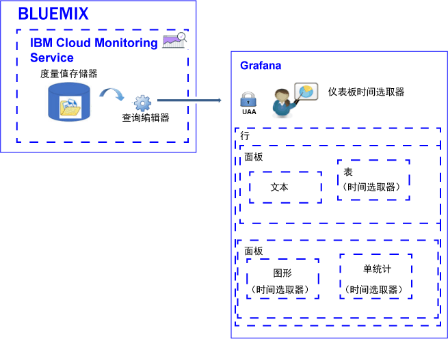

---

copyright:
  years: 2017

lastupdated: "2017-07-14"

---

{:shortdesc: .shortdesc}
{:new_window: target="_blank"}
{:codeblock: .codeblock}
{:screen: .screen}
{:pre: .pre}

# 分析度量值
{: #analyze_metrics_ov}

在 {{site.data.keyword.Bluemix}} 中，可以使用 Grafana（一种开放式源代码可视化和监视平台）通过各种图形（例如，图表和表）来对度量值进行监视、搜索、分析和可视化。
{:shortdesc}

## 组件概述
{: #overview}

{{site.data.keyword.monitoringshort}} 服务在“度量值”存储数据库中存储系列数据。您可以通过“查询编辑器”查询此数据。有关受支持查询的更多信息，请参阅 [Graphite 函数](http://graphite.readthedocs.io/en/latest/functions.html)。

在 Grafana 中，要访问“度量值”存储数据库中可用的数据，必须使用用于登录到 {{site.data.keyword.Bluemix_notm}} 的用户标识和密码登录到 {{site.data.keyword.Bluemix_notm}} 空间、组织和区域。 

要使数据可视化，请配置可以包含一行或多行的仪表板。在每一行中，您可以定义多个面板。 

* 行会在仪表板中对面板进行分组。 
* 面板是用于监视度量值的基本可视化资源。 
* 仪表板可以进行标记并包含注释，这些注释包含可用于在面板之间关联数据的数据。

您可以定义以下类型的面板：文本、图形、表和单统计。每个面板提供可以定制的不同样式和格式化选项。面板可以是静态的或动态的。

面板中显示的数据量由查询和所设置的时间范围确定。您可以在仪表板级别为所有面板设置通用时间范围，也可以为每个面板设置单独的时间范围。

下图显示 Grafana 从 {{site.data.keyword.monitoringshort}} 服务用于过滤数据的不同组件，以及可在 Grafana 中用于可视化和分析数据的资源：

