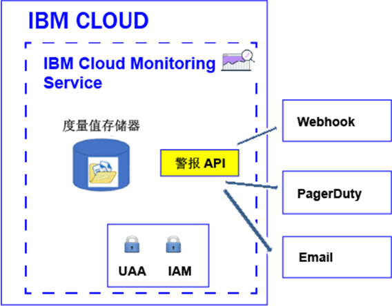

---

copyright:
  years: 2017

lastupdated: "2017-07-12"

---

{:shortdesc: .shortdesc}
{:new_window: target="_blank"}
{:codeblock: .codeblock}
{:screen: .screen}
{:pre: .pre}


# 配置警报
{: #config_alerts_ov}

{{site.data.keyword.monitoringshort}} 服务提供了基于查询的警报系统。可以使用警报 API 为您要监视的每个度量值查询设置规则和通知方法。可以通过发送电子邮件、触发 Webhook 或向 PagerDuty 发出警报来进行通知。
{:shortdesc}

您可以定义警报以触发度量值的通知。警报由规则定义，该规则描述要监视的度量值查询、阈值以及超过阈值时要执行的操作和一个或多个通知方法。  

您可以为一个实例或多个实例定义警报。通过警报规则监视的查询包含通配符时，通配符标识多个目标（即，多个服务实例或应用程序实例）。{{site.data.keyword.monitoringshort}} 服务每 5 分钟运行一次警报规则中配置的查询，并检查针对每个实例或多个实例返回的最后一个数据点。{{site.data.keyword.monitoringshort}} 服务跟踪每个实例的最后状态，并在警报状态发生更改时生成新的警报。 

下图显示了可在 {{site.data.keyword.monitoringshort}} 服务中配置的不同通知类型，以提醒您：



## 警报状态
{: #status}

启用规则后，警报可以具有以下任何状态：

* *正常*：以下情况下规则的状态设置为*正常*：
    
	* {{site.data.keyword.monitoringshort}} 服务中提供了与该规则关联的度量值查询的数据。您已设置警告阈值和错误阈值。数据的值不会超过阈值。
	 
	* {{site.data.keyword.monitoringshort}} 服务中没有与该规则关联的度量值查询的数据，并且您将规则属性 `allow_no_data` 配置为 *true*。           
	 
* *警告*：当 {{site.data.keyword.monitoringshort}} 服务中提供了与该规则关联的度量值查询的数据时，该规则的状态会设置为*警告*。您已设置警告阈值和错误阈值。数据的值在警告阈值和错误阈值之间。
	
* *错误*：当 {{site.data.keyword.monitoringshort}} 服务中提供了与该规则关联的度量值查询的数据时，该规则的状态会设置为*错误*。您已设置警告阈值和错误阈值。达到错误阈值。  

* *未知*：当 {{site.data.keyword.monitoringshort}} 服务中没有与该规则关联的度量值查询的数据时，该规则的状态会设置为*未知*。您可以配置是接收通知还是不基于您为规则配置的属性 `allow_no_data`。如果将此属性设置为 `false`，那么将通知您找不到该规则的任何数据。


	
## 警报历史记录
{: #history}

每次警报状态更改时，都会更新警报的历史记录。可以使用警报 API (*/v1/alert/history*) 来检索有关度量值历史记录的信息。

警报的状态用于定义以下任一场景中的状态：

* 规则触发通知之前的查询状态。
* 规则触发之后的查询状态。 

例如，如果超过了警告阈值，那么会生成一条历史记录，用于记录状态从*正常*转换为*警告*。与此类似，当值恢复到低于阈值时，也会生成一条历史记录，用于记录状态从*警告*转换为*正常*。


## 规则
{: #rules}

规则描述要监视的度量值查询、阈值以及超过阈值时要执行的操作。 

* 可以使用警报 API 创建、删除、更新规则，显示规则的详细信息，以及列出所有规则。有关更多信息，请参阅[使用规则](/docs/services/cloud-monitoring/alerts/rules.html#rules)。

* 警报系统每 5 分钟检查一次在空间中启用的规则。

* 缺省情况下，创建规则时会启用该规则。但是，您可以定义规则，并通过将字段 *enable* 配置为 `false`，对其进行禁用。

* 当规则参数 *comparison* 设置为 below 时，error_level 值必须低于警告级别值。当规则参数 *comparison* 设置为 above 时，error_level 值应高于警告级别值。

* 缺省情况下，创建规则时字段 *allow_no_data* 会设置为 `true`。如果没有数据点可用，那么除非触发规则条件，否则不会发送通知。如果要接收通知以通知找不到规则 X 的任何数据，那么必须将字段 *allow_no_data* 设置为 `false`。 

**提示：**通过 Grafana 中的警报规则验证您监视的查询。请检查它是否未超时，例如，由于配置了长时间段或使用包含通配符的查询而导致超时。请注意，当查询在 Grafana 中超时时，不会触发为该查询配置的警报。

下面是定义规则时所必需的字段：

<table>
  <caption>表 1. 用于定义规则的字段的列表。</caption>
  <tr>
    <th>字段名称</th>
	<th>描述</th>
  </tr>
  <tr>
    <td>name</td>
	<td>规则的名称。此名称必须唯一。</td>
  </tr>
  <tr>
    <td>description</td>
	<td>规则的摘要。</td>
  </tr>
  <tr>
    <td>expression</td>
	<td>要监视并在超过阈值时发送警报的度量值查询。<br>有效表达式为：单个度量值名称、使用通配符标识的多个度量值，或基于一个或多个度量值的函数。<br>**提示**：可以从 Grafana 复制已验证的查询。</td>
  </tr>
  <tr>
    <td>enabled</td>
	<td>描述规则的状态：<br>设置为 `true` 可启用规则。<br>设置为 `false` 可禁用规则。<br>缺省情况下，它会设置为 `true`。</td>
  </tr>
  <tr>
    <td>from</td>
	<td>用于根据您为 expression 字段中所定义查询设置的阈值来分析数据的初始时间点。例如：`"from": "-5min"`</td>
  </tr>
  <tr>
    <td>until</td>
	<td>用于根据您为 expression 字段中所定义查询设置的阈值来分析数据的结束时间点。例如：`"until": "now"`</td>
  </tr>
  <tr>
    <td>comparison</td>
	<td>用于识别要执行哪种类型检查的比较操作。有效值为：*below* 和 *above*。</td>
  </tr>
  <tr>
    <td>comparison_scope</td>
	<td>定义要分析的数据的范围。<br>设置为 *last* 可查看序列（可用于查询的数据）中的最后一个值。</td>
  </tr>
  <tr>
    <td>error_level</td>
	<td>定义用于触发错误警报的阈值。<br>达到所设置的值时，就会生成错误警报。例如：`"error_level" : 27.94`</td>
  </tr>
  <tr>
    <td>warning_level</td>
	<td>定义用于触发错误警报的阈值。<br>达到所设置的值时，就会生成警告警报。例如：`"warning_level" : 24`</td>
  </tr>
  <tr>
    <td>frequency</td>
	<td>定义执行检查的频率。<br>它以分钟、小时或天为单位，例如， 5 分钟、1 小时、7 天。<br>例如，要每分钟进行检查，可以设置 `"frequency": "1min"`。<br>**注：**目前，频率固定为 5 分钟。</td>
  </tr>
  <tr>
    <td>dashboard_url</td>
	<td>定义 Grafana 仪表板的 URL，在此仪表板中定义了受监视查询。</td>
  </tr>
    <tr>
    <td>allow_no_data</td>
	<td>定义在无数据点可用时发送通知的条件。<br>缺省情况下，它会设置为 `true`。<br>如果要在找不到规则 X 的任何数据时接收通知，请设置为 `false`。</td>
  </tr>
  <tr>
    <td>notifications</td>
	<td>通知的名称，该通知定义要针对规则触发的操作。<br>**注：**您可以通过列出以逗号分隔的通知名称，为每个规则定义一个或多个通知。</td>
  </tr>
</table>

例如，下面是规则样本：

```
{
  "name": "checkbytesin1",
  "description": "MH check Bytes In per second",
  "expression": "movingAverage(messagehub.65ad9211-1234-5678-a751-c82123411eee.1.kafka-java-console-sa
mple-topic.BytesInPerSec.15MinuteRate,\"5min\")",
  "enabled": true,
  "from": "-5min",
  "until": "now",
  "comparison": "below",
  "comparison_scope": "last",
   "error_level" : 22.94,
   "warning_level" : 25,
  "frequency": "1min",
  "dashboard_url": "https://metrics.ng.bluemix.net",
  "notifications": [
    "emailXXX"
  ]
}
```
{: screen}


## 通知
{: #notifications}

通知描述在触发警报时用于进行通知的方法和详细信息。例如，要获取度量值的警告通知和错误通知，请定义一个规则用于监视警告阈值，再定义一个规则用于监视错误阈值。 

* 仅当警报的状态更改（例如，度量值警报的状态从“正常”更改为“错误”，或从“错误”更改为“警告”）时，才会发送通知。 

    **注：**如果警报规则保持在相同的状态（*正常*、*警告*、*错误*或*未知*），那么将不会在下一次迭代时重新触发该警报规则。

* 通知被视为 24 小时事件。可以触发通知时，不能指定时间间隔。

* 您可以通过列出以逗号分隔的通知名称，为每个规则配置一个或多个通知方法。 

* 可以使用[警报 REST API](https://console.bluemix.net/apidocs/940-ibm-cloud-monitoring-alerts-api?&language=node#introduction){: new_window} 来创建、删除和更新通知，显示通知的详细信息，以及列出空间中定义的通知。


支持以下通知方法：

<table>
 <caption>表 2. 通知方法的列表。</caption>
 <tr>
    <th>方法</th>
	<th>更多信息</th>
 </tr>
 <tr>
    <td>Email</td>
	<td>[配置电子邮件通知](/docs/services/cloud-monitoring/alerts/configure_alerts.html#send_email)</td>
  </tr>
  <tr>
    <td>PagerDuty</td>
	<td>[配置 PagerDuty 通知](/docs/services/cloud-monitoring/alerts/configure_alerts.html#config_alert_pagerduty)</td>
  </tr>
  <tr>
    <td>Webhook</td>
	<td>[配置 Webhook 通知](/docs/services/cloud-monitoring/alerts/configure_alerts.html#config_webhook)</td>
  </tr>
</table>

**注**：您可独立于规则定义警报通知，这样就能将通知复用于多个规则。
	
## 通知模板
{: #notification_template}
	
通知是一个 JSON 文件。 

可以创建任意数量的通知模板，然后复用这些模板以在您的组织中创建该类型的通知。 

可以定义以下任意类型的通知：

* Email：定义类型为 *Email* 的通知可向有效电子邮件地址发送电子邮件。 
* Webhook：仅对于 HTTPS 端点，定义类型为 *Webhook* 的通知。向端点添加参数以帮助减少其他人尝试调用您的端点的机会。
* Pagerduty：定义类型为 *PagerDuty* 的通知，以将度量值的警报数据发送到 PagerDuty 事件管理系统。 

例如，下表列出了通知模板的示例：

<table>
  <caption>表 3. 通知模板示例</caption>
  <tr>
    <th>类型</th>
	<th>模板</th>
	<th>样本</th>
  </tr>
  <tr>
    <td>Email</td>
	<td>
	```
	{
	"name": "Template_Name",
	"type": "Email",
	"description" : "Description",
	"detail": "EmailAddress"
	}
	```
	{: screen}
	</td>
	<td>
	```
	{
	"name": "my-email",
	"type": "Email",
	"description" : "Send email notification when there is an infrastructure problem.",
	"detail": "xxx@yyy.com"
	}
	```
	{: screen}
	</td>
  </tr>
  <tr>
    <td>Webhook</td>
	<td>
	```
	{
	"name": "Template_Name",
	"type": "Webhook",
	"description" : "Description",
	"detail": "Endpoint"
	}
	```
	{: codeblock}
	</td>
	<td>
	```
	{
	"name": "my-webhook",
	"type": "Webhook",
	"description" : "Fire a webhook when there is an infrastructure problem..",
	"detail": "https://myendpoint.bluemix.net?key=abcd1234"
	}
	```
	{: screen}
	</td>
  </tr>
  <tr>
    <td>Pagerduty</td>
	<td>
	```
	"name": "Template_Name",
	"type": "PagerDuty",
	"description" : "Description",
	"detail": "Pagerduty_APIkey"
	}
	```
	{: codeblock}
	</td>
	<td>
	```
	{
	"name": "my-pagerduty",
	"type": "PagerDuty",
	"description" : "Fire a PagerDuty alert when there is an infrastructure problem..",
	"detail": "abcd1234"
	}
	```
	{: screen}
	</td>
  </tr>
</table>

其中

* *Template_Name* 定义通知模板的名称。
* *Description* 说明何时使用此类型的通知。
* *EmailAddress* 定义通知接收方的电子邮件地址。
* *Endpoint* 定义应该执行 POST 操作的 URL。 
* *Pagerduty_APIkey* 定义唯一 API 密钥。此 API 密钥由 PagerDuty 帐户管理员或所有者生成。

有关更多信息，请参阅[创建通知模板](/docs/services/cloud-monitoring/alerts/notifications.html#template)。


