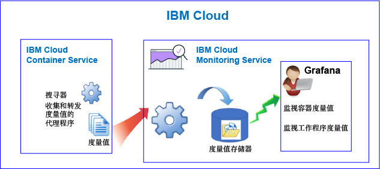
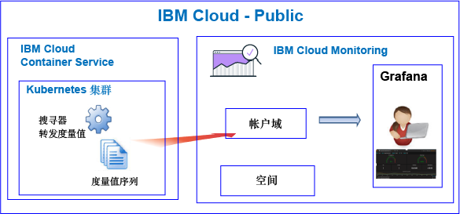
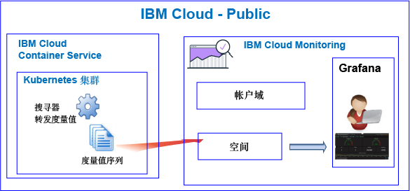
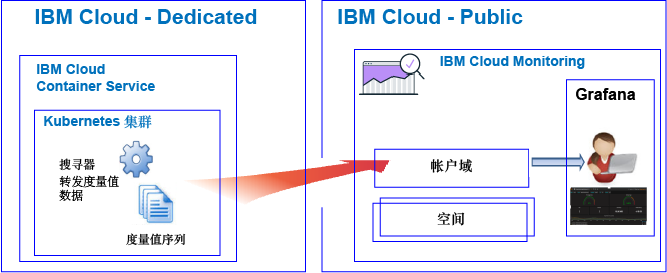

---

copyright:
  years: 2017, 2018

lastupdated: "2018-02-07"

---

{:new_window: target="_blank"}
{:shortdesc: .shortdesc}
{:screen: .screen}
{:pre: .pre}
{:table: .aria-labeledby="caption"}
{:codeblock: .codeblock}
{:tip: .tip}
{:download: .download}

# {{site.data.keyword.containershort_notm}}
{: #monitoring_bmx_containers_ov}

在 {{site.data.keyword.Bluemix}} 中，系统会自动收集集群度量值。您可以使用 Grafana 来监视集群的性能。
{:shortdesc}

**注：**系统将针对在标准集群中运行的容器收集度量值，并可通过 {{site.data.keyword.monitoringshort}} 服务对这些度量值进行监视。有关标准集群支持的功能的更多信息，请参阅[规划集群和应用程序](/docs/containers/cs_planning.html#cs_planning_cluster_type)。

## 关于在 Public 中进行监视
{: #public}

在 {{site.data.keyword.Bluemix_notm}} 中，可以使用 {{site.data.keyword.monitoringshort}} 服务来存储和分析由 Public 中的 {{site.data.keyword.containershort}} 自动收集的容器度量值和 Kubernetes 集群度量值。

在一个帐户中，您可以有一个或多个 Kubernetes 集群。供应集群后，{{site.data.keyword.containershort}} 会立即自动收集度量值。部署 Pod 后，系统会立即收集容器度量值。度量值会自动转发到 {{site.data.keyword.monitoringshort}} 服务：

* 将集群创建为帐户资源时，度量值会转发到 {{site.data.keyword.monitoringshort}} 服务。要将度量值转发到帐户域，{{site.data.keyword.monitoringshort}} 服务密钥所有者必须具有 IAM 策略及**管理员**许可权才能使用 {{site.data.keyword.monitoringshort}} 服务。
* 创建具有关联 Cloud Foundry 空间的集群时，度量值会转发到 {{site.data.keyword.monitoringshort}} 服务中的空间域。要将度量值转发到帐户域，{{site.data.keyword.monitoringshort}} 服务密钥所有者必须具有对组织的**管理者**角色以及对空间的**开发者**角色。

下图显示了 {{site.data.keyword.containershort}} 监视的高级别视图：

搜寻器是在主机中运行的进程，对度量值进行无代理监视。缺省情况下，搜寻器始终从所有容器收集 CPU 和内存度量值。

要在 Grafana 中分析集群的度量值，请考虑以下信息：

* 必须在供应用于查看度量值的 {{site.data.keyword.monitoringshort}} 实例的 Public 区域中启动 Grafana。 
* 可以使用缺省 Grafana 仪表板 **ClusterMonitoringDashboard_v1** 来监视集群。
* 还可以在创建集群的云 Public 区域中配置定制 Grafana 仪表板，以可视化该集群的度量值数据。
* 您的用户标识必须具有查看度量值的许可权。 

    要查看帐户域中的度量值，用户需要针对 {{site.data.keyword.monitoringshort}} 服务的 IAM 策略。用户需要**查看者**许可权。 
    
    要查看空间域中的度量值，用户需要 CF 角色。有关更多信息，请参阅[用户查看度量值所需的角色](/docs/services/cloud-monitoring/security_ov.html#bmx_roles)。

### 监视将度量值转发到帐户域的集群的高级别视图
{: #acc}

下图显示了在 Public 中集群将度量值转发到帐户域时监视 {{site.data.keyword.containershort}} 的高级别视图：

### 监视将度量值转发到空间域的集群的高级别视图
{: #space}

下图显示了在 Public 中集群将度量值转发到空间域时监视 {{site.data.keyword.containershort}} 的高级别视图：

将度量值转发到空间的集群必须在 Cloud Foundry 组织和空间的上下文中通过命令行创建。创建集群之前，请运行 `bx target` 命令来设置 CF 组织和空间上下文。

## 关于在 Dedicated 中进行监视
{: #dedicated}

在 {{site.data.keyword.Bluemix_notm}} 中，可以使用 Public 中的 {{site.data.keyword.monitoringshort}} 服务来存储和分析由 Dedicated 上的 {{site.data.keyword.containershort}} 自动收集的容器度量值和 Kubernetes 集群度量值。

在一个帐户中，您可以有一个或多个 Kubernetes 集群。供应集群后，{{site.data.keyword.containershort}} 会立即自动收集度量值。部署 Pod 后，系统会立即收集容器度量值。度量值会自动转发到 {{site.data.keyword.monitoringshort}} 服务的帐户域。

**注：**要将度量值转发到帐户域，{{site.data.keyword.monitoringshort}} 服务密钥所有者必须具有 IAM 策略及**管理员**许可权才能使用 {{site.data.keyword.monitoringshort}} 服务。

要在 Grafana 中查看和分析集群的度量值，请考虑以下信息：

* 必须在集群于 Dedicated 上可用的云 Public 区域中启动 Grafana。例如，如果集群是在 Dedicated 上的美国南部供应的，那么必须在 Public 上的美国南部区域中启动 Grafana。
* 可以使用缺省 Grafana 仪表板 **ClusterMonitoringDashboard_v1** 来监视集群。
* 还可以在创建集群的云 Public 区域中配置定制 Grafana 仪表板，以可视化该集群的度量值数据。
* 您的用户标识必须具有 IAM 策略才能使用 {{site.data.keyword.monitoringshort}} 服务。您需要具有**查看者**许可权才能查看帐户域中的度量值。  

下图显示了在 Dedicated 中监视 {{site.data.keyword.containershort}} 的高级别视图：

## 容器的 CPU 度量值
{: #cpu_metrics_containers}

下表列出了为容器自动捕获的 CPU 度量值：

<table>
  <caption>表 1. 容器的 CPU 度量值</caption>
  <tr>
    <th>度量值名称</th>
    <th>描述</th>
  </tr>
  <tr>
    <td>*cpu.num-cores*</td>
    <td>此度量值报告可用于容器的 CPU 核心数。
  缺省情况下，此度量值报告工作程序上的核心数。如果您对可用于容器的核心数设置了限制，那么此度量值会报告您在该限制中设置的核心数。</td>
  </tr>
  <tr>
    <td>*cpu.usage*</td>
    <td>此度量值报告所有核心中 CPU 时间的纳秒数。  当 CPU 使用率高时，可能会发生延迟。高 CPU 使用率表示处理能力不足。</td>
  </tr>
  <tr>
    <td>*cpu.usage-pct*</td>
    <td>此度量值报告可用作 CPU 容量百分比的 CPU 时间。  缺省情况下， CPU 容量由工作程序上的核心数确定。如果将限制设置为容器 CPU 容量，那么此度量值会将 CPU 使用率报告为您设置的限制的百分比。当 CPU 使用率的百分比高时，可能会发生延迟。高 CPU 使用率表示处理能力不足。</td>
  </tr>
  <tr>
    <td>*cpu.usage-pct-container-requested*</td>
    <td>此度量值报告用作容器的请求 CPU 百分比的 CPU 时间。  如果未在容器上设置所请求的 CPU，那么不会对容器公开此度量值。</td>
  </tr>
</table>

## 工作程序的负载度量值
{: #load_metrics_workers}

下表列出了为工作程序自动捕获的 CPU 度量值：

<table>
  <caption>表 2. 工作程序的负载度量值</caption>
  <tr>
    <th>度量值名称</th>
    <th>描述</th>
  </tr>
  <tr>
    <td>*load.avg-1*</td>
    <td>此度量值报告过去 1 分钟 Kubernetes 主机的平均 CPU 负载。  平均 CPU 负载大于工作程序上的核心数指示到主机的流量正在排队。</td>
  </tr>
  <tr>
    <td>*load.avg-5*</td>
    <td>此度量值报告过去 5 分钟 Kubernetes 主机的平均 CPU 负载。  平均 CPU 负载大于工作程序上的核心数指示到主机的流量正在排队。</td>
  </tr>
  <tr>
    <td>*load.avg-15*</td>
    <td>此度量值报告过去 15 分钟 Kubernetes 主机的平均 CPU 负载。  平均 CPU 负载大于工作程序上的核心数指示到主机的流量正在排队。</td>
  </tr>
</table>

## 容器的内存度量值
{: #memory_metrics}

下表列出了自动捕获的内存度量值：

<table>
  <caption>表 3. 容器的内存度量值</caption>
  <tr>
    <th>度量值名称</th>
    <th>描述</th>
  </tr>
  <tr>
    <td>*memory.current*</td>
    <td>此度量值报告容器目前使用的内存字节数。</td>
  </tr>
  <tr>
    <td>*memory.limit*</td>
    <td>此度量值报告与为 pod 设置的最大和最小限制相比，允许容器交换到磁盘的内存量。
   缺省情况下，Pod 运行时没有内存限制。Pod 可消耗与其在工作程序上运行时一样多的内存。当您部署 Pod 时，可以设置 Pod 可使用的内存量限制。</td>
  </tr>
  <tr>
    <td>*memory.usage-pct*</td>
    <td>此度量值报告用作容器内存限制百分比的内存。
   如果将限制设置为容器可以使用的内存量，那么此度量值会将内存使用率报告为您设置的限制的百分比。</td>
  </tr>
</table>

## 定义查询以监视 Kubernetes 集群中的资源
{: #monitoring_metrics_kube}

要监视在 {{site.data.keyword.Bluemix_notm}} 中的 Kubernetes 集群中部署的容器和工作程序的性能，请使用 Grafana。 

{{site.data.keyword.monitoringlong}} 服务使用 Grafana（一种开放式源代码分析和可视化平台）通过各种图形（例如，图表和表）来对度量值进行监视、搜索、分析和可视化表示。

您可以通过浏览器启动 Grafana。有关更多信息，请参阅[通过 Web 浏览器导航至 Grafana 仪表板](/docs/services/cloud-monitoring/grafana/navigating_grafana.html#launch_grafana_from_browser)。

要监视在 Kubernetes 集群中运行的容器和工作程序，必须在 Grafana 中针对每种资源定义一个查询：

* 要定义用于监视容器的 CPU 度量值的查询，请参阅[在 Grafana 中配置容器的 CPU 度量值](/docs/services/cloud-monitoring/containers/config_cpu_worker.html#config_cpu_worker)。
* 要定义用于监视容器的内存度量值的查询，请参阅[在 Grafana 中配置容器的内存度量值](/docs/services/cloud-monitoring/containers/config_mem_container.html#config_mem_container)。
* 要定义用于监视工作程序的负载度量值的查询，请参阅[在 Grafana 中配置工作程序的负载度量值](/docs/services/cloud-monitoring/containers/config_load_worker.html#config_load_worker)。

查询的格式根据资源类型和查询类型而有所不同：

* 有关用于监视容器 CPU 的查询格式的更多信息，请参阅[容器的 CPU 度量值查询格式](/docs/services/cloud-monitoring/reference/metrics_format_containers.html#cpu_containers)。 
* 有关用于监视工作程序负载的查询格式的更多信息，请参阅[工作程序的负载度量值查询格式](/docs/services/cloud-monitoring/reference/metrics_format_containers.html#load_workers)。
* 有关用于监视容器内存的查询格式的更多信息，请参阅[容器的内存度量值查询格式](/docs/services/cloud-monitoring/reference/metrics_format_containers.html#mem_containers)。

## 在 {{site.data.keyword.Bluemix_notm}} 中配置定制防火墙配置的网络流量
{: #ports}

如果您设置了其他防火墙，或者您已在 {{site.data.keyword.Bluemix_notm}} Infrastructure (SoftLayer) 中定制了防火墙设置，那么需要允许从工作程序节点到 {{site.data.keyword.monitoringshort}} 服务的出局网络流量。 

您必须针对定制防火墙中的以下 IP 地址，打开 TCP 端口 443 和 TCP 端口 9091，以用于每个工作程序到 {{site.data.keyword.monitoringshort}} 服务的出局流量：

<table>
  <tr>
    <th>区域</th>
    <th>数据获取 URL</th>
	<th>公共 IP 地址</th>
  </tr>
  <tr>
    <td>德国</td>
	<td>ingest-eu-fra.logging.bluemix.net</td>
	<td>158.177.88.43 159.122.87.107</td>
  </tr>
  <tr>
    <td>英国</td>
	<td>ingest.logging.eu-gb.bluemix.net</td>
	<td>169.50.115.113</td>
  </tr>
  <tr>
    <td>美国南部</td>
	<td>ingest.logging.ng.bluemix.net</td>
	<td>169.48.79.236 169.46.186.113</td>
  </tr>
  <tr>
    <td>悉尼</td>
	<td>ingest-au-syd.logging.bluemix.net</td>
	<td>130.198.76.125 168.1.209.20</td>
  </tr>
</table>
